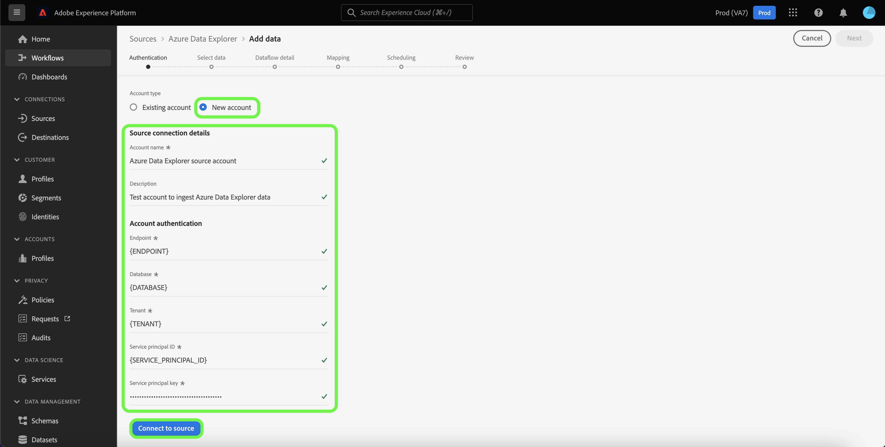

# UI での *YOURSOURCE* ソース接続の作成

*このテンプレートを使用する場合は、（この段落から始めて）斜体のすべての段落を置き換えるか削除します。*

*まず、ページ上部のメタデータ（タイトルと説明）を更新します。 このページの UICONTROL のインスタンスをすべて無視してください。 これは、機械翻訳プロセスが、サポートする複数の言語にページを正しく翻訳するのに役立つタグです。 ドキュメントを送信したら、タグをドキュメントに追加します。*

このチュートリアルでは、Experience Platform ユーザーインターフェイスを使用して *YOURSOURCE* ソースコネクタを作成する手順について説明します。

## 概要

*顧客に提供する価値を含め、会社の概要を入力します。 さらに読むために、製品ドキュメントのホームページへのリンクを含めます。*

>[!IMPORTANT]
>
>このソースコネクタとドキュメントページは、*YourSource* チームによって作成および管理されます。 お問い合わせや更新のリクエストについては、*リンクまたはメールアドレスを挿入* まで直接ご連絡ください。

## 前提条件

*Adobe Experience Platform ユーザーインターフェイスでソースの設定を開始する前にお客様が認識しておく必要のある情報については、この節で説明します。 次に示す内容を使用できます。*

* *許可リストに追加する必要があります*
* *メールハッシュの要件*
* *お客様側のアカウント詳細*
* *プラットフォームに接続するための認証資格情報の取得方法*

### 必要な資格情報の収集

*YOURSOURCE* をExperience Platformに接続するには、次の接続プロパティの値を指定する必要があります。

| 資格情報 | 説明 | 例 |
| --- | --- | --- |
| *認証情報 1* | *ソースの認証情報に簡単な説明を追加してください* | *ソースの認証情報の例をここに追加してください* |
| *認証情報 2* | *ソースの認証情報に簡単な説明を追加してください* | *ソースの認証情報の例をここに追加してください* |
| *認証情報 3* | *ソースの認証情報に簡単な説明を追加してください* | *ソースの認証情報の例をここに追加してください* |

これらの資格情報について詳しくは、*YOURSOURCE* 認証ドキュメントを参照してください。 *プラットフォームの認証ドキュメントへのリンクをここに追加してください*。

## *YOURSOURCE* アカウントを接続

Experience Platformの UI で、左側のナビゲーションバーから **[!UICONTROL Sources]** を選択して、[!UICONTROL Sources] ワークスペースにアクセスします。 [!UICONTROL Catalog] 画面には、アカウントを作成できる様々なソースが表示されます。

画面の左側にあるカタログから適切なカテゴリを選択することができます。または、使用する特定のソースを検索オプションを使用して探すこともできます。

*YOURSOURCE のカテゴリ* カテゴリで *YOURSOURCE* を選択し、**[!UICONTROL Add data]** を選択します。

>[!TIP]
>
>以下で使用するスクリーンショットは例です。 ドキュメントを作成する際は、画像を実際のソースのスクリーンショットに置き換えてください。 同じファイル名だけでなく、同じマークアップパターンと色を使用できます。 スクリーンショットがExperience Platform UI 画面全体をキャプチャしていることを確認してください。 スクリーンショットのアップロード方法について詳しくは、[&#x200B; レビュー用ドキュメントの送信 &#x200B;](./github.md) に関するガイドを参照してください。

**[!UICONTROL Connect YOURSOURCE account]** ページが表示されます。 このページでは、新しい資格情報または既存の資格情報を使用できます。

### 既存のアカウント

既存のアカウントを使用するには、新しいデータフローの作成に使用する *YOURSOURCE* アカウントを選択してから、「**[!UICONTROL Next]**」を選択して続行します。

### 新しいアカウント

新しいアカウントを作成する場合は、「**[!UICONTROL New account]**」を選択し、続けて名前、説明（オプション）、の認証情報を指定します。 終了したら「**[!UICONTROL Connect to source]**」を選択し、新しい接続が確立されるまでしばらく待ちます。

## 次の手順

*データフロー作成の残りの手順のワークフローはモジュール化されます。 ソースに関して特定のコールアウトを行う必要がある場合は、以下のその他のリソースの節を参照してください。*

このチュートリアルでは、*YOURSOURCE* アカウントとの接続を確立しました。 次のチュートリアルに進み、[&#x200B; データをExperience Platformに取り込むためのデータフローの設定 &#x200B;](https://experienceleague.adobe.com/docs/experience-platform/sources/ui-tutorials/dataflow/crm.html) を行いましょう。

## その他のリソース

*これはオプションのセクションで、製品ドキュメントやその他の手順、スクリーンショット、お客様が成功するために重要と考えるニュアンスへの追加のリンクを提供できます。 このセクションを使用すると、ソースのワークフロー全体に関する情報やヒントを追加できます。特に、エンドユーザーが遭遇する可能性のある特定の「潜在的な問題」がある場合に役立ちます。*
