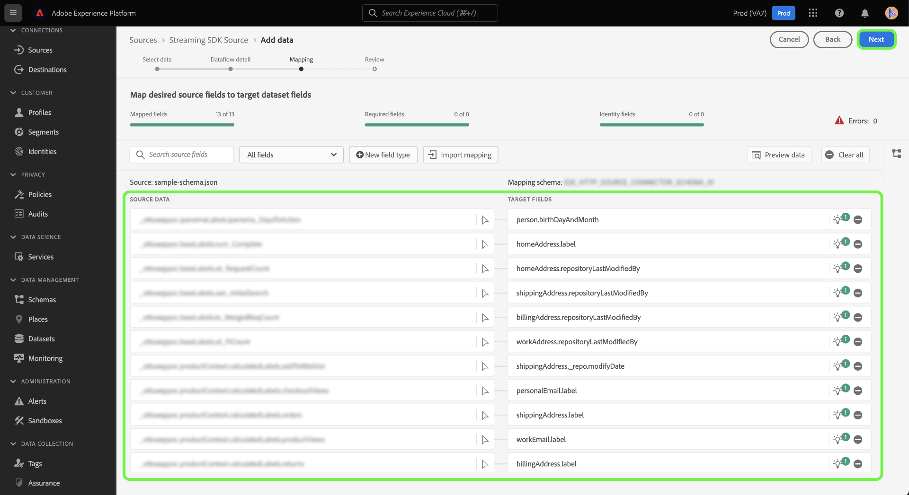

# ストリーミングするソース接続とデータフローを作成 *YOURSOURCE* UI を使用したデータ

*このテンプレートの操作中に、斜体のすべての段落を置き換えるか削除します（この段落から始まります）。*

*まず、ページ上部のメタデータ（タイトルと説明）を更新します。 このページの UICONTROL のすべてのインスタンスを無視してください。 これは、機械翻訳プロセスがページをサポートする複数の言語に正しく翻訳するのに役立つタグです。 お客様がドキュメントを送信した後、ドキュメントにタグを追加します。*

このチュートリアルでは、 *YOURSOURCE* Platform ユーザーインターフェイスを使用したソースコネクタ

## 概要

*顧客に提供する価値を含め、会社の概要を短く示します。 詳しくは、製品ドキュメントのホームページへのリンクを含めてください。*

>[!IMPORTANT]
>
>このソースコネクタとドキュメントページは、 *YOURSOURCE* チーム。 お問い合わせや更新のご依頼は、直接お問い合わせください。 *更新用にアクセスできるリンクまたは電子メールアドレスを挿入します*.

## 前提条件

*Adobe Experience Platformユーザーインターフェイスでソースの設定を開始する前に顧客が認識しておく必要がある事項に関する情報を、この節に追加します。 次のような場合が考えられます。*

* *許可リストに追加する必要がある*
* *電子メールハッシュの要件*
* *お客様側のアカウントの詳細*
* *プラットフォームに接続するための認証資格情報の取得方法*

### 必要な資格情報の収集

接続するには *YOURSOURCE* を Platform に対して、次の接続プロパティの値を指定する必要があります。

| 資格情報 | 説明 | 例 |
| --- | --- | --- |
| *資格情報 1* | *ここでソースの認証資格情報に簡単な説明を追加してください* | *ここにソースの認証資格情報の例を追加してください* |
| *資格情報 2* | *ここでソースの認証資格情報に簡単な説明を追加してください* | *ここにソースの認証資格情報の例を追加してください* |
| *資格 3* | *ここでソースの認証資格情報に簡単な説明を追加してください* | *ここにソースの認証資格情報の例を追加してください* |

これらの資格情報について詳しくは、 *YOURSOURCE* 認証に関するドキュメント。 *ここにプラットフォームの認証に関するドキュメントへのリンクを追加してください*.

### 統合 *YOURSOURCE* ウェブフックで

*ストリーミング SDK では、Experience Platformと通信するために、ソースが Web フックをサポートできる必要があります。 この節では、YOURSOURCE を Webhook と統合するためにユーザーが従う必要のある手順を示す必要があります。*

## 接続する *YOURSOURCE* アカウント

Platform UI の左側のナビゲーションバーで「**[!UICONTROL ソース]**」を選択し、[!UICONTROL ソース]ワークスペースにアクセスします。[!UICONTROL カタログ]画面には、アカウントを作成できる様々なソースが表示されます。

画面の左側にあるカタログから適切なカテゴリを選択することができます。または、使用する特定のソースを検索オプションを使用して探すこともできます。

の下 **ストリーミング** カテゴリ、選択 *YOURSOURCE*&#x200B;を選択し、 **[!UICONTROL データを追加]**.

>[!TIP]
>
>以下に使用するスクリーンショットは例です。 ドキュメントを作成する際は、画像を実際のソースのスクリーンショットに置き換えてください。 同じマークアップパターンと色、同じファイル名を使用できます。 スクリーンショットに Platform UI 画面全体が取り込まれていることを確認してください。 スクリーンショットのアップロード方法について詳しくは、 [ドキュメントのレビュー用の送信](../documentation/github.md).

## データの選択

The **[!UICONTROL データを選択]** の手順が表示され、Platform に取り込むデータを選択するためのインターフェイスが提供されます。

* インターフェイスの左側には、アカウント内で使用可能なデータストリームを表示できるブラウザーがあります。
* インターフェイスの右側では、JSON ファイルから最大 100 行のデータをプレビューできます。

選択 **[!UICONTROL ファイルをアップロード]** をクリックして、ローカルシステムから JSON ファイルをアップロードします。 または、アップロードする JSON ファイルをにドラッグ&amp;ドロップすることもできます [!UICONTROL ファイルをドラッグ&amp;ドロップ] パネル。

ファイルがアップロードされると、プレビューインターフェイスが更新され、アップロードしたスキーマのプレビューが表示されます。 プレビューインターフェイスを使用すると、ファイルの内容と構造を検査できます。 また、 [!UICONTROL 検索フィールド] スキーマ内から特定の項目にアクセスするユーティリティ。

終了したら、「**[!UICONTROL 次へ]**」を選択します。

## データフローの詳細

The **データフローの詳細** 手順が表示され、既存のデータセットを使用するか、データフローの新しいデータセットを確立するか、およびデータフローの名前と説明を指定する機会が提供されます。 この手順では、プロファイルの取り込み、エラー診断、部分取り込み、アラートの設定も指定できます。

終了したら、「**[!UICONTROL 次へ]**」を選択します。

## マッピング

[!UICONTROL マッピング]手順が表示され、ソーススキーマのソースフィールドを、ターゲットスキーマの適切なターゲット XDM フィールドにマッピングするためのインターフェイスが提供されます。

Platform は、選択したターゲットスキーマまたはデータセットに基づいて、自動マッピングされたフィールドに対するインテリジェントなレコメンデーションを提供します。 マッピングルールは、ユースケースに合わせて手動で調整できます。必要に応じて、フィールドを直接マッピングするか、データ準備機能を使用してソースデータを変換して計算値を導き出すかを選択できます。マッパーインターフェイスと計算フィールドを使用した包括的な手順については、 [データ準備 UI ガイド](https://experienceleague.adobe.com/docs/experience-platform/data-prep/ui/mapping.html).

ソースデータが正常にマッピングされたら、「 」を選択します。 **[!UICONTROL 次へ]**.

## レビュー

**[!UICONTROL レビュー]**&#x200B;手順が表示され、新しいデータフローを作成する前に確認できます。詳細は、次のカテゴリに分類されます。

* **[!UICONTROL 接続]**：ソースのタイプ、選択したソースファイルの関連パスおよびそのソースファイル内の列の数を表示します。
* **[!UICONTROL データセットの割り当てとフィールドのマッピング]**：ソースデータがどのデータセットに取り込まれるかを、そのデータセットが準拠するスキーマを含めて表示します。

データフローをレビューしたら、「 」をクリックします。 **[!UICONTROL 完了]** とは、データフローが作成されるまでしばらく時間をかけます。

## ストリーミングエンドポイント URL を取得する

ストリーミングデータフローを作成したら、ストリーミングエンドポイント URL を取得できます。 このエンドポイントは、Webhook を購読するために使用され、ストリーミングソースとExperience Platformが通信できます。

ストリーミングエンドポイントを取得するには、 [!UICONTROL データフローアクティビティ] 作成したデータフローのページで、エンドポイントをの下部からコピーします。 [!UICONTROL プロパティ] パネル。

## 次の手順

*データフローの作成の残りの手順のワークフローはモジュール化されます。 ソースに関する特定のコールアウトが必要な場合は、以下の追加のリソースの節を参照してください。*

このチュートリアルに従って、 *YOURSOURCE* アカウント。 次のチュートリアルに進み、[データを Platform に取り込むためのデータフローの設定](https://experienceleague.adobe.com/docs/experience-platform/sources/ui-tutorials/dataflow/crm.html)を行いましょう。

## その他のリソース

*このセクションはオプションで、製品ドキュメントへの詳細なリンクや、その他の手順、スクリーンショット、ニュアンスを提供して、顧客が成功するために重要と考えるものへのリンクを提供できます。 このセクションを使用して、ソースのワークフロー全体に関する情報やヒントを追加できます。特に、エンドユーザーが遭遇する可能性のある特定の「了解事項」がある場合に役立ちます。*
