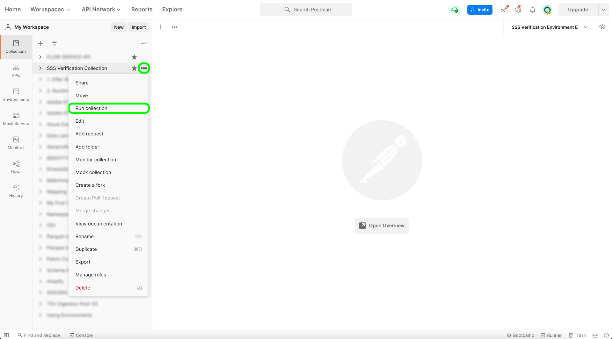

# ソースのテストと送信

セルフサービスソース（ストリーミング SDK）を使用して新しいソースをAdobe Experience Platformに統合する最後の手順は、新しいソースをテストして送信することです。 接続の仕様を完了し、ストリーミングフローの仕様を更新したら、API または UI を使用して、ソースの機能のテストを開始できます。 成功したら、Adobe担当者に問い合わせて、新しいソースを送信できます。

次のドキュメントでは、 [[!DNL Flow Service] API](https://www.adobe.io/experience-platform-apis/references/flow-service/).

## はじめに

* Platform API を正常に呼び出す方法について詳しくは、[Platform API の概要](../../../landing/api-guide.md)のガイドを参照してください。
* Platform API の資格情報を生成する方法について詳しくは、 [Experience PlatformAPI の認証とアクセス](../../../landing/api-authentication.md).
* の設定方法について詳しくは、 [!DNL Postman] Platform API については、 [開発者コンソールの設定および [!DNL Postman]](../../../landing/postman.md).
* テストおよびデバッグプロセスに役立つように、 [セルフサービスソースの検証コレクションと環境をここに](../assets/sdk-verification.zip) およびは、以下に示す手順に従います。

## API を使用したソースのテスト

API を使用してソースをテストするには、 [セルフサービスソースの検証コレクションと環境](../assets/sdk-verification.zip) オン [!DNL Postman] を使用して、ソースに関連する適切な環境変数を指定する場合。

テストを開始するには、まず、次のようにしてコレクションと環境を設定する必要があります。 [!DNL Postman]. 次に、テストする接続仕様 ID を指定します。

>[!NOTE]
>
>以下の変数の例はすべて、更新が必要なプレースホルダー値です ( ただし、 `flowSpecificationId` および `targetConnectionSpecId`：固定値です。

| パラメーター | 説明 | 例 |
| --- | --- | --- |
| `x-api-key` | Experience PlatformAPI の呼び出しを認証するために使用される一意の識別子。 に関するチュートリアルを参照してください。 [Experience PlatformAPI の認証とアクセス](../../../landing/api-authentication.md) 」を参照してください。 `x-api-key`. | `c8d9a2f5c1e03789bd22e8efdd1bdc1b` |
| `x-gw-ims-org-id` | 製品やサービスを所有またはライセンスし、そのメンバーへのアクセスを許可できる企業エンティティ。 に関するチュートリアルを参照してください。 [開発者コンソールの設定および [!DNL Postman]](../../../landing/postman.md) を参照してください。 `x-gw-ims-org-id` 情報。 | `ABCEH0D9KX6A7WA7ATQE0TE@adobeOrg` |
| `authorizationToken` | Experience PlatformAPI の呼び出しを完了するために必要な認証トークン。 に関するチュートリアルを参照してください。 [Experience PlatformAPI の認証とアクセス](../../../landing/api-authentication.md) 」を参照してください。 `authorizationToken`. | `Bearer authorizationToken` |
| `schemaId` | ソースデータを Platform で使用するには、必要に応じてターゲットスキーマを作成してソースデータを構造化する必要があります。 ターゲット XDM スキーマの作成手順について詳しくは、 [API を使用したスキーマの作成](../../../xdm/api/schemas.md)に関するチュートリアルを参照してください。 | `https://ns.adobe.com/{TENANT_ID}.schemas.0ef4ce0d390f0809fad490802f53d30b` |
| `schemaVersion` | スキーマに対応する一意のバージョン。 | `application/vnd.adobe.xed-full-notext+json; version=1` |
| `schemaAltId` | この `meta:altId` それは横に返される  `schemaId` 新しいスキーマを作成する際に使用します。 | `_{TENANT_ID}.schemas.0ef4ce0d390f0809fad490802f53d30b` |
| `dataSetId` | ターゲットデータセットの作成手順について詳しくは、 [API を使用したデータセットの作成](../../../catalog/api/create-dataset.md)に関するチュートリアルを参照してください。 | `5f3c3cedb2805c194ff0b69a` |
| `mappings` | マッピングセットを使用すると、ソーススキーマ内のデータと宛先スキーマのデータとのマッピング方法を定義できます。マッピングの作成方法について詳しくは、 [API を使用したマッピングセットの作成](../../../data-prep/api/mapping-set.md). | `[{"destinationXdmPath":"person.name.firstName","sourceAttribute":"email.email_id","identity":false,"version":0},{"destinationXdmPath":"person.name.lastName","sourceAttribute":"email.activity.action","identity":false,"version":0}]` |
| `mappingId` | マッピングセットに対応する一意の ID。 | `bf5286a9c1ad4266baca76ba3adc9366` |
| `connectionSpecId` | ソースに対応する接続仕様 ID。 これは、次の後に生成された ID です [新しい接続仕様の作成](./create.md). | `2e8580db-6489-4726-96de-e33f5f60295f` |
| `flowSpecificationId` | のフロー仕様 ID `GenericStreamingAEP`. **これは固定値です**. | `e77fde5a-22a8-11ed-861d-0242ac120002` |
| `targetConnectionSpecId` | 取り込んだデータが格納されるデータレイクのターゲット接続 ID。 **これは固定値です**. | `c604ff05-7f1a-43c0-8e18-33bf874cb11c` |
| `verifyWatTimeInSecond` | フロー実行の完了を確認する際に従う指定された時間間隔。 | `40` |
| `startTime` | データフローの指定された開始時間。 開始時刻は UNIX 時刻でフォーマットする必要があります。 | `1597784298` |

すべての環境変数を指定したら、 [!DNL Postman] インターフェイス。 内 [!DNL Postman] インターフェイスで、省略記号 (**...**) を [!DNL Sources SSSs Verification Collection] 次に、 **コレクションを実行**.

この [!DNL Runner] インターフェイスが表示され、データフローの実行順序を設定できます。 選択 **SSS 検証コレクションを実行** コレクションを実行します。

>[!NOTE]
>
>無効にできます **フローを削除** Platform UI でソース監視ダッシュボードを使用する場合は、実行順序チェックリストから ただし、テストが完了したら、テストフローが削除されていることを確認する必要があります。

## UI を使用したソースのテスト

UI でソースをテストするには、Platform UI で組織のサンドボックスのソースカタログに移動します。 ここから、新しいソースが *ストリーミング* カテゴリ。

新しいソースがサンドボックスで使用できるようになったら、ソースワークフローに従って機能をテストする必要があります。 最初に、 **[!UICONTROL 設定]**.

[!UICONTROL データを追加]手順が表示されます。ソースがデータをストリーミングできることをテストするには、インターフェイスの左側を使用して、をアップロードします。 [サンプルの JSON データ](../assets/testing/raw.json.zip). データがアップロードされると、インターフェイスの右側が更新され、データのファイル階層のプレビューが表示されます。 「**[!UICONTROL 次へ]**」を選択して次に進みます。

[!UICONTROL データフロー詳細]ページでは、既存のデータセットと新しいデータセットのどちらを使用するかを選択できます。このプロセスの間に、データをプロファイルに取り込むように設定し、次のような設定を有効にすることもできます。 [!UICONTROL エラー診断] および [!UICONTROL 部分取り込み].

テストの場合は、 **[!UICONTROL 新しいデータセット]** 出力データセット名を指定します。 この手順の間に、オプションで説明を入力して、データセットにさらに情報を追加することもできます。 次に、「[!UICONTROL 詳細検索]」オプションを使用するか、ドロップダウンメニューで既存のスキーマのリストをスクロールして、マッピングするスキーマを選択します。スキーマを選択したら、データフローの名前と説明を指定します。

終了したら、「**[!UICONTROL 次へ]**」を選択します。

[!UICONTROL マッピング]手順が表示され、ソーススキーマのソースフィールドを、ターゲットスキーマの適切なターゲット XDM フィールドにマッピングするためのインターフェイスが提供されます。

Platform は、選択したターゲットスキーマまたはデータセットに基づいて、自動マッピングされたフィールドに対するインテリジェントなレコメンデーションを提供します。 マッピングルールは、ユースケースに合わせて手動で調整できます。必要に応じて、フィールドを直接マッピングするか、データ準備機能を使用してソースデータを変換して計算値を導き出すかを選択できます。マッパーインターフェイスと計算フィールドを使用した包括的な手順については、 [データ準備 UI ガイド](../../../data-prep/ui/mapping.md)

ソースデータが正常にマッピングされたら、「 」を選択します。 **[!UICONTROL 次へ]**.

**[!UICONTROL レビュー]**&#x200B;手順が表示され、新しいデータフローを作成する前に確認できます。詳細は、次のカテゴリに分類されます。

* **[!UICONTROL 接続]**:アカウント名、ソースのタイプ、および使用しているストリーミングクラウドストレージソースに固有のその他の情報が表示されます。
* **[!UICONTROL データセットの割り当てとフィールドのマッピング]**:データフローに使用するターゲットデータセットとスキーマが表示されます。

データフローをレビューしたら、「**[!UICONTROL 終了]**」を選択し、データフローが作成されるまでしばらく待ちます。

最後に、データフローのストリーミングエンドポイントを取得する必要があります。 このエンドポイントは、Webhook を購読するために使用され、ストリーミングソースとExperience Platformが通信できます。 ストリーミングエンドポイントを取得するには、 [!UICONTROL データフローアクティビティ] 作成したデータフローのページで、エンドポイントをの下部からコピーします。 [!UICONTROL プロパティ] パネル。

## ソースの送信

ソースがワークフロー全体を完了したら、Adobe担当者に問い合わせて、他のExperience Platform組織間で統合するソースを送信できます。
