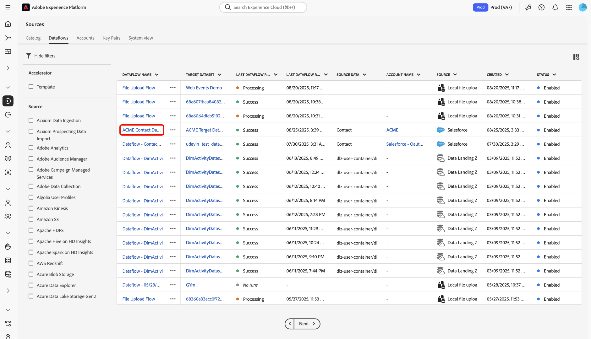

# データフローを作成して、CRM からExperience Platformにデータを取り込みます

このガイドでは、[[!DNL Flow Service] API](https://developer.adobe.com/experience-platform-apis/references/flow-service/) を使用してデータフローを作成し、データをAdobe Experience Platformに取り込む方法を説明します。

## 基本を学ぶ

このガイドは、Adobe Experience Platform の次のコンポーネントを実際に利用および理解しているユーザーを対象としています。

* [ バッチ取り込み ](../../../../ingestion/batch-ingestion/overview.md)：大量のデータをバッチですばやく効率的にアップロードする方法について説明します。
* [ カタログサービス ](../../../../catalog/datasets/overview.md):Experience Platformのデータセットを整理し、追跡します。
* [ データ準備 ](../../../../data-prep/home.md)：受信データを変換し、スキーマ要件に合わせてマッピングします。
* [ データフロー ](../../../../dataflows/home.md)：ソースから宛先にデータを移動するパイプラインを設定および管理します。
* [ エクスペリエンスデータモデル（XDM）スキーマ ](../../../../xdm/home.md):Experience Platformで使用できるように、XDM スキーマを使用してデータを構造化します。
* [ サンドボックス ](../../../../sandboxes/home.md)：実稼動データに影響を与えることなく、分離された環境で安全にテストおよび開発できます。
* [ ソース ](../../../home.md)：外部データソースをExperience Platformに接続する方法を説明します。

### Experience Platform API の使用

Experience Platform API を正常に呼び出す方法について詳しくは、[Experience Platform API の概要 ](../../../../landing/api-guide.md) を参照してください。

### ベース接続を作成 {#base}

ソースのデータフローを作成するには、完全に認証されたソースアカウントと、それに対応するベース接続 ID が必要になります。 この ID をお持ちでない場合は、[ ソースカタログ ](../../../home.md) を参照して、ベース接続を作成できるソースのリストを見つけてください。

### ターゲット XDM スキーマの作成 {#target-schema}

エクスペリエンスデータモデル（XDM）スキーマは、Experience Platform内でカスタマーエクスペリエンスのデータを整理および記述するための標準化された方法を提供します。 ソースデータをExperience Platformに取り込むには、まず取り込むデータの構造とタイプを定義するターゲット XDM スキーマを作成する必要があります。 このスキーマは、取り込んだデータが存在するExperience Platform データセットのブループリントとして機能します。

[Schema Registry API](https://developer.adobe.com/experience-platform-apis/references/schema-registry/) に POST リクエストを行うことで、ターゲット XDM スキーマを作成することができます。 ターゲット XDM スキーマの作成方法に関する詳細な手順については、次のガイドを参照してください。

* [API を使用したスキーマの作成 ](../../../../xdm/api/schemas.md)。
* [UI を使用したスキーマの作成 ](../../../../xdm/tutorials/create-schema-ui.md)。

作成したら、後でターゲットデータセットとマッピングにターゲット XDM スキーマ `$id` が必要になります。

### ターゲットデータセットの作成 {#target-dataset}

データセットは、データのコレクションのためのストレージと管理の構成体で、通常は、列（スキーマ）と行（フィールド）を持つテーブルのように構造化されます。 Experience Platformに正常に取り込まれたデータは、データセットとしてデータレイク内に保存されます。 この手順では、新しいデータセットを作成するか、既存のデータセットを使用します。

ペイロードにターゲットスキーマの ID を指定しながら [Catalog Service API](https://developer.adobe.com/experience-platform-apis/references/catalog/) に対して POST リクエストを実行することで、ターゲットデータセットを作成できます。 ターゲットデータセットの作成手順について詳しくは、[API を使用したデータセットの作成 ](../../../../catalog/api/create-dataset.md) に関するガイドを参照してください。

>[!TIP]
>
>データをリアルタイム顧客プロファイルに取り込む場合は、ターゲット XDM スキーマとターゲットデータセットの両方がプロファイルで有効になっていることを確認する必要があります。

+++を選択して例を表示

**API 形式**

```HTTP
POST /dataSets
```

**リクエスト**

次の例は、リアルタイム顧客プロファイルの取り込みが有効なターゲットデータセットを作成する方法を示しています。 このリクエストでは、`unifiedProfile` プロパティが（`true` オブジェクトの下の） `tags` に設定され、Experience Platformに対してリアルタイム顧客プロファイルにデータセットを含めるように指示します。

```shell
curl -X POST \
  'https://platform.adobe.io/data/foundation/catalog/dataSets' \
  -H 'Authorization: Bearer {ACCESS_TOKEN}' \
  -H 'x-api-key: {API_KEY}' \
  -H 'x-gw-ims-org-id: {ORG_ID}' \
  -H 'x-sandbox-name: {SANDBOX_NAME}' \
  -H 'Content-Type: application/json' \
  -d '{
    "name": "ACME Target Dataset",
    "schemaRef": {
      "id": "https://ns.adobe.com/{TENANT_ID}/schemas/719c4e19184402c27595e65b931a142b",
      "contentType": "application/vnd.adobe.xed+json;version=1"
    },
    "tags": {
      "unifiedProfile": [
        "enabled: true"
      ]
    }
  }'
```

| プロパティ | 説明 |
| --- | --- |
| `name` | ターゲットデータセットのわかりやすい名前。 今後の操作でデータセットを識別および管理しやすくするために、明確で一意の名前を使用します。 |
| `schemaRef.id` | ターゲット XDM スキーマの ID。 |
| `tags.unifiedProfile` | データをリアルタイム顧客プロファイルに取り込む必要があるかどうかをExperience Platformに通知するブール値です。 |

**応答**

正常な応答は、ターゲットデータセットの ID を返します。 この ID は、後でターゲット接続を作成する際に必要になります。

```json
[
    "@/dataSets/6889f4f89b982b2b90bc1207"
]
```

+++

## ソース接続の作成 {#source}

ソース接続は、外部ソースからExperience Platformにデータを取り込む方法を定義します。 ソースシステムと受信データの形式の両方を指定し、認証の詳細を含むベース接続を参照します。 各ソース接続は、組織に固有です。

* ファイルベースのソース（クラウドストレージなど）の場合、ソース接続には、列の区切り文字、エンコーディングの種類、圧縮の種類、ファイル選択の正規表現、ファイルを再帰的に取り込むかどうかなどの設定を含めることができます。
* テーブルベースのソース（データベース、CRM、マーケティング自動化プロバイダーなど）の場合、ソース接続では、テーブル名や列のマッピングなどの詳細を指定できます。

ソース接続を作成するには、`/sourceConnections` API の [!DNL Flow Service] エンドポイントに対して POST リクエストを実行し、ベース接続 ID、接続仕様 ID、ソースデータファイルへのパスを指定します。

**API 形式**

```http
POST /sourceConnections
```

**リクエスト**

```shell
curl -X POST \
  'https://platform.adobe.io/data/foundation/flowservice/sourceConnections' \
  -H 'Authorization: Bearer {ACCESS_TOKEN}' \
  -H 'x-api-key: {API_KEY}' \
  -H 'x-gw-ims-org-id: {ORG_ID}' \
  -H 'x-sandbox-name: {SANDBOX_NAME}' \
  -H 'Content-Type: application/json' \
  -d '{
    "name": "ACME source connection",
    "description": "A source connection for ACME contact data",
    "baseConnectionId": "6990abad-977d-41b9-a85d-17ea8cf1c0e4",
    "data": {
      "format": "tabular"
    },
    "params": {
      "tableName": "Contact",
      "columns": [
        {
          "name": "TestID",
          "type": "string",
          "xdm": {
            "type": "string"
          }
        },
        {
          "name": "Name",
          "type": "string",
          "xdm": {
            "type": "string"
          }
        },
        {
          "name": "Datefield",
          "type": "string",
          "meta:xdmType": "date-time",
          "xdm": {
            "type": "string",
            "format": "date-time"
          }
        }
      ]
    },
    "connectionSpec": {
      "id": "cfc0fee1-7dc0-40ef-b73e-d8b134c436f5",
      "version": "1.0"
    }
  }'
```

| プロパティ | 説明 |
| --- | --- |
| `name` | ソース接続のわかりやすい名前。 今後の操作で接続を識別および管理しやすくするために、明確で一意の名前を使用します。 |
| `description` | ソース接続に追加情報を提供するために追加できるオプションの説明です。 |
| `baseConnectionId` | ベース接続の `id`。 この ID は、[!DNL Flow Service] API を使用してExperience Platformへのソースを認証することで取得できます。 |
| `data.format` | データの形式。 この値を、テーブルベースのソース（データベース、CRM、マーケティング自動化プロバイダーなど）の `tabular` に設定します。 |
| `params.tableName` | Experience Platformに取得するソースアカウント内のテーブルの名前。 |
| `params.columns` | Experience Platformに取り込むデータの特定のテーブル列。 |
| `connectionSpec.id` | 使用しているソースの接続仕様 ID。 |

**応答**

正常な応答は、ソース接続の ID を返します。 この ID は、データフローを作成してデータを取り込むために必要です。

```json
{
    "id": "b7581b59-c603-4df1-a689-d23d7ac440f3",
    "etag": "\"ef05d265-0000-0200-0000-6019e0080000\""
}
```

## ターゲット接続の作成 {#target}

ターゲット接続は、取り込まれたデータが取り込まれる宛先への接続を表します。 ターゲット接続を作成するには、データレイクに関連付けられた固定接続仕様 ID を指定する必要があります。 この接続仕様 ID は `c604ff05-7f1a-43c0-8e18-33bf874cb11c` です。

**API 形式**

```http
POST /targetConnections
```

**リクエスト**

```shell
curl -X POST \
  'https://platform.adobe.io/data/foundation/flowservice/targetConnections' \
  -H 'Authorization: Bearer {ACCESS_TOKEN}' \
  -H 'x-api-key: {API_KEY}' \
  -H 'x-gw-ims-org-id: {ORG_ID}' \
  -H 'x-sandbox-name: {SANDBOX_NAME}' \
  -H 'Content-Type: application/json' \
  -d '{
      "name": "ACME target connection",
      "description": "ACME target connection",
      "data": {
          "schema": {
              "id": "https://ns.adobe.com/{TENANT_ID}/schemas/52b59140414aa6a370ef5e21155fd7a686744b8739ecc168",
              "version": "application/vnd.adobe.xed-full+json;version=1"
          }
      },
      "params": {
          "dataSetId": "6889f4f89b982b2b90bc1207"
      },
      "connectionSpec": {
          "id": "c604ff05-7f1a-43c0-8e18-33bf874cb11c",
          "version": "1.0"
      }
    }'
```

| プロパティ | 説明 |
| --- | --- |
| `name` | ターゲット接続のわかりやすい名前。 今後の操作で接続を識別および管理しやすくするために、明確で一意の名前を使用します。 |
| `description` | ターゲット接続に追加情報を提供するために追加できるオプションの説明です。 |
| `data.schema.id` | ターゲット XDM スキーマの ID。 |
| `params.dataSetId` | ターゲットデータセットの ID |
| `connectionSpec.id` | データレイクの接続仕様 ID。 この ID は固定されています：`c604ff05-7f1a-43c0-8e18-33bf874cb11c`。 |

## マッピング {#mapping}

次に、ターゲットデータセットが準拠するターゲットスキーマにソースデータをマッピングします。 マッピングを作成するには、`mappingSets`API[[!DNL Data Prep]  の ](https://developer.adobe.com/experience-platform-apis/references/data-prep/) エンドポイントに対して POST リクエストを実行します。 ターゲット XDM スキーマ ID と、作成するマッピングセットの詳細を含めます。

**API 形式**

```http
POST /mappingSets
```

**リクエスト**

```shell
curl -X POST \
  'https://platform.adobe.io/data/foundation/conversion/mappingSets' \
  -H 'Authorization: Bearer {ACCESS_TOKEN}' \
  -H 'x-api-key: {API_KEY}' \
  -H 'x-gw-ims-org-id: {ORG_ID}' \
  -H 'x-sandbox-name: {SANDBOX_NAME}' \
  -H 'Content-Type: application/json' \
  -d '{
      "version": 0,
      "xdmSchema": "https://ns.adobe.com/{TENANT_ID}/schemas/52b59140414aa6a370ef5e21155fd7a686744b8739ecc168",
      "xdmVersion": "1.0",
      "id": null,
      "mappings": [
          {
              "destinationXdmPath": "_id",
              "sourceAttribute": "TestID",
              "identity": false,
              "identityGroup": null,
              "namespaceCode": null,
              "version": 0
          },
          {
              "destinationXdmPath": "person.name.fullName",
              "sourceAttribute": "Name",
              "identity": false,
              "identityGroup": null,
              "namespaceCode": null,
              "version": 0
          },
          {
              "destinationXdmPath": "person.birthDate",
              "sourceAttribute": "Datefield",
              "identity": false,
              "identityGroup": null,
              "namespaceCode": null,
              "version": 0
          }
      ]
  }'
```

| プロパティ | 説明 |
| -------- | ----------- |
| `xdmSchema` | ターゲット XDM スキーマの `$id`。 |

**応答**

応答が成功すると、一意の ID（`id`）など、新しく作成されたマッピングの詳細が返されます。この ID は、後の手順でデータフローを作成する際に必要になります。

```json
{
    "id": "93ddfa69c4864d978832b1e5ef6ec3b9",
    "version": 0,
    "createdDate": 1612309018666,
    "modifiedDate": 1612309018666,
    "createdBy": "{CREATED_BY}",
    "modifiedBy": "{MODIFIED_BY}"
}
```

## データフロー仕様の取得 {#flow-specs}

データフローを作成する前に、まず、ソースに対応するデータフロー仕様を取得する必要があります。 この情報を取得するには、`/flowSpecs` API の [!DNL Flow Service] エンドポイントに対してGET リクエストを実行します。

**API 形式**

```http
GET /flowSpecs?property=name=="{NAME}"
```

| クエリパラメーター | 説明 |
| --- | --- |
| `property=name=="{NAME}"` | データフロー仕様の名前。 <ul><li>ファイルベースのソース（クラウドストレージなど）の場合、この値を `CloudStorageToAEP` に設定します。</li><li>テーブルベースのソース（データベース、CRM、マーケティング自動化プロバイダーなど）の場合、この値を `CRMToAEP` に設定します。</li></ul> |

**リクエスト**

```shell
curl -X GET \
  'https://platform.adobe.io/data/foundation/flowservice/flowSpecs?property=name=="CRMToAEP"' \
  -H 'x-api-key: {API_KEY}' \
  -H 'x-gw-ims-org-id: {ORG_ID}' \
  -H 'x-sandbox-name: {SANDBOX_NAME}'
```

**応答**

リクエストが成功した場合は、ソースからExperience Platformにデータを取り込む必要があるデータフローの仕様の詳細が返されます。 応答には、新しいデータフローを作成するために必要な、一意のフロー仕様 `id` が含まれます。

正しいデータフロー仕様を使用していることを確認するには、応答の `items.sourceConnectionSpecIds` 配列を確認します。 ソースの接続仕様 ID がこのリストに含まれていることを確認します。

+++選択して表示

```json
{
    "items": [
        {
            "id": "14518937-270c-4525-bdec-c2ba7cce3860",
            "name": "CRMToAEP",
            "providerId": "0ed90a81-07f4-4586-8190-b40eccef1c5a",
            "version": "1.0",
            "sourceConnectionSpecIds": [
                "3416976c-a9ca-4bba-901a-1f08f66978ff",
                "38ad80fe-8b06-4938-94f4-d4ee80266b07",
                "d771e9c1-4f26-40dc-8617-ce58c4b53702",
                "3c9b37f8-13a6-43d8-bad3-b863b941fedd",
                "cc6a4487-9e91-433e-a3a3-9cf6626c1806",
                "3000eb99-cd47-43f3-827c-43caf170f015",
                "26d738e0-8963-47ea-aadf-c60de735468a",
                "74a1c565-4e59-48d7-9d67-7c03b8a13137",
                "cfc0fee1-7dc0-40ef-b73e-d8b134c436f5",
                "4f63aa36-bd48-4e33-bb83-49fbcd11c708",
                "cb66ab34-8619-49cb-96d1-39b37ede86ea",
                "eb13cb25-47ab-407f-ba89-c0125281c563",
                "1f372ff9-38a4-4492-96f5-b9a4e4bd00ec",
                "37b6bf40-d318-4655-90be-5cd6f65d334b",
                "a49bcc7d-8038-43af-b1e4-5a7a089a7d79",
                "a8b6a1a4-5735-42b4-952c-85dce0ac38b5",
                "6a8d82bc-1caf-45d1-908d-cadabc9d63a6",
                "aac9bbd4-6c01-46ce-b47e-51c6f0f6db3f",
                "8e6b41a8-d998-4545-ad7d-c6a9fff406c3",
                "ecde33f2-c56f-46cc-bdea-ad151c16cd69",
                "09182899-b429-40c9-a15a-bf3ddbc8ced7",
                "0479cc14-7651-4354-b233-7480606c2ac3",
                "d6b52d86-f0f8-475f-89d4-ce54c8527328",
                "a8f4d393-1a6b-43f3-931f-91a16ed857f4",
                "fcad62f3-09b0-41d3-be11-449d5a621b69",
                "ea1c2a08-b722-11eb-8529-0242ac130003",
                "35d6c4d8-c9a9-11eb-b8bc-0242ac130003",
                "b2e08744-4f1a-40ce-af30-7abac3e23cf3",
                "2acf109f-9b66-4d5e-bc18-ebb2adcff8d5",
                "2fa8af9c-2d1a-43ea-a253-f00a00c74412",
                "e9d7ec6b-0873-4e57-ad21-b3a7c65e310b"
            ],
            "targetConnectionSpecIds": [
                "c604ff05-7f1a-43c0-8e18-33bf874cb11c"
            ],
            "optionSpec": {
                "name": "OptionSpec",
                "spec": {
                    "$schema": "http://json-schema.org/draft-07/schema#",
                    "type": "object",
                    "properties": {
                        "errorDiagnosticsEnabled": {
                            "title": "Error diagnostics.",
                            "description": "Flag to enable detailed and sample error diagnostics summary.",
                            "type": "boolean",
                            "default": false
                        },
                        "partialIngestionPercent": {
                            "title": "Partial ingestion threshold.",
                            "description": "Percentage which defines the threshold of errors allowed before the run is marked as failed.",
                            "type": "number",
                            "exclusiveMinimum": 0
                        }
                    }
                }
            },
            "transformationSpecs": [
                {
                    "name": "Copy",
                    "spec": {
                        "$schema": "http://json-schema.org/draft-07/schema#",
                        "type": "object",
                        "properties": {
                            "deltaColumn": {
                                "type": "object",
                                "properties": {
                                    "name": {
                                        "type": "string"
                                    },
                                    "dateFormat": {
                                        "type": "string"
                                    },
                                    "timezone": {
                                        "type": "string"
                                    }
                                },
                                "required": [
                                    "name"
                                ]
                            }
                        },
                        "required": [
                            "deltaColumn"
                        ]
                    }
                },
                {
                    "name": "Mapping",
                    "spec": {
                        "$schema": "http://json-schema.org/draft-07/schema#",
                        "type": "object",
                        "description": "defines various params required for different mapping from source to target",
                        "properties": {
                            "mappingId": {
                                "type": "string"
                            },
                            "mappingVersion": {
                                "type": "string"
                            }
                        }
                    }
                }
            ],
            "scheduleSpec": {
                "name": "PeriodicSchedule",
                "type": "Periodic",
                "spec": {
                    "$schema": "http://json-schema.org/draft-07/schema#",
                    "type": "object",
                    "properties": {
                        "startTime": {
                            "description": "epoch time",
                            "type": "integer"
                        },
                        "frequency": {
                            "type": "string",
                            "enum": [
                                "once",
                                "minute",
                                "hour",
                                "day",
                                "week"
                            ]
                        },
                        "interval": {
                            "type": "integer"
                        },
                        "backfill": {
                            "type": "boolean",
                            "default": true
                        }
                    },
                    "required": [
                        "startTime",
                        "frequency"
                    ],
                    "if": {
                        "properties": {
                            "frequency": {
                                "const": "once"
                            }
                        }
                    },
                    "then": {
                        "allOf": [
                            {
                                "not": {
                                    "required": [
                                        "interval"
                                    ]
                                }
                            },
                            {
                                "not": {
                                    "required": [
                                        "backfill"
                                    ]
                                }
                            }
                        ]
                    },
                    "else": {
                        "required": [
                            "interval"
                        ],
                        "if": {
                            "properties": {
                                "frequency": {
                                    "const": "minute"
                                }
                            }
                        },
                        "then": {
                            "properties": {
                                "interval": {
                                    "minimum": 15
                                }
                            }
                        },
                        "else": {
                            "properties": {
                                "interval": {
                                    "minimum": 1
                                }
                            }
                        }
                    }
                }
            },
            "runSpec": {
                "name": "ProviderParams",
                "spec": {
                    "$schema": "http://json-schema.org/draft-07/schema#",
                    "type": "object",
                    "description": "defines various params required for creating flow run.",
                    "properties": {
                        "startTime": {
                            "type": "integer",
                            "description": "An integer that defines the start time of the run. The value is represented in Unix epoch time."
                        },
                        "windowStartTime": {
                            "type": "integer",
                            "description": "An integer that defines the start time of the window against which data is to be pulled. The value is represented in Unix epoch time."
                        },
                        "windowEndTime": {
                            "type": "integer",
                            "description": "An integer that defines the end time of the window against which data is to be pulled. The value is represented in Unix epoch time."
                        },
                        "deltaColumn": {
                            "type": "object",
                            "description": "The delta column is required to partition the data and separate newly ingested data from historic data.",
                            "properties": {
                                "name": {
                                    "type": "string"
                                },
                                "dateFormat": {
                                    "type": "string"
                                },
                                "timezone": {
                                    "type": "string"
                                }
                            },
                            "required": [
                                "name"
                            ]
                        }
                    },
                    "required": [
                        "startTime",
                        "windowStartTime",
                        "windowEndTime",
                        "deltaColumn"
                    ]
                }
            },
            "attributes": {
                "recordTypeEnabled": true,
                "defaultRecordType": "profile",
                "isSourceFlow": true,
                "flacValidationSupported": true,
                "isDraftModeSupported": true,
                "frequency": "batch",
                "notification": {
                    "category": "sources",
                    "flowRun": {
                        "enabled": true
                    }
                }
            },
            "permissionsInfo": {
                "manage": [
                    {
                        "@type": "lowLevel",
                        "name": "EnterpriseSource",
                        "permissions": [
                            "write"
                        ]
                    }
                ],
                "view": [
                    {
                        "@type": "lowLevel",
                        "name": "EnterpriseSource",
                        "permissions": [
                            "read"
                        ]
                    }
                ]
            }
        }
    ]
}
```

+++

## データフローの作成 {#dataflow}

データフローは、Experience Platform サービス間でデータを転送する設定済みのパイプラインです。 外部ソース（データベース、クラウドストレージ、API など）からデータを取り込み、処理して、ターゲットデータセットにルーティングする方法を定義します。 その後、これらのデータセットは、ID サービス、リアルタイム顧客プロファイル、宛先などのサービスでアクティブ化と分析に使用されます。

データフローを作成するには、次の項目の値を指定する必要があります。

* [ソース接続 ID](#source)
* [ターゲット接続 ID](#target)
* [マッピング ID](#mapping)
* [データフロー仕様 ID](#flow-specs)

この手順では、次のパラメーターを使用して、データフローの取り込みスケジュールを設定で `scheduleParams` ます。

| スケジュール パラメーター | 説明 |
| --- | --- |
| `startTime` | データフローを開始する必要があるエポック時間（秒単位）。 |
| `frequency` | 取り込みの頻度。 頻度を設定して、データフローの実行頻度を示します。 頻度は次のように設定できます。 <ul><li>`once`：頻度を `once` に設定して、1 回限りの取り込みを作成します。 間隔およびバックフィル設定は、1 回限りの取り込みジョブでは使用できません。 デフォルトでは、スケジュールの頻度は 1 回に設定されています。</li><li>`minute`：頻度を `minute` に設定して、1 分ごとにデータを取り込むようにデータフローをスケジュールします。</li><li>`hour`：頻度を `hour` に設定して、1 時間ごとにデータを取り込むようにデータフローをスケジュールします。</li><li>`day`：頻度を `day` に設定して、1 日にデータを取り込むようにデータフローをスケジュールします。</li><li>`week`：頻度を `week` に設定して、データフローが週ごとにデータを取り込むようにスケジュールします。</li></ul> |
| `interval` | 連続して取り込む間隔（`once` 以外のすべての頻度で必要）。 間隔設定を設定して、すべての取り込み間の時間枠を確立します。 例えば、頻度が日に設定され、間隔が 15 の場合、データフローは 15 日ごとに実行されます。 間隔をゼロに設定することはできません。 各頻度で許容される最小のインターバル値は次のとおりです。<ul><li>`once`：なし</li><li>`minute`: 15</li><li>`hour`: 1</li><li>`day`: 1</li><li>`week`: 1</li></ul> |
| `backfill` | `startTime` より前の履歴データを取り込むかどうかを示します。 |

{style="table-layout:auto"}


**API 形式**

```http
POST /flows
```

**リクエスト**

```shell
curl -X POST \
  'https://platform.adobe.io/data/foundation/flowservice/flows' \
  -H 'x-api-key: {API_KEY}' \
  -H 'x-gw-ims-org-id: {ORG_ID}' \
  -H 'x-sandbox-name: {SANDBOX_NAME}' \
  -H 'Content-Type: application/json' \
  -d '{
      "name": "ACME Contact Dataflow",
      "description": "A dataflow for ACME contact data",
      "flowSpec": {
          "id": "14518937-270c-4525-bdec-c2ba7cce3860",
          "version": "1.0"
      },
      "sourceConnectionIds": [
          "b7581b59-c603-4df1-a689-d23d7ac440f3"
      ],
      "targetConnectionIds": [
          "320f119a-5ac1-4ab1-88ea-eb19e674ea2e"
      ],
      "transformations": [
          {
              "name": "Copy",
              "params": {
                  "deltaColumn": {
                      "name": "Datefield",
                      "dateFormat": "YYYY-MM-DD",
                      "timezone": "UTC"
                  }
              }
          },
          {
              "name": "Mapping",
              "params": {
                  "mappingId": "93ddfa69c4864d978832b1e5ef6ec3b9",
                  "mappingVersion": 0
              }
          }
      ],
      "scheduleParams": {
          "startTime": "1612310466",
          "frequency":"minute",
          "interval":"15",
          "backfill": "true"
      }
  }'
```

| プロパティ | 説明 |
| --- | --- |
| `name` | データフローのわかりやすい名前。 今後の操作でデータフローを識別および管理しやすくするために、明確で一意の名前を使用します。 |
| `description` | データフローに追加情報を提供するために追加できるオプションの説明です。 |
| `flowSpec.id` | ソースに対応するフロー仕様の ID。 |
| `sourceConnectionIds` | 以前の手順で生成されたソース接続 ID。 |
| `targetConnectionIds` | 以前の手順で生成されたターゲット接続 ID。 |
| `transformations.params.deltaColum` | 新しいデータと既存のデータを区別するために使用する、指定の列。 増分データは、選択した列のタイムスタンプに基づいて取り込まれます。 `deltaColumn` でサポートされている形式は `yyyy-MM-dd HH:mm:ss` です。[!DNL Microsoft Dynamics] の場合、`deltaColumn` でサポートされている形式は `yyyy-MM-ddTHH:mm:ssZ` です。 |
| `transformations.params.deltaColumn.dateFormat` | 差分列で使用する日付形式。 |
| `transformations.params.deltaColumn.timeZone` | delta 列の値を解釈する際に使用するタイムゾーン。 |
| `transformations.params.mappingId` | 以前の手順で生成されたマッピング ID。 |
| `scheduleParams.startTime` | データフローの開始時間（エポック時間） （Unix エポックからの秒数）。 データフローが最初の実行を開始するタイミングを決定します。 |
| `scheduleParams.frequency` | データフローが実行される頻度。 指定できる値は、`once`、`minute`、`hour`、`day`、`week` です。 |
| `scheduleParams.interval` | 選択した頻度に基づく、連続するデータフロー実行間の間隔。 ゼロ以外の整数にする必要があります。 例えば、頻度が「分」に設定され、間隔が 15 の場合、データフローは 15 分ごとに実行されます。 |
| `scheduleParams.backfill` | データフローが最初に作成されたときに、履歴データを取り込む（バックフィル）かどうかを決定するブール値（`true` または `false`）です。 |

{style="table-layout:auto"}

**応答**

リクエストが成功した場合は、新しく作成したデータフローの ID（`id`）が返されます。

```json
{
    "id": "ae0a9777-b322-4ac1-b0ed-48ae9e497c7e",
    "etag": "\"770029f8-0000-0200-0000-6019e7d40000\""
}
```

### UI を使用した API ワークフローの検証 {#validate-in-ui}

Experience Platform ユーザーインターフェイスを使用して、データフローの作成を検証できます。 Experience Platform UI の *[!UICONTROL ソース]* カタログに移動し、ヘッダータブから **[!UICONTROL データフロー]** を選択します。 次に、[!UICONTROL  データフロー名 ] 列を使用し、[!DNL Flow Service] API を使用して作成したデータフローを見つけます。



[!UICONTROL  データフローアクティビティ ] インターフェイスを通じて、データフローをさらに検証できます。 右側のパネルを使用して、データフローの [!UICONTROL API の使用状況 ] 情報を表示します。 このセクションには、[!DNL Flow Service] のデータフロー作成プロセス中に生成されたのと同じデータフロー ID、データセット ID およびマッピング ID が表示されます。


## 次の手順

このチュートリアルでは、[!DNL Flow Service] API を使用してExperience Platformでデータフローを作成するプロセスについて説明します。 ターゲット XDM スキーマ、データセット、ソース接続、ターゲット接続、データフロー自体など、必要なコンポーネントを作成および設定する方法を学習しました。 これらの手順に従うと、外部ソースからExperience Platformへのデータの取り込みを自動化し、リアルタイム顧客プロファイルや宛先などのダウンストリームサービスで、取り込んだデータを高度なユースケースに活用できるようになります。

### データフローの監視

データフローを作成したら、Experience Platform UI で直接パフォーマンスを監視できます。 これには、取り込み率、成功指標、発生したエラーのトラッキングが含まれます。 データフローの監視方法について詳しくは、[ アカウントとデータフローの監視 ](../../../../dataflows/ui/monitor-sources.md) に関するチュートリアルを参照してください。

### データフローの更新

データフローのスケジュール、マッピング、一般情報などの設定を更新するには、[ ソースデータフローの更新 ](../../api/update-dataflows.md) に関するチュートリアルを参照してください。

## データフローの削除

不要になったデータフローや誤って作成されたデータフローは、**[!UICONTROL データフロー]**&#x200B;ワークスペース内にある&#x200B;**[!UICONTROL 削除]**&#x200B;機能で削除できます。データフローの削除方法について詳しくは、[ データフローの削除 ](../../api/delete.md) のチュートリアルを参照してください。
