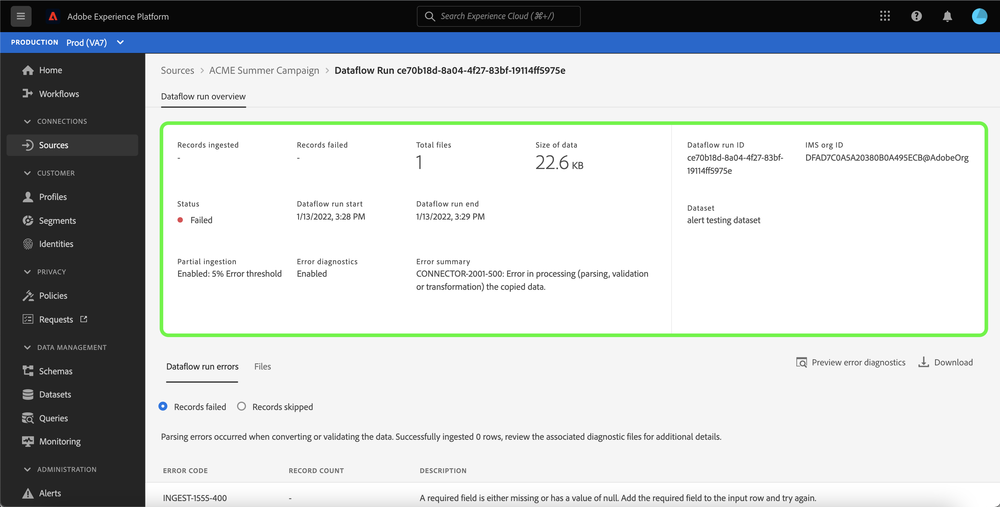

# UI でのソースデータフローのアラートの購読

Adobe Experience Platform では、Adobe Experience Platform アクティビティに関するイベントベースのアラートを登録できます。 アラートにより、ジョブが完了したか、ワークフロー内の特定のマイルストーンに達したか、何らかのエラーが発生したかを確認するために、[[!DNL Observability Insights] API](../../../observability/api/overview.md) をポーリングする必要が低減される、またはなくなります。

データフローを作成する際にアラートの配信を登録して、フロー実行のステータス、成功または失敗に関するアラートメッセージを受信できます。

このドキュメントでは、ソースデータフローのアラートメッセージの受信を登録する手順を説明します。

## はじめに

このドキュメントでは、Adobe Experience Platformの次のコンポーネントに関する十分な知識が必要です。

* [ソース](../../home.md)：[!DNL Experience Platform] を使用すると、データを様々なソースから取得しながら、[!DNL Experience Platform] サービスを使用して受信データの構造化、ラベル付け、拡張を行うことができます。
* [ 可観測性 ](../../../observability/home.md):[!DNL Observability Insights] を使用すると、統計指標とイベント通知を使用して、Experience Platform アクティビティを監視できます。
   * [ アラート ](../../../observability/alerts/overview.md):Experience Platform操作の特定の条件（システムがしきい値に達した場合に問題が発生する可能性があるなど）に達すると、Experience Platformはその条件を登録している組織内のユーザーにアラートメッセージを配信できます。

## UI でのアラートの登録 {#subscribe-sources-alerts}

>[!CONTEXTUALHELP]
>id="platform_sources_alerts_subscribe"
>title="ソースアラートの購読"
>abstract="アラートを使用すると、ソースデータフローのステータスに基づいて、通知を受け取ることができます。アラート通知を設定すると、データフローが開始された場合、成功した場合、失敗した場合、データが取り込まれなかった場合に、更新情報を受け取ることができます。"
>text="Learn more in documentation"

>[!IMPORTANT]
>
>データフローでメールベースのアラート通知を受け取るには、Experience Platform アカウントでメールの即時通知を有効にする必要があります。

ソースワークスペースのソースワークフローの [!UICONTROL  データフローの詳細 ] 手順で、データフローのアラートを有効にできます。

ソースデータフローで使用可能なアラートは次のとおりです。

>[!NOTE]
>
>ストリーミングソースは現在、アラートではサポートされていません。 バッチソースのアラート通知のみを登録できます。

| アラート | 説明 |
| --- | --- |
| ソースフロー実行開始 | このアラートは、ソースデータフローが開始されたときにメッセージを送信します。 |
| ソースフロー実行の成功 | このアラートでは、ソースからのデータがExperience Platformに正常に取り込まれるとメッセージが表示されます。 |
| ソースフロー実行の失敗 | このアラートは、データフローでエラーが発生した場合にメッセージを送信します。 |

購読するアラートを選択し、「**[!UICONTROL 次へ]**」を選択してデータフローを確認して完了します。

UI でのソースデータフローの作成に関する詳細な手順については、次のガイドを参照してください。

* [広告](./dataflow/advertising.md)
* [クラウドストレージ](./dataflow/batch/cloud-storage.md)
* [CRM](./dataflow/crm.md)
* [データベース](./dataflow/databases.md)
* [E コマース](./dataflow/ecommerce.md)
* [ローカルファイル](./create/local-system/local-file-upload.md)
* [マーケティングの自動化](./dataflow/marketing-automation.md)
* [支払い](./dataflow/payments.md)
* [プロトコル](./dataflow/protocols.md)

## アラートの受信

データフローが実行されると、UI またはメールでアラートを受け取ることができます。

### UI 内

アラートは、Experience Platform UI の上部ヘッダーにある通知アイコンによって UI に表示されます。 通知アイコンを選択して、データフローに関する特定のアラートメッセージを表示します。

通知パネルが表示され、作成したデータフローのステータス更新のリストが表示されます。

アラートメッセージにポインタを合わせて、それらを既読としてマークしたり、時計アイコンを選択して、データフローのステータスに関する今後のリマインダーを設定したりできます。

アラートメッセージを選択して、データフローに関する特定の情報を表示します。

[!UICONTROL  データフロー実行の概要 ] ページが表示されます。 画面の上半分には、属性に関する情報、対応するデータフロー実行 ID、高レベルのエラー概要など、データフローの概要が表示されます。

ページの下半分には、データフロー実行ステージで発生した [!UICONTROL  データフロー実行エラー ] が表示されます。 ここから、エラー診断をプレビューしたり、[[!DNL Data Access] API](https://www.adobe.io/experience-platform-apis/references/data-access/) を使用して、データフローに対応するエラー診断またはファイルマニフェストをダウンロードしたりできます。

データフローエラーの処理について詳しくは、[UI でのソースデータフローの監視 ](../../../dataflows/ui/monitor-sources.md) を参照してください。

### 電子メール

データフローに関するアラートもメールで配信されます。 メール本文でデータフロー名を選択すると、データフローの詳細が表示されます。

UI アラートと同様に、[!UICONTROL  データフロー実行の概要 ] ページが表示され、データフローに関連付けられたエラーを調査するためのインターフェイスが提供されます。

## アラートを購読および購読解除

[!UICONTROL  データフロー ] ページでは、追加のアラートを購読したり、既存のデータフローに対して設定されたアラートを登録解除したりできます。 リストから作成したデータフローを見つけ、省略記号（`...`）を選択して、オプションのドロップダウンメニューを表示します。 次に、「**[!UICONTROL アラートを購読]**」を選択して、データフローのアラート設定を変更します。

ポップアップウィンドウが開き、ソースアラートのリストが表示されます。 登録するアラートを選択するか、登録解除するアラートの選択を解除します。 完了したら「**[!UICONTROL 保存]**」を選択します。

## 次の手順

このドキュメントでは、ソースデータフローのコンテキスト内アラートを購読する方法を順を追って説明しました。 詳しくは、[ アラート UI ガイド ](../../../observability/alerts/ui.md) を参照してください。