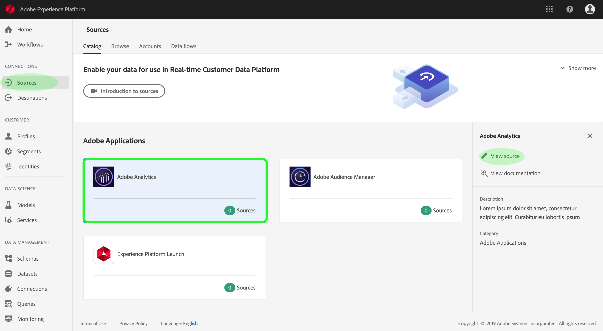
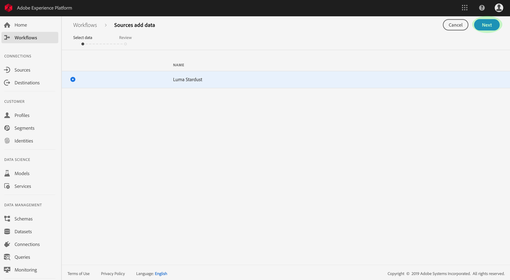

# UIでのAdobe Analyticsソースコネクタの作成

このチュートリアルでは、UIでAdobe Analyticsソースコネクターを作成し、コンシューマーデータをAdobe Experience Platformに取り込む手順を説明します。

## Adobe Analyticsでのソース接続の作成

<a href="https://platform.adobe.com" target="_blank">Adobe Experience Platformにログインし</a> 、左のナビゲーションバーから「 **Sources** 」を選択して、ソースワークスペースにアクセスします。 カタ *ログ画面に* 、とのインバウンド接続を作成するために使用できるソースが表示され、各ソースに関連付けられた既存の接続の数が表示されます。 **Adobe Analyticsのオプションを選択し、** 表示ソース **** をクリックして、確立されたすべてのインバウンド接続を表示します。

ソース *アクティビティ* 画面では、以前にAdobe Analyticsに対して確立されたすべての接続をリストできます。「データを選択」をクリックして、新しい接続を **作成できます**。

>[!NOTE] 1つのソースに対する複数のインバウンド接続は、異なるデータを取り込むために作成できます。

使用可能なレポートスイートのリストから、プラットフォームに取り込むレポートスイートを選択し、「次へ」をクリッ **クします**。

>[!NOTE] Analyticsのソース接続ごとに1つのレポートスイートのみを選択できます。 また、1つのサンドボックスに1つのレポートスイートしか存在できません。

「レビ *ュー* 」手順が表示され、新しいAnalyticsのインバウンド接続を作成前に確認できます。 接続の詳細は、次のようなカテゴリでグループ化されます。

* *ソースの詳細*:ソース接続のタイプと選択したレポートスイートが表示されます。
* *ターゲットの詳細*:他のソースコネクタを作成する場合、このコンテナには、データセットが適合するスキーマなど、ソースデータが取り込まれるデータセットが表示されます。 解析データは自動的にマッピングされ、リアルタイム顧客データに取り込まれます。プロファイル

## 次の手順

接続が作成されると、ターゲットスキーマとデータセットが自動的に作成され、受信データが格納されます。 さらに、データのバックフィルが行われ、最大13か月の履歴データが取り込まれます。 初期インジェストが完了すると、Analyticsデータが使用され、リアルタイムの顧客プロファイルやセグメント化サービスなどのダウンストリームプラットフォームサービスで使用されます。 詳しくは、次のドキュメントを参照してください。

* [リアルタイム顧客プロファイルの概要](../../../../../profile/home.md)
* [セグメント化サービスの概要](../../../../../segmentation/home.md)
* [Data Science Workspaceの概要](../../../../../data-science-workspace/home.md)
* [クエリサービスの概要](../../../../../query-service/home.md)

