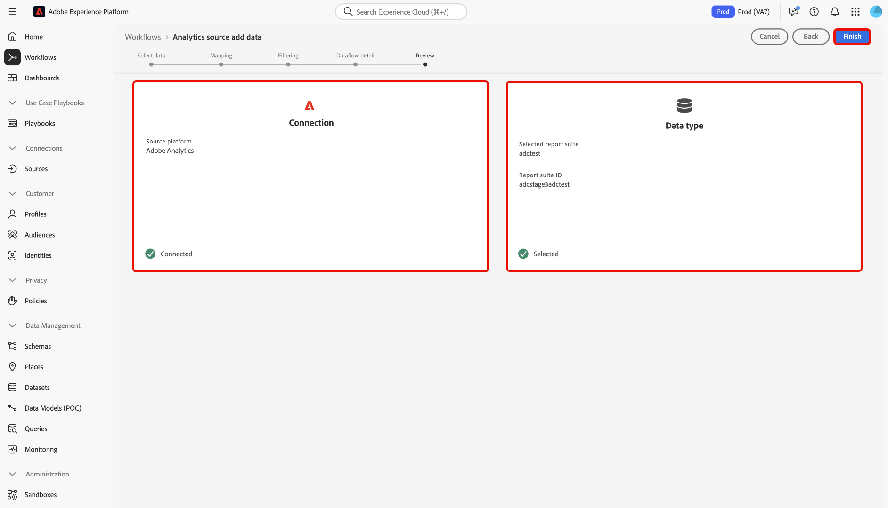
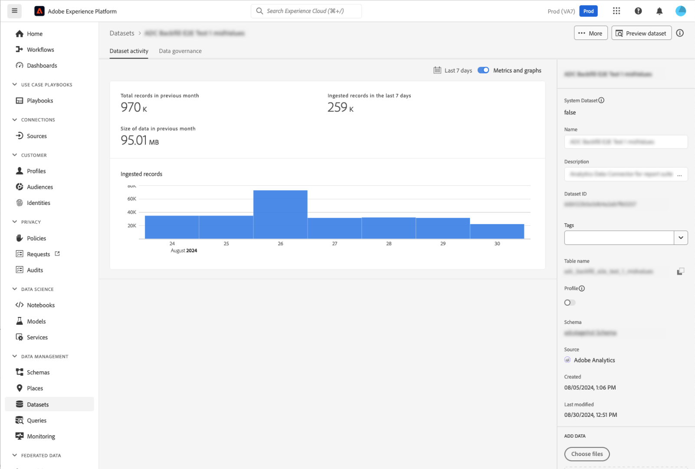
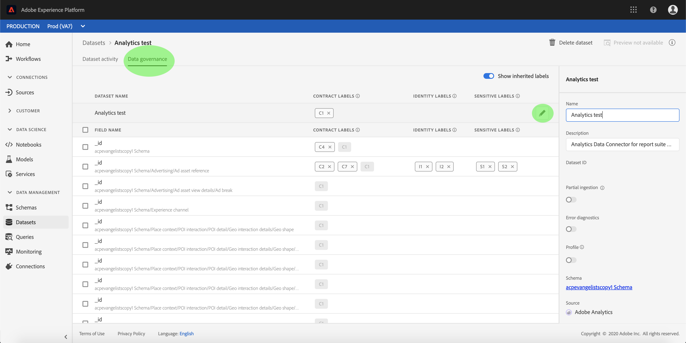

# UI でのAdobe Analyticsソース接続の作成

このチュートリアルでは、UI でAdobe Analyticsソース接続を作成して [!DNL Analytics] レポートスイートデータをAdobe Experience Platformに取り込む手順を説明します。

## はじめに

このチュートリアルは、Adobe Experience Platform の次のコンポーネントを実際に利用および理解しているユーザーを対象としています。

* [エクスペリエンスデータモデル（XDM）システム](../../../../../xdm/home.md)：Experience Platform が顧客体験データを整理するための標準化されたフレームワーク。
* [リアルタイム顧客プロファイル](../../../../../profile/home.md)：複数のソースからの集計データに基づいて、統合されたリアルタイムのプロファイルを顧客に提供します。
* [サンドボックス](../../../../../sandboxes/home.md)：Experience Platform は、単一の Platform インスタンスを別々の仮想環境に分割して、デジタルエクスペリエンスアプリケーションの開発と発展を支援する仮想サンドボックスを提供します。

### 主要用語

このドキュメント全体で使用される以下の主要用語を理解しておくことが重要です。

* **標準属性**:標準属性は、Adobeで事前定義された属性です。これらはすべての顧客に対して同じ意味を持ち、[!DNL Analytics] ソースデータと [!DNL Analytics] スキーマフィールドグループで使用できます。
* **カスタム属性**:カスタム属性は、のカスタム変数階層に含まれる任意の属性で [!DNL Analytics]す。カスタム属性は、Adobe Analyticsの実装内で特定の情報をレポートスイートに取り込むために使用され、レポートスイートとレポートスイートで使用される機能が異なります。 カスタム属性には、eVar、prop、リストが含まれます。 eVar について詳しくは、次の [[!DNL Analytics]  コンバージョン変数 ](https://experienceleague.adobe.com/docs/analytics/admin/admin-tools/conversion-variables/conversion-var-admin.html?lang=en) のドキュメントを参照してください。
* **カスタムフィールドグループの属性**:顧客が作成したフィールドグループから派生する属性はすべてユーザー定義で、標準属性とカスタム属性のどちらでもありません。
* **わかりやすい名前**:わかりやすい名前は、実装内のカスタム変数に対して人間が指定するラベル [!DNL Analytics] です。わかりやすい名前の詳細については、次の [[!DNL Analytics]  コンバージョン変数 ](https://experienceleague.adobe.com/docs/analytics/admin/admin-tools/conversion-variables/conversion-var-admin.html?lang=en) のドキュメントを参照してください。

## Adobe Analyticsとのソース接続の作成

Platform UI で、左のナビゲーションから「 **[!UICONTROL ソース]** 」を選択して、「 [!UICONTROL  ソース ] 」ワークスペースにアクセスします。 [!UICONTROL  カタログ ] 画面には、アカウントを作成できる様々なソースが表示されます。

画面の左側にあるカタログから適切なカテゴリを選択できます。 検索バーを使用して、表示されるソースを絞り込むこともできます。

「**[!UICONTROL Adobeアプリケーション]**」カテゴリで「**[!UICONTROL Adobe Analytics]**」を選択し、「**[!UICONTROL データを追加]**」を選択します。

### データの選択

**[!UICONTROL Analytics ソースのデータ追加]** 手順が表示されます。 「**[!UICONTROL レポートスイート]**」を選択して Analytics レポートスイートデータのソース接続の作成を開始し、取り込むレポートスイートを選択します。 選択できないレポートスイートは、このサンドボックスまたは別のサンドボックスで既に取り込まれています。 「**[!UICONTROL 次へ]**」を選択して次に進みます。

>[!NOTE]
>
>複数のインバウンド接続を使用して複数のレポートスイートを取り込むことはできますが、Real-time Customer Data Platformで一度に使用できるレポートスイートは 1 つだけです。

<!---Analytics Report Suites can be configured for one sandbox at a time. To import the same Report Suite into a different sandbox, the dataset flow will have to be deleted and instantiated again via configuration for a different sandbox.--->

### マッピング

>[!IMPORTANT]
>
>[!DNL Analytics] ソースのデータ準備サポート機能はベータ版です。

[!UICONTROL  マッピング ] ページは、ソースフィールドを適切なターゲットスキーマフィールドにマッピングするためのインターフェイスを提供します。 ここから、カスタム変数を新しいスキーマフィールドグループにマッピングし、データ準備でサポートされている方法で計算を適用できます。 マッピング処理を開始するターゲットスキーマを選択します。

>[!TIP]
>
>[!DNL Analytics] テンプレートフィールドグループを持つスキーマのみが、スキーマ選択メニューに表示されます。 その他のスキーマは省略されます。 お使いのレポートスイートデータに適したスキーマがない場合は、新しいスキーマを作成する必要があります。 スキーマの作成の詳細な手順については、[UI でのスキーマの作成と編集 ](../../../../../xdm/ui/resources/schemas.md) に関するガイドを参照してください。

[!UICONTROL  標準フィールドをマップ ] セクションに、[!UICONTROL  標準マッピングが適用された ]、[!UICONTROL  標準マッピングと一致しない ]、[!UICONTROL  カスタムマッピング ] のパネルが表示されます。 各カテゴリに関する詳細は、次の表を参照してください。

| 標準フィールドのマッピング | 説明 |
| --- | --- |
| [!UICONTROL 標準マッピングの適用] | [!UICONTROL  適用された標準マッピング ] パネルに、マッピングされた属性の合計数が表示されます。 標準マッピングとは、ソース [!DNL Analytics] データ内のすべての属性と、[!DNL Analytics] フィールドグループ内の対応する属性との間のマッピングセットを指します。 これらは事前にマッピングされており、編集はできません。 |
| [!UICONTROL 非一致の標準マッピング] | [!UICONTROL  標準マッピング ] パネルに一致しないと、わかりやすい名前の競合を含む、マッピングされた属性の数が表示されます。 これらの競合は、別のレポートスイートのフィールド記述子のセットが既に入力されているスキーマを再利用する場合に発生します。 わかりやすい名前の競合が発生しても、[!DNL Analytics] データフローを続行できます。 |
| [!UICONTROL カスタムマッピング] | [!UICONTROL  カスタムマッピング ] パネルには、マッピングされたカスタム属性の数（eVar、prop、リストを含む）が表示されます。 カスタムマッピングとは、ソース [!DNL Analytics] データのカスタム属性と、選択したスキーマに含まれるカスタムフィールドグループの属性との間のマッピングセットを指します。 |

[!DNL Analytics] ExperienceEvent テンプレートスキーマフィールドグループをプレビューするには、[!UICONTROL  適用された標準マッピング ] パネルで「**[!UICONTROL 表示]**」を選択します。

[!UICONTROL Adobe Analytics ExperienceEvent テンプレートスキーマフィールドグループ ] ページに、スキーマの構造の検査に使用できるインターフェイスが表示されます。 終了したら、「**[!UICONTROL 閉じる]**」を選択します。

Platform は、わかりやすい名前の競合に対して、マッピングセットを自動的に検出します。 マッピングセットと競合しない場合は、**[!UICONTROL 「次へ]**」を選択して続行します。

ソースレポートスイートと選択したスキーマとの間にわかりやすい名前の競合がある場合は、フィールド記述子が変更されないことを確認しながら、引き続き [!DNL Analytics] データフローを使用できます。 または、空の記述子のセットを含む新しいスキーマを作成することもできます。

「**[!UICONTROL 次へ]**」を選択して次に進みます。

#### カスタムマッピング

データ準備関数を使用し、カスタム属性に新しいマッピングまたは計算フィールドを追加するには、「**[!UICONTROL カスタム・マッピングの表示]**」を選択します。

次に、「**[!UICONTROL 新しいマッピングを追加]**」を選択します。

必要に応じて、表示されるオプションから「**[!UICONTROL 新しいマッピングを追加]**」または「**[!UICONTROL 計算済みフィールドを追加]**」を選択できます。

空のマッピングセットが表示されます。 マッピングアイコンを選択して、ソースフィールドを追加します。

このインターフェイスを使用して、ソーススキーマ構造内を移動し、使用する新しいソースフィールドを特定できます。 マップするソースフィールドを選択したら、「**[!UICONTROL 選択]**」を選択します。

次に、「[!UICONTROL  ターゲットフィールド ]」の下のマッピングアイコンを選択して、選択したソースフィールドを適切なターゲットフィールドにマッピングします。

ソーススキーマと同様に、インターフェイスを使用してターゲットスキーマ構造内を移動し、マッピング先のターゲットフィールドを選択できます。 適切なターゲットフィールドを選択したら、「**[!UICONTROL 選択]**」を選択します。

カスタムマッピングセットが完了したら、「**[!UICONTROL 次へ]**」を選択して次に進みます。

次のドキュメントでは、データ準備、計算フィールド、およびマッピング関数の理解に関する詳細なリソースを提供します。

* [Data Prep の概要](../../../../../data-prep/home.md)
* [データ準備マッピング関数](../../../../../data-prep/functions.md)
* [計算フィールドの追加](../../../../../data-prep/calculated-fields.md)

### データフローの詳細の入力

**[!UICONTROL データフローの詳細]** 手順が表示され、データフローの名前と説明（オプション）を指定する必要があります。 完了したら、「**[!UICONTROL 次へ]**」をクリックします。

### レビュー

「[!UICONTROL  レビュー ]」手順が表示され、新しい Analytics データフローを作成前に確認できます。 接続の詳細は、次のようなカテゴリ別にグループ化されます。

* [!UICONTROL 接続]:接続のソースプラットフォームを表示します。
* [!UICONTROL データタイプ]:選択したレポートスイートと、対応するレポートスイート ID が表示されます。

### データフローの監視

データフローを作成したら、データフローを介して取り込まれるデータを監視できます。 「[!UICONTROL  カタログ ]」画面で、「**[!UICONTROL データフロー]**」を選択して、Analytics アカウントに関連付けられている確立済みフローのリストを表示します。

**データフロー** 画面が表示されます。 このページは、名前、ソースデータ、作成時間およびステータスに関する情報を含む、データセットフローのペアです。

コネクタは、2 つのデータセットフローをインスタンス化します。 一方のフローはバックフィルデータを表し、もう一方のフローはライブデータを表します。 バックフィルデータはプロファイルに対して設定されていませんが、分析およびデータサイエンスの使用例のためにデータレイクに送信されます。

バックフィル、ライブデータおよびそれぞれの待ち時間について詳しくは、[Analytics Data Connector の概要 ](../../../../connectors/adobe-applications/analytics.md) を参照してください。

リストから表示するデータセットフローを選択します。

**[!UICONTROL データセットアクティビティ]** ページが表示されます。 このページには、グラフの形式で消費されるメッセージの割合が表示されます。 ラベル付けフィールドにアクセスするには、上部のヘッダーから「**[!UICONTROL データガバナンス]**」を選択します。

データセットフローの継承されたラベルは、[!UICONTROL  データガバナンス ] 画面で確認できます。 Analytics からのデータにラベルを付ける方法について詳しくは、『[ データ使用ラベルのガイド ](../../../../../data-governance/labels/user-guide.md)』を参照してください。

データフローを削除するには、[!UICONTROL Dataflows] ページに移動し、データフロー名の横にある省略記号 (`...`) を選択して、[!UICONTROL Delete] を選択します。

## 次の手順とその他のリソース

接続が作成されると、データフローが自動的に作成され、受信データが格納され、選択したスキーマでデータセットが設定されます。 さらに、データのバックフィルが発生し、最大 13 か月の履歴データが取り込まれます。最初の取り込みが完了すると、[!DNL Analytics] データが生成され、[!DNL Real-time Customer Profile] やセグメント化サービスなど、ダウンストリームの Platform サービスで使用されます。 詳しくは、次のドキュメントを参照してください。

* [[!DNL Real-time Customer Profile] の概要](../../../../../profile/home.md)
* [[!DNL Segmentation Service] の概要](../../../../../segmentation/home.md)
* [[!DNL Data Science Workspace] の概要](../../../../../data-science-workspace/home.md)
* [[!DNL Query Service] の概要](../../../../../query-service/home.md)

次のビデオは、Adobe Analytics Source コネクタを使用したデータの取り込みに関する理解を深めることを目的としています。

>[!WARNING]
>
> 次のビデオに示す [!DNL Platform] UI は古くなっています。最新の UI スクリーンショットと機能については、上記のドキュメントを参照してください。

>[!VIDEO](https://video.tv.adobe.com/v/29687?quality=12&learn=on)
