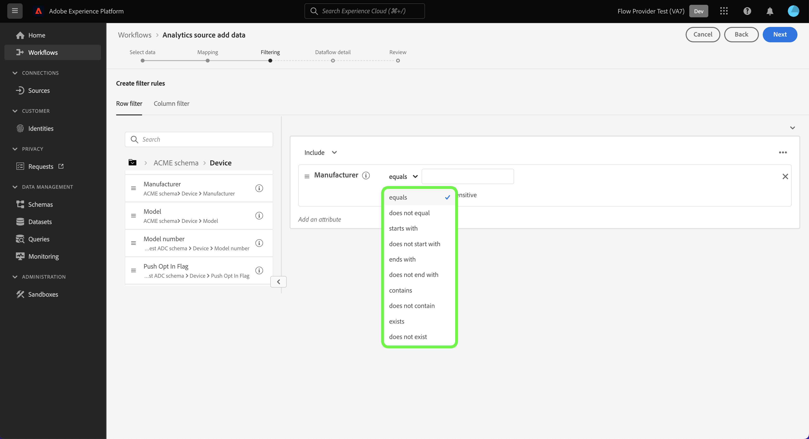
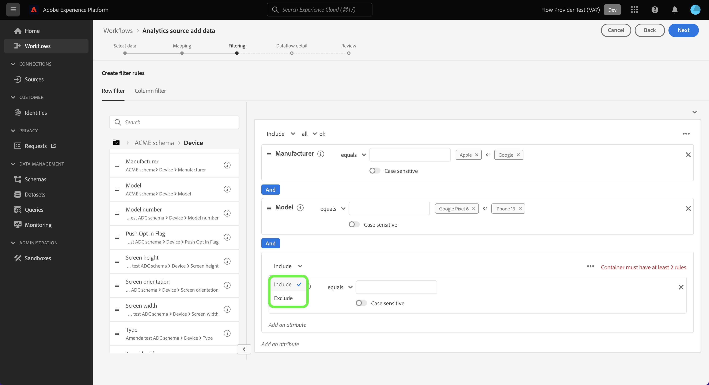

# UI での Adobe Analytics ソースコネクタの作成

このチュートリアルでは、UI でAdobe Analyticsソース接続を作成してAdobe AnalyticsレポートスイートデータをAdobe Experience Platformに取り込む手順を説明します。

## はじめに

このチュートリアルは、 Experience Platform の次のコンポーネントを実際に利用および理解しているユーザーを対象としています。

* [エクスペリエンスデータモデルl（XDM）システム](../../../../../xdm/home.md)：Experience Platform が顧客体験データを整理するための標準化されたフレームワークです。
* [リアルタイム顧客プロファイル](../../../../../profile/home.md):複数のソースからの集計データに基づいて、統合されたリアルタイムの消費者プロファイルを提供します。
* [サンドボックス](../../../../../sandboxes/home.md)：Experience Platform には、単一の Platform インスタンスを別々の仮想環境に分割し、デジタルエクスペリエンスアプリケーションの開発と発展に役立つ仮想サンドボックスが用意されています。

### 主な用語

このドキュメントで使用される以下の主な用語を理解することが重要です。

* **標準属性**：標準属性は、アドビで事前定義された任意の属性です。 これらはすべての顧客に対して同じ意味を持ち、[!DNL Analytics] ソースデータと [!DNL Analytics] スキーマフィールドグループで利用可能です。
* **カスタム属性**：カスタム属性とは、[!DNL Analytics] のカスタム変数階層にある任意の属性のことです。カスタム属性は、Adobe Analytics実装内で特定の情報をレポートスイートに取り込むために使用され、レポートスイートごとに使用方法が異なる場合があります。 カスタム属性には、eVar、prop およびリストが含まれます。eVars の詳細については、以下の[[!DNL Analytics] コンバージョン変数に関するドキュメント](https://experienceleague.adobe.com/docs/analytics/admin/admin-tools/conversion-variables/conversion-var-admin.html?lang=ja)を参照してください。
* **カスタムフィールドグループ内の任意の属性**：顧客が作成したフィールドグループから派生する属性はすべてユーザー定義であり、標準属性でもカスタム属性でもないとみなされます。
* **フレンドリ名**：フレンドリ名は、[!DNL Analytics] 実装のカスタム変数用に、人間がつけたラベルです。フレンドリ名の詳細については、以下の[[!DNL Analytics] コンバージョン変数に関するドキュメント](https://experienceleague.adobe.com/docs/analytics/admin/admin-tools/conversion-variables/conversion-var-admin.html?lang=ja)を参照してください。

## Adobe Analytics でのソース接続の作成

Platform UI で、左側のナビゲーションから「**[!UICONTROL ソース]**」を選択し、[!UICONTROL ソース]ワークスペースにアクセスします。[!UICONTROL カタログ]画面には、アカウントを作成できる様々なソースが表示されます。

画面の左側にあるカタログから適切なカテゴリを選択することができます。また、検索バーを使用して、表示されるソースを絞り込むこともできます。

**[!UICONTROL Adobe アプリケーション]**&#x200B;カテゴリから、**[!UICONTROL Adobe Analytics]**、「**[!UICONTROL データの追加]**」の順に選択します。

### データの選択

>[!IMPORTANT]
>
>画面に表示されるレポートスイートは、様々な地域からのものです。 お客様は、データの制限事項と義務、およびAdobe Experience Platformの複数の地域でのデータの使用方法について理解する必要があります。 会社で許可されていることを確認してください。

この **[!UICONTROL Analytics ソースデータの追加]** 手順に従って、 [!DNL Analytics] ソース接続を作成するレポートスイートデータ。

レポートスイートは、 [!DNL Analytics] レポート。 組織は、様々なデータセットを含む多数のレポートスイートを持つことができます。

ソース接続が作成されているExperience Platformサンドボックスインスタンスと同じ組織にマッピングされている限り、任意の地域（米国、英国、シンガポール）からレポートスイートを取り込むことができます。 レポートスイートは、1 つのアクティブなデータフローのみを使用して取り込むことができます。 選択できないレポートスイートは、使用しているサンドボックスまたは別のサンドボックスで、既に取り込まれています。

複数のインバウンド接続を作成して、複数のレポートスイートを同じサンドボックスに取り込むことができます。 レポートスイートの変数（eVar やイベントなど）のスキーマが異なる場合は、カスタムフィールドグループの特定のフィールドにマッピングし、 [データ準備](../../../../../data-prep/ui/mapping.md). レポートスイートは 1 つのサンドボックスにのみ追加できます。

>[!NOTE]
>
>複数のレポートスイートのデータをリアルタイム顧客プロファイルに対して有効にできるのは、意味が異なる 2 つのカスタムプロパティ（eVar、リストおよび prop）など、データの競合がない場合のみです。

次の手順で [!DNL Analytics] ソース接続を選択し、レポートスイートを選択して、 **[!UICONTROL 次へ]** をクリックして続行します。

<!---Analytics Report Suites can be configured for one sandbox at a time. To import the same Report Suite into a different sandbox, the dataset flow will have to be deleted and instantiated again via configuration for a different sandbox.--->

### マッピング

>[!IMPORTANT]
>
>データ準備変換を実行すると、データフロー全体に遅延が生じる場合があります。 追加される待ち時間は、変換ロジックの複雑さに応じて異なります。

[!DNL Analytics] データをターゲット XDM スキーマをマッピングする前に、まずデフォルトのスキーマとカスタムのスキーマのどちらを使用するかを選択する必要があります。

デフォルトのスキーマは、[!DNL Adobe Analytics ExperienceEvent Template] フィールドグループを含む新しいスキーマをユーザーに代わって作成します。デフォルトのスキーマを使用するには、**[!UICONTROL デフォルトのスキーマ]**&#x200B;を選択してください。

カスタムスキーマを使用すると、[!DNL Analytics] データに対して、[!DNL Adobe Analytics ExperienceEvent Template] フィールドグループを持つスキーマであれば、利用可能な任意のスキーマを選択することができます。カスタムスキーマを使用するには、「**[!UICONTROL カスタムスキーマ]**」を選択してください。

[!UICONTROL マッピング]ページには、ソースフィールドを適切なターゲットスキーマフィールドにマッピングするためのインターフェイスが用意されています。 ここから、カスタム変数を新しいスキーマフィールドグループにマッピングし、データ準備でサポートされている計算を適用できます。 ターゲットスキーマを選択してマッピングプロセスを開始します。

>[!TIP]
>
>[!DNL Adobe Analytics ExperienceEvent Template] フィールドグループを持つスキーマのみがスキーマ選択メニューに表示されます。 その他のスキーマは省略されます。 お使いのレポートスイートデータに適したスキーマがない場合は、新しいスキーマを作成する必要があります。 スキーマの作成手順について詳しくは、[UI でのスキーマの作成と編集](../../../../../xdm/ui/resources/schemas.md)ガイドを参照してください。

[!UICONTROL 標準フィールドをマッピング]セクションには、[!UICONTROL 適用された標準マッピング]、[!UICONTROL 一致しない標準マッピング]および[!UICONTROL カスタムマッピング]のパネルが表示されます。各カテゴリに関する詳細は、次の表を参照してください。

| 標準フィールドをマッピング | 説明 |
| --- | --- |
| [!UICONTROL 適用された標準マッピング] | [!UICONTROL 適用された標準マッピング]パネルには、マッピングされた属性の総数が表示されます。標準マッピングとは、ソース [!DNL Analytics] データ内の全属性と [!DNL Analytics] フィールドグループ内の対応する属性との間のマッピングセットを指します。これらは事前にマッピングされており、編集できません。 |
| [!UICONTROL 一致しない標準マッピング] | [!UICONTROL 一致しない標準マッピング]パネルは、フレンドリ名の競合を含むマッピング済み属性の数を参照します。 これらの競合は、別のレポートスイートからフィールド記述子のセットが既に入力されているスキーマを再利用する場合に発生します。 フレンドリ名が競合していても、[!DNL Analytics] データフローを進めることができます。 |
| [!UICONTROL カスタムマッピング] | [!UICONTROL カスタムマッピング]パネルには、マッピングされたカスタム属性（eVar、prop、リストを含む）の数が表示されます。 カスタムマッピングとは、ソース [!DNL Analytics] データ内のカスタム属性と、選択したスキーマに含まれるカスタムフィールドグループの属性との間のマッピングセットを指します。 |

[!DNL Analytics]ExperienceEvent テンプレートスキーマフィールドグループのプレビューを行うには、[!UICONTROL 適用された標準マッピング]パネルで「**[!UICONTROL 表示]**」を選択します。 

この [!UICONTROL Adobe Analytics ExperienceEvent テンプレートスキーマフィールドグループ]ページには、スキーマの構造を調べるためのインターフェイスが用意されています。 終了したら、「**[!UICONTROL 閉じる]**」をクリックします。

Platform は、マッピングセットにフレンドリ名の競合がないかを自動的に検出します。 マッピングセットと競合しない場合は、「**[!UICONTROL 次へ]**」をクリックして続行します。

ソースレポートスイートと選択したスキーマ間でフレンドリ名の競合がある場合も、フィールド記述子は変更されないことを確認すれば、[!DNL Analytics] データフローを続行することが可能です。または、空の記述子セットで新しいスキーマを作成することもできます。

「**[!UICONTROL 次へ]**」を選択して進みます。

#### カスタムマッピング

データ準備関数を使用し、カスタム属性の新しいマッピングまたは計算フィールドを追加するには、「**[!UICONTROL カスタムマッピングの表示]**」を選択します。

次に、「**[!UICONTROL 新しいマッピングを追加]**」を選択します。

必要に応じて、表示されるオプションから「**[!UICONTROL 新しいマッピングを追加]**」または「**[!UICONTROL 計算フィールドを追加]**」を選択できます。

空のマッピングセットが表示されます。 マッピングアイコンを選択して、ソースフィールドを追加します。

インターフェイスを使用して、ソーススキーマ構造内を移動し、使用する新しいソースフィールドを特定できます。 マッピングするソースフィールドを選択したら、「**[!UICONTROL 選択]**」をクリックします。

次に、[!UICONTROL ターゲットフィールド]の下にあるマッピングアイコンを選択し、選択したソースフィールドを適切なターゲットフィールドにマッピングします。

ソーススキーマと同様に、インターフェイスを使用してターゲットスキーマ構造内を移動し、マッピングしたいターゲットフィールドを選択できます。 適切なターゲットフィールドを選択したら、「**[!UICONTROL 選択]**」をクリックします。

カスタムマッピングセットが完了したら、「**[!UICONTROL 次へ]**」をクリックして続行します。

次のドキュメントでは、データ準備、計算フィールド、およびマッピング機能について理解するための詳細なリソースを提供します。

* [データ準備の概要](../../../../../data-prep/home.md)
* [データ準備のマッピング機能](../../../../../data-prep/functions.md)
* [計算フィールドを追加](../../../../../data-prep/ui/mapping.md#calculated-fields)

### フィルター [!DNL Profile Service] （ベータ版） {#filtering-for-profile}

>[!CONTEXTUALHELP]
>id="platform_data_prep_analytics_filtering"
>title="フィルタールールの作成"
>abstract="リアルタイム顧客プロファイルにデータを送信する際の、行および列レベルのフィルタールールを定義します。 行レベルのフィルターを使用して、条件を適用し、適用するデータを指定します **プロファイル取り込み用に含める**. 列レベルのフィルターを使用して、データの列を選択します **プロファイル取り込み用に除外**. フィルタールールは、データレイクに送信されるデータには適用されません。"

>[!IMPORTANT]
>
>フィルタリングのサポート [!DNL Analytics] データは現在ベータ版で、すべてのユーザーが利用できるわけではありません。 ドキュメントと機能は変更される場合があります。

マッピングを完了したら、 [!DNL Analytics] レポートスイートのデータを使用する場合、フィルタールールと条件を適用して、取り込むデータを選択的に含めたり、取り込まないデータを除外したりできます [!DNL Profile Service]. フィルタリングのサポートは、次の場合にのみ使用できます。 [!DNL Analytics] データとデータは、 [!DNL Profile.] すべてのデータがデータレイクに取り込まれます。

#### 行レベルのフィルター

>[!IMPORTANT]
>
>行レベルのフィルターを使用して、条件を適用し、適用するデータを指定します **プロファイル取り込み用に含める**. 列レベルのフィルターを使用して、データの列を選択します **プロファイル取り込み用に除外**.

データをフィルターできます [!DNL Profile] 行レベルおよび列レベルでの取り込み。 行レベルのフィルタリングでは、文字列の含む、等しい、始まる、次で終わるなどの条件を定義できます。 また、行レベルのフィルターを使用して、 `AND` 同様に `OR`を使用して、条件を無効にする `NOT`.

次の手順で [!DNL Analytics] 行レベルのデータで、 **[!UICONTROL 行フィルター]**.

左側のレールを使用してスキーマ階層間を移動し、選択したスキーマ属性を選択して、特定のスキーマをさらに詳しく掘り下げます。

設定する属性を特定したら、左側のパネルから属性を選択し、フィルタリングパネルにドラッグします。

異なる条件を設定するには、「 **[!UICONTROL 次と等しい]** 次に、表示されるドロップダウンウィンドウから条件を選択します。

設定可能な条件のリストは次のとおりです。

* [!UICONTROL 次と等しい]
* [!UICONTROL 次と等しくない]
* [!UICONTROL 次の語句で始まる]
* [!UICONTROL 次の語句で終わる]
* [!UICONTROL 次の語句で終わらない]
* [!UICONTROL 次を含む]
* [!UICONTROL 次を含まない]
* [!UICONTROL 存在する]
* [!UICONTROL 存在しない]

次に、選択した属性に基づいて、含める値を入力します。 次の例では、 [!DNL Apple] および [!DNL Google] は、 **[!UICONTROL 製造元]** 属性。

フィルター条件をさらに指定するには、スキーマから別の属性を追加してから、その属性に基づく値を追加します。 次の例では、 **[!UICONTROL モデル]** 属性が追加され、 [!DNL iPhone 13] および [!DNL Google Pixel 6] は、取り込み用にフィルタリングされます。

新しいコンテナを追加するには、省略記号 (`...`) をクリックし、「 **[!UICONTROL コンテナを追加]**.

新しいコンテナを追加したら、「 」を選択します。 **[!UICONTROL 次を含む]** 次に、 **[!UICONTROL 除外]** をクリックします。

次に、スキーマ属性をドラッグし、フィルタリングから除外する値を追加して、同じ手順を完了します。 次の例では、 [!DNL iPhone 12], [!DNL iPhone 12 mini]、および [!DNL Google Pixel 5] はすべて、 **[!UICONTROL モデル]** 属性、横長は **[!UICONTROL 画面の向き]**、およびモデル番号 [!DNL A1633] 次から除外： **[!UICONTROL モデル番号]**.

終了したら、「**[!UICONTROL 次へ]**」を選択します。

#### 列レベルのフィルター

選択 **[!UICONTROL 列フィルター]** 列レベルのフィルターを適用するには、ヘッダーからを選択します。

ページがインタラクティブスキーマツリーに更新され、列レベルでスキーマ属性が表示されます。 ここから、除外するデータの列を選択できます [!DNL Profile] 取り込み。 または、列を展開して、除外する特定の属性を選択することもできます。

デフォルトでは、すべて [!DNL Analytics] に移動します。 [!DNL Profile] このプロセスにより、XDM データのブランチをから除外できます。 [!DNL Profile] 取り込み。

終了したら、「**[!UICONTROL 次へ]**」を選択します。

### データフローの詳細を入力

**[!UICONTROL データフローの詳細]**&#x200B;手順が表示され、データフローの名前と説明（オプション）を入力する必要があります。 完了したら、「**[!UICONTROL 次へ]**」をクリックします。

### レビュー

[!UICONTROL レビュー]手順が表示され、新しい Analytics データフローを作成前にレビューすることができます。 接続の詳細は、次のようなカテゴリ別にグループ化されます。

* [!UICONTROL 接続]：接続のソースプラットフォームを表示します。
* [!UICONTROL データタイプ]：選択したレポートスイートと、対応するレポートスイート ID が表示されます。

### データフローの監視

データフローを作成したら、それを通じて取り込まれるデータを監視できます。 [!UICONTROL カタログ]画面から「**[!UICONTROL データフロー]**」を選択すると、Analytics アカウントに関連する確立済みフローのリストが表示されます。

**データフロー**&#x200B;画面が表示されます。 このページは、名前、ソースデータ、作成時間、ステータスに関する情報を含む、データセットフローのペアです。

コネクタは、2 つのデータセットフローをインスタンス化します。 1 つのフローはバックフィルデータ、もう 1 つはライブデータのフローを表します。 バックフィルデータは、プロファイルに対して設定されていませんが、分析およびデータサイエンスのユースケース用にデータレイクへと送信されます。

バックフィル、ライブデータおよびそれぞれのレイテンシーの詳細については、[Analytics データコネクタの概要](../../../../connectors/adobe-applications/analytics.md)を参照してください。

表示するデータセットフローをリストから選択します。

**[!UICONTROL データセットアクティビティ]**&#x200B;ページが表示されます。 このページには、消費したメッセージの割合が、グラフ形式で表示されます。 上部ヘッダーから「**[!UICONTROL データガバナンス]**」を選択し、ラベリングフィールドにアクセスします。

データセットフローの継承されたラベルは、[!UICONTROL データガバナンス]画面から確認できます。Analytics からのデータにラベルを付ける方法について詳しくは、[データ使用ラベルガイド](../../../../../data-governance/labels/user-guide.md)をご覧ください。

データフローを削除するには、[!UICONTROL データフロー]ページを開き、データフロー名の横にある「`...`」を選択してから「[!UICONTROL 削除]」を選択します。

## 次の手順と追加のリソース

接続を作成すると、受信データを格納して選択したスキーマをデータセットに投入するデータフローが自動的に作成されます。さらに、データのバックフィルが発生し、最大 13 か月の履歴データを取り込みます。初回の取り込みが完了したら、[!DNL Analytics] データはダウンストリームの Platform サービス（[!DNL Real-Time Customer Profile]やセグメント化サービスなど）で使用されるようになります。詳しくは、次のドキュメントを参照してください。

* [[!DNL Real-Time Customer Profile] 概要](../../../../../profile/home.md)
* [[!DNL Segmentation Service] の概要](../../../../../segmentation/home.md)
* [[!DNL Data Science Workspace] の概要](../../../../../data-science-workspace/home.md)
* [[!DNL Query Service] の概要](../../../../../query-service/home.md)

次のビデオは、Adobe Analytics Source コネクタを使用したデータの取り込みに関する理解を深めることを目的としています。

>[!WARNING]
>
> 次のビデオに示す [!DNL Platform] UI は旧式のものです。最新の UI のスクリーンショットと機能については、上記のドキュメントを参照してください。

>[!VIDEO](https://video.tv.adobe.com/v/29687?quality=12&learn=on)
