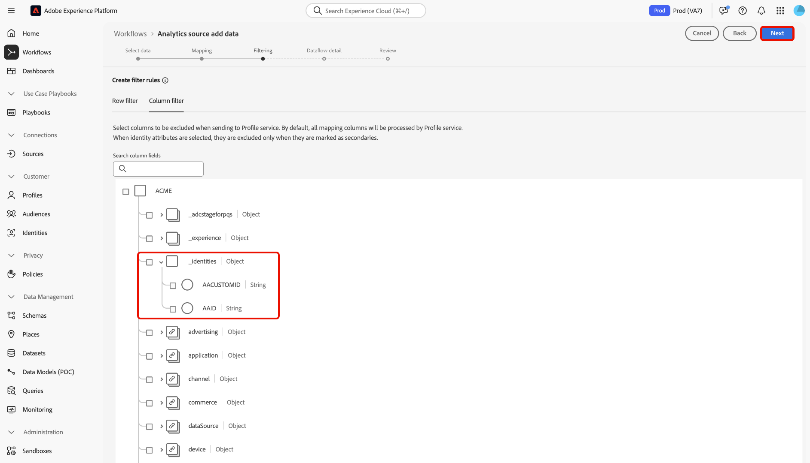

# Adobe AnalyticsのExperience Platformへの接続

このガイドでは、Adobe Analytics ソースを使用して Analytics レポートスイートデータをAdobe Experience Platformに取り込む方法を説明します。

## 基本を学ぶ

このチュートリアルは、 Experience Platform の次のコンポーネントを実際に利用および理解しているユーザーを対象としています。

* [エクスペリエンスデータモデルl（XDM）システム](../../../../../xdm/home.md)：Experience Platform が顧客体験データを整理するための標準化されたフレームワークです。
* [リアルタイム顧客プロファイル](../../../../../profile/home.md)：複数のソースから集計したデータに基づいて、統合されたリアルタイムの顧客プロファイルを提供します。
* [ サンドボックス ](../../../../../sandboxes/home.md): Experience Platformには、1 つのExperience Platform インスタンスを別々の仮想環境に分割し、デジタルエクスペリエンスアプリケーションの開発と発展に役立つ仮想サンドボックスが用意されています。

### 主な用語

このドキュメントで使用される以下の主な用語を理解することが重要です。

* **標準属性**：標準属性は、アドビで事前定義された任意の属性です。 これらはすべての顧客に対して同じ意味を持ち、Analytics ソースデータと Analytics スキーマフィールドグループで利用可能です。
* **カスタム属性**：カスタム属性とは、Analytics のカスタム変数階層にある任意の属性のことです。 カスタム属性は、Adobe Analyticsの実装内で特定の情報をレポートスイートに取り込むために使用され、レポートスイートごとに使用方法が異なる場合があります。 カスタム属性には、eVar、prop およびリストが含まれます。eVar について詳しくは、以下の [ コンバージョン変数に関する Analytics ドキュメント ](https://experienceleague.adobe.com/docs/analytics/admin/admin-tools/conversion-variables/conversion-var-admin.html?lang=ja) を参照してください。
* **カスタムフィールドグループ内の任意の属性**：顧客が作成したフィールドグループから派生する属性はすべてユーザー定義であり、標準属性でもカスタム属性でもないとみなされます。

## ソースカタログのナビゲート

>[!NOTE]
>
>実稼動サンドボックスで Analytics ソースデータフローを作成すると、次の 2 つのデータフローが作成されます。
>
>* データレイクへの履歴レポートスイートデータの 13 か月のバックフィルを行うデータフロー。 このデータフローは、バックフィルが完了すると終了します。
>* ライブデータをデータレイクと [!DNL Real-Time Customer Profile] に送信するデータフローフロー。 このデータフローは継続的に実行されます。

Experience Platform UI の左側のナビゲーションで「**[!UICONTROL ソース]**」を選択し、「[!UICONTROL &#x200B; ソース &#x200B;] ワークスペースにアクセスします。 *[!UICONTROL Adobe アプリケーション]* カテゴリで、Adobe Analyticsカードを選択してから「**[!UICONTROL データを追加]** を選択します。

## データの選択

>[!IMPORTANT]
>
>* 画面に表示されるレポートスイートは、様々な地域のレポートスイートである可能性があります。 お客様は、お客様のデータの制限事項や義務およびAdobe Experience Platformのクロスリージョンにおけるデータの使用方法を理解する責任を負います。 会社で許可されていることを確認してください。
>* 複数のレポートスイートのデータをリアルタイム顧客プロファイルに対して有効にできるのは、異なる意味を持つ 2 つのカスタムプロパティ（eVar、リスト、prop）など、データの競合がない場合のみです。

レポートスイートは、Analytics レポートの基礎を形成するデータのコンテナです。 組織は、それぞれに異なるデータセットを含む、多数のレポートスイートを持つことができます。

ソース接続が作成されているExperience Platform サンドボックスインスタンスと同じ組織にマッピングされている限り、任意の地域（米国、英国またはシンガポール）からレポートスイートを取り込むことができます。 レポートスイートは、1 つのアクティブなデータフローのみを使用して取り込むことができます。 レポートスイートがグレーで選択できない場合は、使用しているサンドボックスまたは別のサンドボックスで、既に取り込まれています。

複数のインバウンド接続を使用して、複数のレポートスイートを同じサンドボックスに取り込むことができます。 変数（eVar やイベントなど）のスキーマが異なるレポートスイートの場合は、カスタムフィールドグループの特定のフィールドにマッピングし、[ データ準備 ](../../../../../data-prep/ui/mapping.md) を使用してデータの競合を回避する必要があります。 レポートスイートは、1 つのサンドボックスにのみ追加できます。

**[!UICONTROL レポートスイート]** を選択し、*[!UICONTROL Analytics ソースデータの追加]* インターフェイスを使用してリスト内を移動し、Experience Platformに取り込む Analytics レポートスイートを特定します。 「**[!UICONTROL 次へ]**」を選択して次に進みます。

&lt;!—Analytics レポートスイートは、一度に 1 つのサンドボックスに対して設定できます。 同じレポートスイートを別のサンドボックスに読み込むには、データセットフローを削除し、別のサンドボックスの設定を使用して再度インスタンス化する必要があります。—>

## マッピング {#mapping}

>[!IMPORTANT]
>
>データ準備変換により、データフロー全体に待ち時間が追加される場合があります。 追加される追加の待ち時間は、変換ロジックの複雑さに応じて異なります。

Analytics データをターゲット XDM スキーマをマッピングする前に、まずデフォルトのスキーマとカスタムのスキーマのどちらを使用するかを判断する必要があります。

>[!BEGINTABS]

>[!TAB  デフォルトのスキーマ ]

デフォルトのスキーマは、ユーザーに代わって新しいスキーマを作成します。 この新しく作成されたスキーマには、[!DNL Adobe Analytics ExperienceEvent Template] フィールドグループが含まれます。 デフォルトのスキーマを使用するには、**[!UICONTROL デフォルトのスキーマ]**&#x200B;を選択してください。

>[!TAB  カスタムスキーマ ]

カスタムスキーマを使用すると、Analytics データに対して、[!DNL Adobe Analytics ExperienceEvent Template] フィールドグループを持つスキーマであれば、利用可能な任意のスキーマを選択することができます。 カスタムスキーマを使用するには、「**[!UICONTROL カスタムスキーマ]**」を選択してください。

>[!ENDTABS]

*[!UICONTROL マッピング]* インターフェイスを使用して、ソースフィールドを適切なターゲットスキーマフィールドにマッピングします。 カスタム変数を新しいスキーマフィールドグループにマッピングし、データ準備でサポートされている計算を適用できます。 ターゲットスキーマを選択してマッピングプロセスを開始します。

>[!TIP]
>
>[!DNL Adobe Analytics ExperienceEvent Template] フィールドグループを持つスキーマのみがスキーマ選択メニューに表示されます。 その他のスキーマは省略されます。 レポートスイートデータに適したスキーマがない場合は、新しいスキーマを作成する必要があります。 スキーマの作成手順について詳しくは、[UI でのスキーマの作成と編集](../../../../../xdm/ui/resources/schemas.md)ガイドを参照してください。

使用する [!UICONTROL &#x200B; 適用された標準マッピング &#x200B;] の指標については、[!UICONTROL &#x200B; 標準フィールドのマッピング &#x200B;] パネルを参照できます。 [!UICONTROL &#x200B; 記述子名が競合している標準マッピング &#x200B;] および [!DNL Custom mappings]。

| 標準フィールドをマッピング | 説明 |
| --- | --- |
| [!UICONTROL 適用された標準マッピング] | [!UICONTROL 適用された標準マッピング]パネルには、マッピングされた属性の総数が表示されます。標準マッピングとは、ソース Analytics データ内の全属性と Analytics フィールドグループ内の対応する属性とのマッピングを指します。 これらは事前にマッピングされており、編集できません。 |
| [!UICONTROL &#x200B; 記述子名が競合している標準マッピング &#x200B;] | [!UICONTROL &#x200B; 記述子名が競合している標準マッピング &#x200B;] パネルは、名前の競合を含むマッピング済み属性の数を参照します。 これらの競合は、別のレポートスイートからフィールド記述子のセットが既に入力されているスキーマを再利用する場合に発生します。 名前が競合していても、Analytics データフローを進めることができます。 |
| [!UICONTROL カスタムマッピング] | [!UICONTROL カスタムマッピング]パネルには、マッピングされたカスタム属性（eVar、prop、リストを含む）の数が表示されます。 カスタムマッピングとは、ソース Analytics データ内のカスタム属性と、選択したスキーマに含まれるカスタムフィールドグループの属性との間のマッピングを指します。 |

### 標準マッピング {#standard-mappings}

名前の競合が見つかった場合は、マッピングがExperience Platformによって自動的に検出されます。 マッピングと競合しない場合は、「**[!UICONTROL 次へ]**」を選択して続行します。

>[!TIP]
>
>ソースレポートスイートと選択したスキーマ間で名前の競合がある場合も、フィールド記述子は変更されないことを確認すれば、Analytics データフローを続行することが可能です。 または、空の記述子セットで新しいスキーマを作成することもできます。

## カスタムマッピング {#custom-mappings}

データ準備関数を使用して、カスタム属性の新しいカスタムマッピングまたは計算フィールドを追加できます。 カスタムマッピングを追加するには、「**[!UICONTROL カスタム]**」を選択します。

* **[!UICONTROL フィールドをフィルター]**: [!UICONTROL &#x200B; フィールドをフィルター &#x200B;] テキスト入力を使用して、マッピング内の特定のマッピングフィールドをフィルタリングします。
* **[!UICONTROL 新しいマッピングを追加]**：新しいソースフィールドとターゲットフィールドのマッピングを追加するには、「**[!UICONTROL 新しいマッピングを追加]**」を選択します。
* **[!UICONTROL 計算フィールドを追加]**：必要に応じて、「**[!UICONTROL 計算フィールドを追加]** を選択して、マッピング用の新しい計算フィールドを作成できます。
* **[!UICONTROL マッピングを読み込み]**：データ準備のマッピング読み込み機能を使用すると、データ取り込みプロセスの手動設定時間を短縮し、ミスを制限できます。 「**[!UICONTROL マッピングをインポート]**」を選択して、既存のフローまたはエクスポートされたファイルからマッピングをインポートします。 詳しくは、[ マッピングのインポートとエクスポートに関するガイド ](../../../../../data-prep/ui/mapping.md#import-mapping) を参照してください。
* **[!UICONTROL テンプレートをダウンロード]**：マッピングの CSV コピーをダウンロードし、ローカルデバイスでマッピングを設定することもできます。 **[!UICONTROL テンプレートをダウンロード]** を選択して、マッピングの CSV コピーをダウンロードします。 ソースファイルとターゲットスキーマで提供されるフィールドのみを使用していることを確認する必要があります。

データ準備について詳しくは、次のドキュメントを参照してください。

* [データ準備の概要](../../../../../data-prep/home.md)
* [データ準備のマッピング機能](../../../../../data-prep/functions.md)
* [計算フィールドを追加](../../../../../data-prep/ui/mapping.md#calculated-fields)

<!-- 
To use Data Prep functions and add new mapping or calculated fields for custom attributes, select **[!UICONTROL View custom mappings]**.

Next, select **[!UICONTROL Add new mapping]**.

Depending on your needs, you can select either **[!UICONTROL Add new mapping]** or **[!UICONTROL Add calculated field]** from the options that appear. 

An empty mapping set appears. Select the mapping icon to add a source field.

You can use the interface to navigate through the source schema structure and identify the new source field that you want to use. Once you have selected the source field that you want to map, select **[!UICONTROL Select]**.

Next, select the mapping icon under [!UICONTROL Target Field] to map your selected source field to its appropriate target field.

Similar to the source schema, you can use the interface to navigate through the target schema structure and select the target field you want to map to. Once you have selected the appropriate target field, select **[!UICONTROL Select]**.

With your custom mapping set completed, select **[!UICONTROL Next]** to proceed.

 -->

## リアルタイム顧客プロファイルのフィルタリング {#filtering-for-profile}

>[!CONTEXTUALHELP]
>id="platform_data_prep_analytics_filtering"
>title="フィルタールールの作成"
>abstract="リアルタイム顧客プロファイルにデータを送信する際に、行および列レベルのフィルタリングルールを定義します。行レベルのフィルタリングを使用して、条件を適用し、**プロファイルの取り込みに含める**&#x200B;データを指示します。列レベルのフィルタリングを使用して、**プロファイルの取り込みから除外する**&#x200B;データの列を選択します。フィルタリングルールは、データレイクに送信されるデータには適用されません。"

Analytics レポートスイートデータのマッピングが完了したら、フィルタリングルールと条件を適用して、リアルタイム顧客プロファイルへの取り込みにデータを選択的に含めるか除外することができます。 フィルタリングのサポートは、Analytics データに対してのみ使用でき、データは [!DNL Profile.] を入力する前にのみフィルタリングされます。すべてのデータは、データレイクに取り込まれます。

>[!BEGINSHADEBOX]

**リアルタイム顧客プロファイルの分析データのデータ準備およびフィルタリングに関する追加情報**

* フィルタリング機能は、プロファイルに送信されるデータには使用できますが、データレイクに送信されるデータには使用できません。
* ライブデータにはフィルターを使用できますが、バックフィルデータをフィルターすることはできません。
   * Analytics ソースは、プロファイルにデータをバックフィルしません。
* Analytics フローの初期設定中にデータ準備設定を利用した場合、それらの変更は 13 か月の自動バックフィルにも適用されます。
   * ただし、フィルタリングはライブデータのみに予約されているので、フィルタリングには該当しません。
* データ準備は、ストリーミングとバッチの両方の取り込みパスに適用されます。 既存の Data Prep 設定を変更すると、それらの変更はストリーミングとバッチの両方の取り込み経路を通じて新しい受信データに適用されます。
   * ただし、Data Prep 設定は、ストリーミングデータかバッチデータかに関係なく、既にExperience Platformに取り込まれているデータには適用されません。
* Analytics の標準属性は、常に自動的にマッピングされます。 したがって、標準属性に変換を適用することはできません。
   * ただし、ID サービスまたはプロファイルで必要でない限り、標準属性を除外できます。
* 列レベルのフィルタリングを使用して、必須フィールドおよび ID フィールドをフィルタリングすることはできません。
* セカンダリ ID （特に AAID と AACustomID）を除外することはできますが、ECID を除外することはできません。
* 変換エラーが発生すると、対応する列は NULL になります。

>[!ENDSHADEBOX]

### 行レベルのフィルタリング

>[!IMPORTANT]
>
>行レベルのフィルタリングを使用して、条件を適用し、**プロファイルの取り込みに含める**&#x200B;データを指示します。列レベルのフィルタリングを使用して、**プロファイルの取り込みから除外** するデータの列を選択します。

プロファイル取り込みのデータは、行レベルおよび列レベルでフィルタリングできます。 行レベルのフィルタリングを使用して、文字列に「次を含む」、「次と等しい」、「次で始まる」、「次で終わる」などの条件を定義します。 また、行レベルのフィルタリングを使用して、`AND` と `OR` を使用して条件を結合したり、`NOT` を使用して条件を否定したりできます。

行レベルで Analytics データをフィルタリングするには、**[!UICONTROL 行フィルター]** を選択し、左側のパネルを使用して、スキーマ階層内を移動し、選択するスキーマ属性を特定します。

設定する属性を特定したら、その属性を選択して、左側のパネルからフィルタリングパネルにドラッグします。

様々な条件を設定するには、「**[!UICONTROL に等しい]**」を選択し、表示されるドロップダウンウィンドウから条件を選択します。

設定可能な条件のリストを以下に示します。

* [!UICONTROL equals]
* [!UICONTROL &#x200B; 次と等しくない &#x200B;]
* [!UICONTROL &#x200B; 次で始まる &#x200B;]
* [!UICONTROL &#x200B; 次で終わる &#x200B;]
* [!UICONTROL &#x200B; 次で終わらない &#x200B;]
* [!UICONTROL contains]
* [!UICONTROL &#x200B; 次を含まない &#x200B;]
* [!UICONTROL exists]
* [!UICONTROL &#x200B; 存在しません &#x200B;]

次に、選択した属性に基づいて、含める値を入力します。 次の例では、[!DNL Apple] と [!DNL Google] が **[!UICONTROL Manufacturer]** 属性の一部として取り込み用に選択されています。

フィルター条件をさらに指定するには、スキーマから別の属性を追加してから、その属性に基づいて値を追加します。 次の例では、**[!UICONTROL モデル]** 属性が追加され、[!DNL iPhone 16] や [!DNL Google Pixel 9] などのモデルが取り込み用にフィルタリングされます。

新しいコンテナを追加するには、フィルタリングインターフェイスの右上にある省略記号（`...`）を選択し、「**[!UICONTROL コンテナを追加]** を選択します。

新しいコンテナを追加したら、「**[!UICONTROL 含める]**」を選択し、ドロップダウンメニューから「**[!UICONTROL 除外]**」を選択します。 除外する属性と値を追加し、終了したら [**[!UICONTROL 次へ]**] を選択します。

### 列レベルのフィルタリング

ヘッダーから **[!UICONTROL 列フィルター]** を選択して、列レベルのフィルタリングを適用します。

ページが更新されてインタラクティブスキーマツリーになり、スキーマ属性が列レベルで表示されます。 ここから、プロファイルの取り込みから除外するデータの列を選択できます。 または、列を展開して、除外する特定の属性を選択することもできます。

デフォルトでは、すべての Analytics はプロファイルに移動しますが、このプロセスを使用すると、XDM データのブランチをプロファイルの取り込みから除外できます。

### セカンダリ ID のフィルタリング

列フィルターを使用して、プロファイルの取り込みからセカンダリ ID を除外します。 セカンダリ ID をフィルタリングするには、「**[!UICONTROL 列フィルター]**」を選択してから、「**[!UICONTROL _identities]**」を選択します。

フィルターは、ID がセカンダリとしてマークされている場合にのみ適用されます。 ID が選択されていても、プライマリとしてマークされた ID のいずれかがイベントに届いた場合、その ID は除外されません。

### データフローの詳細を入力

**[!UICONTROL データフローの詳細]**&#x200B;手順が表示され、データフローの名前と説明（オプション）を入力する必要があります。 完了したら、「**[!UICONTROL 次へ]**」をクリックします。

### レビュー

[!UICONTROL レビュー]手順が表示され、新しい Analytics データフローを作成前にレビューすることができます。 接続の詳細は、次のようなカテゴリ別にグループ化されます。

* [!UICONTROL 接続]：接続のソースプラットフォームを表示します。
* [!UICONTROL データタイプ]：選択したレポートスイートと、対応するレポートスイート ID が表示されます。

## データフローの監視 {#monitor-your-dataflow}

データフローが完了したら、*[!UICONTROL データフロー]* インターフェイスを使用して、Analytics データフローのステータスを監視できます。

[!UICONTROL &#x200B; データセットアクティビティ &#x200B;] インターフェイスを使用すると、Analytics からExperience Platformに送信されるデータの進行状況に関する情報を確認できます。 インターフェイスには、先月のレコードの合計、過去 7 日間に取り込んだレコードの合計、先月のデータのサイズなどの指標が表示されます。

ソースは、2 つのデータセットフローをインスタンス化します。 1 つのフローはバックフィルデータ、もう 1 つはライブデータのフローを表します。 バックフィルデータは、リアルタイム顧客プロファイルへの取り込み用に設定されていませんが、分析およびデータサイエンスのユースケース用にデータレイクへと送信されます。

バックフィル、ライブデータおよびそれぞれのレイテンシーの詳細については、[Analytics ソースの概要 ](../../../../connectors/adobe-applications/analytics.md) を参照してください。

>[!NOTE]
>
>Analytics ソースコネクタはAdobeによって完全に管理されるので、データセットアクティビティページにバッチに関する情報が表示されません。 取り込んだレコードの周囲の指標を確認することで、データのフローを監視できます。

## データフローの削除 {#delete-dataflow}

Analytics データフローを削除するには、ソースワークスペースの上部のヘッダーから **[!UICONTROL データフロー]** を選択します。 データフローページを使用して、削除する Analytics データフローを見つけ、その横にある省略記号（`...`）を選択します。 次に、ドロップダウンメニューを使用して「**[!UICONTROL 削除]**」を選択します。

* ライブ Analytics データフローを削除すると、基になるデータセットも削除されます。
* Analytics データフローのバックフィルを削除しても、基になるデータセットは削除されませんが、対応するレポートスイートのバックフィルプロセスは停止します。 バックフィルデータフローを削除した場合でも、取り込まれたデータはデータセットを使用して表示できます。

## 次の手順とその他のリソース

接続を作成すると、受信データを格納して選択したスキーマをデータセットに投入するデータフローが自動的に作成されます。さらに、データのバックフィルが発生し、最大 13 か月の履歴データを取り込みます。初回の取り込みが完了したら、Analytics データはダウンストリームのExperience Platform サービス（[!DNL Real-Time Customer Profile] やセグメント化サービスなど）で使用されるようになります。 詳しくは、次のドキュメントを参照してください。

* [[!DNL Real-Time Customer Profile] 概要](../../../../../profile/home.md)
* [[!DNL Segmentation Service] の概要](../../../../../segmentation/home.md)
* [[!DNL Data Science Workspace] の概要](../../../../../data-science-workspace/home.md)
* [[!DNL Query Service] の概要](../../../../../query-service/home.md)

次のビデオは、Adobe Analytics Source コネクタを使用したデータの取り込みに関する理解を深めることを目的としています。

>[!WARNING]
>
> 次のビデオに示す [!DNL Experience Platform] UI は旧式のものです。最新の UI のスクリーンショットと機能については、上記のドキュメントを参照してください。

>[!VIDEO](https://video.tv.adobe.com/v/3430254?quality=12&learn=on&captions=jpn)

