# Adobe AnalyticsとExperience Platformの連携

このガイドでは、Adobe Analytics ソースを使用してAnalytics レポートスイートのデータをAdobe Experience Platformに取り込む方法について説明します。

## 基本を学ぶ

このチュートリアルは、 Experience Platform の次のコンポーネントを実際に利用および理解しているユーザーを対象としています。

* [エクスペリエンスデータモデルl（XDM）システム](../../../../../xdm/home.md)：Experience Platform が顧客体験データを整理するための標準化されたフレームワークです。
* [リアルタイム顧客プロファイル](../../../../../profile/home.md)：複数のソースから集計したデータに基づいて、統合されたリアルタイムの顧客プロファイルを提供します。
* [&#x200B; サンドボックス &#x200B;](../../../../../sandboxes/home.md): Experience Platformは、1つのExperience Platform インスタンスを個別のバーチャル環境に分割して、デジタルエクスペリエンスアプリケーションの開発と進化に役立つバーチャルサンドボックスを提供します。

### 主な用語

このドキュメントで使用される以下の主な用語を理解することが重要です。

* **標準属性**：標準属性は、アドビで事前定義された任意の属性です。 すべての顧客に対して同じ意味を持ち、Analytics ソースデータとAnalytics スキーマフィールドグループで使用できます。
* **カスタム属性**: カスタム属性は、Analyticsのカスタム変数階層内の任意の属性です。 カスタム属性は、Adobe Analyticsの実装内でレポートスイートに特定の情報を取り込むために使用され、レポートスイートからレポートスイートへの使用が異なる場合があります。 カスタム属性には、eVar、prop およびリストが含まれます。eVarについて詳しくは、コンバージョン変数[に関する次の](https://experienceleague.adobe.com/docs/analytics/admin/admin-tools/conversion-variables/conversion-var-admin.html?lang=ja)Analytics ドキュメントを参照してください。
* **カスタムフィールドグループ内の任意の属性**：顧客が作成したフィールドグループから派生する属性はすべてユーザー定義であり、標準属性でもカスタム属性でもないとみなされます。

## ソースカタログを移動する

>[!NOTE]
>
>実稼動サンドボックスでAnalytics ソースデータフローを作成すると、次の2つのデータフローが作成されます。
>
>* 履歴レポートスイートのデータをデータレイクに13か月間バックフィルするデータフロー。 このデータフローは、バックフィルが完了すると終了します。
>* ライブデータをデータレイクと[!DNL Real-Time Customer Profile]に送信するデータフローフロー。 このデータフローは継続的に実行されます。

Experience Platform UIで、左側のナビゲーションから「**[!UICONTROL Sources]**」を選択して、[!UICONTROL Sources] ワークスペースにアクセスします。 *[!UICONTROL Adobe applications]* カテゴリで、Adobe Analytics カードを選択し、**[!UICONTROL Add data]**&#x200B;を選択します。

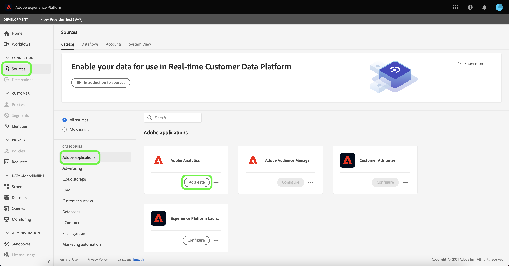

## データの選択

>[!IMPORTANT]
>
>* 画面に表示されるレポートスイートは、様々な地域から選択できます。 お客様は、お客様のデータの制限および義務を理解し、Adobe Experience Platformのクロスリージョンにおけるデータの使用方法を理解する責任があります。 これはあなたの会社で許可されていることを確認してください。
>* 複数のレポートスイートからのデータは、異なる意味を持つ2つのカスタムプロパティ（eVar、リスト、prop）など、データの競合がない場合にのみ、Real-Time Customer Profileに対して有効にできます。

レポートスイートは、Analytics レポートの基礎となるデータのコンテナです。 組織には、それぞれ異なるデータセットを含む多くのレポートスイートを含めることができます。

ソースコネクションが作成されているExperience Platform サンドボックスインスタンスと同じ組織にマッピングされている限り、任意のリージョン（米国、英国、またはシンガポール）からレポートスイートを取り込むことができます。 レポートスイートは、1つのアクティブなデータフローのみを使用して取り込むことができます。 レポートスイートがグレーで選択できない場合は、使用しているサンドボックスまたは別のサンドボックスで、既に取り込まれています。

複数のインバウンド接続を作成して、複数のレポートスイートを同じサンドボックスに取り込むことができます。 レポートスイートに異なる変数（eVarやイベントなど）のスキーマがある場合は、カスタムフィールドグループの特定のフィールドにマッピングし、[&#x200B; データ準備](../../../../../data-prep/ui/mapping.md)を使用してデータの競合を回避する必要があります。 レポートスイートは、1つのサンドボックスにのみ追加できます。

**[!UICONTROL Report suite]**&#x200B;を選択し、*[!UICONTROL Analytics source add data]* インターフェイスを使用してリスト内を移動し、Experience Platformに取り込むAnalytics レポートスイートを特定します。 または、特定のレポートスイートを検索することもできます。 続行するには、**[!UICONTROL Next]**&#x200B;を選択してください。

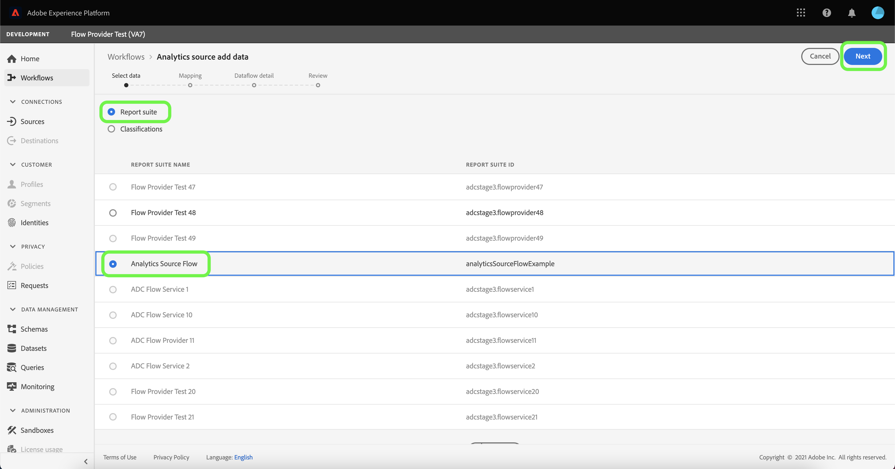

&lt;!—Analytics レポートスイートは、一度に1つのサンドボックスに対して設定できます。 同じレポートスイートを別のサンドボックスに読み込むには、データセットフローを削除し、別のサンドボックスの設定を介して再度インスタンス化する必要があります。—>

## マッピング {#mapping}

>[!IMPORTANT]
>
>データ準備の変換により、データフロー全体に遅延が発生する場合があります。 追加される追加の待ち時間は、変換ロジックの複雑さによって異なります。

Analytics データをターゲット XDM スキーマにマッピングする前に、まず、デフォルトスキーマとカスタムスキーマのどちらを使用しているかを判断する必要があります。

>[!BEGINTABS]

>[!TAB  デフォルトスキーマ ]

デフォルトスキーマは、ユーザーに代わって新しいスキーマを作成します。 この新しく作成されたスキーマには、[!DNL Adobe Analytics ExperienceEvent Template] フィールドグループが含まれています。 デフォルトスキーマを使用するには、**[!UICONTROL Default schema]**&#x200B;を選択します。

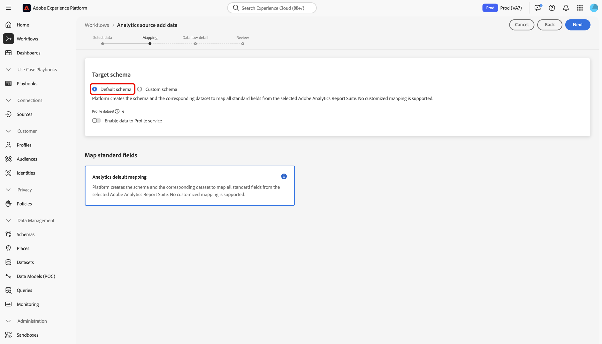

>[!TAB  カスタムスキーマ ]

カスタムスキーマを使用すると、Analytics データに使用可能なスキーマを選択できます。スキーマに[!DNL Adobe Analytics ExperienceEvent Template] フィールドグループがある限り有効です。 カスタムスキーマを使用するには、**[!UICONTROL Custom schema]**&#x200B;を選択します。

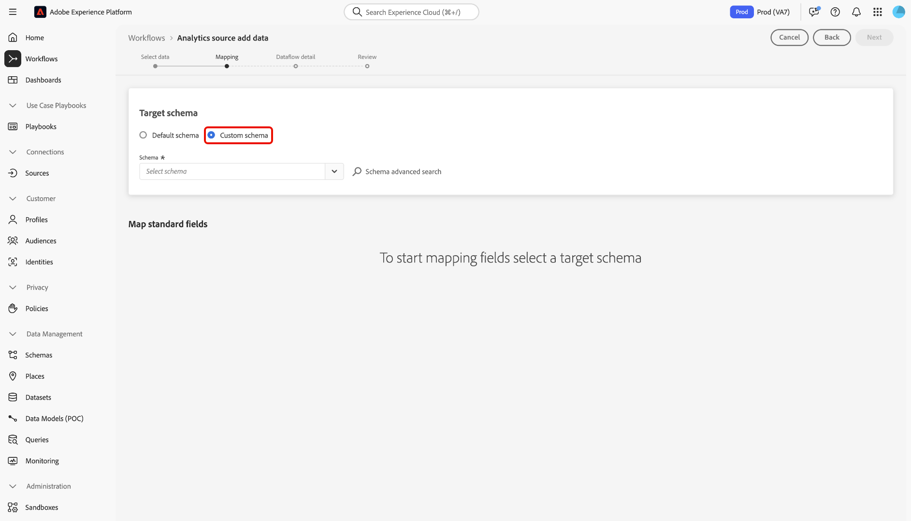

>[!ENDTABS]

*[!UICONTROL Mapping]* インターフェイスを使用して、ソースフィールドを適切なターゲットスキーマフィールドにマッピングします。 カスタム変数を新しいスキーマフィールドグループにマッピングし、データ準備でサポートされているように計算を適用できます。 ターゲットスキーマを選択してマッピングプロセスを開始します。

>[!TIP]
>
>[!DNL Adobe Analytics ExperienceEvent Template] フィールドグループを持つスキーマのみがスキーマ選択メニューに表示されます。 その他のスキーマは省略されます。 レポートスイートデータに使用できる適切なスキーマがない場合は、新しいスキーマを作成する必要があります。 スキーマの作成手順について詳しくは、[UI でのスキーマの作成と編集](../../../../../xdm/ui/resources/schemas.md)ガイドを参照してください。

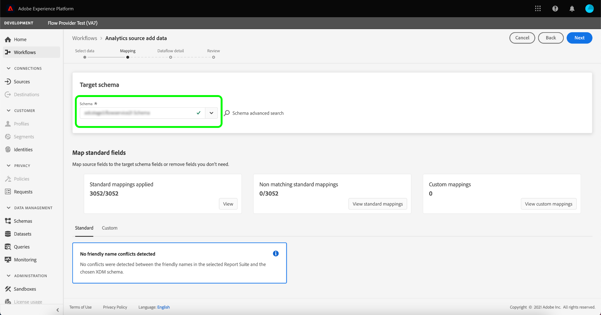

[!UICONTROL Map standard fields]の指標については、[!UICONTROL Standard mappings applied] パネルを参照してください。 [!UICONTROL Standard mappings with descriptor name conflicts]および[!DNL Custom mappings]。

| 標準フィールドをマッピング | 説明 |
| --- | --- |
| [!UICONTROL Standard mappings applied] | [!UICONTROL Standard mappings applied] パネルには、マッピングされた属性の合計数が表示されます。 標準マッピングとは、ソース Analytics データ内のすべての属性と、Analytics フィールドグループ内の対応する属性とのマッピングを指します。 これらは事前にマッピングされており、編集できません。 |
| [!UICONTROL Standard mappings with descriptor name conflicts] | [!UICONTROL Standard mappings with descriptor name conflicts] パネルは、名前の競合を含む、マッピングされた属性の数を参照します。 これらの競合は、既に別のレポートスイートから入力されたフィールドディスクリプタのセットを持つスキーマを再利用する場合に表示されます。 名前が競合している場合でも、Analytics データフローを続行できます。 |
| [!UICONTROL Custom mappings] | [!UICONTROL Custom mappings] パネルには、eVar、prop、リストなど、マッピングされたカスタム属性の数が表示されます。 カスタムマッピングとは、ソース Analytics データ内のカスタム属性と、選択したスキーマに含まれるカスタムフィールドグループ内の属性とのマッピングを指します。 |

### 標準マッピング {#standard-mappings}

Experience Platformは、名前の競合に対するマッピングを自動的に検出します。 マッピングに競合がない場合は、**[!UICONTROL Next]**&#x200B;を選択して続行します。

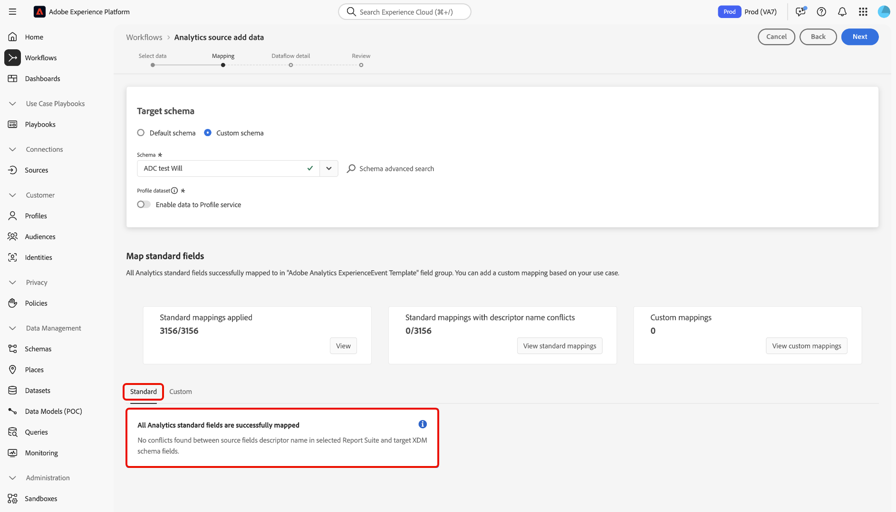

>[!TIP]
>
>ソースレポートスイートと選択したスキーマの間に名前の競合がある場合でも、フィールド記述子が変更されないことを確認しながら、Analytics データフローを続行できます。 または、空の記述子セットで新しいスキーマを作成することもできます。

## カスタムマッピング {#custom-mappings}

>[!CONTEXTUALHELP]
>id="platform_analytics_import_mapping"
>title="テンプレートのダウンロード"
>abstract="オフラインでマッピングを実行するには、CSV テンプレートをダウンロードします。"
>additional-url="https://experienceleague.adobe.com/ja/docs/experience-platform/data-prep/ui/mapping#import-mapping" text="マッピングを読み込む"

データ準備関数を使用して、新しいカスタムマッピングやカスタム属性の計算フィールドを追加できます。 カスタムマッピングを追加するには、**[!UICONTROL Custom]**&#x200B;を選択します。

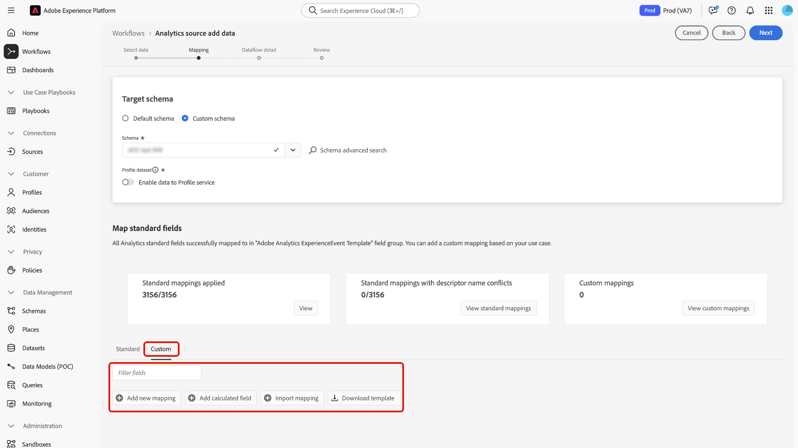

* **[!UICONTROL Filter fields]**: [!UICONTROL Filter fields] テキスト入力を使用して、マッピング内の特定のマッピングフィールドをフィルタリングします。
* **[!UICONTROL Add new mapping]**：新しいソースフィールドとターゲットフィールドマッピングを追加するには、**[!UICONTROL Add new mapping]**&#x200B;を選択します。
* **[!UICONTROL Add calculated field]**：必要に応じて、**[!UICONTROL Add calculated field]**&#x200B;を選択して、マッピング用の新しい計算フィールドを作成できます。
* **[!UICONTROL Import mapping]**: データ準備のインポートマッピング機能を使用することで、データ取り込みプロセスの手動構成時間を短縮し、ミスを制限できます。 既存のフローまたは書き出したファイルからマッピングを読み込むには、**[!UICONTROL Import mapping]**&#x200B;を選択します。 詳しくは、[&#x200B; マッピングの読み込みと書き出しに関するガイド &#x200B;](../../../../../data-prep/ui/mapping.md#import-mapping)を参照してください。
* **[!UICONTROL Download template]**: マッピングのCSV コピーをダウンロードし、ローカルデバイスでマッピングを設定することもできます。 マッピングのCSV コピーをダウンロードするには、**[!UICONTROL Download template]**&#x200B;を選択します。 ソースファイルとターゲットスキーマで提供されているフィールドのみを使用していることを確認する必要があります。

データ準備について詳しくは、次のドキュメントを参照してください。

* [データ準備の概要](../../../../../data-prep/home.md)
* [データ準備のマッピング機能](../../../../../data-prep/functions.md)
* [計算フィールドを追加](../../../../../data-prep/ui/mapping.md#calculated-fields)

<!-- 
To use Data Prep functions and add new mapping or calculated fields for custom attributes, select **[!UICONTROL View custom mappings]**.

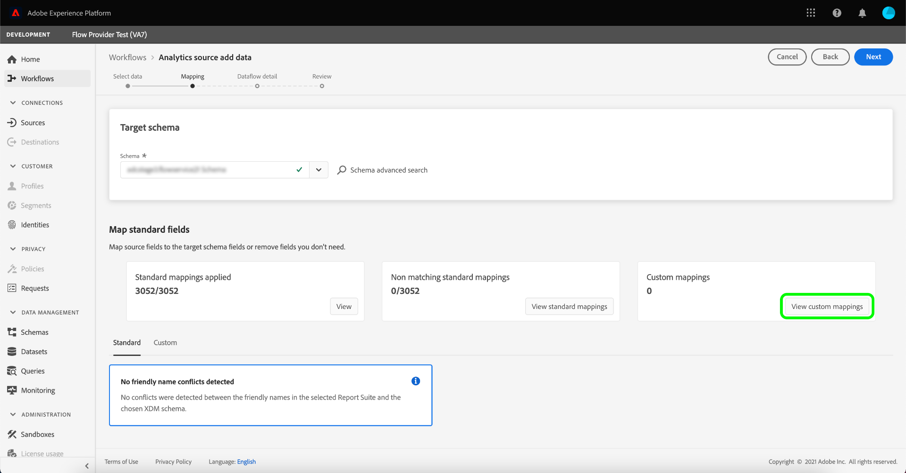

Next, select **[!UICONTROL Add new mapping]**.

Depending on your needs, you can select either **[!UICONTROL Add new mapping]** or **[!UICONTROL Add calculated field]** from the options that appear. 

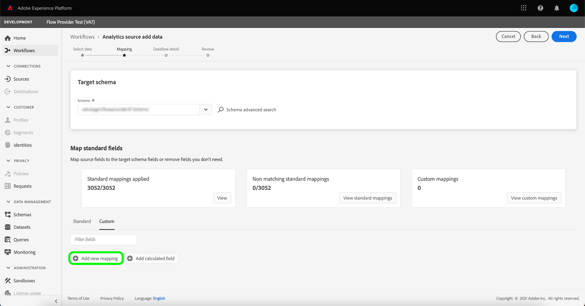

An empty mapping set appears. Select the mapping icon to add a source field.

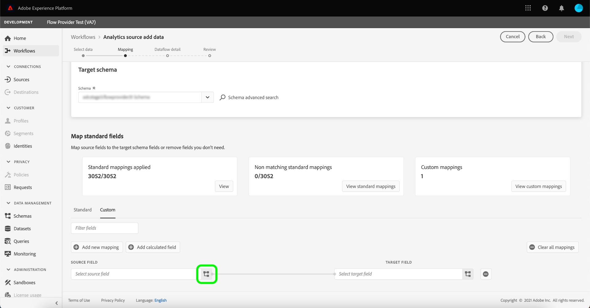

You can use the interface to navigate through the source schema structure and identify the new source field that you want to use. Once you have selected the source field that you want to map, select **[!UICONTROL Select]**.

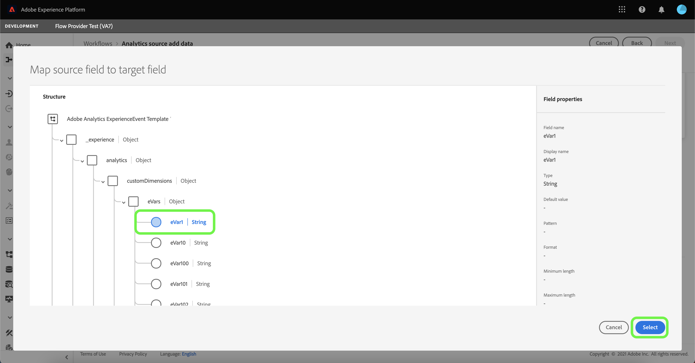

Next, select the mapping icon under [!UICONTROL Target Field] to map your selected source field to its appropriate target field.

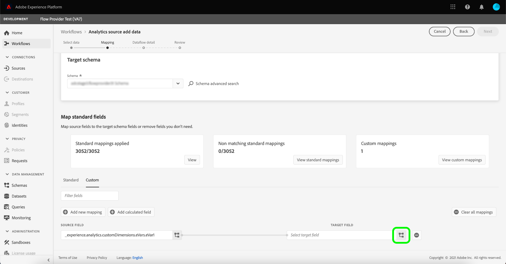

Similar to the source schema, you can use the interface to navigate through the target schema structure and select the target field you want to map to. Once you have selected the appropriate target field, select **[!UICONTROL Select]**.

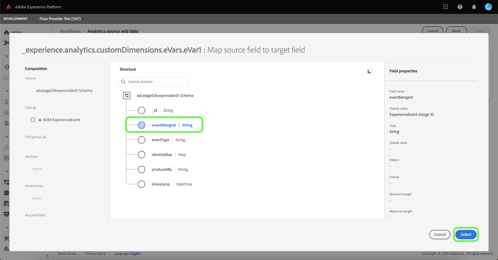

With your custom mapping set completed, select **[!UICONTROL Next]** to proceed.

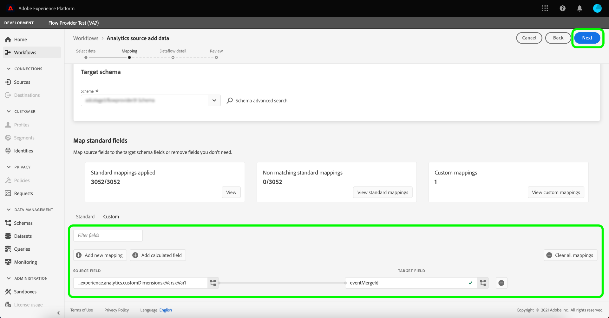 
-->

## リアルタイム顧客プロファイルのフィルタリング {#filtering-for-profile}

>[!CONTEXTUALHELP]
>id="platform_data_prep_analytics_filtering"
>title="フィルタールールの作成"
>abstract="リアルタイム顧客プロファイルにデータを送信する際に、行および列レベルのフィルタリングルールを定義します。行レベルのフィルタリングを使用して、条件を適用し、**プロファイルの取り込みに含める**&#x200B;データを指示します。列レベルのフィルタリングを使用して、**プロファイルの取り込みから除外する**&#x200B;データの列を選択します。フィルタリングルールは、データレイクに送信されるデータには適用されません。"

Analytics レポートスイートデータのマッピングが完了したら、フィルタリングルールと条件を適用して、取り込みデータを選択的に含めることも、取り込みから除外することもできます。 フィルタリングのサポートはAnalytics データでのみ利用でき、データは[!DNL Profile.]を入力する前にのみフィルタリングされます。すべてのデータはデータレイクに取り込まれます。

>[!BEGINSHADEBOX]

**リアルタイム顧客プロファイルのデータ準備とAnalytics データのフィルタリングに関する追加情報**

* プロファイルに送信するデータにはフィルタリング機能を使用できますが、データレイクに送信するデータには使用できません。
* ライブデータにはフィルタリングを使用できますが、バックフィルターデータはフィルタリングできません。
   * Analytics ソースは、プロファイルにデータをバックフィルしません。
* Analytics フローの初期設定中にデータ準備設定を使用する場合、その変更は自動13か月のバックフィルにも適用されます。
   * ただし、フィルタリングはライブデータにのみ予約されているため、フィルタリングの場合はそうではありません。
* データ準備は、ストリーミングパスとバッチ取り込みパスの両方に適用されます。 既存のデータ準備設定を変更した場合、その変更は、ストリーミングおよびバッチ取り込みパスの両方で、新しい受信データに適用されます。
   * ただし、Experience Platformに既に取り込まれているデータは、ストリーミングデータであるかバッチデータであるかを問わず、データ準備設定は適用されません。
* Analyticsの標準属性は常に自動的にマッピングされます。 そのため、標準属性に変換を適用することはできません。
   * ただし、標準属性は、ID サービスまたはプロファイルで必要でない限り、除外することができます。
* 列レベルのフィルタリングを使用して、必須フィールドとID フィールドをフィルタリングすることはできません。
* セカンダリ ID、特にAAIDとAACustomIDはフィルタリングできますが、ECIDはフィルタリングできません。
* 変換エラーが発生すると、対応する列はNULLになります。

>[!ENDSHADEBOX]

### 行レベルのフィルタリング

>[!IMPORTANT]
>
>行レベルのフィルタリングを使用して、条件を適用し、**プロファイルの取り込みに含める**&#x200B;データを指示します。列レベルのフィルタリングを使用して、プロファイル取り込み用に&#x200B;**除外するデータの列を選択します**。

プロファイル取り込み用のデータは、行レベルと列レベルでフィルタリングできます。 行レベルのフィルタリングを使用して、文字列に含まれる、次に等しい、始まる、次で終わるなどの条件を定義します。 行レベルのフィルタリングを使用して、`AND`と`OR`を使用して条件を結合し、`NOT`を使用して条件を否定することもできます。

行レベルでAnalytics データをフィルタリングするには、**[!UICONTROL Row filter]**&#x200B;を選択し、左側のパネルを使用してスキーマ階層を移動し、選択するスキーマ属性を特定します。

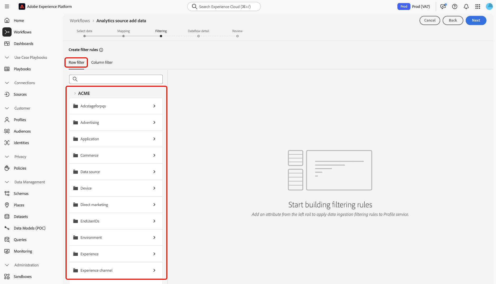

設定する属性を特定したら、属性を選択して、左側のパネルからフィルターパネルにドラッグします。

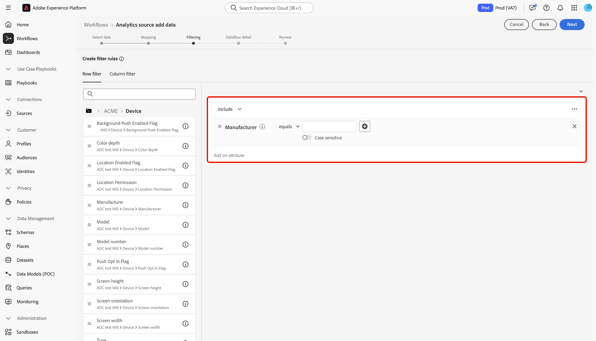

異なる条件を設定するには、**[!UICONTROL equals]**&#x200B;を選択し、表示されるドロップダウンウィンドウから条件を選択します。

設定可能な条件のリストには、次のものが含まれます。

* [!UICONTROL equals]
* [!UICONTROL does not equal]
* [!UICONTROL starts with]
* [!UICONTROL ends with]
* [!UICONTROL does not end with]
* [!UICONTROL contains]
* [!UICONTROL does not contain]
* [!UICONTROL exists]
* [!UICONTROL does not exist]

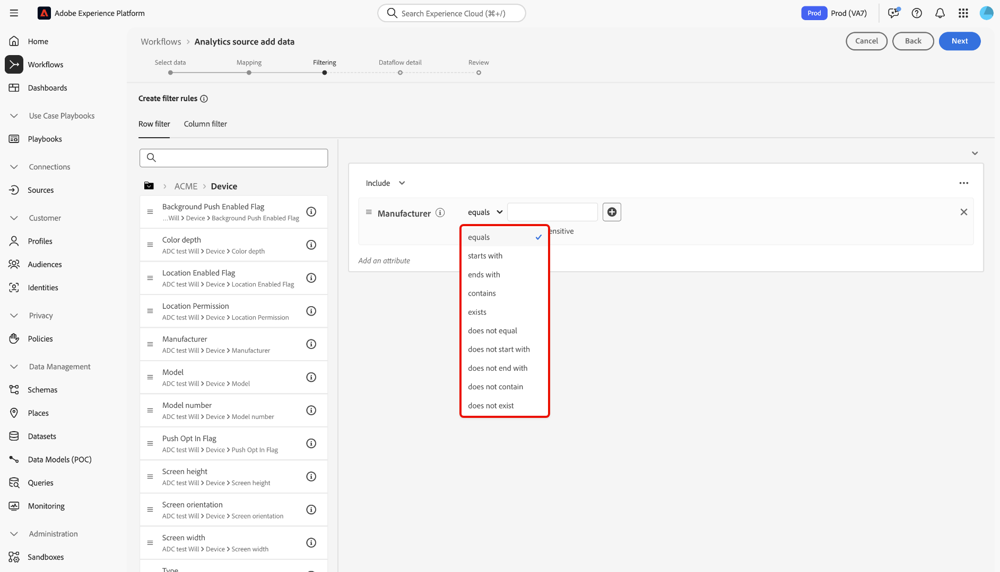

次に、選択した属性に基づいて、含める値を入力します。 次の例では、[!DNL Apple]属性の一部として、[!DNL Google]と&#x200B;**[!UICONTROL Manufacturer]**&#x200B;が取り込み用に選択されています。

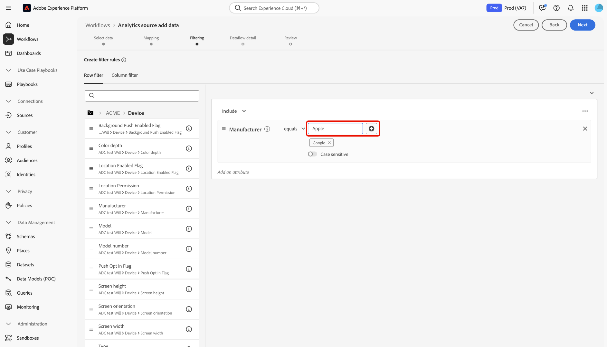

フィルター条件をさらに指定するには、スキーマから別の属性を追加し、その属性に基づいて値を追加します。 次の例では、**[!UICONTROL Model]**&#x200B;属性が追加され、取り込み用に[!DNL iPhone 16]や[!DNL Google Pixel 9]などのモデルがフィルタリングされます。

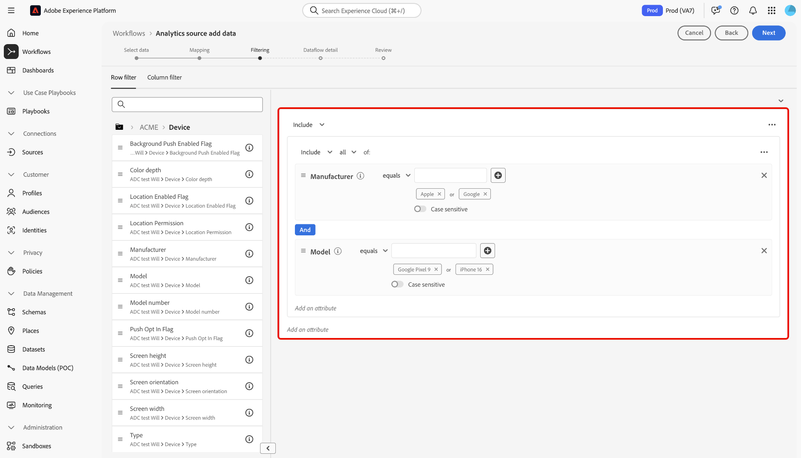

新しいコンテナを追加するには、フィルタリングインターフェイスの右上にある省略記号（`...`）を選択し、**[!UICONTROL Add container]**&#x200B;を選択します。

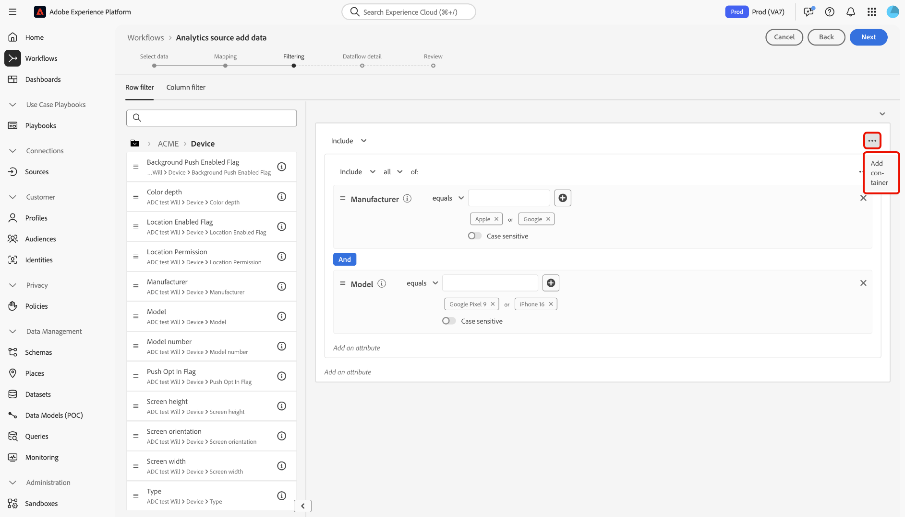

新しいコンテナを追加したら、**[!UICONTROL Include]**&#x200B;を選択し、ドロップダウンメニューから&#x200B;**[!UICONTROL Exclude]**&#x200B;を選択します。 除外する属性と値を追加し、終了したら、**[!UICONTROL Next]**&#x200B;を選択します。

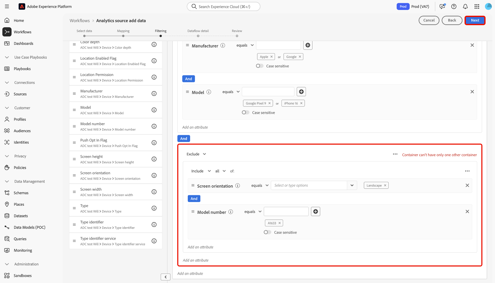

### 列レベルのフィルタリング

ヘッダーから&#x200B;**[!UICONTROL Column filter]**&#x200B;を選択して、列レベルのフィルタリングを適用します。

ページがインタラクティブなスキーマツリーに更新され、列レベルでスキーマ属性が表示されます。 ここから、プロファイルの取り込みから除外するデータの列を選択できます。 または、列を展開し、除外する特定の属性を選択することもできます。

デフォルトでは、すべてのAnalyticsはプロファイルに移動し、このプロセスでは、XDM データの分岐をプロファイル取り込みから除外できます。

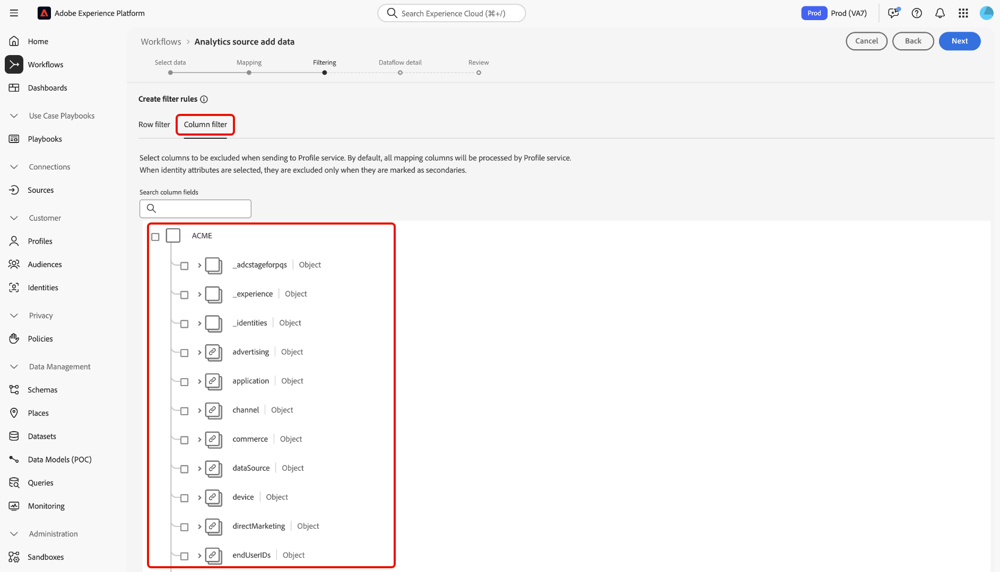

### セカンダリ IDをフィルター

列フィルターを使用して、セカンダリ IDをプロファイル取り込みから除外します。 セカンダリ IDをフィルターするには、**[!UICONTROL Column filter]**&#x200B;を選択し、**[!UICONTROL _identities]**&#x200B;を選択します。

フィルターは、IDがセカンダリとしてマークされている場合にのみ適用されます。 IDが選択されていても、プライマリとしてマークされたIDの1つがイベントに到達した場合、それらのIDはフィルタリングされません。

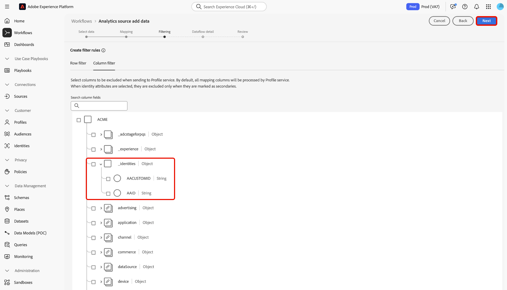

### データフローの詳細を入力

**[!UICONTROL Dataflow detail]** ステップが表示され、データフローの名前とオプションの説明を指定する必要があります。 終了したら「**[!UICONTROL Next]**」を選択します。

### レビュー

[!UICONTROL Review] ステップが表示され、新しいAnalytics データフローを作成する前に確認できます。 接続の詳細は、次のようなカテゴリ別にグループ化されます。

* [!UICONTROL Connection]：接続のソース プラットフォームを表示します。
* [!UICONTROL Data type]：選択したレポートスイートと、対応するレポートスイート IDが表示されます。

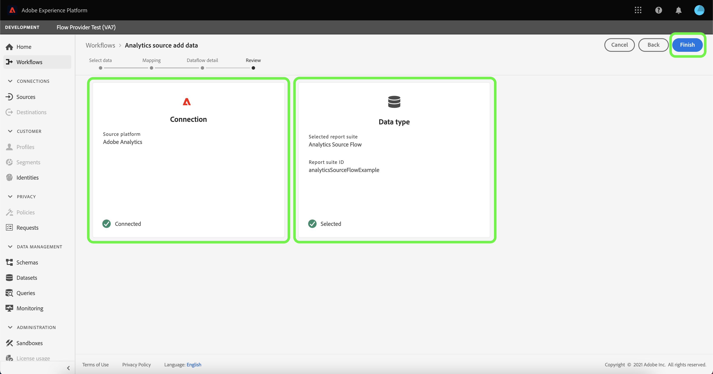

>[!TIP]
>
>ライセンスの使用権限を超え、ストレージとデータリッチネスの総指標に負担がかかることを避けるために、次のベストプラクティスに従ってください。
>
>* データライフサイクル管理とストレージ効率を最適化するために、最初にExperience Event データセットの保持有効期間（TTL）を設定します。 詳しくは、[TTL](../../../../../catalog/datasets/experience-event-dataset-retention-ttl-guide.md)を使用したデータレイクでのエクスペリエンスイベントデータセット保持の管理に関するガイドを参照してください。
>
>* Analytics ソースデータフローを作成する場合は、まず、データレイクにのみデータを取り込むようにコネクタを設定します。 データフローが機能していることを確認したら、データセットのプロファイル取り込みを有効にできます。 この方法は、行と列のフィルターによってデータ量が効果的に削減される場合に最適です。

## データフローの監視 {#monitor-your-dataflow}

データフローが完了したら、*[!UICONTROL Dataflows]* インターフェイスを使用して、Analytics データフローのステータスを監視できます。

AnalyticsからExperience Platformに送信されるデータの進行状況については、[!UICONTROL Dataset activity] インターフェイスを使用してください。 インターフェイスには、前月のレコードの合計、過去7日間に取り込まれたレコードの合計、前月のデータサイズなどの指標が表示されます。

ソースは2つのデータセットフローをインスタンス化します。 1 つのフローはバックフィルデータ、もう 1 つはライブデータのフローを表します。 バックフィルデータは、リアルタイム顧客プロファイルに取り込むように設定されていませんが、分析およびデータサイエンスのユースケースのためにデータレイクに送信されます。

バックフィル、ライブデータ、およびそれぞれの遅延について詳しくは、[Analytics ソースの概要](../../../../connectors/adobe-applications/analytics.md)を参照してください。

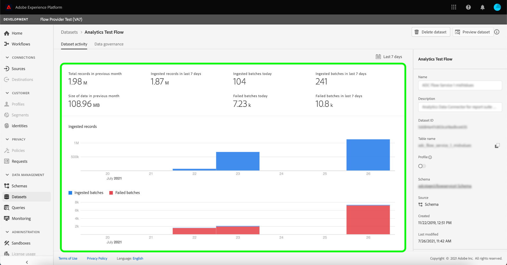

>[!NOTE]
>
>Analytics ソースコネクタはAdobeで完全に管理されているため、データセットアクティビティページにはバッチに関する情報は表示されません。 取り込んだレコードに関する指標を確認することで、データの流れを監視できます。

## データフローの削除 {#delete-dataflow}

>[!NOTE]
>
>Analytics データフローを無効にすることはできません。 Analytics データのフローを停止するには、データフロー全体を&#x200B;**削除**&#x200B;する必要があります。

Analytics データフローを削除するには、ソースワークスペースの上部ヘッダーから&#x200B;**[!UICONTROL Dataflows]**&#x200B;を選択します。 データフローページを使用して、削除するAnalytics データフローを見つけ、その横にある省略記号（`...`）を選択します。 次に、ドロップダウンメニューを使用して、**[!UICONTROL Delete]**&#x200B;を選択します。

* ライブ Analytics データフローを削除すると、その基礎となるデータセットも削除されます。
* バックフィル Analytics データフローを削除しても、基になるデータセットは削除されませんが、対応するレポートスイートのバックフィルプロセスは停止されます。 バックフィルデータフローを削除しても、取り込まれたデータはデータセットを通じて表示される場合があります。

## 次の手順とその他のリソース

接続を作成すると、受信データを格納して選択したスキーマをデータセットに投入するデータフローが自動的に作成されます。さらに、データのバックフィルが発生し、最大 13 か月の履歴データを取り込みます。最初の取り込みが完了すると、Analytics データが返され、[!DNL Real-Time Customer Profile]やSegmentation Serviceなどのダウンストリーム Experience Platform サービスで使用されます。 詳しくは、次のドキュメントを参照してください。

* [[!DNL Real-Time Customer Profile] 概要](../../../../../profile/home.md)
* [[!DNL Segmentation Service] の概要](../../../../../segmentation/home.md)
* [[!DNL Data Science Workspace] の概要](../../../../../data-science-workspace/home.md)
* [[!DNL Query Service] の概要](../../../../../query-service/home.md)

次のビデオは、Adobe Analytics Source コネクタを使用したデータの取り込みに関する理解を深めることを目的としています。

>[!WARNING]
>
> 次のビデオに示す [!DNL Experience Platform] UI は旧式のものです。最新の UI のスクリーンショットと機能については、上記のドキュメントを参照してください。

>[!VIDEO](https://video.tv.adobe.com/v/29687?quality=12&learn=on)

