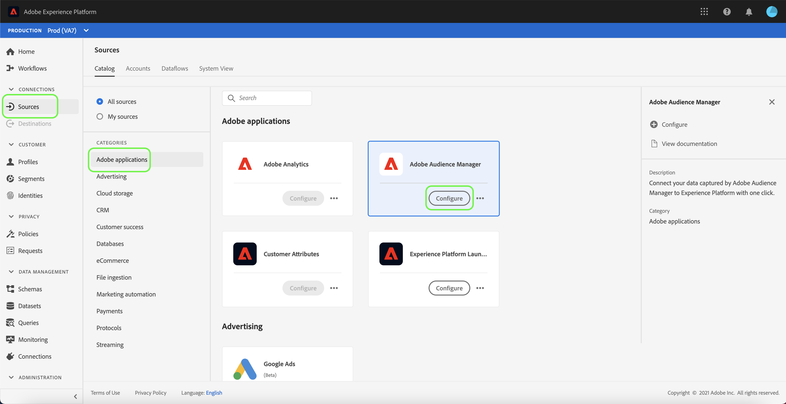

# UI での Adobe Audience Manager ソースコネクタの作成

このチュートリアルでは、ユーザーインターフェイスを使用して消費者エクスペリエンスイベントデータを Platform に取り込むための、Adobe Audience Manager用のソースコネクタを作成する手順を説明します。

## Adobe Audience Managerでのソース接続の作成

にログインします。 [Adobe Experience Platform](https://platform.adobe.com) 次に、 **[!UICONTROL ソース]** 左側のナビゲーションバーから [!UICONTROL ソース] ワークスペース。 [!UICONTROL カタログ]画面には、アカウントを作成できる様々なソースが表示されます。

以下 [!UICONTROL Adobe] カテゴリ、選択 **[!UICONTROL Adobe Audience Manager]** 次に、 **[!UICONTROL 設定]**.

この [!UICONTROL 特性とセグメントの選択] 手順が表示され、特性、セグメントおよびデータを調査および選択するためのインタラクティブなインターフェイスが提供されます。

* インターフェイスの左側のパネルには、 [!UICONTROL 特性とセグメントの選択] オプションに加えて、使用可能なすべてのセグメントの階層ディレクトリが含まれます。
* インターフェイスの右側では、選択したセグメントを操作し、使用する特定のデータを選択できます。

使用可能なセグメント間を移動するには、 [!UICONTROL すべてのセグメント] パネル。 フォルダーを選択すると、フォルダーの階層を移動し、フィルター処理するセグメントのリストを表示できます。

使用するセグメントを特定して選択すると、右側に新しいパネルが表示され、選択した項目のリストが表示されます。 引き続き様々なフォルダーにアクセスし、接続に対して様々なセグメントを選択できます。 他のセグメントを選択すると、右側のパネルが更新されます。

または、 **[!UICONTROL すべてのセグメントを選択]** および **[!UICONTROL すべての特性を選択]** ボックス。 すべてのセグメントを選択するとAudience Managerセグメントが Platform に取り込まれ、すべての特性を選択すると、Audience Managerからすべてのファーストパーティ特性が有効になります。

完了したら、「 」を選択します。 **[!UICONTROL 次へ]**

この [!UICONTROL レビュー] 手順が表示され、選択した特性とセグメントを、Platform に接続する前に確認できます。 詳細は、次のカテゴリに分類されます。

* **[!UICONTROL 接続]**:ソースプラットフォームと接続のステータスを表示します。
* **[!UICONTROL 選択したデータ]**:選択したセグメントと有効な特性の数が表示されます。

データフローをレビューしたら、「 」を選択します。 **[!UICONTROL 完了]** とは、データフローが作成されるまでしばらく時間をかけます。

## 次の手順

Audience Managerのデータフローがアクティブな間、受信データはリアルタイム顧客プロファイルに自動的に取り込まれます。 これで、この受信データを利用し、Platform セグメント化サービスを使用してオーディエンスセグメントを作成できます。 詳しくは、次のドキュメントを参照してください。

* [リアルタイム顧客プロファイルの概要](../../../../../profile/home.md)
* [セグメント化サービスの概要](../../../../../segmentation/home.md)
