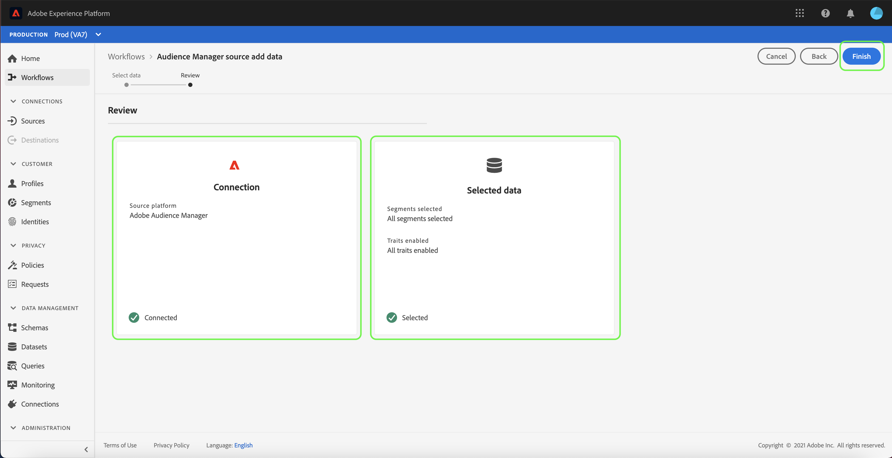

# UI での Adobe Audience Manager ソース接続の作成

このチュートリアルでは、ユーザーインターフェイスを使用して消費者エクスペリエンスイベントデータを Platform に取り込むための、Adobe Audience Manager用のソースコネクタを作成する手順を説明します。

## Adobe Audience Managerでのソース接続の作成

Platform の UI で、左側のナビゲーションバーで「**[!UICONTROL ソース]**」を選択し、[!UICONTROL ソース]ワークスペースにアクセスします。[!UICONTROL カタログ]画面には、アカウントを作成できる様々なソースが表示されます。

画面の左側にあるカタログから適切なカテゴリを選択することができます。または、検索バーを使用して、利用したい特定のソースを見つけることもできます。

の下 [!UICONTROL Adobe]を選択します。 **[!UICONTROL Adobe Audience Manager]** 次に、 **[!UICONTROL 設定]**.

### 特性とセグメントの選択

>[!NOTE]
>
>地域データを地域ソースからAudience Managerに取り込むことはできません。 地域データを必要とする Analytics の使用例がある場合は、 [Analytics ソースコネクタ](../adobe-applications/analytics.md).

この [!UICONTROL 特性とセグメントの選択] 手順が表示され、特性、セグメントおよびデータを調査および選択するためのインタラクティブなインターフェイスが提供されます。

* インターフェイスの左側のパネルには、 [!UICONTROL 特性とセグメントの選択] オプションに加えて、使用可能なすべてのセグメントの階層ディレクトリが含まれます。
* インターフェイスの右側では、選択したセグメントを操作し、使用する特定のデータを選択できます。

使用可能なセグメント間を移動するには、 [!UICONTROL すべてのセグメント] パネル。 フォルダーを選択すると、フォルダーの階層を移動し、フィルター処理するセグメントのリストを表示できます。

使用するセグメントを特定して選択すると、右側に新しいパネルが表示され、選択した項目のリストが表示されます。 引き続き様々なフォルダーにアクセスし、接続に対して様々なセグメントを選択できます。 他のセグメントを選択すると、右側のパネルが更新されます。

または、 **[!UICONTROL すべてのセグメントを選択]** および **[!UICONTROL すべての特性を選択]** ボックス。 すべてのセグメントを選択するとAudience Managerセグメントが Platform に取り込まれ、すべての特性を選択すると、Audience Managerからすべてのファーストパーティ特性が有効になります。

>[!WARNING]
>
>サイズの大きい Audience Manager セグメント母集団の取り込みは、Audience Manager ソースを使用して初めて Platform に Audience Manager セグメントを送信する際に、合計プロファイル数に直接影響します。つまり、すべてのセグメントを選択すると、ライセンス使用権限を超えるプロファイル数が発生する可能性があります。次を確認してください： [ライセンス使用許可](../../../../../dashboards/guides/license-usage.md) 先に進む前に

完了したら、「 」を選択します。 **[!UICONTROL 次へ]**

この [!UICONTROL レビュー] 手順が表示され、選択した特性とセグメントを、Platform に接続する前に確認できます。 詳細は、次のカテゴリに分類されます。

* **[!UICONTROL 接続]**:ソースプラットフォームと接続のステータスを表示します。
* **[!UICONTROL 選択したデータ]**:選択したセグメントと有効な特性の数が表示されます。

データフローをレビューしたら、「**[!UICONTROL 終了]**」を選択し、データフローが作成されるまでしばらく待ちます。

## 次の手順

Audience Managerのデータフローがアクティブな間、受信データはリアルタイム顧客プロファイルに自動的に取り込まれます。 これで、この受信データを利用し、Platform セグメント化サービスを使用してオーディエンスセグメントを作成できます。 詳しくは、次のドキュメントを参照してください。

* [リアルタイム顧客プロファイルの概要](../../../../../profile/home.md)
* [セグメント化サービスの概要](../../../../../segmentation/home.md)
