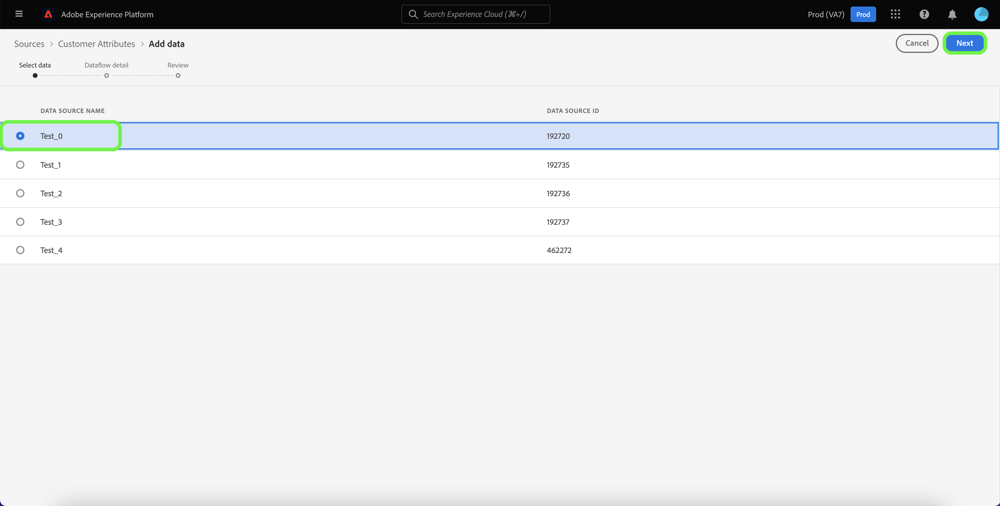

# UI での Customer Attributes ソース接続の作成

このチュートリアルでは、UI でソース接続を作成して顧客属性プロファイルデータをAdobe Experience Platformに取り込む手順を説明します。 顧客属性について詳しくは、 [顧客属性の概要](https://experienceleague.adobe.com/docs/core-services/interface/customer-attributes/attributes.html?lang=ja).

>[!IMPORTANT]
>
>現在、顧客属性ソースは、データフローの有効化と無効化をサポートしていません。

## ソース接続の作成

>[!NOTE]
>
>顧客属性プロファイルデータのソース接続を既に確立している場合、ソースに接続するオプションは無効になります。

Platform の UI で、左側のナビゲーションバーで「**[!UICONTROL ソース]**」を選択し、[!UICONTROL ソース]ワークスペースにアクセスします。この [!UICONTROL カタログ] screen には、接続を作成できる様々なソースが表示されます。

画面の左側にあるカタログから適切なカテゴリを選択することができます。または、検索バーを使用して、利用したい特定のソースを見つけることもできます。

以下 [!UICONTROL Adobe] カテゴリ、選択 **[!UICONTROL 顧客属性]** 次に、 **[!UICONTROL データを追加]**.

### 顧客属性データソースを選択

この [!UICONTROL データを追加] 画面に、顧客属性で使用可能なすべてのデータソースが表示されます。 顧客属性ソース接続ごとに 1 つのデータセットのみを選択できます。

>[!NOTE]
>
>フィールドグループ、スキーマ、およびデータセットは、フロープロビジョニングの一環として標準で作成されます。 そのまま残るので、必要に応じて手動で削除する必要があります。

顧客属性ソースでは、スキーマの変化はサポートされていません。 顧客属性データソースのスキーマ入力が変更されると、Platform との互換性が失われます。 回避策として、既存の顧客属性データフローと、関連するデータセット、スキーマ、フィールドグループを削除し、更新されたスキーマとデータソースを持つ新しい顧客属性データフローを作成できます。

>[!IMPORTANT]
>
>顧客属性データフローは削除できますが、対応するデータセットはデータフローを削除した後も保持されます。 詳しくは、 [データセットの削除](../../../../../catalog/datasets/user-guide.md) データセットを手動で削除する手順を参照してください。

新しい接続を作成するには、リストからデータソースを選択し、 **[!UICONTROL 次へ]**.

### データフローの詳細を入力

この [!UICONTROL データフローの詳細] 手順が表示され、データフローの名前と簡単な説明を指定できます。 この処理の間に、 [!UICONTROL エラー診断], [!UICONTROL 部分取り込み]、および [!UICONTROL アラート].

[!UICONTROL エラー診断]は、データフローで発生するエラーレコードに対して、詳細なエラーメッセージ生成を有効にします。[!UICONTROL 部分取り込み]では、手動で定義した特定のしきい値に到達するまで、エラーを含むデータを取り込むことができます。詳しくは、[バッチ取り込みの概要](../../../../../ingestion/batch-ingestion/partial.md)を参照してください。

アラートを有効にすると、データフローのステータスに関する通知を受け取ることができます。リストからアラートを選択して、データフローのステータスに関する通知を受け取るよう登録します。アラートについて詳しくは、[UI を使用したソースアラートの購読](../../alerts.md)についてのガイドを参照してください。

データフローへの詳細の入力を終えたら「**[!UICONTROL 次へ]** 」を選択します。

### レビュー データフロー

[!UICONTROL レビュー]手順が表示され、新しいデータフローを作成する前に確認できます。詳細は、次のカテゴリに分類されます。

* **[!UICONTROL 接続]**:ソースのタイプ、選択したソースファイルの関連パス、およびそのソースファイル内の列数を表示します。
* **[!UICONTROL データセットの割り当てとフィールドのマッピング]**：ソースデータがどのデータセットに取り込まれるかを、そのデータセットが準拠するスキーマを含めて表示します。

## 次の手順

接続が作成されると、ターゲットスキーマとデータセットが自動的に作成され、受信データが格納されます。初回の取り込みが完了すると、顧客属性プロファイルデータを、次のようなダウンストリームの Platform サービスで使用できます。 [!DNL Real-time Customer Profile] および [!DNL Segmentation Service]. 詳しくは、次のドキュメントを参照してください。

* [[!DNL Real-time Customer Profile] 概要](../../../../../profile/home.md)
* [[!DNL Segmentation Service] 概要](../../../../../segmentation/home.md)
