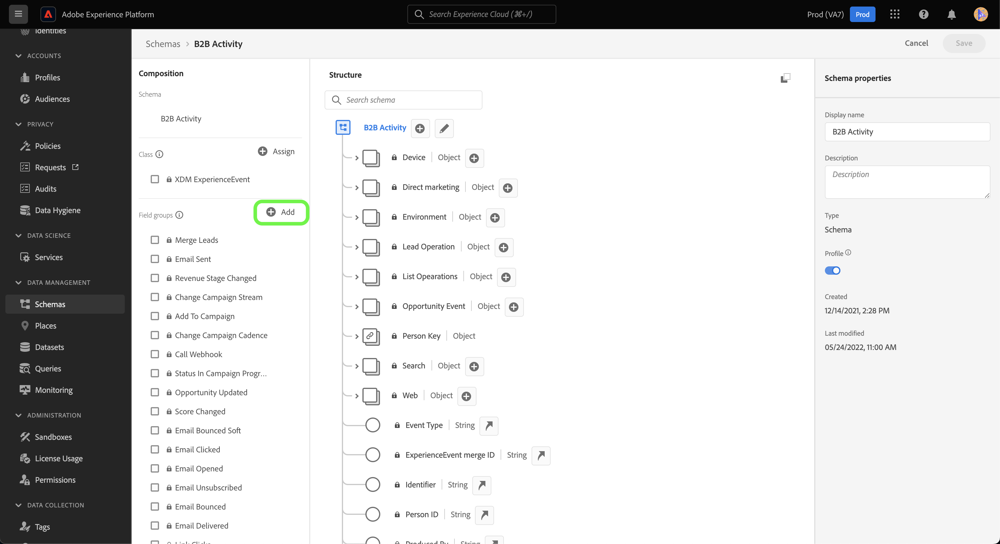

# の作成 [!DNL Marketo Engage] UI のカスタムアクティビティデータのソース接続とデータフロー

>[!NOTE]
>
>このチュートリアルでは、 **カスタムアクティビティ** からのデータ [!DNL Marketo] Experience Platformに 次の項目については、 **標準活動** データ、読み取り [[!DNL Marketo] UI ガイド](./marketo.md).

に加えて [標準アクティビティ](../../../../connectors/adobe-applications/mapping/marketo.md#activities)また、 [!DNL Marketo] カスタムアクティビティデータをAdobe Experience Platformに取り込むソース。 このドキュメントでは、 [!DNL Marketo] UI のソース。

## はじめに

このチュートリアルは、Adobe Experience Platform の次のコンポーネントを実際に利用および理解しているユーザーを対象としています。

* [B2B 名前空間とスキーマ自動生成ユーティリティ](../../../../connectors/adobe-applications/marketo/marketo-namespaces.md):B2B 名前空間とスキーマ自動生成ユーティリティを使用すると、 [!DNL Postman] を使用して、B2B 名前空間とスキーマの値を自動生成します。 B2B 名前空間とスキーマを作成する前に、まず B2B 名前空間とスキーマに入力する必要があります [!DNL Marketo] ソース接続とデータフロー。
* [ソース](../../../../home.md)：Experience Platform を使用すると、データを様々なソースから取得しながら、Platform サービスを使用して受信データの構造化、ラベル付け、拡張を行うことができます。
* [Experience Data Model（XDM）](../../../../../xdm/home.md)：Adobe Experience Platform が顧客体験データの整理に使用する標準化されたフレームワーク。
   * [UI でのスキーマの作成と編集](../../../../../xdm/ui/resources/schemas.md)：UI でスキーマを作成および編集する方法について説明します。
* [ID 名前空間](../../../../../identity-service/namespaces.md)：ID 名前空間は [!DNL Identity Service] のコンポーネントで、ID の関連先コンテキストのインジケーターとして機能します。完全修飾 ID には、ID 値と名前空間が含まれます。
* [[!DNL Real-Time Customer Profile]](/help/profile/home.md)：複数のソースからの集計データに基づいて、統合されたリアルタイムの顧客プロファイルを提供します。
* [サンドボックス](../../../../../sandboxes/home.md)：Experience Platform は、単一の Platform インスタンスを個別の仮想環境に分割する仮想サンドボックスを提供し、デジタル体験アプリケーションの開発および進化を支援します。

## カスタムアクティビティの詳細を取得する

カスタムアクティビティデータを取り込む最初の手順 [!DNL Marketo] をExperience Platformするには、カスタムアクティビティの API 名と表示名を取得します。

次を使用してアカウントにログインします。 [[!DNL Marketo]](https://app-sjint.marketo.com/#MM0A1) インターフェイス。 左側のナビゲーションで、の下に移動します。 [!DNL Database Management]を選択します。 **Marketo Custom Activities**.

インターフェイスは、それぞれの表示名や API 名の情報を含むカスタムアクティビティの表示に更新されます。 また、右側のパネルを使用して、アカウントから他のカスタムアクティビティを選択して表示することもできます。

選択 **フィールド** 上部のヘッダーから、カスタムアクティビティに関連付けられたフィールドを表示します。 このページでは、カスタムアクティビティのフィールドの名前、API 名、説明、データタイプを表示できます。 個々のフィールドに関する詳細は、後の手順（スキーマの作成時）で使用します。

## B2B アクティビティスキーマでカスタムアクティビティのフィールドグループを設定する

内 *[!UICONTROL スキーマ]* ダッシュボード UI で、「Experience Platform」を選択します。 **[!UICONTROL 参照]** 次に、 **[!UICONTROL B2B アクティビティ]** スキーマのリストから。

>[!TIP]
>
>検索バーを使用すると、スキーマのリスト内の移動を迅速におこなうことができます。

### カスタムアクティビティ用の新しいフィールドグループを作成します

次に、 [!DNL B2B Activity] スキーマ。 このフィールドグループは、取り込むカスタムアクティビティに対応し、以前に取得したカスタムアクティビティの表示名を使用する必要があります。

新しいフィールドグループを追加するには、「 **[!UICONTROL +追加]** の横に *[!UICONTROL フィールドグループ]* 下のパネル *[!UICONTROL 構成]*.

この *[!UICONTROL フィールドグループを追加]* ウィンドウが表示されます。 選択 **[!UICONTROL 新しいフィールドグループを作成]** 次に、前の手順で取得したカスタムアクティビティと同じ表示名を指定し、新しいフィールドグループの説明を任意で指定します。 終了したら、「 」を選択します。 **[!UICONTROL フィールドグループを追加]**.

作成すると、カスタムアクティビティの新しいフィールドグループが [!UICONTROL フィールドグループ] カタログ。

### スキーマ構造に新しいフィールドを追加します

次に、スキーマに新しいフィールドを追加します。 この新しいフィールドは、 `type: object` とには、カスタムアクティビティの個々のフィールドが含まれます。

新しいフィールドを追加するには、プラス記号 (`+`) をクリックします。 エントリ *[!UICONTROL 名称未設定フィールド |タイプ]* が表示されます。 次に、 *[!UICONTROL フィールドプロパティ]* パネル。 フィールド名をカスタムアクティビティの API 名に設定し、表示名をカスタムアクティビティの表示名に設定します。 次に、タイプをに設定します。 `object` フィールドグループを、前の手順で作成したカスタムアクティビティフィールドグループに割り当てます。 完了したら、「**[!UICONTROL 適用]**」を選択します。

スキーマに新しいフィールドが表示されます。

### オブジェクトフィールドにサブフィールドを追加 {#add-sub-fields-to-the-object-field}

スキーマを準備する最後の手順は、前の手順で作成したフィールド内に個々のフィールドを追加することです。

## データフローの作成

スキーマの設定が完了したら、カスタムアクティビティデータのデータフローの作成に進むことができます。

Platform UI の左側のナビゲーションバーで「**[!UICONTROL ソース]**」を選択し、[!UICONTROL ソース]ワークスペースにアクセスします。[!UICONTROL カタログ]画面には、アカウントを作成できる様々なソースが表示されます。

画面の左側にあるカタログから適切なカテゴリを選択することができます。または、検索バーを使用して、利用したい特定のソースを見つけることもできます。

[!UICONTROL アドビアプリケーション]カテゴリ内で「**[!UICONTROL Marketo Engage]**」を選択します。次に「**[!UICONTROL データの追加]**」を選択して、新しい [!DNL Marketo] データフローを作成します。

### データの選択

選択 **[!UICONTROL アクティビティ]** リストから [!DNL Marketo] データセットと選択 **[!UICONTROL 次へ]**.

### データフローの詳細

次に、 [データフローの情報を提供する](./marketo.md#provide-dataflow-details)（データセットとデータフローの名前と説明、使用するスキーマ、の設定を含む） [!DNL Profile] 取り込み、エラー診断、部分取り込み。

### マッピング

標準アクティビティフィールドのマッピングは自動入力されますが、カスタムアクティビティフィールドは、対応するターゲットフィールドに手動でマッピングする必要があります。

カスタムアクティビティフィールドのマッピングを開始するには、「 **[!UICONTROL 新しいフィールドタイプ]** 次に、 **[!UICONTROL 新しいフィールドを追加]**.

ソースデータ構造内を移動し、取り込むカスタムアクティビティフィールドを見つけます。 終了したら、「 」を選択します。 **[!UICONTROL 選択]**.

>[!TIP]
>
>混乱を避け、重複するフィールド名を処理するために、カスタムアクティビティフィールドの前には API 名が付きます。

ターゲットフィールドを追加するには、スキーマアイコンを選択します。  次に、ターゲットスキーマからカスタムアクティビティフィールドを選択します。

手順を繰り返して、残りのカスタムアクティビティマッピングフィールドを追加します。 終了したら、「**[!UICONTROL 次へ]**」を選択します。

### レビュー

*[!UICONTROL レビュー]*&#x200B;手順が表示され、新しいデータフローを作成する前に確認できます。詳細は、次のカテゴリに分類されます。

* **[!UICONTROL 接続]**：ソースのタイプ、選択したソースエンティティの関連パス、およびそのソースエンティティ内の列の数を表示します。
* **[!UICONTROL データセットの割り当てとフィールドのマッピング]**：ソースデータがどのデータセットに取り込まれるかを、そのデータセットが準拠するスキーマを含めて表示します。

データフローをレビューしたら、「**[!UICONTROL 保存して取り込み]**」を選択し、データフローが作成されるまでしばらく待ちます。

>[!NOTE]
>
>取り込みが完了すると、取り込まれたデータセットには、標準アクティビティとカスタムアクティビティの両方を含む、すべてのアクティビティが含まれます [!DNL Marketo] インスタンス。 Platform でカスタムアクティビティレコードを選択するには、 [クエリサービス](../../../../../query-service/home.md) 適切な述語を提供します。

## 次の手順

このチュートリアルに従って、次の用の Platform スキーマを設定しました。 [!DNL Marketo] カスタムアクティビティデータを作成し、そのデータを Platform に取り込むためのデータフローを作成しました。 に関する一般的な情報 [!DNL Marketo] ソース、読む [[!DNL Marketo] ソースの概要](../../../../connectors/adobe-applications/marketo/marketo.md).