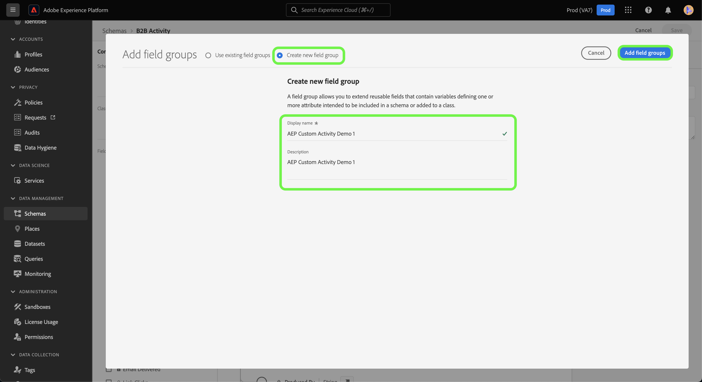

# UI でカスタムアクティビティデータの [!DNL Marketo Engage] ソース接続とデータフローを作成

>[!NOTE]
>
>このチュートリアルでは、**カスタムアクティビティ** データを [!DNL Marketo] からExperience Platformにを設定および取り込む方法に関する具体的な手順を説明します。 **標準アクティビティ** データを取り込む手順については、[[!DNL Marketo] UI ガイド &#x200B;](./marketo.md) を参照してください。

[&#x200B; 標準のアクティビティ &#x200B;](../../../../connectors/adobe-applications/mapping/marketo.md#activities) に加えて、[!DNL Marketo] ソースを使用して、カスタムアクティビティデータをAdobe Experience Platformに取り込むこともできます。 このドキュメントでは、UI の [!DNL Marketo] ソースを使用して、カスタムアクティビティデータのソース接続とデータフローを作成する手順を説明します。

## はじめに

このチュートリアルは、Adobe Experience Platform の次のコンポーネントを実際に利用および理解しているユーザーを対象としています。

* [B2B 名前空間とスキーマ自動生成ユーティリティ &#x200B;](../../../../connectors/adobe-applications/marketo/marketo-namespaces.md): B2B 名前空間とスキーマ自動生成ユーティリティを使用すると、[!DNL Postman] を使用して B2B 名前空間とスキーマの値を自動生成できます。 [!DNL Marketo] ソース接続とデータフローを作成する前に、まず B2B 名前空間とスキーマを完了する必要があります。
* [&#x200B; ソース &#x200B;](../../../../home.md):Experience Platformを使用すると、データを様々なソースから取得しながら、Experience Platform サービスを使用して受信データの構造化、ラベル付け、拡張を行うことができます。
* [Experience Data Model（XDM）](../../../../../xdm/home.md)：Adobe Experience Platform が顧客体験データの整理に使用する標準化されたフレームワーク。
   * [UI でのスキーマの作成と編集](../../../../../xdm/ui/resources/schemas.md)：UI でスキーマを作成および編集する方法について説明します。
* [ID 名前空間](../../../../../identity-service/features/namespaces.md)：ID 名前空間は [!DNL Identity Service] のコンポーネントで、ID の関連先コンテキストのインジケーターとして機能します。完全修飾 ID には、ID 値と名前空間が含まれます。
* [[!DNL Real-Time Customer Profile]](/help/profile/home.md)：複数のソースからの集計データに基づいて、統合されたリアルタイムの顧客プロファイルを提供します。
* [&#x200B; サンドボックス &#x200B;](../../../../../sandboxes/home.md): Experience Platformには、1 つのExperience Platform インスタンスを別々の仮想環境に分割し、デジタルエクスペリエンスアプリケーションの開発と発展に役立つ仮想サンドボックスが用意されています。

## カスタムアクティビティの詳細の取得

カスタムアクティビティデータを [!DNL Marketo] からExperience Platformに取り込む最初の手順は、カスタムアクティビティの API 名と表示名を取得することです。

[[!DNL Marketo]](https://app-sjint.marketo.com/#MM0A1) インターフェイスを使用してアカウントにログインします。 左側のナビゲーションの [!DNL Database Management] の下の「**Marketoカスタムアクティビティ**」を選択します。

インターフェイスは、それぞれの表示名や API 名などのカスタムアクティビティの表示に更新されます。 また、右側のパネルを使用して、アカウントから他のカスタムアクティビティを選択および表示することもできます。


上部ヘッダーから **フィールド** を選択して、カスタムアクティビティに関連付けられているフィールドを表示します。 このページでは、カスタムアクティビティのフィールドの名前、API 名、説明およびデータタイプを確認できます。 個々のフィールドに関する詳細は、後の手順でスキーマを作成する際に使用します。


## B2B アクティビティスキーマのカスタムアクティビティ用のフィールドグループを設定します

Experience Platform UI の *[!UICONTROL スキーマ]* ダッシュボードで、「**[!UICONTROL 参照]** を選択したあと、スキーマのリストから「**[!UICONTROL B2B アクティビティ]**」を選択します。

>[!TIP]
>
>検索バーを使用して、スキーマのリストを素早く移動できます。


### カスタムアクティビティ用の新しいフィールドグループの作成

次に、新しいフィールドグループを [!DNL B2B Activity] スキーマに追加します。 このフィールドグループは、取り込むカスタムアクティビティに対応している必要があり、以前に取得したカスタムアクティビティの表示名を使用する必要があります。

新しいフィールドグループを追加するには、「**[!UICONTROL 構成]** の下の *[!UICONTROL フィールドグループ]* パネルの横にある「*[!UICONTROL +追加]*」を選択します。


*[!UICONTROL フィールドグループを追加]* ウィンドウが表示されます。 **[!UICONTROL 新しいフィールドグループを作成]** を選択して、前の手順で取得したカスタムアクティビティと同じ表示名を入力し、新しいフィールドグループのオプション説明を入力します。 完了したら、「**[!UICONTROL フィールドグループを追加]**」を選択します。



作成すると、カスタムアクティビティの新しいフィールドグループが [!UICONTROL &#x200B; フィールドグループ &#x200B;] カタログに表示されます。


### スキーマ構造に新しいフィールドを追加します

次に、スキーマに新しいフィールドを追加します。 この新しいフィールドは `type: object` に設定する必要があり、カスタムアクティビティの個々のフィールドを含みます。

新しいフィールドを追加するには、スキーマ名の横にあるプラス記号（`+`）を選択します。 *[!UICONTROL 無題フィールドのエントリ | タイプ]* が表示されます。 次に、*[!UICONTROL フィールドプロパティ]* パネルを使用してフィールドのプロパティを設定します。 フィールド名をカスタムアクティビティの API 名に設定し、表示名をカスタムアクティビティの表示名に設定します。 次に、タイプを `object` に設定し、フィールドグループを前の手順で作成したカスタムアクティビティフィールドグループに割り当てます。 完了したら、「**[!UICONTROL 適用]**」を選択します。


新しいフィールドがスキーマに表示されます。


### サブフィールドをオブジェクトフィールドに追加します {#add-sub-fields-to-the-object-field}

スキーマを準備するための最後の手順は、前の手順で作成したフィールド内に個々のフィールドを追加することです。


## データフローの作成

スキーマの設定が完了したので、カスタムアクティビティデータのデータフローの作成に進むことができます。

Experience Platform UI の左側のナビゲーションバーで「**[!UICONTROL ソース]**」を選択し、「[!UICONTROL &#x200B; ソース &#x200B;] ワークスペースにアクセスします。 [!UICONTROL カタログ]画面には、アカウントを作成できる様々なソースが表示されます。

画面の左側にあるカタログから適切なカテゴリを選択することができます。または、検索バーを使用して、利用したい特定のソースを見つけることもできます。

[!UICONTROL アドビアプリケーション]カテゴリ内で「**[!UICONTROL Marketo Engage]**」を選択します。次に「**[!UICONTROL データの追加]**」を選択して、新しい [!DNL Marketo] データフローを作成します。


### データの選択

[!DNL Marketo] のデータセットのリストから **[!UICONTROL アクティビティ]** を選択し、「**[!UICONTROL 次へ]**」を選択します。


### データフローの詳細

次に、[&#x200B; データフローの情報を指定 &#x200B;](./marketo.md#provide-dataflow-details) します。これには、データセットとデータフローの名前と説明、使用するスキーマ、[!DNL Profile] ータ取り込み、エラー診断、部分取り込みの設定が含まれます。


### マッピング

標準アクティビティフィールドのマッピングは自動入力されますが、カスタムアクティビティフィールドは、対応するターゲットフィールドに手動でマッピングする必要があります。

カスタムアクティビティフィールドのマッピングを開始するには、「**[!UICONTROL 新しいフィールドタイプ]**」を選択したあと、「**[!UICONTROL 新しいフィールドを追加]**」を選択します。


ソースデータ構造内を移動し、取り込むカスタムアクティビティフィールドを見つけます。 終了したら、「**[!UICONTROL 選択]**」を選択します。

>[!TIP]
>
>混乱を避け、重複したフィールド名を処理するために、カスタムアクティビティフィールドには API 名のプレフィックスが付きます。


ターゲットフィールドを追加するには、スキーマアイコン  を選択し、ターゲットスキーマからカスタムアクティビティフィールドを選択します。


手順を繰り返して、残りのカスタムアクティビティマッピングフィールドを追加します。 終了したら、「**[!UICONTROL 次へ]**」を選択します。


### レビュー

*[!UICONTROL レビュー]*&#x200B;手順が表示され、新しいデータフローを作成する前に確認できます。詳細は、次のカテゴリに分類されます。

* **[!UICONTROL 接続]**：ソースのタイプ、選択したソースエンティティの関連パス、およびそのソースエンティティ内の列の数を表示します。
* **[!UICONTROL データセットの割り当てとフィールドのマッピング]**：ソースデータがどのデータセットに取り込まれるかを、そのデータセットが準拠するスキーマを含めて表示します。

データフローをレビューしたら、「**[!UICONTROL 保存して取り込み]**」を選択し、データフローが作成されるまでしばらく待ちます。


### 既存のアクティビティデータフローへのカスタムアクティビティの追加 {#add-to-existing-dataflows}

既存のデータフローにカスタムアクティビティデータを追加するには、取り込むカスタムアクティビティデータで既存のアクティビティデータフローのマッピングを変更します。 これにより、カスタムアクティビティを、同じ既存のアクティビティデータセットに取り込むことができます。 既存のデータフローのマッピングを更新する方法について詳しくは、[UI でのデータフローの更新 &#x200B;](../../update-dataflows.md) に関するガイドを参照してください。

### [!DNL Query Service] を使用して、カスタムアクティビティのアクティビティをフィルタリングします {#query-service-filter}

データフローが完了したら、[&#x200B; クエリサービス &#x200B;](../../../../../query-service/home.md) を使用して、カスタムアクティビティデータのアクティビティをフィルタリングできます。

カスタムアクティビティがExperience Platformに取り込まれると、そのカスタムアクティビティの API 名が自動的に `eventType` になります。 `eventType={API_NAME}` を使用して、カスタムアクティビティデータをフィルタリングします。

```sql
SELECT * FROM with_custom_activities_ds_today WHERE eventType='aepCustomActivityDemo1' 
```

`IN` 句を使用して、複数のカスタムアクティビティをフィルタリングします。

```sql
SELECT * FROM $datasetName WHERE eventType='{API_NAME}'
SELECT * FROM $datasetName WHERE eventType IN ('aepCustomActivityDemo1', 'aepCustomActivityDemo2')
```

次の画像は、カスタムアクティビティデータをフィルタリングする [&#x200B; クエリエディター &#x200B;](../../../../../query-service/ui/user-guide.md) の SQL 文の例を示しています。


## 次の手順

このチュートリアルでは、カスタムアクティビティデータのExperience Platform スキーマ [!DNL Marketo] 設定し、そのデータをExperience Platformに取り込むためのデータフローを作成しました。 [!DNL Marketo] ソースの一般的な情報については、[[!DNL Marketo]  ソースの概要 &#x200B;](../../../../connectors/adobe-applications/marketo/marketo.md) を参照してください。
