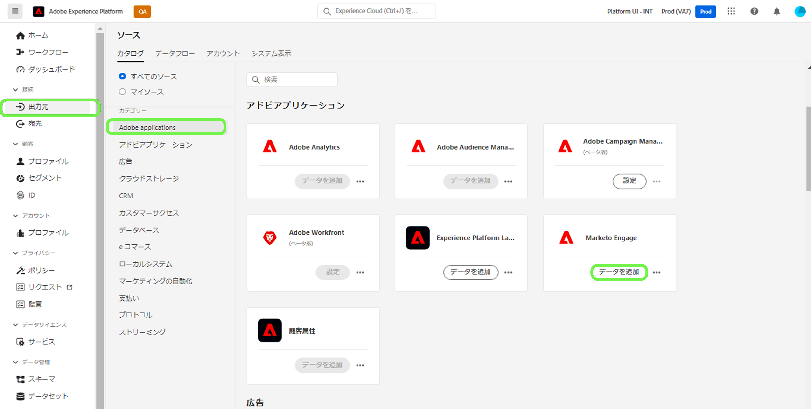
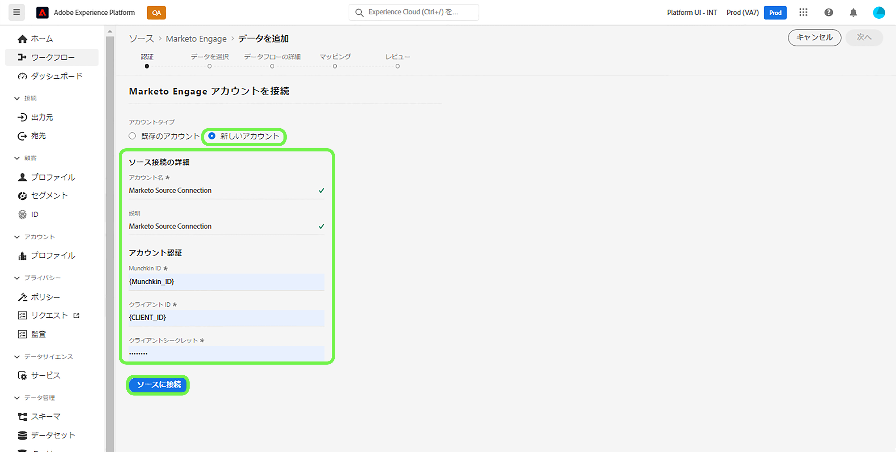
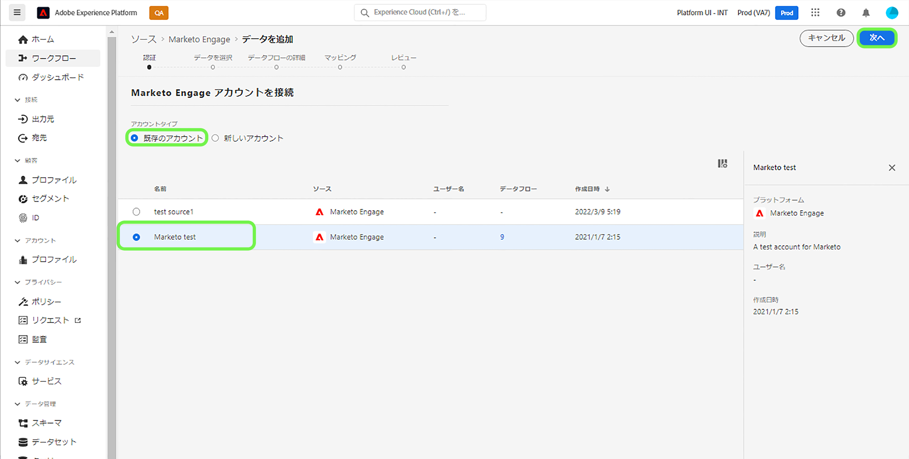
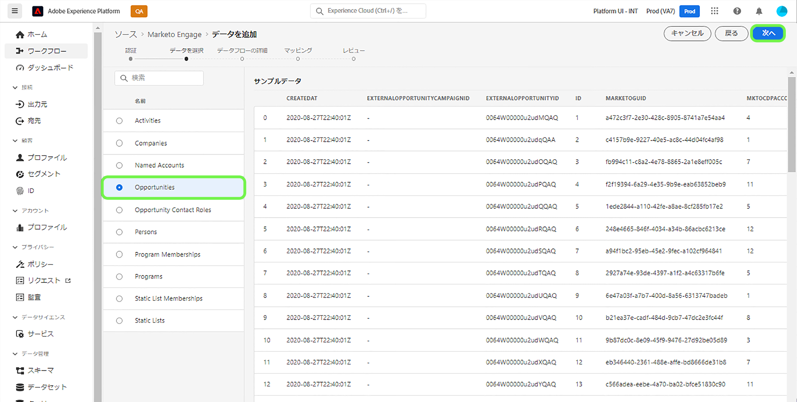
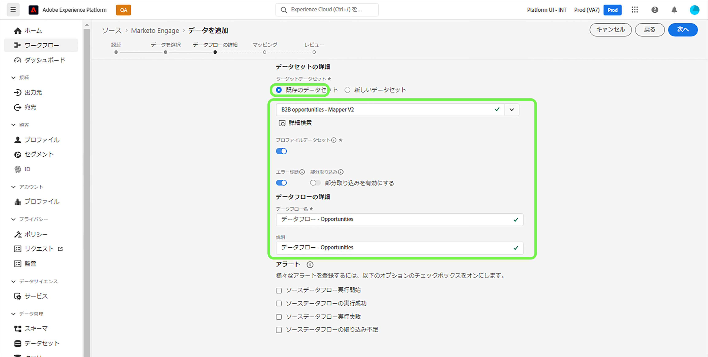
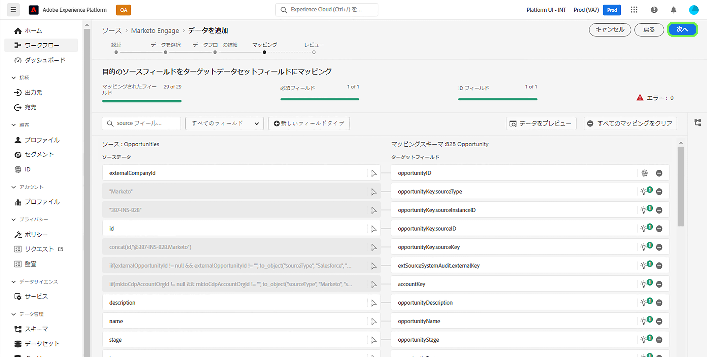
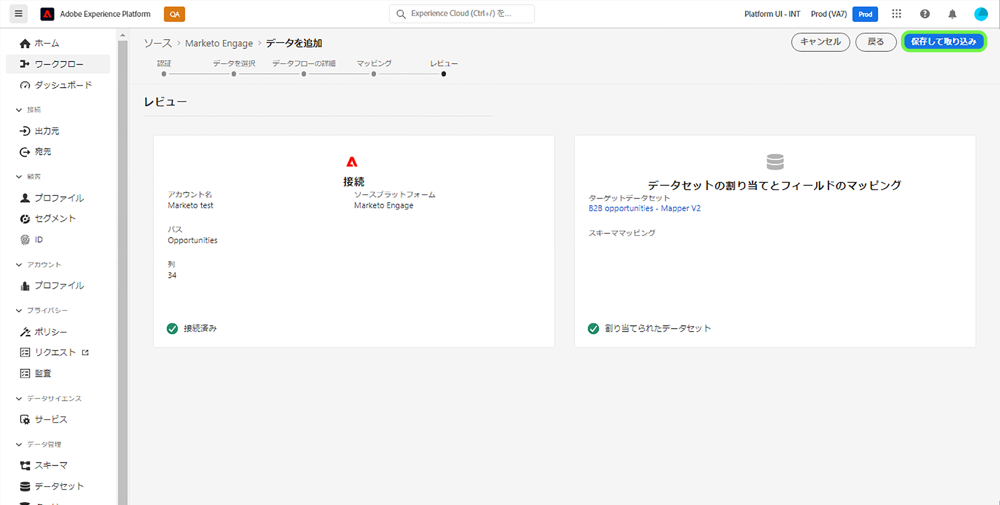

# UI での [!DNL Marketo Engage] ソースコネクタの作成

このチュートリアルでは、B2B データをAdobe Experience Platformに取り込むための UI で [!DNL Marketo Engage]（以下「[!DNL Marketo]」と呼ばれる）ソースコネクタを作成する手順を説明します。

## はじめに

このチュートリアルは、Adobe Experience Platform の次のコンポーネントを実際に利用および理解しているユーザーを対象としています。

* [ソース](../../../../home.md):Experience Platformを使用すると、様々なソースからデータを取り込みながら、Platform サービスを使用して、受信データの構造化、ラベル付け、拡張をおこなうことができます。
* [エクスペリエンスデータモデル (XDM)](../../../../../xdm/home.md):顧客体験データを整理する際に使用する標準化されたExperience Platformフレームワーク。
   * [UI でのスキーマの作成と編集](../../../../../xdm/ui/resources/schemas.md):UI でスキーマを作成および編集する方法について説明します。
* [ID 名前空間](../../../../../identity-service/namespaces.md):ID 名前空間は、ID が関 [!DNL Identity Service] 連するコンテキストのインジケーターとして機能するのコンポーネントです。完全修飾 ID には、ID 値と名前空間が含まれます。
* [[!DNL Real-time Customer Profile]](/help/profile/home.md)：複数のソースからの集計データに基づいて、統合されたリアルタイムの顧客プロファイルを提供します。
* [サンドボックス](../../../../../sandboxes/home.md)：Experience Platform は、単一の Platform インスタンスを別々の仮想環境に分割して、デジタルエクスペリエンスアプリケーションの開発と発展を支援する仮想サンドボックスを提供します。

### 必要な資格情報の収集

Platform の [!DNL Marketo] アカウントにアクセスするには、次の値を指定する必要があります。

| 資格情報 | 説明 |
| ---------- | ----------- |
| `munchkinId` | Munchkin ID は、特定の [!DNL Marketo] インスタンスの一意の識別子です。 |
| `clientId` | [!DNL Marketo] インスタンスの一意のクライアント ID。 |
| `clientSecret` | [!DNL Marketo] インスタンスの一意のクライアント秘密鍵。 |

これらの値の取得について詳しくは、[[!DNL Marketo]  認証ガイド ](../../../../connectors/adobe-applications/marketo/marketo-auth.md) を参照してください。

必要な資格情報を収集したら、次の節の手順に従います。

## [!DNL Marketo] アカウントに接続

プラットフォーム UI で、左のナビゲーションバーから「 **[!UICONTROL ソース]** 」を選択して、「 [!UICONTROL  ソース ] 」ワークスペースにアクセスします。 [!UICONTROL  カタログ ] 画面には、アカウントを作成するための様々なソースが表示されます。

画面の左側にあるカタログから適切なカテゴリを選択できます。 または、検索バーを使用して、作業対象の特定のソースを見つけることもできます。

「[!UICONTROL Adobeアプリケーション ]」カテゴリで、「**[!UICONTROL Marketo Engage]**」を選択します。 次に、「**[!UICONTROL データを追加]**」を選択して、新しい [!DNL Marketo] データフローを作成します。

「**[!UICONTROL Marketo Engageに接続]**」ページが表示されます。 このページでは、新しいアカウントを使用するか、既存のアカウントにアクセスできます。

### 新規アカウント

新しいアカウントを作成する場合は、「**[!UICONTROL 新しいアカウント]**」を選択します。 表示される入力フォームで、アカウント名、オプションの説明、[!DNL Marketo] 認証資格情報を入力します。 終了したら、[**[!UICONTROL ソースに接続]**] を選択し、新しい接続が確立されるまでしばらく時間をかけます。

### 既存のアカウント

既存のアカウントでデータフローを作成するには、「**[!UICONTROL 既存のアカウント]**」を選択し、使用する [!DNL Marketo] アカウントを選択します。 「**[!UICONTROL 次へ]**」を選択して次に進みます。

## データセットの選択

[!DNL Marketo] アカウントを作成した後、次の手順で [!DNL Marketo] データセットを調べるためのインターフェイスを提供します。

インターフェイスの左半分はディレクトリブラウザーで、10 個の [!DNL Marketo] データセットが表示されています。 完全に機能する [!DNL Marketo] ソース接続には、9 つの異なるデータセットを取り込む必要があります。 [!DNL Marketo] アカウントベースマーケティング (ABM) 機能も使用している場合は、[!UICONTROL  名前付きアカウント ] データセットを取り込む 10 番目のデータフローも作成する必要があります。

>[!NOTE]
>
>簡潔にするため、次のチュートリアルでは、[!UICONTROL  名前付きアカウント ] を例として使用しますが、以下の手順は 10 個の [!DNL Marketo] データセットのいずれかに適用されます。

最初に取り込むデータセットを選択し、次に **[!UICONTROL 「次へ]**」を選択します。

## [!DNL Marketo] スキーマをプラットフォームにマッピング

[!UICONTROL  マッピング ] 手順が表示され、[!DNL Marketo] スキーマを Platform にマッピングするためのインターフェイスが表示されます。

取り込む受信データのデータセットを選択します。 既存のデータセットを使用するか、新しいデータセットを作成できます。

### 既存のデータセットを使用する

データを既存のデータセットに取り込むには、**[!UICONTROL 既存のデータセット]** を選択し、データセットのアイコンを選択します。

**[!UICONTROL データセットの選択]** ダイアログが表示されます。 使用する適切なスキーマを持つデータセットを見つけ、選択して、**[!UICONTROL 確認]** を選択します。

### 新しいデータセットの使用

データを新しいデータセットに取り込むには、**[!UICONTROL New dataset]** を選択し、指定したフィールドにデータセットの名前と説明を入力します。

**[!UICONTROL スキーマを選択]** 検索バーにスキーマの名前を入力して、スキーマを検索できます。 ドロップダウンアイコンを選択して、既存のスキーマのリストを表示することもできます。 または、「**[!UICONTROL 詳細検索]**」を選択して、既存のスキーマのページにアクセスし、それぞれの詳細を含めることができます。

「**[!UICONTROL プロファイルデータセット]**」ボタンを切り替えて、[!DNL Profile] のターゲットデータセットを有効にし、エンティティの属性と動作の全体像を作成できます。 [!DNL Profile] が有効なすべてのデータセットのデータは [!DNL Profile] に含まれ、データフローを保存する際に変更が適用されます。

スキーマを選択したら、下にスクロールしてマッピングダイアログを表示し、[!DNL Marketo] データセットフィールドの適切なターゲット XDM フィールドへのマッピングを開始します。

### [!DNL Marketo] データセットソースフィールドをターゲット XDM フィールドにマッピングする

各 [!DNL Marketo] データセットには、従うべき固有のマッピングルールがあります。 [!DNL Marketo] データセットを XDM にマッピングする方法の詳細については、次を参照してください。

* [アクティビティ](../../../../connectors/adobe-applications/mapping/marketo.md#activities)
* [プログラム](../../../../connectors/adobe-applications/mapping/marketo.md#programs)
* [プログラムのメンバーシップ](../../../../connectors/adobe-applications/mapping/marketo.md#program-memberships)
* [会社](../../../../connectors/adobe-applications/mapping/marketo.md#companies)
* [静的リスト](../../../../connectors/adobe-applications/mapping/marketo.md#static-lists)
* [静的リストのメンバーシップ](../../../../connectors/adobe-applications/mapping/marketo.md#static-list-memberships)
* [名前付きアカウント](../../../../connectors/adobe-applications/mapping/marketo.md#named-accounts)
* [機会](../../../../connectors/adobe-applications/mapping/marketo.md#opportunities)
* [商談の連絡先の役割](../../../../connectors/adobe-applications/mapping/marketo.md#opportunity-contact-roles)
* [人](../../../../connectors/adobe-applications/mapping/marketo.md#persons)

「**[!UICONTROL データのプレビュー]**」を選択して、選択したデータセットに基づいてマッピング結果を表示します。

「[!UICONTROL  プレビュー ]」ポップオーバーには、選択したデータセットから最大 100 行のサンプルデータのマッピング結果を調べるためのインターフェイスが用意されています。

ソースフィールドが適切なターゲットフィールドにマッピングされたら、「**[!UICONTROL 閉じる]**」を選択します。

## データフローの詳細の入力

[!UICONTROL  データフローの詳細 ] 手順が表示され、新しいデータフローに関する名前と簡単な説明を指定できます。

「 **[!UICONTROL エラー診断]** 」切り替えを有効にして、新しく取り込んだバッチに関する詳細なエラーメッセージの生成を許可します。このメッセージは API を使用してダウンロードできます。 詳しくは、[ データ取得エラー診断の取得 ](../../../../../ingestion/quality/error-diagnostics.md) に関するチュートリアルを参照してください。

[!DNL Marketo] コネクタは、バッチ取り込みを使用してすべての履歴レコードを取り込み、リアルタイム更新のストリーミング取り込みを使用します。 これにより、誤ったレコードを取り込みながら、コネクタのストリーミングを続行できます。 「**[!UICONTROL 部分取得]**」切り替えを有効にし、「[!UICONTROL  エラーしきい値%]」を最大値に設定して、データフローが失敗するのを防ぎます。

**[!UICONTROL 部分取]** り込みでは、エラーを含むデータを特定のしきい値まで取り込むことができます。詳しくは、「[ バッチ取得の部分の概要 ](../../../../../ingestion/batch-ingestion/partial.md)」を参照してください。

データフローの詳細を指定し、エラーしきい値を max に設定したら、「**[!UICONTROL 次へ]**」を選択します。

## データフローの確認

「**[!UICONTROL レビュー]**」手順が表示され、新しいデータフローを作成前に確認できます。 詳細は、次のカテゴリに分類されます。

* **[!UICONTROL 接続]**:ソースの種類、選択したソースエンティティの関連パス、およびそのソースエンティティ内の列の数を表示します。
* **[!UICONTROL データセットとマップのフィールドの割り当て]**:データセットが準拠するスキーマなど、ソースデータの取り込み先のデータセットを示します。

データフローをレビューしたら、「**[!UICONTROL Finish]**」を選択し、データフローの作成に時間を割きます。

## データフローの監視

データフローを作成したら、データフローを介して取り込まれるデータを監視して、取り込み率、成功、エラーに関する情報を確認できます。 データフローの監視方法の詳細については、](../../../../../dataflows/ui/monitor-sources.md)UI での [ データフローの監視に関するチュートリアルを参照してください。

## 属性の削除

データセット内のカスタム属性を遡って非表示にしたり削除したりすることはできません。 既存のデータセットからカスタム属性を非表示または削除する場合は、このカスタム属性を持たない新しいデータセットと新しい XDM スキーマを作成し、作成する新しいデータセット用に新しいデータフローを設定する必要があります。 また、非表示または削除するカスタム属性を持つデータセットで構成される元のデータフローを無効または削除する必要があります。

## データフローの削除

不要になったデータフローや誤って作成されたデータフローは、[!UICONTROL Dataflows] ワークスペースの **[!UICONTROL Delete]** 関数を使用して削除できます。 データフローの削除方法の詳細については、[UI でのデータフローの削除 ](../../delete.md) に関するチュートリアルを参照してください。

## 次の手順

このチュートリアルに従って、[!DNL Marketo] データを取り込むデータフローを正常に作成しました。 受信データは、[!DNL Real-time Customer Profile] や [!DNL Data Science Workspace] など、ダウンストリームの Platform サービスで使用できるようになりました。 詳しくは、次のドキュメントを参照してください。

* [[!DNL Real-time Customer Profile] の概要](/help/profile/home.md)
* [[!DNL Data Science Workspace] の概要](/help/data-science-workspace/home.md)
