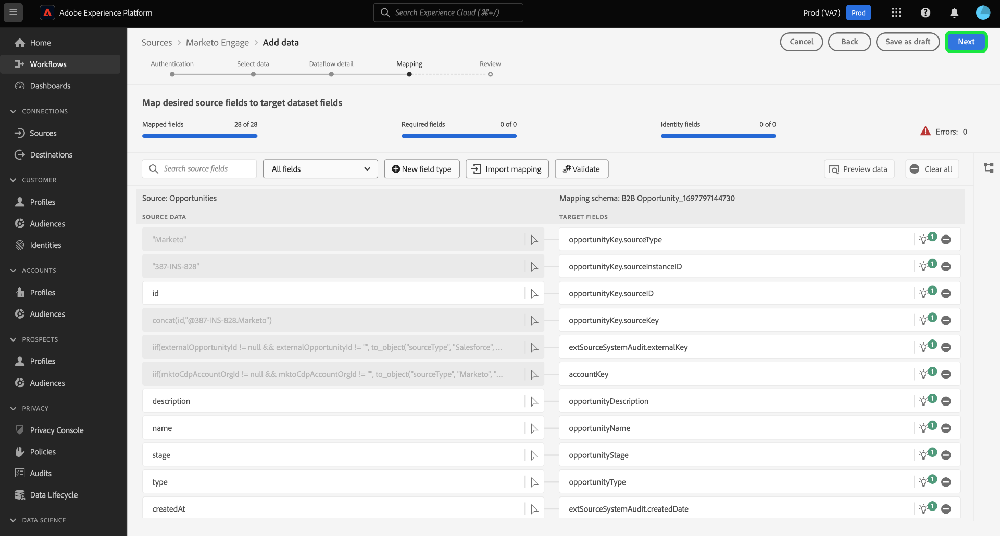

# UI での [!DNL Marketo Engage] ソースコネクタの作成

>[!IMPORTANT]
>
>を作成する前に [!DNL Marketo Engage] ソース接続とデータフローの場合は、まず [Adobe IMS組織 ID をマッピング済み](https://experienceleague.adobe.com/docs/marketo/using/product-docs/core-marketo-concepts/miscellaneous/set-up-adobe-organization-mapping.html?lang=en) in [!DNL Marketo]. さらに、 [自動入力 [!DNL Marketo] B2B 名前空間とスキーマ](../../../../connectors/adobe-applications/marketo/marketo-namespaces.md) ソース接続とデータフローを作成する前に、次の手順を実行します。

このチュートリアルでは、UI で [!DNL Marketo Engage]（以下「[!DNL Marketo]」）ソースコネクタを作成し、B2B データを Adobe Experience Platform に取り込む手順について説明します。

## はじめに

このチュートリアルは、Adobe Experience Platform の次のコンポーネントを実際に利用および理解しているユーザーを対象としています。

* [B2B 名前空間とスキーマ自動生成ユーティリティ](../../../../connectors/adobe-applications/marketo/marketo-namespaces.md):B2B 名前空間とスキーマ自動生成ユーティリティを使用すると、 [!DNL Postman] を使用して、B2B 名前空間とスキーマの値を自動生成します。 B2B 名前空間とスキーマを作成する前に、まず B2B 名前空間とスキーマに入力する必要があります [!DNL Marketo] ソース接続とデータフロー。
* [ソース](../../../../home.md)：Experience Platform を使用すると、データを様々なソースから取得しながら、Platform サービスを使用して受信データの構造化、ラベル付け、拡張を行うことができます。
* [Experience Data Model（XDM）](../../../../../xdm/home.md)：Adobe Experience Platform が顧客体験データの整理に使用する標準化されたフレームワーク。
   * [UI でのスキーマの作成と編集](../../../../../xdm/ui/resources/schemas.md)：UI でスキーマを作成および編集する方法について説明します。
* [ID 名前空間](../../../../../identity-service/namespaces.md)：ID 名前空間は [!DNL Identity Service] のコンポーネントで、ID の関連先コンテキストのインジケーターとして機能します。完全修飾 ID には、ID 値と名前空間が含まれます。
* [[!DNL Real-Time Customer Profile]](/help/profile/home.md)：複数のソースからの集計データに基づいて、統合されたリアルタイムの顧客プロファイルを提供します。
* [サンドボックス](../../../../../sandboxes/home.md)：Experience Platform は、単一の Platform インスタンスを個別の仮想環境に分割する仮想サンドボックスを提供し、デジタル体験アプリケーションの開発および進化を支援します。

### 必要な認証情報の収集

Platform で [!DNL Marketo] アカウントにアクセスするには、次の値を指定する必要があります。

| 資格情報 | 説明 |
| ---------- | ----------- |
| `munchkinId` | Munchkin ID は、特定の [!DNL Marketo] インスタンスの一意の ID です。 |
| `clientId` | [!DNL Marketo] インスタンスの一意のクライアント ID。 |
| `clientSecret` | [!DNL Marketo] インスタンスの一意のクライアント秘密鍵。 |

これらの値の取得について詳しくは、[[!DNL Marketo] 認証ガイド](../../../../connectors/adobe-applications/marketo/marketo-auth.md)を参照してください。

必要な資格情報を収集したら、次の節の手順に従います。

## [!DNL Marketo] アカウントの接続

Platform の UI で、左側のナビゲーションバーで「**[!UICONTROL Sources]**」を選択し、[!UICONTROL Sources ]のワークスペースにアクセスします。[!UICONTROL カタログ]画面には、アカウントを作成できる様々なソースが表示されます。

画面の左側にあるカタログから適切なカテゴリを選択することができます。または、検索バーを使用して、利用したい特定のソースを見つけることもできます。

[!UICONTROL アドビアプリケーション]カテゴリ内で「**[!UICONTROL Marketo Engage]**」を選択します。次に「**[!UICONTROL データの追加]**」を選択して、新しい [!DNL Marketo] データフローを作成します。

**[!UICONTROL Marketo Engage アカウントの接続]**&#x200B;ページが表示されます。このページでは、新しいアカウントを使用するか、既存のアカウントにアクセスできます。

### 既存のアカウント

既存のアカウントでデータフローを作成するには、「**[!UICONTROL 既存のアカウント]**」を選択して、使用したい [!DNL Marketo] アカウントを選択します。「**[!UICONTROL 次へ]**」を選択して次に進みます。

### 新しいアカウント

新しいアカウントを作成する場合は、「**[!UICONTROL 新しいアカウント]**」を選択します。表示される入力フォームで、アカウント名、説明（オプション）、[!DNL Marketo] の認証資格情報を入力します。完了したら、「 **[!UICONTROL ソースへ接続]**」を選択し、新しい接続が確立されるまでしばらく待ちます。

## データセットの選択

[!DNL Marketo] アカウントを作成したら、次の手順では [!DNL Marketo] のデータセットを調べるためのインターフェースを利用できます。

インターフェイスの左半分はディレクトリブラウザーで、[!DNL Marketo] データセットが 10 種類表示されています。[!DNL Marketo] ソース接続を完全に機能させるには、9 種類の異なるデータセットを取り込む必要があります。また、 [!DNL Marketo] Account-Based Marketing（ABM）機能を使用する場合は、10 個目のデータフローを作成して[!UICONTROL 指定顧客]のデータセットを取り込む必要があります。

>[!NOTE]
>
>説明を簡潔にするために、以降のチュートリアルでは[!UICONTROL 商談]を例として使用しますが、以下で説明する手順は 10 種類の [!DNL Marketo] データセットのいずれにも該当します。

最初に取り込むデータセットを選択したら「**[!UICONTROL 次へ]**」を選択します。

## データフローの詳細を入力

[!UICONTROL データフロー詳細]ページでは、既存のデータセットと新しいデータセットのどちらを使用するかを選択できます。このプロセスでは、[!UICONTROL プロファイルデータセット]、[!UICONTROL エラー診断]、[!UICONTROL 部分取り込み]、および[!UICONTROL アラート]の設定も指定できます。

### 既存のデータセットを使用する

データを既存のデータセットに取り込むには、**[!UICONTROL 既存のデータセット]**&#x200B;を選択します。「[!UICONTROL 詳細検索]」オプションを使用するか、ドロップダウンメニューで既存のデータセットのリストをスクロールすると、既存のデータセットを取得できます。データセットを選択したら、データフローの名前と説明を入力します。

### 新しいデータセットの使用

データを新しいデータセットに取り込むには、「**[!UICONTROL 新しいデータセット]**」を選択して、出力データセット名とオプションの説明を入力します。次に、「[!UICONTROL 詳細検索]」オプションを使用するか、ドロップダウンメニューで既存のスキーマのリストをスクロールして、マッピングするスキーマを選択します。スキーマを選択したら、データフローの名前と説明を指定します。

### [!DNL Profile] とエラー診断の有効化

次に、 **[!UICONTROL プロファイルデータセット]**&#x200B;切り替えスイッチを選択して、[!DNL Profile] のデータセットを有効にします。これにより、エンティティの属性と動作の全体像を把握できます。[!DNL Profile] が有効化されたすべてのデータセットのデータは [!DNL Profile] に含まれ、変更はデータフローを保存するときに適用されます。

[!UICONTROL エラー診断]は、データフローで発生するエラーレコードに対して、詳細なエラーメッセージ生成を有効にします。[!UICONTROL 部分取り込み]では、手動で定義した特定のしきい値に到達するまで、エラーを含むデータを取り込むことができます。詳しくは、[バッチ取り込みの概要](../../../../../ingestion/batch-ingestion/partial.md)を参照してください。

>[!IMPORTANT]
>
>[!DNL Marketo] コネクタは、バッチ取り込みを使用して過去のすべてのレコードを取り込み、ストリーミング取り込みを使用してリアルタイムに更新を行います。これにより、誤りのあるレコードを取り込みながら、コネクタのストリーミングを続行できます。**[!UICONTROL 部分取り込み]**&#x200B;切り替えスイッチを有効化して、[!UICONTROL エラーしきい値 %] を最大にし、データフローが失敗するのを防ぎます。

### アラートの有効化

アラートを有効にすると、データフローのステータスに関する通知を受け取ることができます。リストからアラートを選択して、データフローのステータスに関する通知を受け取るよう登録します。アラートについて詳しくは、[UI を使用したソースアラートの購読](../../alerts.md)についてのガイドを参照してください。

データフローへの詳細の入力を終えたら「**[!UICONTROL 次へ]** 」を選択します。

## [!DNL Marketo] データセットのソースフィールドをターゲットの XDM フィールドにマッピング

[!UICONTROL マッピング]手順が表示され、ソーススキーマのソースフィールドを、ターゲットスキーマの適切なターゲット XDM フィールドにマッピングするためのインターフェイスが提供されます。

各 [!DNL Marketo] データセットには、従うべき固有のマッピングルールがあります。[!DNL Marketo] データセットを XDM にマッピングする方法について詳しくは、次を参照してください。

* [アクティビティ](../../../../connectors/adobe-applications/mapping/marketo.md#activities)
* [プログラム](../../../../connectors/adobe-applications/mapping/marketo.md#programs)
* [プログラムのメンバーシップ](../../../../connectors/adobe-applications/mapping/marketo.md#program-memberships)
* [会社](../../../../connectors/adobe-applications/mapping/marketo.md#companies)
* [静的リスト](../../../../connectors/adobe-applications/mapping/marketo.md#static-lists)
* [静的リストのメンバーシップ](../../../../connectors/adobe-applications/mapping/marketo.md#static-list-memberships)
* [指定顧客](../../../../connectors/adobe-applications/mapping/marketo.md#named-accounts)
* [商談](../../../../connectors/adobe-applications/mapping/marketo.md#opportunities)
* [商談連絡先の役割](../../../../connectors/adobe-applications/mapping/marketo.md#opportunity-contact-roles)
* [人物](../../../../connectors/adobe-applications/mapping/marketo.md#persons)

必要に応じて、フィールドを直接マッピングするか、データ準備機能を使用してソースデータを変換して計算値を導き出すかを選択できます。マッピングインターフェイスの使用に関する包括的な手順については、[データ準備 UI ガイド](../../../../../data-prep/ui/mapping.md)を参照してください。

マッピングセットの準備が整ったら「 **[!UICONTROL 次へ]**」を選択し、新しいデータフローが作成されるまでしばらく待ちます。

## データフローのレビュー

**[!UICONTROL レビュー]**&#x200B;手順が表示され、新しいデータフローを作成する前に確認できます。詳細は、次のカテゴリに分類されます。

* **[!UICONTROL 接続]**：ソースのタイプ、選択したソースエンティティの関連パス、およびそのソースエンティティ内の列の数を表示します。
* **[!UICONTROL データセットの割り当てとフィールドのマッピング]**：ソースデータがどのデータセットに取り込まれるかを、そのデータセットが準拠するスキーマを含めて表示します。

データフローをレビューしたら、「**[!UICONTROL 保存して取り込み]**」を選択し、データフローが作成されるまでしばらく待ちます。

## データフローの監視

データフローを作成したら、そのデータフローを通じて取り込まれるデータをモニターすると、取り込み速度、成功、エラーに関する情報を確認できます。データフローのモニター方法について詳しくは、[UI でのデータフローのモニタリング](../../../../../dataflows/ui/monitor-sources.md)を参照してください。

## 属性の削除

データセット内のカスタム属性は、過去にさかのぼって非表示にしたり削除したりすることはできません。既存のデータセットのカスタム属性を非表示または削除する場合は、そのカスタム属性がない新しいデータセットと、新しい XDM スキーマを作成し、作成した新しいデータセット用に新しいデータフローを構成する必要があります。また、非表示または削除するカスタム属性があるデータセットを含む、元のデータフローを無効または削除する必要があります。

## データフローの削除

不要になったデータフローや誤って作成されたデータフローは、[!UICONTROL データフロー]ワークスペース内にある&#x200B;**[!UICONTROL 削除]**&#x200B;機能で削除できます。データフローの削除方法について詳しくは、[UI でのデータフローの削除](../../delete.md)のチュートリアルを参照してください。

## 次の手順

このチュートリアルでは、[!DNL Marketo] データを取り込むためのデータフローを正常に作成しました。これで、[!DNL Real-Time Customer Profile] や [!DNL Data Science Workspace] などのダウンストリームの Platform サービスで受信データを使用できるようになりました。詳しくは、次のドキュメントを参照してください。

* [[!DNL Real-Time Customer Profile] 概要](/help/profile/home.md)
* [[!DNL Data Science Workspace] 概要](/help/data-science-workspace/home.md)
