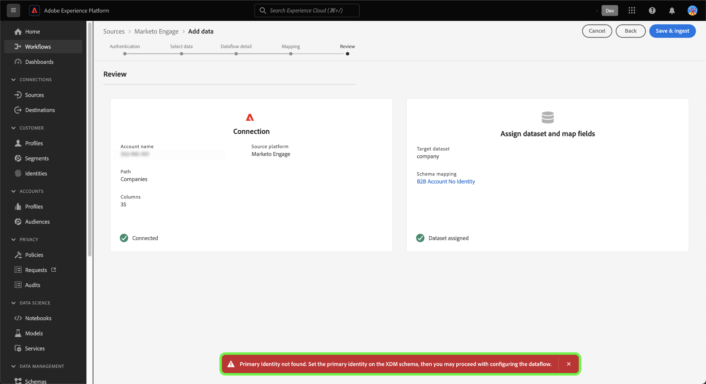

# を作成 [!DNL Marketo Engage] ui のソース接続とデータフロー

>[!IMPORTANT]
>
>の作成前に [!DNL Marketo Engage] ソース接続とデータフローは、最初に以下が揃っていることを確認する必要があります [Adobe組織 ID をマッピング済み](https://experienceleague.adobe.com/docs/marketo/using/product-docs/core-marketo-concepts/miscellaneous/set-up-adobe-organization-mapping.html) 。対象： [!DNL Marketo]. さらに、次の手順を完了することも必要です [の自動入力 [!DNL Marketo] B2B 名前空間とスキーマ](../../../../connectors/adobe-applications/marketo/marketo-namespaces.md) ソース接続とデータフローを作成する前に行います。

このチュートリアルでは、UI で [!DNL Marketo Engage]（以下「[!DNL Marketo]」）ソースコネクタを作成し、B2B データを Adobe Experience Platform に取り込む手順について説明します。

## 基本を学ぶ

このチュートリアルは、Adobe Experience Platform の次のコンポーネントを実際に利用および理解しているユーザーを対象としています。

* [B2B 名前空間とスキーマ自動生成ユーティリティ](../../../../connectors/adobe-applications/marketo/marketo-namespaces.md):B2B 名前空間とスキーマ自動生成ユーティリティを使用すると、次のことを使用できます [!DNL Postman] b2B 名前空間とスキーマの値を自動生成します。 を作成する前に、まず B2B 名前空間とスキーマを完了する必要があります [!DNL Marketo] ソース接続とデータフロー。
* [ソース](../../../../home.md)：Experience Platform を使用すると、データを様々なソースから取得しながら、Platform サービスを使用して受信データの構造化、ラベル付け、拡張を行うことができます。
* [Experience Data Model（XDM）](../../../../../xdm/home.md)：Adobe Experience Platform が顧客体験データの整理に使用する標準化されたフレームワーク。
   * [UI でのスキーマの作成と編集](../../../../../xdm/ui/resources/schemas.md)：UI でスキーマを作成および編集する方法について説明します。
* [ID 名前空間](../../../../../identity-service/features/namespaces.md)：ID 名前空間は [!DNL Identity Service] のコンポーネントで、ID の関連先コンテキストのインジケーターとして機能します。完全修飾 ID には、ID 値と名前空間が含まれます。
* [[!DNL Real-Time Customer Profile]](/help/profile/home.md)：複数のソースからの集計データに基づいて、統合されたリアルタイムの顧客プロファイルを提供します。
* [サンドボックス](../../../../../sandboxes/home.md)：Experience Platform は、単一の Platform インスタンスを個別の仮想環境に分割する仮想サンドボックスを提供し、デジタル体験アプリケーションの開発および進化を支援します。

### 必要な資格情報の収集

にアクセスするには [!DNL Marketo] Experience Platform時にアカウント。次の値を指定する必要があります。

| 資格情報 | 説明 |
| ---- | ---- |
| `munchkinId` | Munchkin ID は、特定の [!DNL Marketo] インスタンスの一意の ID です。 |
| `clientId` | [!DNL Marketo] インスタンスの一意のクライアント ID。 |
| `clientSecret` | [!DNL Marketo] インスタンスの一意のクライアント秘密鍵。 |

これらの値の取得について詳しくは、[[!DNL Marketo] 認証ガイド](../../../../connectors/adobe-applications/marketo/marketo-auth.md)を参照してください。

必要な資格情報を収集したら、次の節の手順に従います。

## [!DNL Marketo] アカウントの接続

Platform UI の左側のナビゲーションバーで「**[!UICONTROL ソース]**」を選択して、[!UICONTROL ソース]ワークスペースにアクセスします。画面の左側にあるカタログから適切なカテゴリを選択することができます。または、使用する特定のソースを検索オプションを使用して探すこともできます。

の下 *Adobeアプリケーション* カテゴリ、選択 **[!UICONTROL Marketo Engage]**&#x200B;を選択してから、 **[!UICONTROL データを追加]**.

>[!TIP]
>
>ソースカタログ内のソースには、 **[!UICONTROL の設定]** 特定のソースがまだ認証済みアカウントを持っていない場合のオプション。 認証済みアカウントが存在すると、このオプションはに変更されます。 **[!UICONTROL データを追加]**.

**[!UICONTROL Marketo Engage アカウントの接続]**&#x200B;ページが表示されます。このページでは、新しいアカウントを使用するか、既存のアカウントにアクセスできます。

>[!BEGINTABS]

>[!TAB 新しいアカウントを作成]

新しいアカウントを作成するには、を選択します **[!UICONTROL 新しいアカウント]** に加えて、名前、説明（オプション）、の認証情報を指定します。

終了したら「**[!UICONTROL ソースに接続]**」を選択し、新しい接続が確立されるまでしばらく待ちます。

>[!TAB 既存のアカウントを使用]

既存のアカウントを使用するには、を選択します **[!UICONTROL 既存のアカウント]** 次に、既存のアカウントカタログから使用するアカウントを選択します。

「**[!UICONTROL 次へ]**」を選択して次に進みます。

>[!ENDTABS]

## データセットの選択

[!DNL Marketo] アカウントを作成したら、次の手順では [!DNL Marketo] のデータセットを調べるためのインターフェースを利用できます。

インターフェイスの左半分はディレクトリブラウザーで、[!DNL Marketo] データセットが 10 種類表示されています。[!DNL Marketo] ソース接続を完全に機能させるには、9 種類の異なるデータセットを取り込む必要があります。また、 [!DNL Marketo] Account-Based Marketing（ABM）機能を使用する場合は、10 個目のデータフローを作成して[!UICONTROL 指定顧客]のデータセットを取り込む必要があります。

>[!NOTE]
>
>説明を簡潔にするために、以降のチュートリアルでは[!UICONTROL 商談]を例として使用しますが、以下で説明する手順は 10 種類の [!DNL Marketo] データセットのいずれにも該当します。

取得するデータセットを選択します。 これにより、インターフェイスが更新され、データセットのプレビューが表示されます。 終了したら、「**[!UICONTROL 次へ]**」を選択します。

## データセットとデータフローの詳細の指定 {#provide-dataset-and-dataflow-details}

次に、データセットとデータフローに関する情報を指定する必要があります。

### データセットの詳細 {#dataset-details}

データセットは、スキーマ（列）とフィールド（行）で構成されるデータコレクション（通常はテーブル）を格納し管理するための構造です。Experience Platformに正常に取り込まれたデータは、データセットとしてデータレイク内に保存されます。 この手順では、新しいデータセットを作成するか、既存のデータセットを使用します。

>[!BEGINTABS]

>[!TAB 新しいデータセットを使用]

新しいデータセットを使用するには、以下を選択します。 **[!UICONTROL 新しいデータセット]** 次に、データセットの名前と説明（オプション）を入力します。 また、データセットが準拠するエクスペリエンスデータモデル（XDM）スキーマを選択する必要があります。

>[!TAB 既存のデータセットを使用する]

既存のデータセットがある場合は、 **[!UICONTROL 既存のデータセット]** 次に、 **[!UICONTROL 詳細検索]** リアルタイム顧客プロファイルへの取り込みが有効かどうかなど、組織内のすべてのデータセットのそれぞれの詳細を含むウィンドウを表示するオプション。

>[!ENDTABS]

### データフロー設定 {#dataflow-configurations}

>[!IMPORTANT]
>
>この [!DNL Marketo] ソースでは、バッチ取り込みを使用して過去のすべてのレコードを取り込み、ストリーミング取り込みを使用してリアルタイムに更新を行います。 これにより、誤りのあるレコードを取り込みながら、ソースのストリーミングを続行できます。 **[!UICONTROL 部分取り込み]**&#x200B;切り替えスイッチを有効化して、[!UICONTROL エラーしきい値 %] を最大にし、データフローが失敗するのを防ぎます。

リアルタイム顧客プロファイルに対してデータセットが有効になっている場合は、この手順の間に切り替えることができます **[!UICONTROL プロファイルデータセット]** でプロファイル取り込み用のデータを有効にします。 また、この手順を使用してを有効にすることもできます **[!UICONTROL エラー診断]** および **[!UICONTROL 部分取り込み]**.

* **[!UICONTROL エラー診断]**：を選択 **[!UICONTROL エラー診断]** データセットアクティビティとデータフローステータスを監視する際に後で参照できるエラー診断を生成するようにソースに指示する。
* **[!UICONTROL 部分取り込み]**: [部分バッチ取り込み](../../../../../ingestion/batch-ingestion/partial.md) は、設定可能な特定のしきい値まで、エラーを含むデータを取り込む機能です。 この機能を使用すると、正確なデータをすべてExperience Platformに正常に取り込みながら、不正なデータがすべて無効な理由に関する情報と共に個別にバッチ処理されます。

この手順の間に、を有効にできます **[!UICONTROL サンプルデータフロー]** データの取り込みを制限し、人物 ID を含むすべての履歴データの取り込みに伴う追加コストを回避します。

>[!BEGINSHADEBOX]

**サンプルデータフローの使用に関するクイックガイド**

サンプルデータフローは、次の目的で設定できます [!DNL Marketo] データフローを使用して取り込みレートを制限してから、大量のデータを取り込まずにExperience Platform機能を試します。

* サンプルデータフローを有効にして、最大 100,000 件（最大レコード ID から）のレコードまたはバックフィルジョブ中の最後の 10 日間のアクティビティを取り込むことで、履歴データを制限します。
* すべての B2B エンティティにサンプルデータフロー設定を使用する場合、ソースデータの履歴全体が取り込まれないので、関連するレコードの一部が欠落している可能性があることを考慮する必要があります。

>[!ENDSHADEBOX]

さらに、会社データセットからデータを取り込む場合は、を有効にできます **[!UICONTROL 未要求アカウントの除外]** 未要求アカウントを取り込みから除外します。

個人がフォームに入力する場合、 [!DNL Marketo] 他のデータを含まない会社名に基づいて、幻のアカウントレコードを作成します。 新しいデータフローの場合、未要求アカウントを除外する切替スイッチはデフォルトで有効になっています。 既存のデータフローの場合、この機能を有効または無効にして、既存のデータではなく、新しく取り込んだデータに変更を適用できます。

## [!DNL Marketo] データセットのソースフィールドをターゲットの XDM フィールドにマッピング

[!UICONTROL マッピング]手順が表示され、ソーススキーマのソースフィールドを、ターゲットスキーマの適切なターゲット XDM フィールドにマッピングするためのインターフェイスが提供されます。

各 [!DNL Marketo] データセットには、従うべき固有のマッピングルールがあります。[!DNL Marketo] データセットを XDM にマッピングする方法について詳しくは、次を参照してください。

* [アクティビティ](../../../../connectors/adobe-applications/mapping/marketo.md#activities)
* [プログラム](../../../../connectors/adobe-applications/mapping/marketo.md#programs)
* [プログラムのメンバーシップ](../../../../connectors/adobe-applications/mapping/marketo.md#program-memberships)
* [会社](../../../../connectors/adobe-applications/mapping/marketo.md#companies)
* [静的リスト](../../../../connectors/adobe-applications/mapping/marketo.md#static-lists)
* [静的リストのメンバーシップ](../../../../connectors/adobe-applications/mapping/marketo.md#static-list-memberships)
* [指定顧客](../../../../connectors/adobe-applications/mapping/marketo.md#named-accounts)
* [商談](../../../../connectors/adobe-applications/mapping/marketo.md#opportunities)
* [商談連絡先の役割](../../../../connectors/adobe-applications/mapping/marketo.md#opportunity-contact-roles)
* [人物](../../../../connectors/adobe-applications/mapping/marketo.md#persons)

必要に応じて、フィールドを直接マッピングするか、データ準備機能を使用してソースデータを変換して計算値を導き出すかを選択できます。マッピングインターフェイスの使用に関する包括的な手順については、[データ準備 UI ガイド](../../../../../data-prep/ui/mapping.md)を参照してください。

マッピングセットの準備が整ったら「 **[!UICONTROL 次へ]**」を選択し、新しいデータフローが作成されるまでしばらく待ちます。

## データフローのレビュー

**[!UICONTROL レビュー]**&#x200B;手順が表示され、新しいデータフローを作成する前に確認できます。詳細は、次のカテゴリに分類されます。

* **[!UICONTROL 接続]**：ソースのタイプ、選択したソースエンティティの関連パス、およびそのソースエンティティ内の列の数を表示します。
* **[!UICONTROL データセットの割り当てとフィールドのマッピング]**：ソースデータがどのデータセットに取り込まれるかを、そのデータセットが準拠するスキーマを含めて表示します。

データフローをレビューしたら、「**[!UICONTROL 保存して取り込み]**」を選択し、データフローが作成されるまでしばらく待ちます。

## データフローの監視

データフローを作成したら、そのデータフローを通じて取り込まれるデータをモニターすると、取り込み速度、成功、エラーに関する情報を確認できます。データフローのモニター方法について詳しくは、[UI でのデータフローのモニタリング](../../../../../dataflows/ui/monitor-sources.md)を参照してください。

## 属性の削除

データセット内のカスタム属性は、過去にさかのぼって非表示にしたり削除したりすることはできません。既存のデータセットのカスタム属性を非表示または削除する場合は、そのカスタム属性がない新しいデータセットと、新しい XDM スキーマを作成し、作成した新しいデータセット用に新しいデータフローを構成する必要があります。また、非表示または削除するカスタム属性があるデータセットを含む、元のデータフローを無効または削除する必要があります。

## データフローの削除

不要になったデータフローや誤って作成されたデータフローは、[!UICONTROL データフロー]ワークスペース内にある&#x200B;**[!UICONTROL 削除]**&#x200B;機能で削除できます。データフローの削除方法について詳しくは、[UI でのデータフローの削除](../../delete.md)のチュートリアルを参照してください。

## 次の手順

このチュートリアルでは、から B2B データを取り込むデータフローを正常に作成しました [!DNL Marketo Engage] ソースからExperience Platform。

## 付録 {#appendix}

以下の節では、 [!DNL Marketo] ソース。

### UI のエラーメッセージ {#error-messages}

Platform が設定の問題を検出すると、次のエラーメッセージが UI に表示されます。

#### [!DNL Munchkin ID] は適切な組織にマッピングされていません

次の場合、認証は拒否されます [!DNL Munchkin ID] は、使用している Platform 組織にマッピングされていません。 の間のマッピングの設定 [!DNL Munchkin ID] およびを使用している組織 [[!DNL Marketo] インターフェイス](https://app-sjint.marketo.com/#MM0A1).

#### プライマリ ID がありません

プライマリ ID がない場合、データフローは保存に失敗し、取り込まれません。 を確実にする [プライマリ ID が XDM スキーマ内に存在する](../../../../../xdm/tutorials/create-schema-ui.md)データフローを設定する前に行います。

