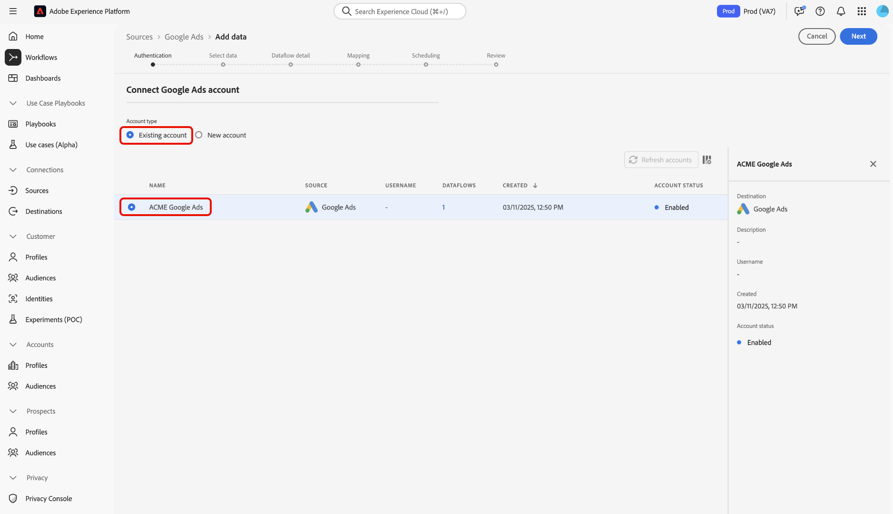

# UI での [!DNL Google AdWords] ソース接続の作成

>[!NOTE]
>
>[!DNL Google AdWords] コネクタはベータ版です。 ベータラベルのコネクタの使用について詳しくは、「[ ソースの概要 ](../../../../home.md#terms-and-conditions)」を参照してください。

Adobe Experience Platformのソースコネクタは、外部ソースのデータをスケジュールに従って取り込む機能を提供します。 このチュートリアルでは、[!DNL Platform] ユーザーインターフェイスを使用して [!DNL Google AdWords] ソースコネクタを作成する手順を説明します。

## はじめに

このチュートリアルは、Adobe Experience Platform の次のコンポーネントを実際に利用および理解しているユーザーを対象としています。

* [[!DNL Experience Data Model (XDM)] システム](../../../../../xdm/home.md):顧客体験データを整理する際に使用す [!DNL Experience Platform] る標準化されたフレームワーク。
   * [スキーマ構成の基本](../../../../../xdm/schema/composition.md)：スキーマ構成の主要な原則やベストプラクティスなど、XDM スキーマの基本的な構成要素について学びます。
   * [スキーマエディターのチュートリアル](../../../../../xdm/tutorials/create-schema-ui.md):スキーマエディターの UI を使用してカスタムスキーマを作成する方法を説明します。
* [[!DNL Real-time Customer Profile]](../../../../../profile/home.md)：複数のソースからの集計データに基づいて、統合されたリアルタイムの顧客プロファイルを提供します。

既に有効な [!DNL Google AdWords] 接続がある場合は、このドキュメントの残りの部分をスキップし、[ データフローの設定 ](../../dataflow/payments.md) に関するチュートリアルに進んでください。

### 必要な資格情報の収集

[!DNL Google AdWords] アカウント [!DNL Platform] にアクセスするには、次の値を指定する必要があります。

| 資格情報 | 説明 |
| ---------- | ----------- |
| `clientCustomerId` | [!DNL AdWords] アカウントのクライアント顧客 ID。 |
| `developerToken` | マネージャーアカウントに関連付けられている開発者トークン。 |
| `refreshToken` | [!DNL AdWords] へのアクセスを許可するために [!DNL Google] から取得した更新トークン。 |
| `clientId` | 更新トークンの取得に使用する [!DNL Google] アプリケーションのクライアント ID。 |
| `clientSecret` | 更新トークンの取得に使用する [!DNL Google] アプリケーションのクライアント秘密鍵。 |

使い始める方法については、この [[!DNL Google AdWords]  ドキュメント ](https://developers.google.com/adwords/api/docs/guides/authentication) を参照してください。

## [!DNL Google AdWords] アカウントに接続

必要な資格情報を収集したら、以下の手順に従って [!DNL Google AdWords] アカウントを [!DNL Platform] にリンクします。

[Adobe Experience Platform](https://platform.adobe.com) にログインし、左側のナビゲーションバーから「**[!UICONTROL ソース]**」を選択して、「**[!UICONTROL ソース]**」ワークスペースにアクセスします。 **[!UICONTROL カタログ]** 画面には、アカウントを作成するための様々なソースが表示されます。

画面の左側にあるカタログから適切なカテゴリを選択できます。 または、検索オプションを使用して、目的の特定のソースを見つけることもできます。

「**[!UICONTROL 広告]**」カテゴリで、「**[!UICONTROL Google AdWords]**」を選択します。 このコネクタを初めて使用する場合は、「**[!UICONTROL 設定]**」を選択します。 それ以外の場合は、「**[!UICONTROL データを追加]**」を選択して新しい [!DNL Google AdWords] コネクタを作成します。

「**[!UICONTROL Google AdWords に接続]**」ページが表示されます。 このページでは、新しい資格情報または既存の資格情報を使用できます。

### 新規アカウント

新しい資格情報を使用する場合は、「**[!UICONTROL 新しいアカウント]**」を選択します。 表示される入力フォームで、名前、説明（オプション）、[!DNL Google AdWords] 資格情報を入力します。 終了したら、[**[!UICONTROL 接続]**] を選択し、新しい接続が確立されるまでしばらく時間をかけます。

### 既存のアカウント

既存のアカウントに接続するには、接続する [!DNL Google AdWords] アカウントを選択し、**[!UICONTROL 次へ]** を選択して次に進みます。

## 次の手順

このチュートリアルに従って、[!DNL Google AdWords] アカウントへの接続を確立しました。 次のチュートリアルに進み、[ 広告データを  [!DNL Platform]](../../dataflow/advertising.md) に取り込むようにデータフローを設定します。
