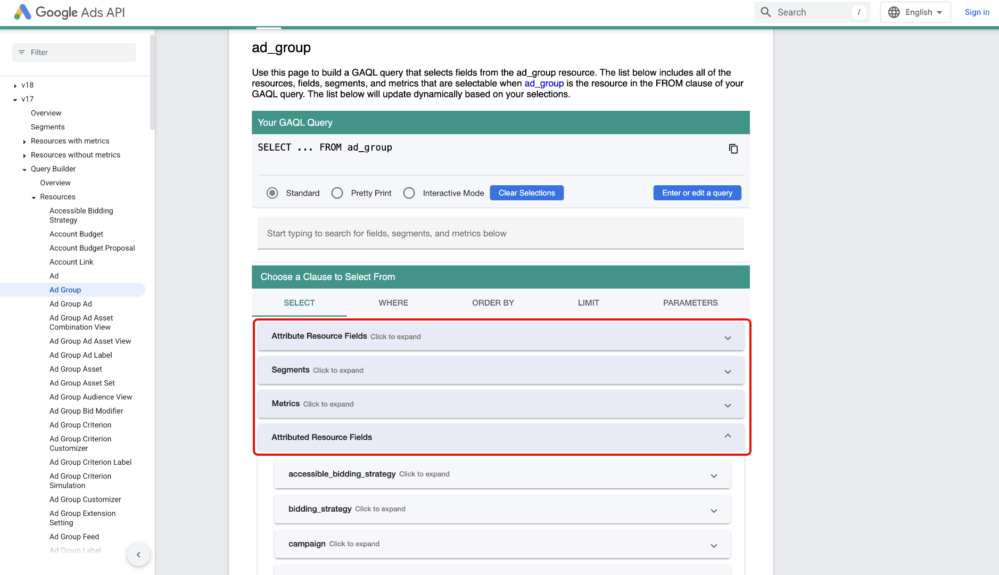

# UI を使用した [!DNL Google Ads] のExperience Platformへの接続

>[!WARNING]
>
>[!DNL Google Ads] ソースは現在、UI では使用できません。 [!DNL Google Ads] データをExperience Platformに引き続き取り込むことができます [API を使用 &#x200B;](../../../api/create/advertising/ads.md)。

>[!NOTE]
>
>[!DNL Google Ads] ソースはベータ版です。ベータラベル付きソースの使用について詳しくは、[&#x200B; ソースの概要 &#x200B;](../../../../home.md#terms-and-conditions) を参照してください。

このガイドでは、Experience Platform UI のソースワークスペースを使用して [!DNL Google Ads] アカウントをAdobe Experience Platformに接続する方法について説明します。

## 基本を学ぶ

このチュートリアルは、 Experience Platform の次のコンポーネントを実際に利用および理解しているユーザーを対象としています。

* [[!DNL Experience Data Model (XDM)] システム](../../../../../xdm/home.md)：Experience Platform が顧客体験データの整理に使用する標準化されたフレームワーク。
   * [スキーマ構成の基本](../../../../../xdm/schema/composition.md)：スキーマ構成の主要な原則やベストプラクティスなど、XDM スキーマの基本的な構成要素について学びます。
   * [スキーマエディターのチュートリアル](../../../../../xdm/tutorials/create-schema-ui.md)：スキーマエディター UI を使用してカスタムスキーマを作成する方法を説明します。
* [[!DNL Real-Time Customer Profile]](../../../../../profile/home.md)：複数のソースからの集計データに基づいて、統合されたリアルタイムの顧客プロファイルを提供します。

既に有効な [!DNL Google Ads] 接続がある場合は、このドキュメントの残りの部分をスキップして、[&#x200B; データフローの設定 &#x200B;](../../dataflow/advertising.md) に関するチュートリアルに進むことができます。

### 必要な資格情報の収集

認証について詳しくは、[[!DNL Google Ads]  ソースの概要 &#x200B;](../../../../connectors/advertising/ads.md) を参照してください。

## Google Ads アカウントを接続

Experience Platformの UI で、左側のナビゲーションから **[!UICONTROL Sources]** を選択し、*[!UICONTROL Sources]* ワークスペースにアクセスします。 *[!UICONTROL カテゴリ]* パネルで適切なカテゴリを選択できます。 または、検索バーを使用して、使用する特定のソースに移動できます。

[!DNL Google Ads] を使用するには、*[!UICONTROL Advertisingの下にある&#x200B;**[!UICONTROL Google Ads]**&#x200B;ソースカードを選択してから]&#x200B;***[!UICONTROL データを追加]** を選択します。

### 既存のアカウント

既存のアカウントを使用するには、「**[!UICONTROL 既存のアカウント]**」を選択し、インターフェイスのアカウントのリストから使用するアカウントを選択します。

アカウントを選択したら、「**[!UICONTROL 次へ]**」を選択して次の手順に進みます。

..

### 新規アカウント

既存のアカウントがない場合は、ソースに対応する必要な認証資格情報を指定して、新しいアカウントを作成する必要があります。

新しいアカウントを作成するには、「**[!UICONTROL 新しいアカウント]**」を選択し、アカウント名と、オプションでアカウントの詳細の説明を入力します。 次に、Experience Platformに対してソースを認証するための適切な認証値を指定します。

* **クライアント顧客 ID**：クライアント顧客 ID は、[!DNL Google Ads] API で管理する [!DNL Google Ads] クライアントアカウントに対応するアカウント番号です。 この ID は `123-456-7890` のテンプレートに従います。
* **ログインカスタマー ID**：ログインカスタマー ID は、[!DNL Google Ads] Manager アカウントに対応するアカウント番号で、特定の運用顧客からレポートデータを取得するために使用されます。 ログインカスタマー ID について詳しくは、[[!DNL Google Ads] API ドキュメント &#x200B;](https://developers.google.com/search-ads/reporting/concepts/login-customer-id) を参照してください。
* **開発者トークン**：開発者トークンを使用すると、[!DNL Google Ads] API にアクセスできます。 同じ開発者トークンを使用して、すべての [!DNL Google Ads] アカウントに対してリクエストを行うことができます。 [&#x200B; マネージャーアカウントにログイン &#x200B;](https://ads.google.com/home/tools/manager-accounts/) して API センターページに移動して、開発者トークンを取得します。
* **更新トークン**：更新トークンは、[!DNL OAuth2] 認証の一部です。 このトークンを使用すると、有効期限が切れた後にアクセストークンを再生成できます。
* **クライアント ID**：クライアント ID は、認証の一環としてクライアント秘密鍵と並行して使用 [!DNL OAuth2] れます。 クライアント ID とクライアント秘密鍵を組み合わせると、[!DNL Google] ーザー先のアプリケーションを識別することにより、お客様のアカウントに代わってアプリケーションを動作させることができます。
* **クライアント秘密鍵**：クライアント秘密鍵は、クライアント ID と並行して、認証の一部として使用 [!DNL OAuth2] れます。 クライアント ID とクライアント秘密鍵を組み合わせると、[!DNL Google] ーザー先のアプリケーションを識別することにより、お客様のアカウントに代わってアプリケーションを動作させることができます。
* **[!DNL Google Ads]API version**: [!DNL Google Ads] でサポートされている現在の API バージョン。 最新バージョンは `v18` ですが、Experience Platformでサポートされている最新バージョンは `v17` です。

資格情報を入力したら、「**[!UICONTROL ソースに接続]**」を選択し、接続が処理されるまでしばらく待ちます。 終了したら、「**[!UICONTROL 次へ]**」を選択します。

## データの選択 {#select-data}

[!DNL Google Ads] では、ワークフローのデータ選択フェーズで取り込む属性のリストを指定する必要があります。 これらの属性を取得するには、[[!DNL Google Ads Query Builder]](https://developers.google.com/google-ads/api/fields/v17/overview_query_builder) を使用する必要があります。

[!DNL Google Ads Query Builder] で、使用するリソースタイプに移動し、属性セレクターを使用して、属性、セグメントおよび指標を選択します。

選択した属性が [!DNL Google Ads Query Language] パネルに入力されます。 [!DNL Standard] モードを使用していることを確認し、**[!DNL Enter or edit a query]** を選択します。

次に、「**[!DNL Validate Query]**」を選択して、[!DNL Google Ads] クエリを検証します。

リクエストが成功した場合、[!DNL Google Ads Query Builder] はクエリが有効であることを示すメッセージを返します。 次に、クエリ内から **属性のみ** をコピーします。

Experience Platform UI でソースワークフローのデータ選択フェーズに戻り、*[!UICONTROL リスト属性]* パネルに属性を貼り付けます。

「**[!UICONTROL プレビュー]**」を選択してデータをプレビューし、「**[!UICONTROL 次へ]**」を選択して続行します。

## 広告データを取り込むデータフローの作成

このチュートリアルでは、Google Ads アカウントとの接続を確立しました。 次のチュートリアルに進み、[&#x200B; 広告データをExperience Platformに取り込むためのデータフローの設定 &#x200B;](../../dataflow/advertising.md) を行いましょう。
