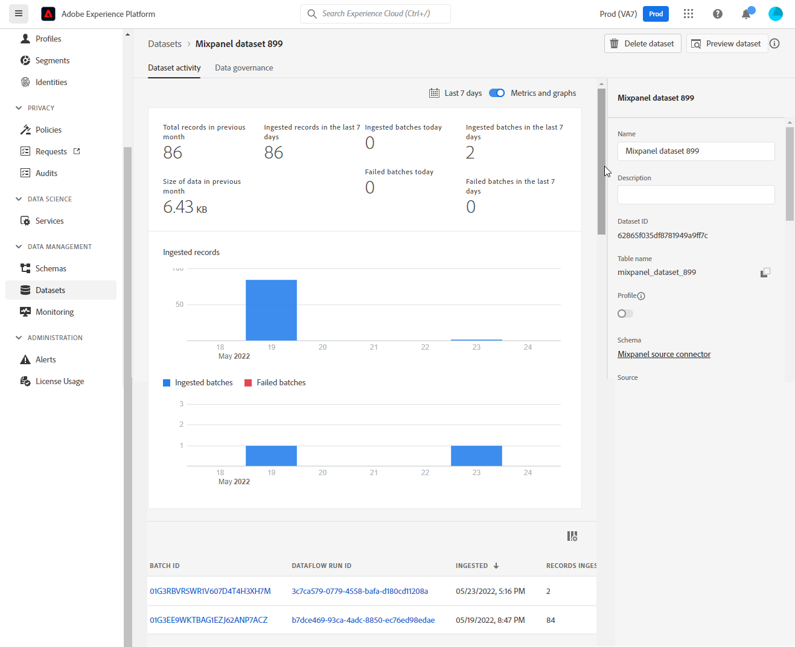

# UI での [!DNL Mixpanel] ソース接続の作成

このチュートリアルでは、 [!DNL Mixpanel] Adobe Experience Platform Platform ユーザーインターフェイスを使用したソース接続

## はじめに

このチュートリアルは、 Experience Platform の次のコンポーネントを実際に利用および理解しているユーザーを対象としています。

* [[!DNL Experience Data Model (XDM)]  システム](../../../../../xdm/home.md)：[!DNL Experience Platform] が顧客体験データの整理に使用する標準化されたフレームワーク。
   * [スキーマ構成の基本](../../../../../xdm/schema/composition.md)：スキーマ構成の主要な原則やベストプラクティスなど、XDM スキーマの基本的な構成要素について学びます。
   * [スキーマエディターのチュートリアル](../../../../../xdm/tutorials/create-schema-ui.md)：スキーマエディター UI を使用してカスタムスキーマを作成する方法を説明します。
* [[!DNL Real-Time Customer Profile]](../../../../../profile/home.md)：複数のソースからの集計データに基づいて、統合されたリアルタイムの顧客プロファイルを提供します。

### 必要な認証情報の収集

[!DNL Mixpanel] を Platform に接続するには、次の接続プロパティの値を指定する必要があります。

| 認証情報 | 説明 | 例 |
| --- | --- | --- |
| ユーザー名 | に対応するサービスアカウントユーザー名 [!DNL Mixpanel] アカウント 詳しくは、 [[!DNL Mixpanel] サービスアカウントドキュメント](https://developer.mixpanel.com/reference/service-accounts#authenticating-with-a-service-account) を参照してください。 | `Test8.6d4ee7.mp-service-account` |
| パスワード | お使いの [!DNL Mixpanel] アカウント | `dLlidiKHpCZtJhQDyN2RECKudMeTItX1` |
| プロジェクト ID | お使いの [!DNL Mixpanel] プロジェクト ID。 この ID は、ソース接続を作成するために必要です。 詳しくは、 [[!DNL Mixpanel] プロジェクト設定ドキュメント](https://help.mixpanel.com/hc/en-us/articles/115004490503-Project-Settings) そして [[!DNL Mixpanel] プロジェクトの作成と管理に関するガイド](https://help.mixpanel.com/hc/en-us/articles/115004505106-Create-and-Manage-Projects) を参照してください。 | `2384945` |
| タイムゾーン | に対応するタイムゾーン [!DNL Mixpanel] プロジェクト。 ソース接続を作成するには、タイムゾーンが必要です。 詳しくは、 [Mixpanel プロジェクト設定ドキュメント](https://help.mixpanel.com/hc/en-us/articles/115004490503-Project-Settings) を参照してください。 | `Pacific Standard Time` |

認証の詳細については、 [!DNL Mixpanel] ソース、 [[!DNL Mixpanel] ソースの概要](../../../../connectors/analytics/mixpanel.md).

## [!DNL Mixpanel] アカウントの接続

Platform UI の左側のナビゲーションバーで「**[!UICONTROL ソース]**」を選択し、[!UICONTROL ソース]ワークスペースにアクセスします。[!UICONTROL カタログ]画面には、アカウントを作成できる様々なソースが表示されます。

画面の左側にあるカタログから適切なカテゴリを選択することができます。または、使用する特定のソースを検索オプションを使用して探すこともできます。

以下 *Analytics* カテゴリ、選択 [!DNL Mixpanel]を選択し、 **[!UICONTROL データを追加]**.

この **[!UICONTROL Mixpanel アカウントの接続]** ページが表示されます。 このページでは、新しい資格情報または既存の資格情報を使用できます。

### 既存のアカウント

既存のアカウントを使用するには、新しいデータフローを作成する [!DNL Mixpanel] アカウントを選択し、「**[!UICONTROL 次へ]**」を選択して続行します。

### 新しいアカウント

新しいアカウントを作成する場合は、「**[!UICONTROL 新規アカウント]**」を選択し、続けて名前、説明（オプション）、 の認証情報を指定します。終了したら「**[!UICONTROL ソースに接続]**」を選択し、新しい接続が確立されるまでしばらく待ちます。

## プロジェクト ID とタイムゾーンを選択します {#project-id-and-timezone}

>[!CONTEXTUALHELP]
>id="platform_sources_mixpanel_timezone"
>title="Mixpanel 取り込みのタイムゾーンの設定"
>abstract="Platform は、指定されたプロジェクトのタイムゾーンを使用して Mixpanel から関連するデータを取り込むので、Platform のタイムゾーンは、Mixpanel プロファイルのタイムゾーン設定と同じである必要があります。Mixpanel は、Mixpanel データストアにイベントを記録する前に、プロジェクトのタイムゾーンに合わせて自身のタイムゾーンを調整します。"
>additional-url="https://experienceleague.adobe.com/docs/experience-platform/sources/ui-tutorials/create/analytics/mixpanel.html?lang=ja#project-id-and-timezone" text="詳しくは、ドキュメントを参照してください"

ソースが認証されたら、プロジェクト ID とタイムゾーンを指定してから、「 」を選択します **[!UICONTROL 選択]**.

取り込む前に指定するタイムゾーン [!DNL Mixpanel] Platform へのデータは、 [!DNL Mixpanel] プロファイルのタイムゾーン設定。 データのタイムゾーンに対する変更は新しいイベントにのみ適用され、古いイベントは以前に指定したタイムゾーンに残ります。 [!DNL Mixpanel] は夏時間に対応し、取り込みタイムスタンプを適切に調整します。 タイムゾーンがデータに与える影響について詳しくは、 [!DNL Mixpanel] ～に関するガイド [プロジェクトのタイムゾーンの管理](https://help.mixpanel.com/hc/en-us/articles/115004547203-Manage-Timezones-for-Projects-in-Mixpanel).

しばらくすると、右側のインターフェイスがプレビューパネルに更新され、データフローを作成する前にスキーマを調査できます。 終了したら、「**[!UICONTROL 次へ]**」を選択します。

## 次の手順

このチュートリアルでは、[!DNL Mixpanel] アカウントとの接続を確立しました。次のチュートリアルに進み、 [データフローを設定して analytics データを Platform に取り込む](../../dataflow/analytics.md).

## その他のリソース {#additional-resources}

以下の節では、 [!DNL Mixpanel] ソース。

### 検証 {#validation}

次に、 [!DNL Mixpanel] ソースとそれ [!DNL Mixpanel] イベントが Platform に取り込まれています。

Platform UI で、「 **[!UICONTROL データセット]** 左側のナビゲーションバーから [!UICONTROL データセット] ワークスペース。 この [!UICONTROL データセットアクティビティ] screen には、実行の詳細が表示されます。

次に、表示するデータフローのデータフロー実行 ID を選択して、そのデータフロー実行に関する具体的な詳細を確認します。

最後に、 **[!UICONTROL データセットをプレビュー]** をクリックして、取り込まれたデータを表示します。

このデータを [!DNL Mixpanel] > [!DNL Events] ページ。 詳しくは、 [[!DNL Mixpanel] イベントに関するドキュメント](https://help.mixpanel.com/hc/en-us/articles/4402837164948-Events-formerly-Live-View-) を参照してください。

### Mixpanel スキーマ

次の表に、 [!DNL Mixpanel].

>[!TIP]
>
>詳しくは、 [イベント書き出し API/ダウンロード](https://developer.mixpanel.com/reference/raw-event-export) を参照してください。

| ソース | タイプ |
|---|---|
| `distinct_id` | 文字列 |
| `event_name` | 文字列 |
| `import` | ブール値 |
| `insert_id` | 文字列 |
| `item_id` | 文字列 |
| `item_name` | 文字列 |
| `item_price` | 文字列 |
| `mp_api_endpoint` | 文字列 |
| `mp_api_timestamp_ms` | 整数 |
| `mp_processing_time_ms` | 整数 |
| `time` | 整数 |

### 制限 {#limits}

* に示すように、同時クエリは最大 100 個、クエリは 1 時間に 60 個です。 [書き出し API のレート制限](https://help.mixpanel.com/hc/en-us/articles/115004602563-Rate-Limits-for-API-Endpoints).
