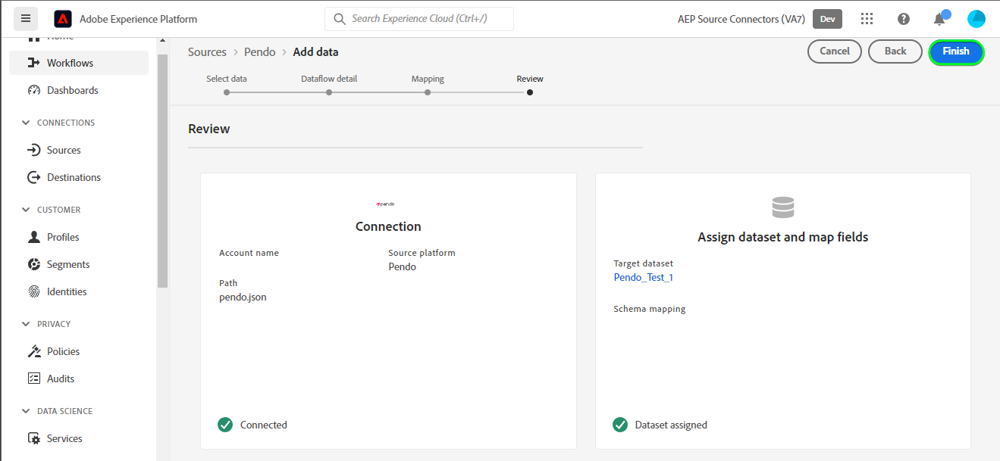

# の作成 [!DNL Pendo] ソース接続データフローと UI

>[!NOTE]
>
>[!DNL Pendo] ソースはベータ版です。ベータラベル付きソースの使用について詳しくは、[ソースの概要](../../../../home.md#terms-and-conditions)を参照してください。

このチュートリアルでは、 [!DNL Pendo] Adobe Experience Platformユーザーインターフェイスを使用したソース接続とデータフロー。

## はじめに {#getting-started}

このチュートリアルは、 Experience Platform の次のコンポーネントを実際に利用および理解しているユーザーを対象としています。

* [[!DNL Experience Data Model (XDM)]  システム](../../../../../xdm/home.md)：[!DNL Experience Platform] が顧客体験データの整理に使用する標準化されたフレームワーク。
   * [スキーマ構成の基本](../../../../../xdm/schema/composition.md)：スキーマ構成の主要な原則やベストプラクティスなど、XDM スキーマの基本的な構成要素について学びます。
   * [スキーマエディターのチュートリアル](../../../../../xdm/tutorials/create-schema-ui.md)：スキーマエディター UI を使用してカスタムスキーマを作成する方法を説明します。
* [[!DNL Real-Time Customer Profile]](../../../../../profile/home.md)：複数のソースからの集計データに基づいて、統合されたリアルタイムの顧客プロファイルを提供します。

## 前提条件 {#prerequisites}

次の節では、 [!DNL Pendo] ソース接続。

### のソーススキーマを定義するサンプル JSON [!DNL Pendo] {#prerequisites-json-schema}

を作成する前に [!DNL Pendo] ソース接続の場合は、ソーススキーマを指定する必要があります。 以下の JSON を使用できます。

```
{
  "accountId": "58f79ee324d3f",
  "timestamp": 1673372516,
  "visitorId": "test@test.com",
  "uniqueId": "166e50cdf40930fe1367e4d44795c9c74d88b83a",
  "properties": {
    "guideProperties": {
  "name": "Guide Conversion Test"
  }
}
}
```

詳しくは、 [[!DNL Pendo] ウェブフックのガイド](https://support.pendo.io/hc/en-us/articles/360032285012-Webhooks).

### 用の Platform スキーマの作成 [!DNL Pendo] {#create-platform-schema}

また、最初に、ソースに使用する Platform スキーマを作成する必要があります。 に関するチュートリアルを参照してください。 [Platform スキーマの作成](../../../../../xdm/schema/composition.md) スキーマの作成方法に関する包括的な手順を参照してください。


## [!DNL Pendo] アカウントを接続 {#connect-account}

Platform UI で、「 **[!UICONTROL ソース]** 左側のナビゲーションから [!UICONTROL ソース] workspace を参照し、Experience Platformで使用可能なソースのカタログを確認します。

以下を使用： *[!UICONTROL カテゴリ]* メニューを使用して、ソースをカテゴリでフィルタリングできます。 または、検索バーにソース名を入力して、カタログから特定のソースを検索します。

次に移動： [!UICONTROL Analytics] 表示するカテゴリ [!DNL Pendo] ソースカード。 最初に、 **[!UICONTROL データを追加]**.


## データの選択 {#select-data}

この **[!UICONTROL データを選択]** の手順が表示され、Platform に取り込むデータを選択するためのインターフェイスが提供されます。

* インターフェイスの左側には、アカウント内で使用可能なデータストリームを表示できるブラウザーがあります。
* インターフェイスの右側では、JSON ファイルから最大 100 行のデータをプレビューできます。

選択 **[!UICONTROL ファイルをアップロード]** をクリックして、ローカルシステムから JSON ファイルをアップロードします。 または、アップロードする JSON ファイルをにドラッグ&amp;ドロップすることもできます [!UICONTROL ファイルをドラッグ&amp;ドロップ] パネル。


ファイルがアップロードされると、プレビューインターフェイスが更新され、アップロードしたスキーマのプレビューが表示されます。 プレビューインターフェイスを使用すると、ファイルの内容と構造を検査できます。 また、 [!UICONTROL 検索フィールド] スキーマ内から特定の項目にアクセスするユーティリティ。

終了したら、「**[!UICONTROL 次へ]**」を選択します。


## データフローの詳細 {#dataflow-detail}

この **データフローの詳細** 手順が表示され、既存のデータセットを使用するか、データフローの新しいデータセットを確立するか、およびデータフローの名前と説明を指定する機会が提供されます。 この手順では、プロファイルの取り込み、エラー診断、部分取り込み、アラートの設定も指定できます。

終了したら、「**[!UICONTROL 次へ]**」を選択します。


## マッピング {#mapping}

[!UICONTROL マッピング]手順が表示され、ソーススキーマのソースフィールドを、ターゲットスキーマの適切なターゲット XDM フィールドにマッピングするためのインターフェイスが提供されます。

Platform は、選択したターゲットスキーマまたはデータセットに基づいて、自動マッピングされたフィールドに対するインテリジェントなレコメンデーションを提供します。 マッピングルールは、ユースケースに合わせて手動で調整できます。必要に応じて、フィールドを直接マッピングするか、データ準備機能を使用してソースデータを変換して計算値を導き出すかを選択できます。マッパーインターフェイスと計算フィールドを使用した包括的な手順については、 [データ準備 UI ガイド](../../../../../data-prep/ui/mapping.md).

以下に示すマッピングは必須で、 [!UICONTROL レビュー] ステージ。

| ターゲットフィールド | 説明 |
| --- | --- |
| `uniqueId` | この [!DNL Pendo] イベントの識別子。 |

ソースデータが正常にマッピングされたら、「 」を選択します。 **[!UICONTROL 次へ]**.


## レビュー {#review}

**[!UICONTROL レビュー]**&#x200B;手順が表示され、新しいデータフローを作成する前に確認できます。詳細は、次のカテゴリに分類されます。

* **[!UICONTROL 接続]**：ソースのタイプ、選択したソースファイルの関連パスおよびそのソースファイル内の列の数を表示します。
* **[!UICONTROL データセットの割り当てとフィールドのマッピング]**：ソースデータがどのデータセットに取り込まれるかを、そのデータセットが準拠するスキーマを含めて表示します。

データフローをレビューしたら、「**[!UICONTROL 終了]**」を選択し、データフローが作成されるまでしばらく待ちます。



## ストリーミングエンドポイント URL の取得 {#get-streaming-endpoint-url}

ストリーミングデータフローを作成したら、ストリーミングエンドポイント URL を取得できます。 このエンドポイントは、Webhook を購読するために使用され、ストリーミングソースとExperience Platformが通信できます。

Webhook の設定に使用する URL を構築するために [!DNL Pendo] 次を取得する必要があります。

* **[!UICONTROL データフロー ID]**
* **[!UICONTROL ストリーミングエンドポイント]**

次の手順で **[!UICONTROL データフロー ID]** および **[!UICONTROL ストリーミングエンドポイント]**、 [!UICONTROL データフローアクティビティ] 作成したデータフローのページを開き、詳細を [!UICONTROL プロパティ] パネル。


ストリーミングエンドポイントとデータフロー ID を取得したら、次のパターンに基づいて URL を作成します。 ```{STREAMING_ENDPOINT}?x-adobe-flow-id={DATAFLOW_ID}```. 例えば、生成される Webhook URL は次のようになります。 ```https://dcs.adobedc.net/collection/0c61859cc71939a0caf01123f91b2fc52589018800ad46b6c76c2dff3595ee95```

## で Webhook を設定します。 [!DNL Pendo] {#set-up-webhook}

次に、 [[!DNL Pendo]](https://pendo.io/) ウェブフックを作成します。 を使用して Webhook を作成する手順については、 [!DNL Pendo] ユーザーインターフェイス ( [[!DNL Pendo] webhook の作成に関するガイド](https://support.pendo.io/hc/en-us/articles/360032285012-Webhooks#create-a-webhook-0-4).

Webhook を作成したら、 [!DNL Pendo] Webhook を開き、Webhook の URL を [!DNL URL] フィールドに入力します。


>[!TIP]
>
>様々なイベントカテゴリを購読して、送信するイベントの種類を [!DNL Pendo] インスタンスから Platform へ 各イベントについて詳しくは、 [[!DNL Pendo] ドキュメント](https://support.pendo.io/hc/en-us/articles/360032285012-Webhooks#create-a-webhook-0-4).

## 次の手順 {#next-steps}

このチュートリアルに従うことで、 [!DNL Pendo] データをExperience Platformに送信します。 取り込まれるデータを監視するには、 [Platform UI を使用したストリーミングデータフローの監視](../../monitor-streaming.md).

## その他のリソース {#additional-resources}

以下の節では、 [!DNL Pendo] ソース。

### 検証 {#validation}

ソースとが正しく設定されていることを検証するには、以下を実行します。 [!DNL Pendo] メッセージを取り込むには、次の手順に従います。

* 次の項目を確認できます。 [!DNL Pendo] **[!UICONTROL レポート]** > **[!UICONTROL チャット履歴]** キャプチャされたイベントを識別するページ [!DNL Pendo].


* Platform UI で、「 **[!UICONTROL データフローを表示]** の横に [!DNL Pendo] ソースカタログのカードメニュー 次に、 **[!UICONTROL データセットをプレビュー]** で設定した web フック用に取り込まれたデータを検証するには、以下を実行します。 [!DNL Pendo].


### エラーとトラブルシューティング {#errors-and-troubleshooting}

データフローの実行をチェックする際に、次のエラーメッセージが表示される場合があります。 `The message can't be validated ... uniqueID:expected minLength:1, actual 0].`


このエラーを修正するには、 *uniqueID* マッピングが設定されました。 追加のガイダンスについては、 [マッピング](#mapping) 」セクションに入力します。

詳しくは、 [[!DNL Pendo] ヘルプセンター](https://www.pendo.io/help-center/).
