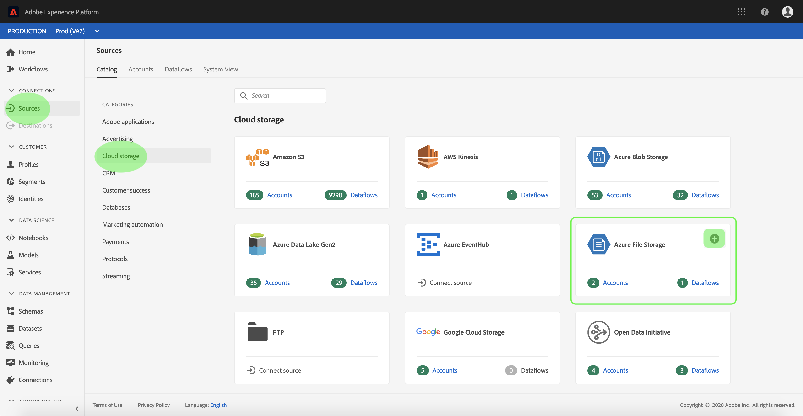

# UI での [!DNL Azure File Storage] ソース接続の作成

Adobe Experience Platformのソースコネクタは、外部ソースのデータをスケジュールに従って取り込む機能を提供します。 このチュートリアルでは、[!DNL Platform] ユーザーインターフェイスを使用して [!DNL Azure File Storage] ソースコネクタを認証する手順を説明します。

## はじめに

このチュートリアルは、Adobe Experience Platform の次のコンポーネントを実際に利用および理解しているユーザーを対象としています。

- [[!DNL Experience Data Model (XDM)] システム](../../../../../xdm/home.md):顧客体験データを整理する際に使用す [!DNL Experience Platform] る標準化されたフレームワーク。
   - [スキーマ構成の基本](../../../../../xdm/schema/composition.md)：スキーマ構成の主要な原則やベストプラクティスなど、XDM スキーマの基本的な構成要素について学びます。
   - [スキーマエディターのチュートリアル](../../../../../xdm/tutorials/create-schema-ui.md):スキーマエディターの UI を使用してカスタムスキーマを作成する方法を説明します。
- [[!DNL Real-time Customer Profile]](../../../../../profile/home.md)：複数のソースからの集計データに基づいて、統合されたリアルタイムの顧客プロファイルを提供します。

既に有効な [!DNL Azure File Storage] 接続がある場合は、このドキュメントの残りの部分をスキップし、[ データフローの設定 ](../../dataflow/batch/cloud-storage.md) に関するチュートリアルに進んでください。

### 必要な資格情報の収集

[!DNL Azure File Storage] ソースコネクタを認証するには、次の接続プロパティの値を指定する必要があります。

| 資格情報 | 説明 |
| ---------- | ----------- |
| `host` | アクセスする [!DNL Azure File Storage] インスタンスのエンドポイント。 |
| `userId` | [!DNL Azure File Storage] エンドポイントへの十分なアクセス権を持つユーザー。 |
| `password` | [!DNL Azure File Storage] アクセスキー。 |

使い始める方法については、[ [!DNL Azure File Storage]  ドキュメント ](https://docs.microsoft.com/en-us/azure/storage/files/storage-how-to-use-files-windows) を参照してください。

## [!DNL Azure File Storage] アカウントに接続

必要な資格情報を収集したら、以下の手順に従って [!DNL Azure File Storage] アカウントを [!DNL Platform] にリンクします。

[Adobe Experience Platform](https://platform.adobe.com) にログインし、左側のナビゲーションバーから「**[!UICONTROL ソース]**」を選択して、「**[!UICONTROL ソース]**」ワークスペースにアクセスします。 **[!UICONTROL カタログ]** 画面には、アカウントを作成するための様々なソースが表示されます。

画面の左側にあるカタログから適切なカテゴリを選択できます。 または、検索オプションを使用して、目的の特定のソースを見つけることもできます。

「**[!UICONTROL Databases]**」カテゴリで、「**[!UICONTROL Azure File Storage]**」を選択します。 このコネクタを初めて使用する場合は、「**[!UICONTROL 設定]**」を選択します。 それ以外の場合は、「**[!UICONTROL データを追加]**」を選択して新しい [!DNL Azure File Storage] コネクタを作成します。

「**[!UICONTROL Azure ファイルストレージに接続]**」ページが表示されます。 このページでは、新しい資格情報または既存の資格情報を使用できます。

### 新規アカウント

新しい資格情報を使用する場合は、「**[!UICONTROL 新しいアカウント]**」を選択します。 表示される入力フォームで、名前、説明（オプション）、[!DNL Azure File Storage] 資格情報を入力します。 終了したら、[**[!UICONTROL 接続]**] を選択し、新しい接続が確立されるまでしばらく時間をかけます。

### 既存のアカウント

既存のアカウントに接続するには、接続する [!DNL Azure File Storage] アカウントを選択し、**[!UICONTROL 次へ]** を選択して次に進みます。

## 次の手順

このチュートリアルに従って、[!DNL Azure File Storage] アカウントへの接続を確立しました。 次のチュートリアルに進み、クラウドストレージから  [!DNL Platform]](../../dataflow/batch/cloud-storage.md) にデータを取り込むように [ データフローを設定します。
