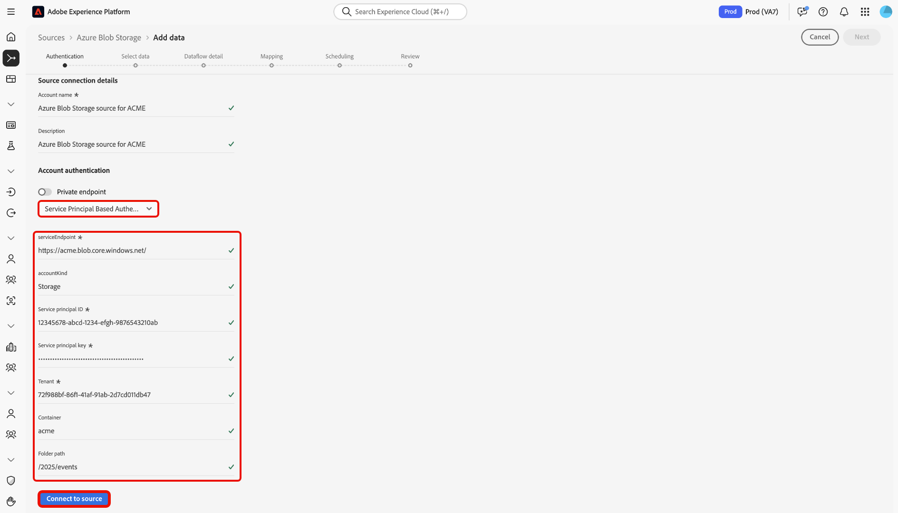

# UI を使用した [!DNL Azure Blob Storage] のExperience Platformへの接続

このガイドでは、Experience Platform ユーザーインターフェイスのソースワークスペースを使用して [!DNL Azure Blob Storage] インスタンスをAdobe Experience Platformに接続する方法について説明します。

## はじめに

このチュートリアルは、Adobe Experience Platform の次のコンポーネントを実際に利用および理解しているユーザーを対象としています。

* [[!DNL Experience Data Model (XDM)]  システム &#x200B;](../../../../../xdm/home.md):Experience Platformでカスタマーエクスペリエンスデータを整理するための標準化されたフレームワーク。
   * [スキーマ構成の基本](../../../../../xdm/schema/composition.md)：スキーマ構成の主要な原則やベストプラクティスなど、XDM スキーマの基本的な構成要素について学びます。
   * [スキーマエディターのチュートリアル](../../../../../xdm/tutorials/create-schema-ui.md)：スキーマエディター UI を使用してカスタムスキーマを作成する方法を説明します。
* [[!DNL Real-Time Customer Profile]](../../../../../profile/home.md)：複数のソースからの集計データに基づいて、統合されたリアルタイムの顧客プロファイルを提供します。

既に有効な [!DNL Azure Blob Storage] 接続がある場合は、このドキュメントの残りの部分をスキップして、[データフローの設定](../../dataflow/batch/cloud-storage.md)に関するチュートリアルに進むことができます。

### サポートされているファイル形式

Experience Platformでは、外部ストレージから取り込む次のファイル形式をサポートしています。

* 区切り文字区切り値（DSV）: タブ、コンマ、パイプ、セミコロン、ハッシュなど、任意の単一列の区切り文字を使用して、任意の形式のフラットファイルを収集できます。
* JavaScript Object Notation （JSON）: JSON 形式のデータファイルは XDM に準拠している必要があります。
* Apache Parquet:Parquet 形式のデータファイルは XDM に準拠している必要があります。

### 必要な資格情報の収集

認証について詳しくは、[[!DNL Azure Blob Storage]  概要 &#x200B;](../../../../connectors/cloud-storage/blob.md#authentication) を参照してください。

## ソースカタログのナビゲート

Experience Platformの UI で、左側のナビゲーションから **[!UICONTROL Sources]** を選択し、*[!UICONTROL Sources]* ワークスペースにアクセスします。 カテゴリを選択するか、検索バーを使用してソースを検索します。

[!DNL Azure Blob Storage] に接続するには、「*[!UICONTROL クラウドストレージ]*」カテゴリに移動し、「**[!UICONTROL Azure Blob ストレージ]**」ソースカードを選択して「**[!UICONTROL 設定]**」を選択します。

>[!TIP]
>
>新しい接続の場合はソースに **[!UICONTROL 設定]** が表示され、アカウントが既に存在する場合は **[!UICONTROL データを追加]** が表示されます。

## 既存のアカウントを使用

既存のアカウントを使用するには、「**[!UICONTROL 既存のアカウント]**」を選択して、使用する [!DNL Azure Blob Storage] アカウントを選択します。

## 新しいアカウントを作成

新しいアカウントを作成するには、「**[!UICONTROL 新しいアカウント]**」を選択し、アカウントの名前を入力して、オプションで説明を追加します。 次の認証タイプを使用して、[!DNL Azure Blob Storage] アカウントをExperience Platformに接続できます。

* **アカウントキー認証**: ストレージアカウントのアクセスキーを使用して認証し、[!DNL Azure Blob Storage] アカウントに接続します。
* **共有アクセス署名（SAS）**:SAS URI を使用して、[!DNL Azure Blob Storage] アカウントのリソースへのデリゲートされた時間制限アクセスを提供します。
* **サービスプリンシパルベースの認証**:Azure Active Directory （AAD）サービスプリンシパル（クライアント ID とシークレット）を使用して、Azure Blob Storage アカウントに対して安全に認証します。

>[!BEGINTABS]

>[!TAB  アカウントキー認証 ]

**[!UICONTROL アカウントキー認証]** を選択し、`connectionString`、`container`、`folderPath` を入力します。 次に、「**[!UICONTROL ソースに接続]**」を選択し、接続が確立されるまでしばらく待ちます。

>[!TAB  共有アクセス署名 ]

**[!UICONTROL 共有アクセス署名]** を選択し、`sasUri`、`container` および `folderPath` を指定します。 次に、「**[!UICONTROL ソースに接続]**」を選択し、接続が確立されるまでしばらく待ちます。

>[!TAB  サービスプリンシパルベースの認証 ]

**[!UICONTROL サービスプリンシパルベースの認証]** を選択し、`serviceEndpoint`、`servicePrincipalId`、`servicePrincipalKey`、`accountKind`、`tenant`、`container` および `folderPath` を入力します。 次に、「**[!UICONTROL ソースに接続]**」を選択し、接続が確立されるまでしばらく待ちます。

>[!ENDTABS]

## 次の手順

このチュートリアルでは、[!DNL Azure Blob Storage] アカウントとの接続を確立しました。次のチュートリアルに進み、[&#x200B; データフローを設定して、クラウドストレージからExperience Platformにデータを取り込む &#x200B;](../../dataflow/batch/cloud-storage.md) ことができます。
