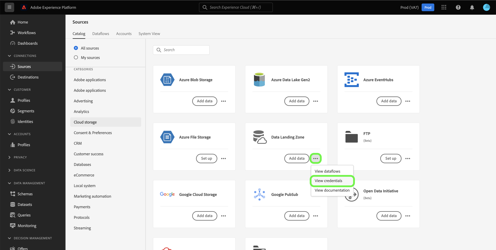

# UI を使用して [!DNL Data Landing Zone] を Platform に接続

[!DNL Data Landing Zone] は、Adobe Experience Platformでプロビジョニングされた一時ファイルストレージのクラウドベースのデータストレージ機能です。データは 7 日後に [!DNL Data Landing Zone] から自動的に削除されます。

このチュートリアルでは、Platform のユーザーインターフェイスを使用して [!DNL Data Landing Zone] ソース接続を作成する手順を説明します。

## はじめに

このチュートリアルは、Adobe Experience Platform の次のコンポーネントを実際に利用および理解しているユーザーを対象としています。

* [ソース](../../../../home.md):Experience Platformを使用すると、様々なソースからデータを取り込みながら、Platform サービスを使用して、受信データの構造化、ラベル付け、拡張をおこなうことができます。
* [サンドボックス](../../../../../sandboxes/home.md)：Experience Platform は、単一の Platform インスタンスを別々の仮想環境に分割して、デジタルエクスペリエンスアプリケーションの開発と発展を支援する仮想サンドボックスを提供します。

## ファイルを [!DNL Data Landing Zone] から Platform に移動します

Platform UI で、左のナビゲーションから「 **[!UICONTROL ソース]** 」を選択して、「 [!UICONTROL  ソース ] 」ワークスペースにアクセスします。 [!UICONTROL  カタログ ] 画面には、アカウントを作成できる様々なソースが表示されます。

画面の左側にあるカタログから適切なカテゴリを選択できます。 または、検索バーを使用して、作業対象の特定のソースを見つけることもできます。

「[!UICONTROL  クラウドストレージ ]」カテゴリで「[!DNL Data Landing Zone]」を選択し、「**[!UICONTROL データを追加]**」を選択します。

[!UICONTROL  データの追加 ] 手順が表示され、Platform に取り込むデータを選択およびプレビューするインターフェイスが表示されます。

クラウドストレージソースのデータフローを作成する手順の詳細なガイドについては、[ クラウドストレージデータフローの作成（データを Platform に送信する場合）に関するチュートリアル ](../../dataflow/batch/cloud-storage.md) を参照してください。

## [!DNL Data Landing Zone] 資格情報を取得して更新します

[!DNL Data Landing Zone] は、Adobe Experience Platform Sources ライセンスに付属の標準のソースです。[!DNL Data Landing Zone] は、SAS URI と SAS トークンベースの認証を使用します。[!UICONTROL  ソースカタログ ] ページから認証資格情報を取得して更新できます。

[!UICONTROL  ソースカタログ ] の「[!UICONTROL  クラウドストレージ ]」カテゴリで、省略記号 (**...**) を **[!UICONTROL Data Landing Zone]** カードから削除します。 表示されるドロップダウンメニューから、「**[!UICONTROL View credentials]**」を選択します。

ポップオーバーが表示され、コンテナ名、SAS トークン、ストレージアカウント名、SAS URI が表示されます。

「**[!UICONTROL 資格情報を更新]**」を選択し、更新された資格情報が処理されるまで数秒間待ちます。

## 次の手順

このチュートリアルでは、[!DNL Data Landing Zone] コンテナにアクセスし、資格情報を取得して更新する方法を学習しました。 次の [ データフローの作成に関するチュートリアルに進み、クラウドストレージから Platform](../../dataflow/batch/cloud-storage.md) にデータを取り込むことができます。
