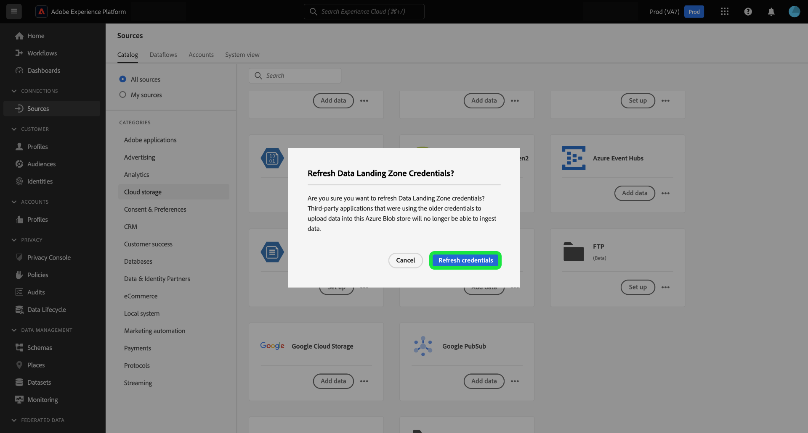

# UI を使用した [!DNL Data Landing Zone] の Platform への接続

>[!IMPORTANT]
>
>このページは、に固有です。 [!DNL Data Landing Zone] *ソース* Experience Platform内のコネクタ。 への接続について [!DNL Data Landing Zone] *宛先* コネクタについては、を参照してください [[!DNL Data Landing Zone] 宛先ドキュメントページ](/help/destinations/catalog/cloud-storage/data-landing-zone.md).

[!DNL Data Landing Zone] は、ファイルをAdobe Experience Platformに取り込むための安全なクラウドベースのファイルストレージ機能です。 データはから自動的に削除されます [!DNL Data Landing Zone] 7 日後。

このチュートリアルでは、を作成する手順を説明します。 [!DNL Data Landing Zone] platform ユーザーインターフェイスを使用したソース接続。

## はじめに

このチュートリアルは、Adobe Experience Platform の次のコンポーネントを実際に利用および理解しているユーザーを対象としています。

* [ソース](../../../../home.md)：Experience Platform を使用すると、データを様々なソースから取得しながら、Platform サービスを使用して受信データの構造化、ラベル付け、拡張を行うことができます。
* [サンドボックス](../../../../../sandboxes/home.md)：Experience Platform には、単一の Platform インスタンスを別々の仮想環境に分割し、デジタルエクスペリエンスアプリケーションの開発と発展に役立つ仮想サンドボックスが用意されています。

## ファイルの提供元 [!DNL Data Landing Zone] から Platform

Platform の UI で、左側のナビゲーションバーで「**[!UICONTROL ソース]**」を選択し、[!UICONTROL ソース]ワークスペースにアクセスします。[!UICONTROL カタログ]画面には、アカウントを作成できる様々なソースが表示されます。

画面の左側にあるカタログから適切なカテゴリを選択することができます。または、検索バーを使用して、利用したい特定のソースを見つけることもできます。

の下 [!UICONTROL クラウドストレージ] カテゴリ、選択 [!DNL Data Landing Zone] を選択してから、 **[!UICONTROL データを追加]**.

この [!UICONTROL データを追加] 手順が表示され、Platform に取り込むデータを選択およびプレビューするためのインターフェイスが表示されます。

* インターフェイスの左側はフォルダーブラウザーで、コンテナにあるファイルのリストが表示されます。このファイルは Platform に取り込むことができます。
* インターフェイスの右側の部分では、互換性のあるファイルから最大 100 行のデータをプレビューできます。

Experience Platformにするファイルを選択し、適切なインターフェイスがプレビュー画面に更新されるまでしばらく待ちます。

>[!TIP]
>
>Platform は、ファイルのデータ形式、指定された列区切り文字、圧縮タイプなど、選択したファイルのプロパティ情報を自動検出します。

プレビューインターフェイスを使用すると、ファイルの内容と構造を検査できます。 デフォルトでは、プレビューインターフェイスには、選択したフォルダー内の最初のファイルが表示されます。

別のファイルをプレビューするには、検査するファイル名の横にあるプレビューアイコンを選択します。

終了したら、「**[!UICONTROL 次へ]**」を選択します。

クラウドストレージソースのデータフローを作成する手順について詳しくは、のチュートリアルを参照してください。 [platform にデータを取り込むためのクラウドストレージデータフローの作成](../../dataflow/batch/cloud-storage.md).

## を取得する [!DNL Data Landing Zone] 資格情報

[!DNL Data Landing Zone] は、Adobe Experience Platform ソースライセンスに付属するソースです。 [!DNL Data Landing Zone] sas URI および SAS トークンベースの認証を使用します。 から認証資格情報を取得できます [!UICONTROL ソースカタログ] ページ。

資格情報を取得するには、 **[!UICONTROL Data Landing Zone]** カードを選択し、表示される右側のパネルから資格情報をコピーします。

ポップオーバーが表示され、コンテナ名、SAS トークン、ストレージアカウント名、SAS URI および有効期限が表示されます。

## を更新 [!DNL Data Landing Zone] 資格情報

あなたの [!DNL Data Landing Zone] 資格情報は 90 日後に自動的に期限切れになるように設定されています。に再接続するには、新しい資格情報を使用する必要があります [!DNL Data Landing Zone] 有効期限の後。 Experience Platformのデータフローは、有効期限が切れる資格情報の影響を受けず、新しい資格情報を使用して新しいデータフローおよび既存のデータフローを引き続き使用できます。

を更新する方法は 2 つあります [!DNL Data Landing Zone] 資格情報：

>[!BEGINTABS]

>[!TAB ソースカードの使用]

ソースカタログページから資格情報を更新するには、省略記号（**`...`**） [!DNL Data Landing Zone] カードを選択してから、 **[!UICONTROL 資格情報を更新]**.

ポップアップウィンドウが表示され、続行する前に確認を求められます。 準備が整ったら、 **[!UICONTROL 資格情報を更新]**.

>[!TAB 右側のパネルを使用]

右側のパネルを使用して資格情報を更新するには、 **[!UICONTROL Data Landing Zone]** ソースカードを選択してから、 **[!UICONTROL その他のアクション]**. 次に、を選択します **[!UICONTROL 資格情報の更新]** 次に、表示されるポップアップウィンドウを使用して確認します。

>[!ENDTABS]

## 次の手順

このチュートリアルに従って、をアクセスしました [!DNL Data Landing Zone] をコンテナに追加し、資格情報の取得と更新について説明しました。 次のチュートリアルに進むことができます [クラウドストレージから Platform にデータを取り込むためのデータフローの作成](../../dataflow/batch/cloud-storage.md).
