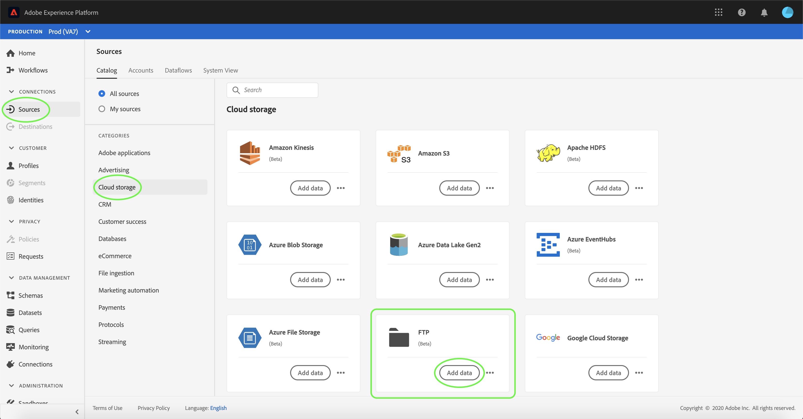

# UI での FTP ソース接続の作成

>[!NOTE]
>
>FTP コネクタはベータ版です。 ベータラベルのコネクタの使用について詳しくは、「[ ソースの概要 ](../../../../home.md#terms-and-conditions)」を参照してください。

このチュートリアルでは、Adobe Experience Platform UI を使用して FTP ソース接続を作成する手順を説明します。

## はじめに

このチュートリアルは、Adobe Experience Platform の次のコンポーネントを実際に利用および理解しているユーザーを対象としています。

* [[!DNL Experience Data Model (XDM)] システム](../../../../../xdm/home.md):顧客体験データを整理する際に使用する標準化されたExperience Platformフレームワーク。
   * [スキーマ構成の基本](../../../../../xdm/schema/composition.md)：スキーマ構成の主要な原則やベストプラクティスなど、XDM スキーマの基本的な構成要素について学びます。
   * [スキーマエディターのチュートリアル](../../../../../xdm/tutorials/create-schema-ui.md):スキーマエディターの UI を使用してカスタムスキーマを作成する方法を説明します。
* [[!DNL Real-time Customer Profile]](../../../../../profile/home.md)：複数のソースからの集計データに基づいて、統合されたリアルタイムの顧客プロファイルを提供します。

既に有効な FTP 接続がある場合は、このドキュメントの残りの部分をスキップして、[ データフローの設定 ](../../dataflow/batch/cloud-storage.md) に関するチュートリアルに進んでください。

### 必要な資格情報の収集

FTP に接続するには、次の接続プロパティの値を指定する必要があります。

| 資格情報 | 説明 |
| ---------- | ----------- |
| `host` | FTP サーバーに関連付けられている名前または IP アドレス。 |
| `username` | FTP サーバーへのアクセス権を持つユーザー名。 |
| `password` | FTP サーバーのパスワード。 |

## FTP サーバーへの接続

必要な資格情報を収集したら、次の手順に従って、新しい FTP アカウントを作成し、Platform に接続します。

[Adobe Experience Platform](https://platform.adobe.com) にログインし、左側のナビゲーションバーから「**[!UICONTROL ソース]**」を選択して、「[!UICONTROL  ソース ]」ワークスペースにアクセスします。 [!UICONTROL  カタログ ] 画面には、受信アカウントを作成するための様々なソースが表示されます。

画面の左側にあるカタログから適切なカテゴリを選択できます。 または、検索オプションを使用して、目的の特定のソースを見つけることもできます。

「[!UICONTROL  クラウドストレージ ]」カテゴリで、「**[!UICONTROL FTP]**」を選択します。 このコネクタを初めて使用する場合は、「**[!UICONTROL 設定]**」を選択します。 それ以外の場合は、「**[!UICONTROL データを追加]**」を選択して新しい FTP 接続を作成します。

「**[!UICONTROL FTP に接続]**」ページが表示されます。 このページでは、新しい資格情報または既存の資格情報を使用できます。

### 新規アカウント

新しい資格情報を使用する場合は、「**[!UICONTROL 新しいアカウント]**」を選択します。 表示される入力フォームで、名前、説明（オプション）および資格情報を入力します。 終了したら、[**[!UICONTROL 接続]**] を選択し、新しい接続が確立されるまでしばらく時間をかけます。

### 既存のアカウント

既存のアカウントに接続するには、接続する FTP アカウントを選択し、「**[!UICONTROL 次へ]**」を選択して次に進みます。

## 次の手順

このチュートリアルに従って、FTP アカウントへの接続を確立しました。 次のチュートリアルに進み、クラウドストレージから Platform](../../dataflow/batch/cloud-storage.md) にデータを取り込むように [ データフローを設定します。
