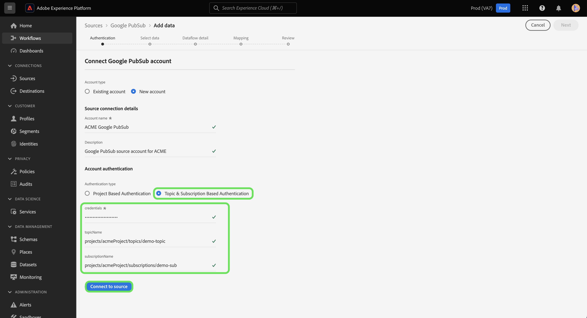

# UI での [!DNL Google PubSub] ソース接続の作成

このチュートリアルでは、Platform ユーザーインターフェイスを使用して、[!DNL Google PubSub]（以下「[!DNL PubSub]」と呼びます）を作成する手順について説明します。

## はじめに

このチュートリアルは、Adobe Experience Platform の次のコンポーネントを実際に利用および理解しているユーザーを対象としています。

* [ソース](../../../../home.md)：Experience Platform を使用すると、データを様々なソースから取得しながら、Platform サービスを使用して受信データの構造化、ラベル付け、拡張を行うことができます。
* [サンドボックス](../../../../../sandboxes/home.md)：Experience Platform には、単一の Platform インスタンスを別々の仮想環境に分割し、デジタルエクスペリエンスアプリケーションの開発と発展に役立つ仮想サンドボックスが用意されています。

既に有効な [!DNL PubSub] 接続がある場合は、このドキュメントの残りの部分をスキップして、[データフローの設定](../../dataflow/batch/cloud-storage.md)に関するチュートリアルに進むことができます。

### 必要な認証情報の収集

[!DNL PubSub] を Platform に接続するには、次の資格情報に対する有効な値を指定する必要があります。

| 認証情報 | 説明 |
| ---------- | ----------- |
| プロジェクト ID | [!DNL PubSub] の認証に必要なプロジェクト ID。 |
| 認証情報 | [!DNL PubSub] の認証に必要な資格情報または秘密鍵の ID。 |
| トピック名 | お客様の [!DNL PubSub] 購読。 In [!DNL PubSub]を使用すると、購読を使用して、メッセージの公開先のトピックを購読することでメッセージを受け取ることができます。 **注意**:単一の [!DNL PubSub] サブスクリプションは 1 つのデータフローに対してのみ使用できます。 複数のデータフローを作成するには、複数のサブスクリプションが必要です。 |
| 購読名 | お客様の [!DNL PubSub] 購読。 In [!DNL PubSub]を使用すると、購読を使用して、メッセージの公開先のトピックを購読することでメッセージを受け取ることができます。 |

これらの値について詳しくは、次の [PubSub 認証](https://cloud.google.com/pubsub/docs/authentication)ドキュメントを参照してください。サービスアカウントベースの認証を使用している場合、資格情報の生成手順については、次の [PubSub ガイド](https://cloud.google.com/docs/authentication/production#create_service_account)を参照してください。

>[!TIP]
>
>サービスアカウントベースの認証を使用している場合は、サービスアカウントに十分なユーザーアクセス権が付与され、資格情報をコピー＆ペーストする際に、JSON 内に余分な空白がないことを確認してください。

必要な資格情報を収集したら、以下の手順に従って [!DNL PubSub] アカウントを Platform にリンクできます。

## [!DNL PubSub] アカウントを接続

Platform UI の左側のナビゲーションバーで「**[!UICONTROL ソース]**」を選択して、[!UICONTROL ソース]ワークスペースにアクセスします。この [!UICONTROL カタログ] 画面には、アカウントを作成できる様々なソースが表示されます。

画面の左側にあるカタログから適切なカテゴリを選択することができます。または、使用する特定のソースを検索オプションを使用して探すこともできます。

[!UICONTROL クラウドストレージ]カテゴリで、**[!UICONTROL Google PubSub]** を選択し、次に&#x200B;**[!UICONTROL データを追加]**&#x200B;を選択します。

**[!UICONTROL Google PubSub に接続]**&#x200B;ページが表示されます。このページでは、新しい資格情報または既存の資格情報を使用できます。

### 既存のアカウント

既存のアカウントを使用するには、新しいデータフローを作成する [!DNL PubSub] アカウントを選択し、「**[!UICONTROL 次へ]**」を選択して続行します。

### 新規アカウント

>[!TIP]
>
>アクセスが制限されたアカウントを作成する場合は、1 つ以上のトピック名またはサブスクリプション名を指定する必要があります。 両方の値が見つからない場合、認証は失敗します。

新しいアカウントを作成する場合は、「 **[!UICONTROL 新しいアカウント]**&#x200B;新しい [!DNL PubSub] アカウント

この [!DNL PubSub] 「ソース」では、認証時に許可するアクセスのタイプを指定できます。 アカウントを設定して、プロジェクトベースの認証を使用することも、トピックおよび購読ベースの認証を使用することもできます。 プロジェクトベースの認証では、アカウント内のルートレベルプロジェクトへのアクセスを許可できますが、トピックおよび購読ベースの認証では、特定のプロジェクトへのアクセスを制限できます [!DNL PubSub] トピックおよび購読。

>[!BEGINTABS]

>[!TAB プロジェクトベースの認証]

ルートへのアクセス権を持つアカウントを作成するには [!DNL PubSub] プロジェクトフォルダー。 選択 **[!UICONTROL Google PubSub 認証資格情報]** を認証タイプとして設定し、プロジェクト ID と資格情報を指定します。 終了したら「**[!UICONTROL ソースに接続]**」を選択し、新しい接続が確立されるまでしばらく待ちます。

>[!TAB トピックおよび購読ベースの認証]

特定のに対するアクセスのみを制限したアカウントを作成するには [!DNL PubSub] トピックと購読、選択 **[!UICONTROL Google PubSub スコープ認証資格情報]** 次に、資格情報、トピック名、サブスクリプション名を入力します。 終了したら「**[!UICONTROL ソースに接続]**」を選択し、新しい接続が確立されるまでしばらく待ちます。

>[!ENDTABS]

>[!NOTE]
>
>に割り当てられたプリンシパル（ロール） [!DNL PubSub] プロジェクトは、 [!DNL PubSub] プロジェクト。 プリンシパル（役割）に特定のトピックへのアクセス権を付与する場合は、そのプリンシパル（役割）もトピックの対応するサブスクリプションに追加する必要があります。 詳しくは、 [[!DNL PubSub] アクセス制御に関するドキュメント](<https://cloud.google.com/pubsub/docs/access-control>).

## データの選択

認証に成功すると、 [!UICONTROL データを選択] ステップ ( [!DNL PubSub] データ階層を参照し、Experience Platformに取り込むデータを選択します。

>[!BEGINTABS]

>[!TAB プロジェクトベースの認証]

プロジェクトベースのアクセス権で認証済みの場合、 [!UICONTROL データを選択] インターフェイスには、トピックが関連付けられているプロジェクト内のすべての購読が表示されます。

>[!TAB トピックおよび購読ベースの認証]

トピックおよび購読ベースのアクセスで認証済みの場合、 [!UICONTROL データを選択] インターフェイスの表示は、指定した情報に応じて異なる場合があります。

* トピック名のみを指定した場合、インターフェイスには、指定したトピックに対応するすべてのトピックと購読のペアが表示されます。
* 購読名のみを指定した場合、インターフェイスには、指定した購読名に対応するすべてのトピックと購読のペアが表示されます。
* トピック名と購読名の両方が指定されている場合、インターフェイスには、指定された値の両方に対応するトピックと購読のペアが表示されます。

>[!ENDTABS]

## 次の手順

このチュートリアルでは、 [!DNL PubSub] アカウントとプラットフォーム。 次のチュートリアルに進み、[データフローを設定して、クラウドストレージから Platform にストリーミングデータを取り込みます](../../dataflow/streaming/cloud-storage-streaming.md)。
