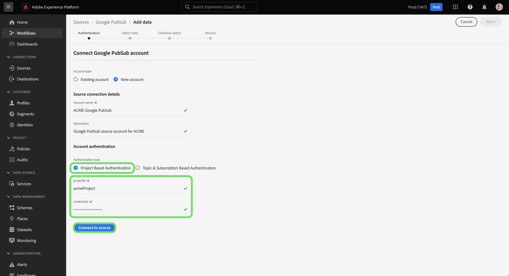

# UI での [!DNL Google PubSub] ソース接続の作成

>[!IMPORTANT]
>
>Real-Time Customer Data Platform Ultimateを購入したユーザーは、ソースカタログで [!DNL Google PubSub] ソースを利用できます。

このチュートリアルでは、Experience Platform ユーザーインターフェイスを使用して、[!DNL Google PubSub] （以下「[!DNL PubSub]」と呼びます）を作成する手順について説明します。

## 基本を学ぶ

このチュートリアルは、Adobe Experience Platform の次のコンポーネントを実際に利用および理解しているユーザーを対象としています。

* [ ソース ](../../../../home.md):Experience Platformを使用すると、データを様々なソースから取得しながら、Experience Platform サービスを使用して受信データの構造化、ラベル付け、拡張を行うことができます。
* [ サンドボックス ](../../../../../sandboxes/home.md): Experience Platformには、1 つのExperience Platform インスタンスを別々の仮想環境に分割し、デジタルエクスペリエンスアプリケーションの開発と発展に役立つ仮想サンドボックスが用意されています。

既に有効な [!DNL PubSub] 接続がある場合は、このドキュメントの残りの部分をスキップして、[データフローの設定](../../dataflow/batch/cloud-storage.md)に関するチュートリアルに進むことができます。

### 必要な資格情報の収集

[!DNL PubSub] アカウントをExperience Platformに接続するには、以下に説明する接続プロパティの値を指定する必要があります。 認証と前提条件の設定について詳しくは、[[!DNL PubSub source]  概要 ](../../../../connectors/cloud-storage/google-pubsub.md#prerequisites) を参照してください。

>[!BEGINTABS]

>[!TAB  プロジェクトベースの認証 ]

| 資格情報 | 説明 |
| --- | --- |
| プロジェクト ID | [!DNL PubSub] の認証に必要なプロジェクト ID。 |
| 資格情報 | [!DNL PubSub] の認証に必要な資格情報。 資格情報から空白を削除した後、必ず完全な JSON ファイルを配置してください。 |

>[!TAB  トピックおよび購読ベースの認証 ]

| 資格情報 | 説明 |
| --- | --- |
| 資格情報 | [!DNL PubSub] の認証に必要な資格情報。 資格情報から空白を削除した後、必ず完全な JSON ファイルを配置してください。 |
| トピック名 | [!DNL PubSub] サブスクリプションの名前。 ま [!DNL PubSub]、購読を使用すると、メッセージの公開先のトピックを購読することで、メッセージを受信できます。 **メモ**:1 つの [!DNL PubSub] 購読は、1 つのデータフローに対してのみ使用できます。 複数のデータフローを作成するには、複数の購読が必要です。 |
| サブスクリプション名 | [!DNL PubSub] サブスクリプションの名前。 ま [!DNL PubSub]、購読を使用すると、メッセージの公開先のトピックを購読することで、メッセージを受信できます。 |

>[!ENDTABS]

これらの値について詳しくは、次の [PubSub 認証](https://cloud.google.com/pubsub/docs/authentication)ドキュメントを参照してください。サービスアカウントベースの認証を使用している場合、資格情報の生成手順については、次の [PubSub ガイド](https://cloud.google.com/docs/authentication/production#create_service_account)を参照してください。

>[!TIP]
>
>サービスアカウントベースの認証を使用している場合は、サービスアカウントに十分なユーザーアクセス権が付与され、資格情報をコピー＆ペーストする際に、JSON 内に余分な空白がないことを確認してください。

必要な資格情報を収集したら、次の手順に従って [!DNL PubSub] アカウントをExperience Platformにリンクできます。

## [!DNL PubSub] アカウントを接続

Experience Platformの UI で、左側のナビゲーションから **[!UICONTROL Sources]** を選択し、[!UICONTROL Sources] ワークスペースにアクセスします。 [!UICONTROL &#x200B; カタログ &#x200B;] 画面には、アカウントを作成できる様々なソースが表示されます。

画面の左側にあるカタログから適切なカテゴリを選択することができます。または、使用する特定のソースを検索オプションを使用して探すこともできます。

[!UICONTROL クラウドストレージ]カテゴリで、**[!UICONTROL Google PubSub]** を選択し、次に&#x200B;**[!UICONTROL データを追加]**&#x200B;を選択します。

**[!UICONTROL Google PubSub に接続]**&#x200B;ページが表示されます。このページでは、新しい資格情報または既存の資格情報を使用できます。

### 既存のアカウント

既存のアカウントを使用するには、新しいデータフローを作成する [!DNL PubSub] アカウントを選択し、「**[!UICONTROL 次へ]**」を選択して続行します。

### 新規アカウント

>[!TIP]
>
>* アクセスが制限されたアカウントを作成する場合は、トピック名またはサブスクリプション名の少なくとも 1 つを指定する必要があります。 両方の値がない場合、認証は失敗します。
>* 作成した後は、[!DNL Google PubSub] ベース接続の認証タイプを変更できません。 認証タイプを変更するには、新しいベース接続を作成する必要があります。

新しいアカウントを作成する場合は、「**[!UICONTROL 新しいアカウント]**」を選択し、新しい [!DNL PubSub] アカウントの名前と説明（オプション）を入力します。

[!DNL PubSub] ソースでは、認証時に許可するアクセスの種類を指定できます。 アカウントを設定して、プロジェクトベースの認証か、トピックおよび購読ベースの認証を持つことができます。 プロジェクトベースの認証では、アカウントのルートレベルのプロジェクトへのアクセス権を付与でき、トピックおよび購読ベースの認証では、特定の [!DNL PubSub] トピックおよび購読へのアクセスを制限できます。

>[!BEGINTABS]

>[!TAB  プロジェクトベースの認証 ]

ルート [!DNL PubSub] プロジェクトフォルダーへのアクセス権を持つアカウントを作成するには： 認証の種類として **[!UICONTROL Google PubSub 認証資格情報]** を選択し、プロジェクト ID と資格情報を入力します。 終了したら「**[!UICONTROL ソースに接続]**」を選択し、新しい接続が確立されるまでしばらく待ちます。

>[!TAB  トピックおよび購読ベースの認証 ]

特定の [!DNL PubSub] トピックおよびサブスクリプションに対してのみアクセスが制限されたアカウントを作成するには、**[!UICONTROL Google PubSub スコープ認証資格情報を選択してから]** 資格情報、トピック名、サブスクリプション名を指定します。 終了したら「**[!UICONTROL ソースに接続]**」を選択し、新しい接続が確立されるまでしばらく待ちます。

>[!ENDTABS]

>[!NOTE]
>
>[!DNL PubSub] プロジェクトに割り当てられたプリンシパル（役割）は、[!DNL PubSub] プロジェクト内で作成されたすべてのトピックと購読に継承されます。 プリンシパル（役割）に特定のトピックへのアクセス権を付与する場合は、そのプリンシパル（役割）もトピックの対応するサブスクリプションに追加する必要があります。 詳しくは、[[!DNL PubSub]  アクセス制御に関するドキュメント ](<https://cloud.google.com/pubsub/docs/access-control>) を参照してください。

## データの選択

認証が成功すると、[!UICONTROL &#x200B; データを選択 &#x200B;] ステップに移動します。このステップでは、[!DNL PubSub] データ階層内を移動し、Experience Platformに取り込むデータを選択できます。

>[!BEGINTABS]

>[!TAB  プロジェクトベースの認証 ]

プロジェクトベースのアクセスで認証した場合、[!UICONTROL &#x200B; データを選択 &#x200B;] インターフェイスには、トピックが添付されたプロジェクト内のすべての購読が表示されます。

>[!TAB  トピックおよび購読ベースの認証 ]

トピックおよび購読ベースのアクセスで認証されている場合、[!UICONTROL &#x200B; データを選択 &#x200B;] インターフェイスの表示は、指定した情報によって異なる場合があります。

* トピック名のみを指定した場合、インターフェイスには、指定されたトピックに対応するすべてのトピックと購読のペアが表示されます。
* 購読名のみを指定した場合、インターフェイスには、指定された購読名に対応するすべてのトピックと購読のペアが表示されます。
* トピック名と購読名の両方が指定されている場合、インターフェイスには、指定された値の両方に対応するトピックと購読のペアが表示されます。

>[!ENDTABS]

## 次の手順

このチュートリアルでは、[!DNL PubSub] アカウントとExperience Platformの間に接続を作成しました。 次のチュートリアルに進み、[ データフローを設定して、クラウドストレージからExperience Platformにストリーミングデータを取り込む ](../../dataflow/streaming/cloud-storage-streaming.md) ことができます。
