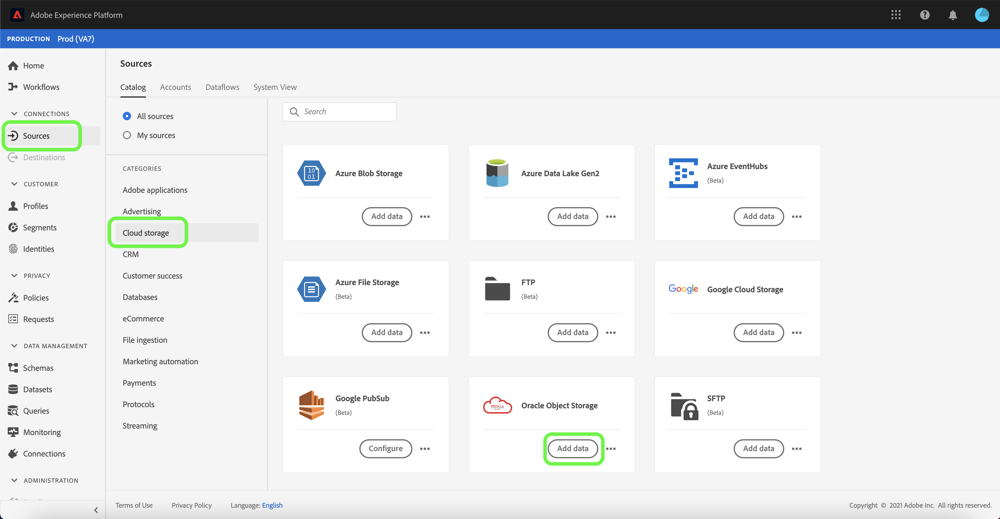

# UI での [!DNL Oracle Object Storage] Source接続の作成

このチュートリアルでは、Adobe Experience Platform UI を使用して [!DNL Oracle Object Storage] ソース接続を作成する手順について説明します。

## はじめに

このチュートリアルは、Adobe Experience Platform の次のコンポーネントを実際に利用および理解しているユーザーを対象としています。

* [ソース](../../../../home.md)：Experience Platform を使用すると、データを様々なソースから取得しながら、Platform サービスを使用して受信データの構造化、ラベル付け、拡張を行うことができます。
* [サンドボックス](../../../../../sandboxes/home.md)：Experience Platform には、単一の Platform インスタンスを別々の仮想環境に分割し、デジタルエクスペリエンスアプリケーションの開発と発展に役立つ仮想サンドボックスが用意されています。

### 必要な資格情報の収集

を [!DNL Oracle Object Storage] に接続するには、次の接続プロパティの値を指定する必要があります。

| 資格情報 | 説明 |
| ---------- | ----------- |
| `serviceUrl` | 認証に必要な [!DNL Oracle Object Storage] エンドポイント。 エンドポイントの形式は `https://{OBJECT_STORAGE_NAMESPACE}.compat.objectstorage.eu-frankfurt-1.oraclecloud.com` です。 |
| `accessKey` | 認証に必要な [!DNL Oracle Object Storage] アクセスキー ID。 |
| `secretKey` | 認証に必要な [!DNL Oracle Object Storage] パスワード。 |
| `bucketName` | ユーザーがアクセスを制限している場合に必要な、許可されたバケット名。 バケット名は 3 ～ 63 文字で、先頭と末尾は文字または数字である必要があります。また、小文字、数字、ハイフン （`-`）のみを含めることができます。 バケット名を IP アドレスのようにフォーマットすることはできません。 |
| `folderPath` | ユーザーがアクセスを制限している場合は、許可されたフォルダーパスが必要です。 |

これらの値の取得方法の詳細については、[Oracleオブジェクト ストレージの認証ガイド ](https://docs.oracle.com/en-us/iaas/Content/Identity/Concepts/usercredentials.htm#User_Credentials) を参照してください。

必要な資格情報を収集したら、次の手順に従って、Platform に接続する新しいOracleオブジェクトストレージアカウントを作成できます。

## oracle オブジェクト ストレージへの接続

Platform の UI で、左側のナビゲーションバーで「**[!UICONTROL ソース]**」を選択し、[!UICONTROL ソース]ワークスペースにアクセスします。[!UICONTROL カタログ]画面には、アカウントを作成できる様々なソースが表示されます。

画面の左側にあるカタログから適切なカテゴリを選択することができます。または、検索バーを使用して、利用したい特定のソースを見つけることもできます。

「[!UICONTROL  クラウドストレージ ]」カテゴリで、「**[!UICONTROL Oracleオブジェクトストレージ]**」を選択し、「**[!UICONTROL データを追加]**」を選択します。

### 既存のアカウント

既存のアカウントを使用するには、新しいデータフローを作成する [!DNL Oracle Object Storage] アカウントを選択し、「**[!UICONTROL 次へ]**」を選択して続行します。

### 新しいアカウント

新しいアカウントを作成する場合は、「**[!UICONTROL 新規アカウント]**」を選択し、続けて名前、説明（オプション）、[!DNL Oracle Object Storage] の資格情報を指定します。終了したら「**[!UICONTROL ソースに接続]**」を選択し、新しい接続が確立されるまでしばらく待ちます。

## 次の手順

このチュートリアルでは、[!DNL Oracle Object Storage] アカウントとの接続を確立しました。次は、[ クラウドストレージから Platform にデータを取り込むためのデータフローの設定 ](../../dataflow/batch/cloud-storage.md) に関するチュートリアルに進むことができます。
