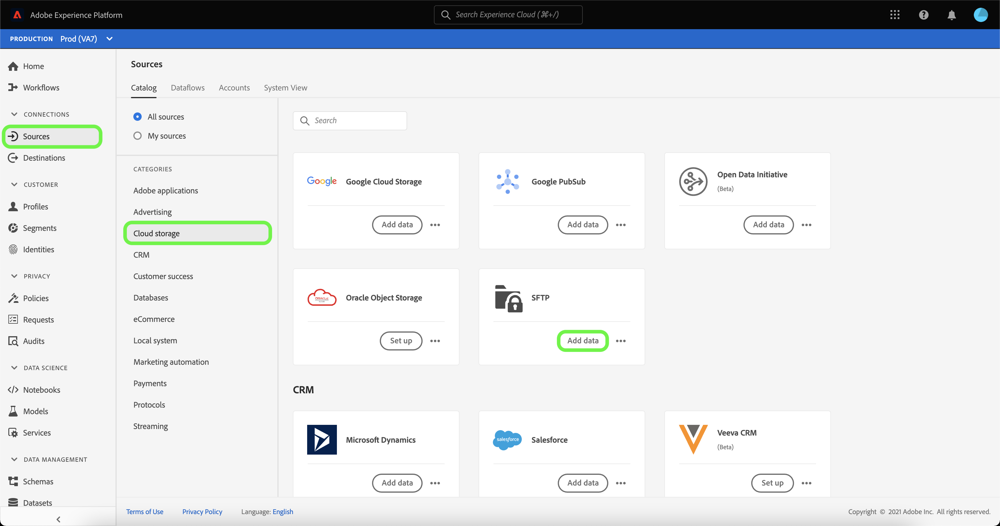

# UI での [!DNL SFTP] ソース接続の作成

このチュートリアルでは、Adobe Experience Platform UI を使用して [!DNL SFTP] ソース接続を作成する手順を説明します。

## はじめに

このチュートリアルは、 Platform の次のコンポーネントを実際に利用および理解しているユーザーを対象としています。

* [[!DNL Experience Data Model (XDM)] システム](../../../../../xdm/home.md):顧客体験データを整理する際に使用する標準化されたExperience Platformフレームワーク。
   * [スキーマ構成の基本](../../../../../xdm/schema/composition.md)：スキーマ構成の主要な原則やベストプラクティスなど、XDM スキーマの基本的な構成要素について学びます。
   * [スキーマエディターのチュートリアル](../../../../../xdm/tutorials/create-schema-ui.md):スキーマエディターの UI を使用してカスタムスキーマを作成する方法を説明します。
* [[!DNL Real-time Customer Profile]](../../../../../profile/home.md)：複数のソースからの集計データに基づいて、統合されたリアルタイムの顧客プロファイルを提供します。

>[!IMPORTANT]
>
>[!DNL SFTP] ソース接続を持つ JSON オブジェクトを取り込む場合は、改行やキャリッジリターンを避けることをお勧めします。 この制限を回避するには、1 行に 1 つの JSON オブジェクトを使用し、その後のファイルに複数行を使用します。

既に有効な [!DNL SFTP] 接続がある場合は、このドキュメントの残りの部分をスキップし、[ データフローの設定 ](../../dataflow/batch/cloud-storage.md) に関するチュートリアルに進んでください。

### 必要な資格情報の収集

[!DNL SFTP] に接続するには、次の接続プロパティの値を指定する必要があります。

| 資格情報 | 説明 |
| ---------- | ----------- |
| `host` | [!DNL SFTP] サーバーに関連付けられている名前または IP アドレス。 |
| `port` | 接続先の [!DNL SFTP] サーバポート。 指定しない場合、値のデフォルトは `22` です。 |
| `username` | [!DNL SFTP] サーバーへのアクセス権を持つユーザー名。 |
| `password` | [!DNL SFTP] サーバーのパスワード。 |
| `privateKeyContent` | Base64 でエンコードされた SSH 秘密鍵のコンテンツ。 OpenSSH キーのタイプは、RSA または DSA に分類する必要があります。 |
| `passPhrase` | 鍵ファイルや鍵の内容がパスフレーズで保護されている場合に秘密鍵を復号化するパスフレーズまたはパスワード。 PrivateKeyContent がパスワードで保護されている場合、このパラメーターは PrivateKeyContent のパスフレーズと共に値として使用する必要があります。 |

必要な資格情報を収集したら、以下の手順に従って新しい [!DNL SFTP] アカウントを作成し、Platform に接続します。

## [!DNL SFTP] サーバーに接続する

プラットフォーム UI で、左のナビゲーションバーから「 **[!UICONTROL ソース]** 」を選択して、「 [!UICONTROL  ソース ] 」ワークスペースにアクセスします。 [!UICONTROL  カタログ ] 画面には、受信アカウントを作成するための様々なソースが表示されます。

画面の左側にあるカタログから適切なカテゴリを選択できます。 または、検索オプションを使用して、目的の特定のソースを見つけることもできます。

「[!UICONTROL  クラウドストレージ ]」カテゴリで、「**[!UICONTROL SFTP]**」を選択し、「**[!UICONTROL データを追加]**」を選択します。

「**[!UICONTROL SFTP に接続]**」ページが表示されます。 このページでは、新しい資格情報または既存の資格情報を使用できます。

### 既存のアカウント

既存のアカウントに接続するには、接続する FTP または SFTP アカウントを選択し、「**[!UICONTROL 次へ]**」を選択して次に進みます。

### 新規アカウント

新しいアカウントを作成する場合は、「**[!UICONTROL 新しいアカウント]**」を選択し、新しい [!DNL SFTP] アカウントの名前と説明（オプション）を入力します。

#### パスワードを使用した認証

[!DNL SFTP] は、アクセス用に様々な認証タイプをサポートしています。「**[!UICONTROL アカウント認証]**」で「**[!UICONTROL パスワード]**」を選択し、接続するホストとポートの値を、ユーザー名とパスワードと共に指定します。

#### SSH 公開鍵を使用した認証

SSH 公開鍵ベースの資格情報を使用するには、**[!UICONTROL SSH 公開鍵]** を選択し、ホストとポートの値、および秘密鍵の内容とパスフレーズの組み合わせを指定します。

>[!IMPORTANT]
>
>SFTP は、RSA または DSA タイプの OpenSSH 鍵をサポートします。 キーファイルの内容が `"-----BEGIN [RSA/DSA] PRIVATE KEY-----"` で始まり、`"-----END [RSA/DSA] PRIVATE KEY-----"` で終わることを確認します。 秘密鍵ファイルが PPK 形式のファイルの場合は、PuTTY ツールを使用して PPK 形式から OpenSSH 形式に変換します。

| 資格情報 | 説明 |
| ---------- | ----------- |
| 秘密鍵コンテンツ | Base64 でエンコードされた SSH 秘密鍵のコンテンツ。 OpenSSH キーのタイプは、RSA または DSA に分類する必要があります。 |
| パスフレーズ | キーファイルやキーの内容がパスフレーズで保護されている場合に秘密鍵を復号化するパスフレーズまたはパスワードを指定します。 PrivateKeyContent がパスワードで保護されている場合、このパラメーターは PrivateKeyContent のパスフレーズを値として使用する必要があります。 |

## 次の手順

このチュートリアルに従って、SFTP アカウントへの接続を確立しました。 次のチュートリアルに進み、クラウドストレージから Platform](../../dataflow/batch/cloud-storage.md) にデータを取り込むように [ データフローを設定します。
