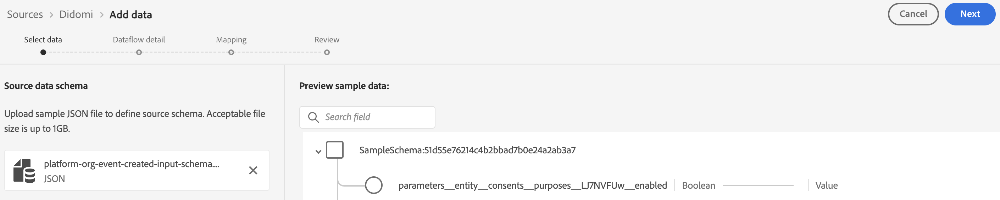

# [!DNL Didomi] をExperience Platformに接続

>[!AVAILABILITY]
>
>[!DNL Didomi] ソースはベータ版です。ベータラベル付きソースの使用について詳しくは、ソースの概要の [ 利用条件 ](../../../../home.md#terms-and-conditions) を参照してください。

このガイドでは、UI のソースワークスペースを使用して [!DNL Didomi] アカウントをAdobe Experience Platformに接続する方法について説明します。

>[!IMPORTANT]
>
>* このドキュメントページは、*Didomi* チームが作成したものです。 お問い合わせや更新のリクエストについては、*support@didomi.io* まで直接ご連絡ください。
>* 接続を生成する手順については、[Didomi Adobe ソースコネクタのドキュメント ](https://developers.didomi.io/integrations/third-party-apps/preference-management-platform-integrations/Adobe-source-connector) を参照してください。

## 基本を学ぶ

このチュートリアルは、Adobe Experience Platform の次のコンポーネントを実際に利用および理解しているユーザーを対象としています。

* [[!DNL Experience Data Model (XDM)] システム](../../../../../xdm/home.md)：Experience Platform が顧客体験データの整理に使用する標準化されたフレームワーク。
   * [スキーマ構成の基本](../../../../../xdm/schema/composition.md)：スキーマ構成の主要な原則やベストプラクティスなど、XDM スキーマの基本的な構成要素について学びます。
   * [スキーマエディターのチュートリアル](../../../../../xdm/tutorials/create-schema-ui.md)：スキーマエディター UI を使用してカスタムスキーマを作成する方法を説明します。
* [[!DNL Real-Time Customer Profile]](../../../../../profile/home.md)：複数のソースからの集計データに基づいて、統合されたリアルタイムの顧客プロファイルを提供します。

### [!DNL Didomi] アカウントの設定

続行する前に、「概要 [[!DNL Didomi]  に記載されている前提条件の手順を読んで完了し、アカウントをExperience Platformに正常に接続していることを確認してください ](../../../../connectors/consent-and-preferences/didomi.md#prerequisites)。

## ソースカタログのナビゲート

Experience Platformの UI で、左側のナビゲーションから **[!UICONTROL Sources]** を選択し、*[!UICONTROL Sources]* ワークスペースにアクセスします。 カテゴリを選択するか、検索バーを使用してソースを検索します。

[!DNL Didomi] に接続するには、[*[!UICONTROL データベース]*] カテゴリに移動し、&lbrack;**[!UICONTROL Didomi]** ソース カードを選択してから [**[!UICONTROL 設定]**] を選択します。

>[!TIP]
>
>ソースカタログ内のソースは、特定のソースがまだ認証済みのアカウントを持っていない場合に「**[!UICONTROL 設定]**」オプションを表示します。 認証済みアカウントを作成すると、このオプションは **[!UICONTROL データを追加]** に変わります。

## ソースデータスキーマの追加

次に、*[!UICONTROL データを選択]* インターフェイスを使用して、（前提条件の手順でダウンロードした [JSON ファイルをアップロード ](../../../../connectors/consent-and-preferences/didomi.md#download-the-sample-payload-file) ます。

プレビューインターフェイスを使用して、ペイロードのファイル構造を表示できます。 終了したら、「**[!UICONTROL 次へ]**」を選択します。

## データフローの詳細を入力

次に、データセットとデータフローに関する情報を指定する必要があります。

### データセットの詳細

データセットは、スキーマ（列）とフィールド（行）で構成されるデータコレクション（通常はテーブル）を格納し管理するための構造です。Experience Platformに正常に取り込まれたデータは、データレイク内にデータセットとして保持されます。

この手順では、既存のデータセットを使用するか、新しいデータセットを作成します。

>[!NOTE]
>
>既存のデータセットを使用するか、新しいデータセットを作成するかに関係なく、データセットが取り込み **プロファイルに対して有効** になっていることを確認する必要があります。

+++プロファイル取り込み、エラー診断、部分取り込みを有効にする手順を選択します。

データセットがリアルタイム顧客プロファイルに対して有効になっている場合、この手順の間に **[!UICONTROL プロファイルデータセット]** を切り替えて、プロファイル取り込み用のデータを有効にすることができます。 また、この手順を使用して、**[!UICONTROL エラー診断]** および **[!UICONTROL 部分取り込み]** を有効にすることもできます。

* **[!UICONTROL エラー診断]**: **[!UICONTROL エラー診断]** を選択して、データセットアクティビティとデータフローステータスを監視する際に後で参照できるエラー診断を生成するようにソースに指示します。
* **[!UICONTROL 部分取り込み]**：部分バッチ取り込みは、設定可能な特定のしきい値まで、エラーを含んだデータを取り込む機能です。 この機能を使用すると、正確なデータをすべてExperience Platformに正常に取り込みながら、不正なデータがすべて無効な理由に関する情報と共に個別にバッチ処理されます。

+++

### データフローの詳細

データセットを設定したら、名前、説明（オプション）、アラート設定など、データフローの詳細を指定する必要があります。

| データフロー設定 | 説明 |
| --- | --- |
| データフロー名 | データフローの名前。  デフォルトでは、読み込まれるファイルの名前が使用されます。 |
| 説明 | （任意）データフローの簡単な説明です。 |
| アラート | Experience Platformは、ユーザーが登録できるイベントベースのアラートを作成でき、これらのオプションは、これらをトリガーにする実行中のデータフローです。  詳しくは、[ アラートの概要 ](../../alerts.md) を参照してください <ul><li>**ソースデータフロー実行開始**：データフロー実行が開始したときに通知を受け取るには、このアラートを選択します。</li><li>**ソースデータフロー実行成功**：データフローがエラーなく終了した場合に通知を受け取るには、このアラートを選択します。</li><li>**ソースデータフロー実行の失敗**：データフローの実行がエラーで終了した場合に通知を受け取るには、このアラートを選択します。</li></ul> |

{style="table-layout:auto"}

## マッピング

マッピングインターフェイスを使用して、データをExperience Platformに取り込む前に、ソースデータを適切なスキーマフィールドにマッピングします。  詳しくは、UI の [ マッピングガイド ](../../../../../data-prep/ui/mapping.md) を参照してください。

マッピングは、**からExperience Platform データセットに** 目的のデータ [!DNL Didomi] を転送するために特別に使用されます。 これらの目的は、ユーザーの同意の選択肢（分析、パーソナライゼーション、広告のためなど）を表し、この統合で許可される唯一のマッピングフィールドです。

[ Webhook 設定から ](../../../../connectors/consent-and-preferences/didomi.md#download-the-sample-payload-file) ダウンロードしたサンプル Webhook ペイロード [!DNL Didomi] を使用して、各 [!DNL Didomi] の目的をAdobe データセットの適切なフィールドにマッピングします。

終了したら、「**[!UICONTROL 次へ]**」を選択します。

## レビュー

*[!UICONTROL レビュー]* 手順が表示され、データフローを作成する前に詳細をレビューできます。 詳細は、次のカテゴリ内でグループ化されます。

* **[!UICONTROL 接続]**：アカウント名、ソースプラットフォーム、ソース名が表示されます。
* **[!UICONTROL データセットの割り当てとフィールドのマッピング]**：ターゲットデータセットと、そのデータセットが準拠するスキーマを表示します。

詳細が正しいことを確認したら、「**[!UICONTROL 終了]**」を選択します。

## ストリーミングエンドポイント URL の取得

接続が作成されると、ソースの詳細ページが表示されます。 このページには、以前に実行したデータフロー、ID、ストリーミングエンドポイント URL など、新しく作成した接続の詳細が表示されます。

## Adobeの設定を完了します。

データフローが作成されたら、*[!UICONTROL ソース]* カタログに移動し、「**[!UICONTROL データフロー]**」を選択します。 データフローディレクトリを使用して [!DNL Didomi] のデータフローを探し、*[!UICONTROL データフローアクティビティ]* インターフェイスにアクセスします。 次に、右側のパネルの *[!UICONTROL プロパティ]* パネルを使用して、以下の値を取得します。

* [!UICONTROL &#x200B; ストリーミングエンドポイント &#x200B;]
* [!UICONTROL &#x200B; データフロー ID]

Experience Platform UI で、次の操作を行います。

1. 設定が完了したら、Webhook の初期設定で見つからなかった設定パラメーターを確認します。
2. これらの値が使用可能になったら、Didomi に戻り、Webhook 設定を更新します。

## Webhook 設定の更新

設定が完了したら、[!DNL Didomi] コンソールに戻り、**ストリーミングエンドポイント URL** と **データフロー ID** を使用して Webhook 設定を更新します。

これが完了 [!DNL Didomi] ると、統合を通じて同意管理および環境設定管理イベントの送信が開始され、データがAdobe データセットに保存されます。

## 次の手順

このチュートリアルでは、[!DNL Didomi] ソースからExperience Platformにバッチデータを取り込むデータフローを正常に作成しました。 その他のリソースについては、以下に概要を説明するドキュメントを参照してください。

### データフローの監視

データフローを作成したら、そのデータフローを通じて取り込まれるデータを監視し、取り込み率、成功、エラーに関する情報を表示できます。 データフローのモニタリング方法について詳しくは、[UI でのアカウントとデータフローのモニタリング ](../../../../../dataflows/ui/monitor-sources.md) のチュートリアルを参照してください。

### データフローの更新

データフローのスケジュール、マッピング、一般情報の設定を更新するには、[UI でのソースデータフローの更新 ](../../update-dataflows.md) に関するチュートリアルを参照してください。

### データフローの削除

不要になったデータフローや誤って作成されたデータフローは、**[!UICONTROL データフロー]**&#x200B;ワークスペース内にある&#x200B;**[!UICONTROL 削除]**&#x200B;機能で削除できます。データフローの削除方法について詳しくは、[UI でのデータフローの削除 ](../../delete.md) のチュートリアルを参照してください。
