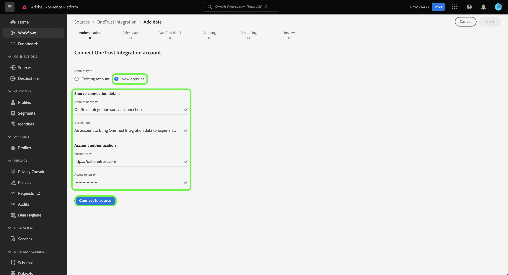

# （ベータ版） [!DNL OneTrust Integration] UI のソース接続

>[!NOTE]
>
>この [!DNL OneTrust Integration] ソースはベータ版です。 機能とドキュメントは変更される場合があります。 ベータ版のラベル付きソースの使用について詳しくは、 [ソースの概要](../../../../home.md#terms-and-conditions).

このチュートリアルでは、 [[!DNL OneTrust Integration]](https://my.onetrust.com/s/contactsupport?language=en_US) Platform ユーザーインターフェイスを使用して、履歴データとスケジュールされた同意データの両方をAdobe Experience Platformに取り込むためのソース接続。

## 前提条件

>[!IMPORTANT]
>
>この [!DNL OneTrust Integration] ソースコネクタとドキュメントは [!DNL OneTrust Integration] チーム。 お問い合わせや更新のご依頼については、 [[!DNL OneTrust] チーム](https://my.onetrust.com/s/contactsupport?language=en_US) 直接

接続する前に [!DNL OneTrust Integration] Platform に接続する場合は、最初にアクセストークンを取得する必要があります。 アクセストークンの検索方法について詳しくは、 [[!DNL OneTrust Integration] OAuth 2 ガイド](https://developer.onetrust.com/docs/api-docs-v3/b3A6MjI4OTUyOTc-generate-access-token).

システム間の更新トークンはではサポートされていないので、有効期限が切れた後、アクセストークンは自動的に更新されません。 [!DNL OneTrust]. したがって、アクセストークンの有効期限が切れる前に、接続でアクセストークンを必ず更新しておく必要があります。 アクセストークンの設定可能な最大有効期間は 1 年です。 アクセストークンの更新について詳しくは、 [[!DNL OneTrust] OAuth 2.0 クライアント資格情報の管理に関するドキュメント](https://developer.onetrust.com/docs/documentation/ZG9jOjIyODk1MTUw-managing-o-auth-2-0-client-credentials).

### 必要な認証情報の収集

接続するには [!DNL OneTrust Integration] を Platform に設定するには、次の認証資格情報の値を指定する必要があります。

| 認証情報 | 説明 | 例 |
| --- | --- | --- |
| ホスト | 環境 [!DNL OneTrust Integration] からデータを取り込む必要があります。 | `https://uat.onetrust.com/` |
| 認証テスト URL | （オプション）認証テスト URL は、ベース接続の作成時に認証情報を検証するために使用されます。指定しない場合、代わりにソース接続の作成時に資格情報が自動的にチェックされます。 |  |
| アクセストークン | に対応するアクセストークン [!DNL OneTrust Integration] アカウント | `ZGFkZDMyMjFhMmEyNDQ2ZGFhNTdkZjNkZjFmM2IyOWE6QjlUSERVUTNjOFVsRmpEZTJ6Vk9oRnF3Sk8xNlNtcm4=` |

これらの資格情報について詳しくは、 [[!DNL OneTrust Integration] 認証ドキュメント](https://developer.onetrust.com/docs/api-docs-v3/b3A6MjI4OTUyOTc-generate-access-token).

## [!DNL OneTrust Integration] アカウントを接続

>[!NOTE]
>
>この [!DNL OneTrust Integration] API の仕様は、データ取り込み用にAdobeと共有されています。

Platform の UI で、左側のナビゲーションバーで「**[!UICONTROL ソース]**」を選択し、[!UICONTROL ソース]ワークスペースにアクセスします。[!UICONTROL カタログ]画面には、アカウントを作成できる様々なソースが表示されます。

画面の左側にあるカタログから適切なカテゴリを選択することができます。または、使用する特定のソースを検索オプションを使用して探すこともできます。

以下 *[!UICONTROL 同意と環境設定]* カテゴリ、選択 [!DNL OneTrust Integration]を選択し、 **[!UICONTROL データを追加]**.

この **[!UICONTROL OneTrust 統合アカウントに接続]** ページが表示されます。 このページでは、新しい資格情報または既存の資格情報を使用できます。

### 既存のアカウント

既存のアカウントを使用するには、新しいデータフローを作成する [!DNL OneTrust Integration] アカウントを選択し、「**[!UICONTROL 次へ]**」を選択して続行します。

### 新しいアカウント

新しいアカウントを作成する場合は、「**[!UICONTROL 新規アカウント]**」を選択し、続けて名前、説明（オプション）、 の認証情報を指定します。終了したら「**[!UICONTROL ソースに接続]**」を選択し、新しい接続が確立されるまでしばらく待ちます。

## 次の手順

このチュートリアルでは、[!DNL OneTrust Integration] アカウントとの接続を確立しました。次のチュートリアルに進み、 [データフローを設定して、同意データを Platform に取り込む](../../dataflow/consent-and-preferences.md).
