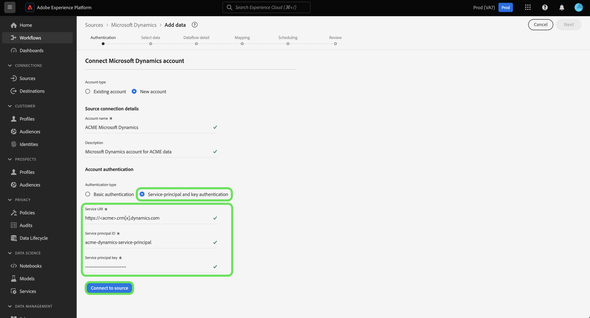

# UI での [!DNL Microsoft Dynamics] ソース接続の作成

このチュートリアルでは、 [!DNL Microsoft Dynamics] （以下「」という。）[!DNL Dynamics]&quot;) Adobe Experience Platform UI を使用したソース接続。

## はじめに

このチュートリアルは、Adobe Experience Platform の次のコンポーネントを実際に利用および理解しているユーザーを対象としています。

* [[!DNL Experience Data Model (XDM)] システム](../../../../../xdm/home.md)：Experience Platform が顧客体験データの整理に使用する標準化されたフレームワーク。
   * [スキーマ構成の基本](../../../../../xdm/schema/composition.md)：スキーマ構成の主要な原則やベストプラクティスなど、XDM スキーマの基本的な構成要素について学びます。
   * [スキーマエディターのチュートリアル](../../../../../xdm/tutorials/create-schema-ui.md)：スキーマエディター UI を使用してカスタムスキーマを作成する方法を説明します。
* [[!DNL Real-Time Customer Profile]](../../../../../profile/home.md)：複数のソースからの集計データに基づいて、統合されたリアルタイムの顧客プロファイルを提供します。

既に有効な [!DNL Dynamics] アカウントを使用する場合は、このドキュメントの残りの部分をスキップし、次のチュートリアルに進んでください： [CRM ソース用のデータフローの設定](../../dataflow/crm.md).

### 必要な資格情報の収集

を認証するために、 [!DNL Dynamics] ソースの場合、次の接続プロパティの値を指定する必要があります。

>[!BEGINTABS]

>[!TAB 基本認証]

| 資格情報 | 説明 |
| --- | --- |
| `serviceUri` | のサービス URL [!DNL Dynamics] インスタンス。 |
| `username` | のユーザー名 [!DNL Dynamics] ユーザーアカウント。 |
| `password` | ユーザーのパスワード [!DNL Dynamics] アカウント。 |

>[!TAB サービスプリンシパルおよびキー認証]

| 資格情報 | 説明 |
| --- | --- |
| `servicePrincipalId` | のクライアント ID [!DNL Dynamics] アカウント。 この ID は、サービスプリンシパルとキーベースの認証を使用する場合に必要です。 |
| `servicePrincipalKey` | サービスプリンシパル秘密鍵です。 この資格情報は、サービスプリンシパルとキーベースの認証を使用する場合に必要です。 |

>[!ENDTABS]

の導入について詳しくは、 [この [!DNL Dynamics] 文書](https://docs.microsoft.com/en-us/powerapps/developer/common-data-service/authenticate-oauth).

## [!DNL Dynamics] アカウントを接続

Platform UI の左側のナビゲーションバーで「**[!UICONTROL ソース]**」を選択して、[!UICONTROL ソース]ワークスペースにアクセスします。The [!UICONTROL カタログ] 画面には、アカウントを作成できる様々なソースが表示されます。

画面の左側にあるカタログから適切なカテゴリを選択することができます。または、使用する特定のソースを検索オプションを使用して探すこともできます。

の下 [!UICONTROL CRM] カテゴリ、選択 **[!UICONTROL Microsoft Dynamics]**&#x200B;を選択し、 **[!UICONTROL データを追加]**.

The **[!UICONTROL Microsoft Dynamics アカウントに接続]** ページが表示されます。 このページでは、新しい資格情報または既存の資格情報を使用できます。

### 既存のアカウント

既存のアカウントを使用するには、 [!DNL Dynamics] 使用するアカウントを選択し、 **[!UICONTROL 次へ]** をクリックして次に進みます。

### 新しいアカウント

>[!TIP]
>
>作成後は、 [!DNL Dynamics] ベース接続。 認証タイプを変更するには、新しいベース接続を作成する必要があります。

新しいアカウントを作成するには、 **[!UICONTROL 新しいアカウント]**&#x200B;をクリックし、新しい [!DNL Dynamics] アカウント。

を作成する際に、基本認証、またはサービスプリンシパルとキー認証を使用できます [!DNL Dynamics] アカウント。

>[!BEGINTABS]

>[!TAB 基本認証]

を作成するには、以下を実行します。 [!DNL Dynamics] 基本認証を使用するアカウント： [!UICONTROL 基本認証] 次に、 [!UICONTROL サービス URI], [!UICONTROL ユーザー名]、および [!UICONTROL パスワード]. **注意**：での基本認証 [!DNL Dynamics] は、現在 Platform ではサポートされていない 2 要素認証によってブロックされる場合があります。 この場合、キーベースの認証を使用して、 [!DNL Dynamics].

終了したら、「 」を選択します。 **[!UICONTROL ソースに接続]** そして、新しいアカウントが確立されるまでしばらく待ちます。

>[!TAB サービスプリンシパルおよびキー認証]

を作成するには、以下を実行します。 [!DNL Dynamics] service-principal および key 認証を持つアカウントを選択します。 **[!UICONTROL サービスプリンシパルおよびキー認証]** 次に、 [!UICONTROL サービスプリンシパル ID] および [!UICONTROL サービスプリンシパルキー].

終了したら、「 」を選択します。 **[!UICONTROL ソースに接続]** そして、新しいアカウントが確立されるまでしばらく待ちます。

>[!ENDTABS]

## 次の手順

このチュートリアルでは、[!DNL Dynamics] アカウントとの接続を確立しました。次のチュートリアルに進み、[データを Platform に取り込むためのデータフローの設定](../../dataflow/crm.md)を行いましょう。
