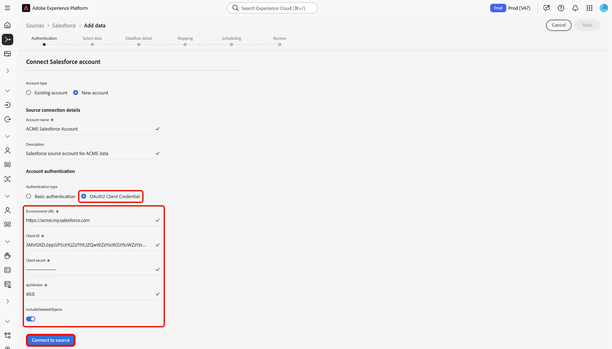

# UI を使用した [!DNL Salesforce] アカウントのExperience Platformへの接続

このガイドでは、[!DNL Salesforce] アカウントを連携し、Experience Platform ユーザーインターフェイスを使用して CRM データをAdobe Experience Platformに取り込む方法について説明します。

## はじめに

このチュートリアルは、 Experience Platform の次のコンポーネントを実際に利用および理解しているユーザーを対象としています。

* [[!DNL Experience Data Model (XDM)] システム](../../../../../xdm/home.md)：Experience Platform が顧客体験データの整理に使用する標準化されたフレームワーク。
   * [スキーマ構成の基本](../../../../../xdm/schema/composition.md)：スキーマ構成の主要な原則やベストプラクティスなど、XDM スキーマの基本的な構成要素について学びます。
   * [スキーマエディターのチュートリアル](../../../../../xdm/tutorials/create-schema-ui.md)：スキーマエディター UI を使用してカスタムスキーマを作成する方法を説明します。
* [[!DNL Real-Time Customer Profile]](../../../../../profile/home.md)：複数のソースからの集計データに基づいて、統合されたリアルタイムの顧客プロファイルを提供します。

認証済みの [!DNL Salesforce] アカウントが既にある場合は、このドキュメントの残りの部分をスキップし、[CRM データのデータフローの設定 &#x200B;](../../dataflow/crm.md) に関するチュートリアルに進むことができます。

### 必要な資格情報の収集 {#gather-required-credentials}

>[!WARNING]
>
>[!DNL Salesforce] ソースの基本認証は、2026 年 1 月に廃止されます。 ソースの使用と [!DNL Salesforce] アカウントからExperience Platformへのデータの取り込みを続行するには、OAuth 2 クライアント資格情報認証に移行する必要があります。

[!DNL Salesforce] ソースは、基本認証と OAuth2 クライアント資格情報をサポートしています。

>[!BEGINTABS]

>[!TAB  基本認証 ]

基本認証を使用して [!DNL Salesforce] アカウントに接続するには、次の資格情報の値を指定する必要があります。

| 資格情報 | 説明 |
| --- | --- |
| 環境 URL | [!DNL Salesforce] ソースインスタンスの URL。 環境 URL の形式は `https://[domain].my.salesforce.com` です。 |
| ユーザー名 | [!DNL Salesforce] ユーザーアカウントのユーザー名。 |
| パスワード | [!DNL Salesforce] ユーザーアカウントのパスワード。 |
| セキュリティトークン | [!DNL Salesforce] ユーザーアカウントのセキュリティ トークン。 |
| API バージョン | （オプション）使用している [!DNL Salesforce] インスタンスの REST API バージョン。 API バージョンの値は、10 進数でフォーマットする必要があります。 例えば、API バージョン `52` を使用している場合、値を `52.0` と入力する必要があります。 このフィールドを空白のままにすると、Experience Platformでは使用可能な最新バージョンが自動的に使用されます。 |

認証について詳しくは、[&#x200B; この  [!DNL Salesforce]  認証ガイド &#x200B;](https://developer.salesforce.com/docs/atlas.en-us.api_rest.meta/api_rest/quickstart_oauth.htm) を参照してください。

>[!TAB OAuth2 クライアント資格情報 ]

OAuth2 クライアント資格情報を使用して [!DNL Salesforce] アカウントに接続するには、次の資格情報の値を指定する必要があります。

| 資格情報 | 説明 |
| --- | --- |
| 環境 URL | [!DNL Salesforce] ソースインスタンスの URL。 環境 URL の形式は `https://[domain].my.salesforce.com` です。 |
| クライアント ID | クライアント ID は、OAuth2 認証の一部として、クライアント秘密鍵と並行して使用されます。 クライアント ID とクライアント秘密鍵を一緒に使用すると、[!DNL Salesforce] ーザー先のアプリケーションを識別することにより、お客様のアカウントに代わってアプリケーションが動作することができます。 |
| クライアントシークレット | クライアントの秘密鍵は、クライアント ID と並行して、OAuth2 認証の一部として使用されます。 クライアント ID とクライアント秘密鍵を一緒に使用すると、[!DNL Salesforce] ーザー先のアプリケーションを識別することにより、お客様のアカウントに代わってアプリケーションが動作することができます。 |
| API バージョン | 使用している [!DNL Salesforce] インスタンスの REST API バージョン。 API バージョンの値は、10 進数でフォーマットする必要があります。 例えば、API バージョン `52` を使用している場合、値を `52.0` と入力する必要があります。 このフィールドを空白のままにすると、Experience Platformでは使用可能な最新バージョンが自動的に使用されます。 |
| 削除されたオブジェクトを含める | ソフト削除されたレコードを含めるかどうかを決定するために使用されるブール値。 true に設定した場合、[!DNL Salesforce] クエリにソフト削除レコードを含めて、アカウントからExperience Platformに取り込むことができます。設定を指定しない場合、この値はデフォルトで `false` になります。 |

[!DNL Salesforce] に対する OAuth の使用について詳しくは、[[!DNL Salesforce] OAuth 認証フローのガイド &#x200B;](https://help.salesforce.com/s/articleView?id=sf.remoteaccess_oauth_flows.htm&type=5) を参照してください。

>[!ENDTABS]

必要な資格情報を収集したら、次の手順に従って [!DNL Salesforce] アカウントをExperience Platformに接続できます。

## [!DNL Salesforce] アカウントを接続

Experience Platformの UI で、左側のメニューから **[!UICONTROL Sources]** に移動し、[!UICONTROL Sources] ワークスペースを開きます。 左側のカタログを使用してカテゴリを参照するか、検索バーを使用して接続するソースをすばやく見つけます。

**[!DNL Salesforce]** CRM *[!UICONTROL カテゴリの下の「]*」を選択し、「**[!UICONTROL データを追加]**」を選択します。

>[!TIP]
>
>ソースカタログには、アカウントが接続されていない場合は **[!UICONTROL 設定]**、アカウントが既に認証されている場合は **[!UICONTROL データを追加]** と表示されます。

**[!UICONTROL Salesforceへの接続]** ページが表示されます。 このページでは、新しい資格情報または既存の資格情報を使用できます。

### 既存のアカウントを使用

既存のアカウントを使用するには、「**[!UICONTROL 既存のアカウント]**」を選択し、表示されるリストから使用するアカウントを選択します。 終了したら、「**[!UICONTROL 次へ]** を選択して続行します。

### 新しいアカウントを作成

新しいアカウントを作成するには、「**[!UICONTROL 新しいアカウント]**」を選択し、新しい [!DNL Salesforce] アカウントの名前と説明を入力します。

次に、新しいアカウントに使用する認証タイプを選択します。

>[!BEGINTABS]

>[!TAB  基本認証 ]

基本認証の場合は、「**[!UICONTROL 基本認証]** を選択し、次の資格情報の値を指定します。

* 環境 URL
* ユーザー名
* パスワード
* API バージョン （オプション）

終了したら「**[!UICONTROL ソースに接続]**」を選択します。

>[!TAB OAuth2 クライアント資格情報 ]

「OAuth 2 クライアント資格情報」で、「**[!UICONTROL OAuth2 クライアント資格情報]** を選択し、次の資格情報の値を入力します。

* 環境 URL
* クライアント ID
* クライアントシークレット
* API バージョン
* 削除オブジェクトを含める

終了したら「**[!UICONTROL ソースに接続]**」を選択します。

>[!ENDTABS]

### サンプルデータのプレビューをスキップ {#skip-preview-of-sample-data}

データ選択手順で、大きなテーブルまたはファイルのデータを取り込む際にタイムアウトが発生することがあります。 データプレビューをスキップして、タイムアウトを回避し、サンプルデータがなくてもスキーマを表示できます。 データのプレビューをスキップするには、「サンプルデータのプレビューをスキップ **[!UICONTROL 切替スイッチを有効]** します。

残りのワークフローは変わりません。 唯一の注意点は、データのプレビューをスキップすると、マッピングステップ中に計算フィールドと必須フィールドが自動検証されない可能性があり、マッピング中にこれらのフィールドを手動で検証する必要があるということです。

## 次の手順

このチュートリアルでは、[!DNL Salesforce] アカウントとの接続を確立しました。次のチュートリアルに進み、[&#x200B; データをに取り込むためのデータフローの設定  [!DNL Experience Platform]](../../dataflow/crm.md) を行いましょう。
