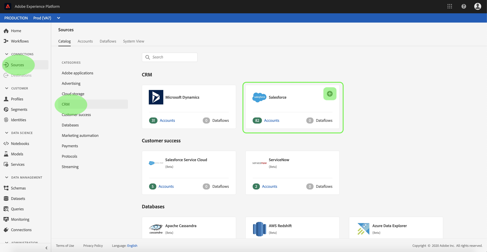

# UIを使用して[!DNL Salesforce] アカウントをExperience Platformに接続します

このガイドでは、[!DNL Salesforce] アカウントを接続し、Experience Platform ユーザーインターフェイスを使用してCRM データをAdobe Experience Platformに取り込む方法について説明します。

## はじめに

このチュートリアルは、 Experience Platform の次のコンポーネントを実際に利用および理解しているユーザーを対象としています。

* [[!DNL Experience Data Model (XDM)] システム](../../../../../xdm/home.md)：Experience Platform が顧客体験データの整理に使用する標準化されたフレームワーク。
   * [スキーマ構成の基本](../../../../../xdm/schema/composition.md)：スキーマ構成の主要な原則やベストプラクティスなど、XDM スキーマの基本的な構成要素について学びます。
   * [スキーマエディターのチュートリアル](../../../../../xdm/tutorials/create-schema-ui.md)：スキーマエディター UI を使用してカスタムスキーマを作成する方法を説明します。
* [[!DNL Real-Time Customer Profile]](../../../../../profile/home.md)：複数のソースからの集計データに基づいて、統合されたリアルタイムの顧客プロファイルを提供します。

既に認証済みの[!DNL Salesforce] アカウントをお持ちの場合は、このドキュメントの残りの部分をスキップして、[CRM データのデータフローの設定](../../dataflow/crm.md)に関するチュートリアルに進むことができます。

### 必要な資格情報の収集 {#gather-required-credentials}

[!DNL Salesforce] ソースは、OAuth2 クライアント資格情報による認証をサポートしています。

| 資格情報 | 説明 |
| --- | --- |
| 環境 URL | [!DNL Salesforce] ソースインスタンスのURL。 環境URLの形式は`https://[domain].my.salesforce.com`です。 |
| クライアント ID | クライアント IDは、OAuth2認証の一環として、クライアント秘密鍵と並行して使用されます。 クライアント IDとクライアント秘密鍵を組み合わせることで、アプリケーションを[!DNL Salesforce]に対して識別し、アカウントの代理でアプリケーションを操作できるようになります。 |
| クライアントシークレット | クライアント秘密鍵は、OAuth2認証の一環として、クライアント IDと並行して使用されます。 クライアント IDとクライアント秘密鍵を組み合わせることで、アプリケーションを[!DNL Salesforce]に対して識別し、アカウントの代理でアプリケーションを操作できるようになります。 |
| API バージョン | 使用している[!DNL Salesforce] インスタンスのREST API バージョン。 API バージョンの値は、10進数でフォーマットする必要があります。 例えば、API バージョン `52`を使用している場合、値を`52.0`として入力する必要があります。 このフィールドを空白のままにすると、Experience Platformは使用可能な最新バージョンを自動的に使用します。 |
| 削除されたオブジェクトを含める | 削除されたレコードをソフトで含めるかどうかを判断するために使用されるブール値。 trueに設定すると、ソフト削除されたレコードを[!DNL Salesforce] クエリに含め、アカウントからExperience Platformに取り込むことができます。設定を指定しない場合、この値はデフォルトで`false`になります。 |

[!DNL Salesforce]でのOAuthの使用について詳しくは、[[!DNL Salesforce] OAuth認証フローに関するガイド ](https://help.salesforce.com/s/articleView?id=sf.remoteaccess_oauth_flows.htm&type=5)を参照してください。

## [!DNL Salesforce] アカウントを接続

Experience Platform UIで、左側のメニューから&#x200B;**[!UICONTROL Sources]**&#x200B;に移動して、[!UICONTROL Sources] ワークスペースを開きます。 左側のカタログを使用してカテゴリを参照するか、検索バーを使用して、接続するソースをすばやく見つけます。

「*[!UICONTROL CRM]*」カテゴリの「**[!DNL Salesforce]**」を選択し、「**[!UICONTROL Add data]**」を選択します。

>[!TIP]
>
>ソースカタログでは、アカウントが接続されていない場合は&#x200B;**[!UICONTROL Set up]**、アカウントが既に認証されている場合は&#x200B;**[!UICONTROL Add data]**&#x200B;と表示されます。

**[!UICONTROL Connect to Salesforce]** ページが表示されます。 このページでは、新しい資格情報または既存の資格情報を使用できます。

### 既存のアカウントの使用

既存のアカウントを使用するには、**[!UICONTROL Existing account]**&#x200B;を選択し、表示されるリストから使用するアカウントを選択します。 完了したら、**[!UICONTROL Next]**&#x200B;を選択して続行します。

### 新しいアカウントを作成

新しいアカウントを作成するには、**[!UICONTROL New account]**&#x200B;を選択し、新しい[!DNL Salesforce] アカウントの名前と説明を入力します。

OAuth 2 クライアント資格情報の場合、**[!UICONTROL OAuth2 Client Credential]**&#x200B;を選択し、次の資格情報の値を指定します。

* 環境 URL
* クライアント ID
* クライアントシークレット
* API バージョン
* 削除オブジェクトを含める

終了したら「**[!UICONTROL Connect to source]**」を選択します。

### サンプルデータのプレビューをスキップ {#skip-preview-of-sample-data}

データ選択ステップで、大きなテーブルまたはデータファイルを取り込む際にタイムアウトが発生する場合があります。 データプレビューをスキップしてタイムアウトを回避し、サンプルデータを含めなくてもスキーマを表示できます。 データのプレビューをスキップするには、**[!UICONTROL Skip previewing sample data]** トグルを有効にします。

ワークフローの残りの部分は同じままです。 唯一の注意点は、データプレビューをスキップすると、マッピングステップ中に計算フィールドと必須フィールドが自動検証されなくなる可能性があり、マッピング中にこれらのフィールドを手動で検証する必要があることです。

## 次の手順

このチュートリアルでは、[!DNL Salesforce] アカウントとの接続を確立しました。 次のチュートリアルに進み、[ データフローを設定して [!DNL Experience Platform]](../../dataflow/crm.md)にデータを取り込めるようになりました。
