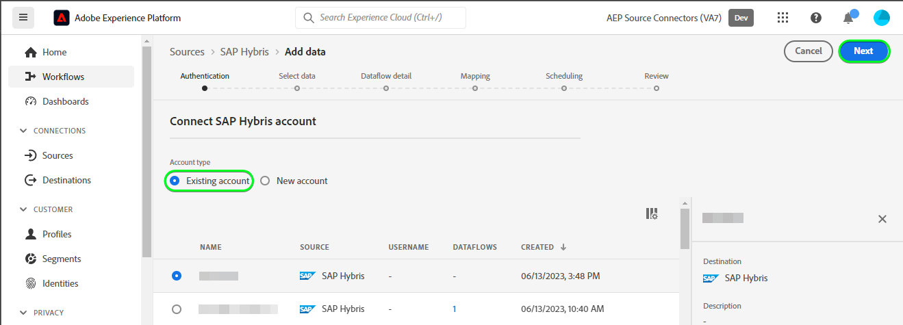
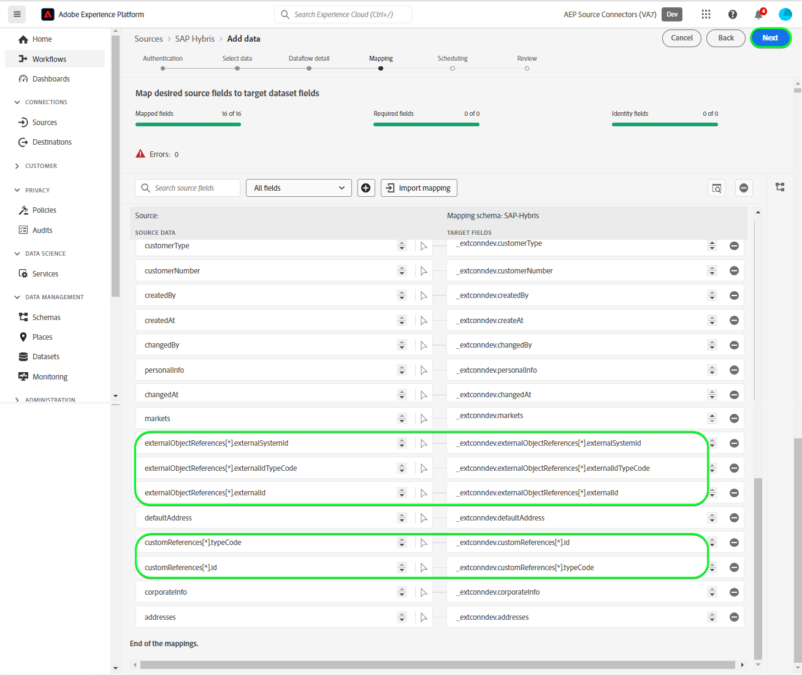

# UI での [!DNL SAP Hybris] ソース接続の作成

>[!NOTE]
>
>[!DNL SAP Hybris] ソースはベータ版です。詳しくは、 [ソースの概要](../../../../home.md#terms-and-conditions) ベータラベル付きのソースの使用に関する詳細

次のチュートリアルでは、 [!DNL SAP Hybris] 持ち込むソース接続 [[!DNL SAP] サブスクリプション請求](https://www.sap.com/products/financial-management/subscription-billing.html) Adobe Experience Platformユーザーインターフェイスを使用しての連絡先と顧客データ。

## はじめに {#getting-started}

このチュートリアルは、 Experience Platform の次のコンポーネントを実際に利用および理解しているユーザーを対象としています。

* [[!DNL Experience Data Model (XDM)]  システム](../../../../../xdm/home.md)：[!DNL Experience Platform] が顧客体験データの整理に使用する標準化されたフレームワーク。
   * [スキーマ構成の基本](../../../../../xdm/schema/composition.md)：スキーマ構成の主要な原則やベストプラクティスなど、XDM スキーマの基本的な構成要素について学びます。
   * [スキーマエディターのチュートリアル](../../../../../xdm/tutorials/create-schema-ui.md)：スキーマエディター UI を使用してカスタムスキーマを作成する方法を説明します。
* [[!DNL Real-Time Customer Profile]](../../../../../profile/home.md)：複数のソースからの集計データに基づいて、統合されたリアルタイムの顧客プロファイルを提供します。

有効な [!DNL SAP Hybris] アカウントを既にお持ちの場合は、このドキュメントの残りの部分をスキップし、[データフローの設定](../../dataflow/crm.md)に関するチュートリアルに進んでください。

### 必要な認証情報の収集 {#gather-credentials}

接続するには [!DNL SAP Hybris] をExperience Platformするには、次の接続プロパティの値を指定する必要があります。

| 資格情報 | 説明 |
| --- | --- |
| クライアント ID | の値 `clientId` サービスキーから。 |
| クライアントシークレット | の値 `clientSecret` サービスキーから。 |
| トークンエンドポイント | の値 `url` サービスキーから、次のようになります。 `https://subscriptionbilling.authentication.eu10.hana.ondemand.com`. |
| 領域 | データセンターの場所。 地域が `url` の値は、 `eu10` または `us10`. 例えば、 `url` が `https://eu10.revenue.cloud.sap/api` 必要なもの `eu10`. |

詳しくは、 [[!DNL SAP Hybris] ドキュメント](https://help.sap.com/docs/CLOUD_TO_CASH_OD/987aec876092428f88162e438acf80d6/c5fcaf96daff4c7a8520188e4d8a1843.html).

### Platform スキーマの作成 {#create-platform-schema}

を作成する前に [!DNL SAP Hybris] ソース接続の場合は、まず、ソースに使用するExperience Platformスキーマを作成する必要があります。 に関するチュートリアルを参照してください。 [Platform スキーマの作成](../../../../../xdm/schema/composition.md) スキーマの作成方法に関する包括的な手順を参照してください。

次のセクションを展開して、サンプルのスキーマを表示します。

+++ スキーマの例を表示

```
{
  "_extconndev": {
    "addresses": [
      {
        "addressUUID": "{ADDRESS_UUID}",
        "city": "Burnaby",
        "country": "Canada",
        "email": "chandni@acme.com",
        "houseNumber": "27",
        "isDefault": false,
        "phone": "123-456-7890",
        "postalCode": "V3J 1X9",
        "state": "British Columbia",
        "street": "Beresford"
      }
    ],
    "changedAt": "1687204041",
    "changedBy": "vero@acme.com",
    "contactNumber": "123-456-7980",
    "corporateInfo": {
      "company": "acme"
    },
    "createAt": "1687204041",
    "createdBy": "vero@acme.com",
    "customReferences": [
      {
        "id": "Sample value",
        "typeCode": "Sample value"
      }
    ],
    "customerNumber": "Sample value",
    "customerType": "Sample value",
    "defaultAddress": {
      "addressUUID": "Sample value",
      "city": "North Vancouver",
      "country": "Canada",
      "email": "chandni@acme.come",
      "houseNumber": "34",
      "isDefault": false,
      "phone": "123-456-7890",
      "postalCode": "V7H 2P1",
      "state": "British Columbia",
      "street": "Maple"
    },
    "externalObjectReferences": [
      {
        "externalId": "{EXTERNAL_ID}",
        "externalIdTypeCode": "{EXTERNAL_ID_TYPE_CODE}",
        "externalSystemId": "{EXTERNAL_SYSTEM_ID}"
      }
    ],
    "markets": [
      {
        "active": false,
        "country": "USA",
        "currency": "USD",
        "marketId": "Sample value",
        "priceinfo": {
          "incoterms": "{INCO_TERMS}",
          "incotermsLocation": "{INCO_TERMS_LOCATION}",
          "priceGroup": "{PRICE_GROUP}",
          "priceListType": "{PRICE_LIST_TYPE}"
        },
        "salesArea": {
          "distributionChannel": "{DISTRIBUTION_CHANNEL}",
          "division": "{DIVISION}",
          "salesOrganization": "{SALES_ORGANIZATION}"
        }
      }
    ],
    "personalInfo": {
      "firstName": "Chandni",
      "lastName": "Kaur"
    }
  },
  "_id": "/uri-reference",
  "_repo": {
    "createDate": "2004-10-23T12:00:00-06:00",
    "modifyDate": "2004-10-23T12:00:00-06:00"
  },
  "createdByBatchID": "/uri-reference",
  "modifiedByBatchID": "/uri-reference",
  "personID": "{PERSON_ID}",
  "repositoryCreatedBy": "kevin@acme.com",
  "repositoryLastModifiedBy": "kevin@acme.com"
}
```

+++

## [!DNL SAP Hybris] アカウントの接続 {#connect-account}

Platform UI の左側のナビゲーションバーで「**[!UICONTROL ソース]**」を選択し、[!UICONTROL ソース]ワークスペースにアクセスします。[!UICONTROL カタログ]画面には、アカウントを作成できる様々なソースが表示されます。

画面の左側にあるカタログから適切なカテゴリを選択することができます。または、使用する特定のソースを検索オプションを使用して探すこともできます。

以下 *CRM* カテゴリ、選択 **[!UICONTROL SAP Hybris]**&#x200B;を選択し、 **[!UICONTROL データを追加]**.


この **[!UICONTROL SAP Hybris アカウントの接続]** ページが表示されます。 このページでは、新しい資格情報または既存の資格情報を使用できます。

### 既存のアカウント {#existing-account}

既存のアカウントを使用するには、新しいデータフローを作成する [!DNL SAP Hybris] アカウントを選択し、「**[!UICONTROL 次へ]**」を選択して続行します。



### 新規アカウント {#new-account}

新しいアカウントを作成する場合は、「**[!UICONTROL 新規アカウント]**」を選択し、続けて名前、説明（オプション）、 の認証情報を指定します。終了したら「**[!UICONTROL ソースに接続]**」を選択し、新しい接続が確立されるまでしばらく待ちます。


### データの選択 {#select-data}

最後に、Platform に取り込むオブジェクトタイプを選択する必要があります。

| オブジェクトタイプ | 説明 |
| --- | --- |
| `Customers` | 購読を持つエンティティ。 |
| `Contacts` | 顧客の連絡先の詳細。 |

>[!BEGINTABS]

>[!TAB 顧客]

顧客データを取り込むには、 **[!UICONTROL 顧客]** を選択し、 **[!UICONTROL 次へ]**.


>[!TAB 連絡先]

連絡先データを取り込むには、 **[!UICONTROL 連絡先]** を選択し、 **[!UICONTROL 次へ]**.


>[!ENDTABS]

## 次の手順 {#next-steps}

このチュートリアルでは、[!DNL SAP Hybris] アカウントとの接続を確立しました。次のチュートリアルに進み、 [CRM データを Platform に取り込むためのデータフローの設定](../../dataflow/crm.md).

## その他のリソース {#additional-resources}

以下の節では、 [!DNL SAP Hybris] ソース。

### マッピング {#mapping}

Platform は、選択したターゲットスキーマまたはデータセットに基づいて、自動マッピングされたフィールドに対するインテリジェントなレコメンデーションを提供します。 マッピングルールは、ユースケースに合わせて手動で調整できます。必要に応じて、フィールドを直接マッピングするか、データ準備機能を使用してソースデータを変換して計算値を導き出すかを選択できます。マッパーインターフェイスと計算フィールドを使用した包括的な手順については、 [データ準備 UI ガイド](../../../../../data-prep/ui/mapping.md).

データフローのマッピング設定は、スキーマと、取り込むように選択したオブジェクトタイプに応じて異なります。

>[!BEGINTABS]

>[!TAB 顧客]

顧客データの場合、 [!DNL SAP Hybris] は [顧客](https://api.sap.com/api/BusinessPartner_APIs/path/GET_customers) そして [顧客と連絡先の関係](https://api.sap.com/api/BusinessPartner_APIs/path/GET_relationships-customer-contacts) のエンドポイント [!DNL SAP Business Partners] データを取得する API

以下は、 [!DNL SAP Hybris] 顧客データのデータフロー：

| ターゲットフィールド | 説明 |
| --- | --- |
| `customerNumber` | 顧客の番号。 |
| `corporateInfo` | 顧客の番号。 |
| `customerType` | 顧客タイプ。 |
| `createdAt` | 顧客がいつ作成されたかを示すタイムスタンプ。 |
| `changedAt` | 顧客が最後に更新された日時を示すタイムスタンプ。 |
| `markets[*].country` | 顧客は、配列オブジェクトとして取得された市場を市場に投入します。 |
| `addresses[*].email` | 顧客の複数のアドレスに関連付けられ、配列オブジェクトとして取得された E メール。 |
| `addresses[*].city` | 顧客の複数のアドレスに関連付けられ、配列オブジェクトとして取得された市区町村。 |
| `addresses[*].addressUUID` | 顧客の複数のアドレスに関連付けられ、配列オブジェクトとして取得された ID。 |
| `externalObjectReferences[*].externalSystemId` | 配列オブジェクトとして取得された追加データ。 |
| `externalObjectReferences[*].externalId` | 配列オブジェクトとして取得された追加データ。 |
| `customReferences[*].id` | 配列オブジェクトとして取得された追加データ。 |
| `customReferences[*].typeCode` | 配列オブジェクトとして取得された追加データ。 |



>[!TAB 連絡先]

連絡先データの場合、 [!DNL SAP Hybris] は [連絡先](https://api.sap.com/api/BusinessPartner_APIs/path/GET_contacts) エンドポイント [!DNL SAP Business Partners] データを取得する API。

以下は、 [!DNL SAP Hybris] 連絡先データのデータフロー：

| ターゲットフィールド | 説明 |
| --- | --- |
| `contactNumber` | 連絡先の番号。 |
| `createdAt` | 連絡先がいつ作成されたかを示すタイムスタンプ。 |
| `changedAt` | 連絡先が最後に更新された日時を示すタイムスタンプ。 |
| `personalInfo.lastName` | 連絡先の姓。 |
| `personalInfo.firstName` | 連絡先の名。 |
| `externalObjectReferences[*].externalSystemId` | 配列オブジェクトとして取得された追加データ。 |
| `externalObjectReferences[*].externalId` | 配列オブジェクトとして取得された追加データ。 |
| `externalObjectReferences[*].externalIdTypeCode` | 配列オブジェクトとして取得された追加データ。 |


>[!ENDTABS]

