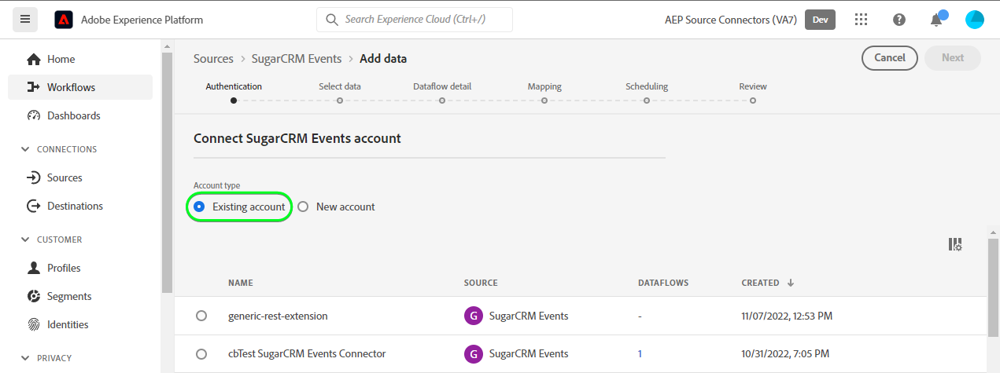

# UI での [!DNL SugarCRM Events] ソース接続の作成

このチュートリアルでは、 [!DNL SugarCRM Events] Adobe Experience Platformユーザーインターフェイスを使用したソース接続

## はじめに

このチュートリアルは、 Experience Platform の次のコンポーネントを実際に利用および理解しているユーザーを対象としています。

* [[!DNL Experience Data Model (XDM)]  システム](../../../../../xdm/home.md)：[!DNL Experience Platform] が顧客体験データの整理に使用する標準化されたフレームワーク。
   * [スキーマ構成の基本](../../../../../xdm/schema/composition.md)：スキーマ構成の主要な原則やベストプラクティスなど、XDM スキーマの基本的な構成要素について学びます。
   * [スキーマエディターのチュートリアル](../../../../../xdm/tutorials/create-schema-ui.md)：スキーマエディター UI を使用してカスタムスキーマを作成する方法を説明します。
* [[!DNL Real-Time Customer Profile]](../../../../../profile/home.md)：複数のソースからの集計データに基づいて、統合されたリアルタイムの顧客プロファイルを提供します。

有効な [!DNL SugarCRM] アカウントを既にお持ちの場合は、このドキュメントの残りの部分をスキップし、[データフローの設定](../../dataflow/crm.md)に関するチュートリアルに進んでください。

### 必要な認証情報の収集

[!DNL SugarCRM Events] を Platform に接続するには、次の接続プロパティの値を指定する必要があります。

| 認証情報 | 説明 | 例 |
| --- | --- | --- |
| `Host` | ソースが接続する SugarCRM API エンドポイント。 | `developer.salesfusion.com` |
| `Username` | SugarCRM 開発者アカウントのユーザー名。 | `abc.def@example.com@sugarmarketdemo000.com` |
| `Password` | SugarCRM 開発者アカウントのパスワード。 | `123456789` |

### 用の Platform スキーマの作成 [!DNL SugarCRM]

を作成する前に [!DNL SugarCRM] ソース接続の場合は、まず、ソースに使用する Platform スキーマを作成する必要もあります。 に関するチュートリアルを参照してください。 [Platform スキーマの作成](../../../../../xdm/schema/composition.md) スキーマの作成方法に関する包括的な手順を参照してください。

>[!WARNING]
>
>スキーマをマッピングする際は、必須の `event_id` および `timestamp` Platform で必要なフィールド。

## [!DNL SugarCRM Events] アカウントの接続

Platform UI の左側のナビゲーションバーで「**[!UICONTROL ソース]**」を選択し、[!UICONTROL ソース]ワークスペースにアクセスします。[!UICONTROL カタログ]画面には、アカウントを作成できる様々なソースが表示されます。

画面の左側にあるカタログから適切なカテゴリを選択することができます。または、使用する特定のソースを検索オプションを使用して探すこともできます。

の下 *CRM* カテゴリ、選択 **[!UICONTROL SugarCRM イベント]**&#x200B;を選択し、 **[!UICONTROL データを追加]**.

The **[!UICONTROL SugarCRM イベントアカウントを接続]** ページが表示されます。 このページでは、新しい資格情報または既存の資格情報を使用できます。

### 既存のアカウント

既存のアカウントを使用するには、新しいデータフローを作成する [!DNL SugarCRM Events] アカウントを選択し、「**[!UICONTROL 次へ]**」を選択して続行します。

### 新規アカウント

新しいアカウントを作成する場合は、「**[!UICONTROL 新規アカウント]**」を選択し、続けて名前、説明（オプション）、 の認証情報を指定します。終了したら「**[!UICONTROL ソースに接続]**」を選択し、新しい接続が確立されるまでしばらく待ちます。

## 次の手順

このチュートリアルでは、[!DNL SugarCRM Events] アカウントとの接続を確立しました。次のチュートリアルに進み、[データを Platform に取り込むためのデータフローの設定](../../dataflow/crm.md)を行いましょう。

## その他のリソース

以下の節では、 [!DNL SugarCRM] ソース。

### ガードレール {#guardrails}

The [!DNL SugarCRM] API スロットル率は、1 分あたり 90 呼び出し、または 1 日あたり 2,000 呼び出し（いずれか最初に実行される方）です。 ただし、この制限は、レート制限に達しないようにリクエスト時間を遅延させるパラメーターを接続仕様に追加することで回避されました。

### 検証 {#validation}

ソースとが正しく設定されていることを検証するには、以下を実行します。 [!DNL SugarCRM Events] データを取り込む場合は、次の手順に従います。

* Platform UI で、「 」を選択します。 **[!UICONTROL データフローを表示]** の横に [!DNL SugarCRM Events] ソースカタログのカードメニュー 次に、「 **[!UICONTROL データセットをプレビュー]** をクリックして、取り込まれたデータを確認します。

* 操作しているオブジェクトタイプに応じて、集計データを、 [!DNL SugarMarket] 以下のイベントページ：

>[!NOTE]
>
>The [!DNL SugarMarket] ページには、削除されたオブジェクトの数は含まれません。 ただし、このソースを通じて取得されたデータには削除された数も含まれるので、削除済みフラグが付けられます。
