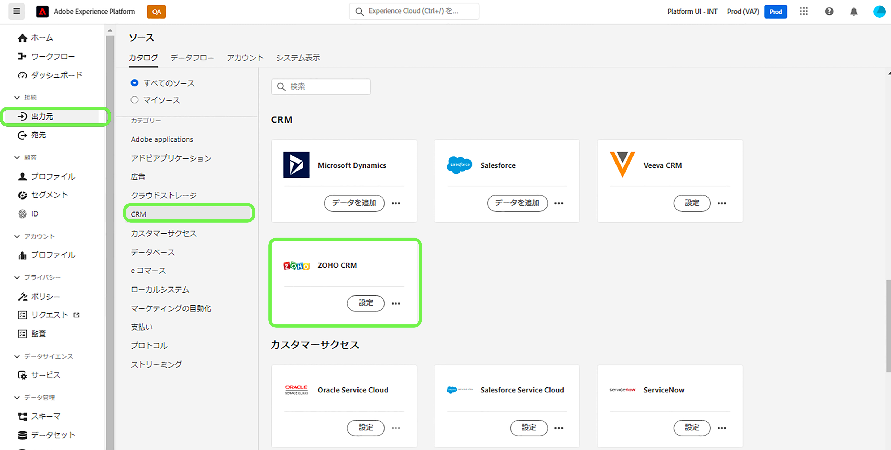
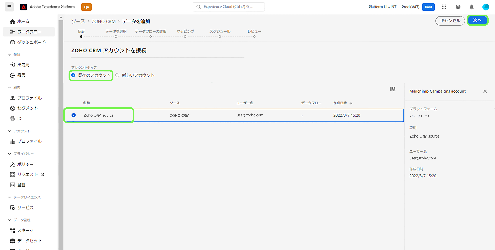
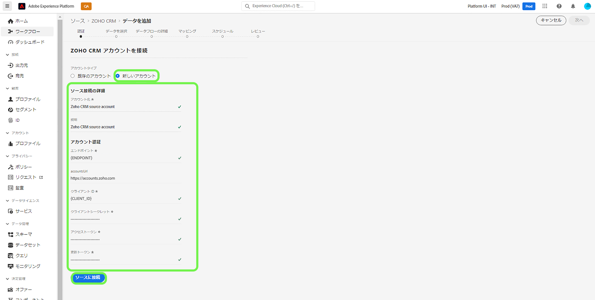

# UI での [!DNL Zoho CRM] ソース接続の作成

Adobe Experience Platform のソースコネクタには、外部ソースの CRM データを設定したスケジュールに従って取り込む機能が用意されています。 このチュートリアルでは、[!DNL Platform] のユーザーインターフェイスを使用して [!DNL Zoho CRM] ソースコネクタを作成する手順を説明します。

## はじめに

このチュートリアルは、Adobe Experience Platform の次のコンポーネントを実際に利用および理解しているユーザーを対象としています。

* [[!DNL Experience Data Model (XDM)]  システム](../../../../../xdm/home.md)：[!DNL Experience Platform] が顧客体験データの整理に使用する標準化されたフレームワーク。
   * [スキーマ構成の基本](../../../../../xdm/schema/composition.md)：スキーマ構成の主要な原則やベストプラクティスなど、XDM スキーマの基本的な構成要素について学びます。
   * [スキーマエディターのチュートリアル](../../../../../xdm/tutorials/create-schema-ui.md)：スキーマエディター UI を使用してカスタムスキーマを作成する方法を説明します。
* [[!DNL Real-Time Customer Profile]](../../../../../profile/home.md)：複数のソースからの集計データに基づいて、統合されたリアルタイムの顧客プロファイルを提供します。

有効な [!DNL Zoho CRM] アカウントを既にお持ちの場合は、このドキュメントの残りの部分をスキップし、[データフローの設定](../../dataflow/crm.md)に関するチュートリアルに進んでください。

### 必要な認証情報の収集

[!DNL Zoho CRM] を Platform に接続するには、次の接続プロパティの値を指定する必要があります。

| 認証情報 | 説明 |
| --- | --- |
| エンドポイント | リクエスト先の [!DNL Zoho CRM] サーバーのエンドポイント。 |
| アカウント URL | アカウント URL は、アクセスおよび更新トークンの生成に使用されます。URL は、ドメイン固有である必要があります。 |
| クライアント ID | [!DNL Zoho CRM] のユーザーアカウントに対応するクライアント ID。 |
| クライアント秘密鍵 | [!DNL Zoho CRM] ユーザーアカウントに対応するクライアントの秘密鍵。 |
| アクセストークン | アクセストークンによって、[!DNL Zoho CRM] アカウントへの安全な一時アクセスが認証されます。 |
| 更新トークン | 更新トークンは、アクセストークンの有効期限が切れた後に、新しいアクセストークンの生成に使用されるトークンです。 |

これらの資格情報について詳しくは、[[!DNL Zoho CRM] 認証](https://www.zoho.com/crm/developer/docs/api/v2/oauth-overview.html)に関するドキュメントを参照してください。

## [!DNL Zoho CRM] アカウントの接続

必要な認証情報が揃ったら、次の手順に従って、[!DNL Zoho CRM] アカウントを [!DNL Platform] にリンクします。

Platform UI の左側のナビゲーションバーで「**[!UICONTROL ソース]**」を選択し、[!UICONTROL ソース]ワークスペースにアクセスします。[!UICONTROL カタログ]画面には、アカウントを作成できる様々なソースが表示されます。

画面の左側にあるカタログから適切なカテゴリを選択することができます。または、使用する特定のソースを検索オプションを使用して探すこともできます。

[!UICONTROL CRM] カテゴリ内で、「**[!UICONTROL Zoho CRM]**」、「**[!UICONTROL データを追加]**」の順に選択します。

**[!UICONTROL Zoho CRM アカウントを接続]**&#x200B;ページが表示されます。このページでは、新しい資格情報または既存の資格情報を使用できます。

### 既存のアカウント

既存のアカウントを使用するには、新しいデータフローを作成する [!DNL Zoho CRM] アカウントを選択し、「**[!UICONTROL 次へ]**」を選択して続行します。

### 新しいアカウント

新しいアカウントを作成する場合は、「**[!UICONTROL 新規アカウント]**」を選択し、続けて名前、説明（オプション）、[!DNL Zoho CRM] の認証情報を指定します。完了したら、「**[!UICONTROL ソースに接続]**」を選択し、新しい接続が確立されるまでしばらく待ちます。

>[!TIP]
>
>アカウント URL のドメインは、適切なドメインの地域に対応している必要があります。様々なドメインと対応するアカウント URL を次に示します。<ul><li>米国：https://accounts.zoho.com</li><li>オーストラリア：https://accounts.zoho.com.au</li><li>ヨーロッパ：https://accounts.zoho.eu</li><li>インド：https://accounts.zoho.in</li><li>中国：https://accounts.zoho.com.cn</li></ul>

## 次の手順

このチュートリアルでは、[!DNL Zoho CRM] アカウントとの接続を確立しました。次のチュートリアルに進み、[データを Platform に取り込むためのデータフローの設定](../../dataflow/crm.md)を行いましょう。
