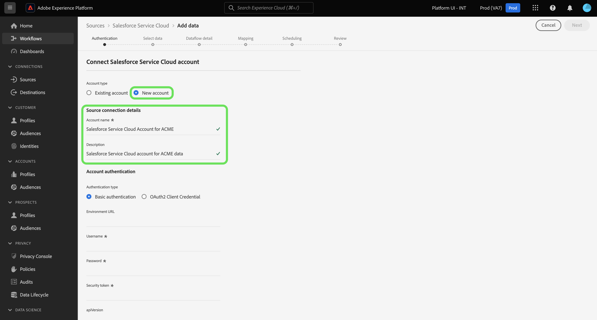

# 接続する [!DNL Salesforce Service Cloud] UI を使用してExperience Platformにアカウント

このチュートリアルでは、 [!DNL Salesforce Service Cloud] アカウントを使用し、顧客ユーザーインターフェイスを使用して顧客成功Experience PlatformをAdobe Experience Platformに取り込みます。

## はじめに

このチュートリアルは、 Experience Platform の次のコンポーネントを実際に利用および理解しているユーザーを対象としています。

* [[!DNL Experience Data Model (XDM)] システム](../../../../../xdm/home.md)：Experience Platform が顧客体験データの整理に使用する標準化されたフレームワーク。
   * [スキーマ構成の基本](../../../../../xdm/schema/composition.md)：スキーマ構成の主要な原則やベストプラクティスなど、XDM スキーマの基本的な構成要素について学びます。
   * [スキーマエディターのチュートリアル](../../../../../xdm/tutorials/create-schema-ui.md)：スキーマエディター UI を使用してカスタムスキーマを作成する方法を説明します。
* [[!DNL Real-Time Customer Profile]](../../../../../profile/home.md)：複数のソースからの集計データに基づいて、統合されたリアルタイムの顧客プロファイルを提供します。

既に有効な [!DNL Salesforce Service Cloud] 接続する場合は、このドキュメントの残りの部分をスキップして、 [顧客の成功のためのデータフローの設定](../../dataflow/customer-success.md)

### 必要な資格情報の収集

次の項目にアクセスするには、 [!DNL Salesforce Service Cloud] Experience Platformのアカウントでは、次の値を指定する必要があります。

| 資格情報 | 説明 |
| --- | --- |
| `environmentUrl` | の URL [!DNL Salesforce Service Cloud] ソースインスタンス。 |
| `username` | のユーザー名 [!DNL Salesforce Service Cloud] ユーザーアカウント。 |
| `password` | のパスワード [!DNL Salesforce Service Cloud] ユーザーアカウント。 |
| `securityToken` | のセキュリティトークン [!DNL Salesforce Service Cloud] ユーザーアカウント。 |
| `apiVersion` | （オプション） [!DNL Salesforce Service Cloud] 使用しているインスタンス。 このフィールドを空白のままにすると、Experience Platformは利用可能な最新バージョンを自動的に使用します。 |

認証について詳しくは、 [この [!DNL Salesforce] 認証ガイド](https://developer.salesforce.com/docs/atlas.en-us.api_rest.meta/api_rest/quickstart_oauth.htm).

## [!DNL Salesforce Service Cloud] アカウントを接続

必要な資格情報を収集したら、次の手順に従って、 [!DNL Salesforce] アカウントからExperience Platformへ。

Platform UI で、「 」を選択します。 **[!UICONTROL ソース]** 左側のナビゲーションからソースワークスペースにアクセスします。 The *[!UICONTROL カタログ]* 画面には、「ソース」カタログで使用できる様々なソースがExperience Platformされます。

画面の左側にあるカタログから適切なカテゴリを選択することができます。または、検索オプションを使用して特定のソースを検索できます。

選択 **[!UICONTROL 顧客の成功]** ソースカテゴリのリストから、「 」を選択します。 **[!UICONTROL データを追加]** から [!DNL Salesforce Service Cloud] カード。

The **[!UICONTROL Salesforce Service Cloud に接続]** ページが表示されます。 このページでは、新しい資格情報または既存の資格情報を使用できます。

>[!BEGINTABS]

>[!TAB 既存の Salesforce Service Cloud アカウントを使用]

既存のアカウントを使用するには、「**[!UICONTROL 既存のアカウント]**」を選択し、表示されるリストから使用するアカウントを選択します。終了したら、「 」を選択します。 **[!UICONTROL 次へ]** をクリックして続行します。

>[!TAB 新しい Salesforce Service Cloud アカウントを作成]

新しいアカウントを使用するには、 **[!UICONTROL 新しいアカウント]** 名前、説明、 [!DNL Salesforce Service Cloud] 認証資格情報。 終了したら、「 」を選択します。 **[!UICONTROL ソースに接続]** そして、新しい接続が確立されるまで数秒間待ちます。

>[!ENDTABS]

## 次の手順

このチュートリアルでは、[!DNL Salesforce Service Cloud] アカウントとの接続を確立しました。次のチュートリアルに進み、 [顧客成功データをExperience Platformに取り込むためのデータフローの設定](../../dataflow/customer-success.md).
