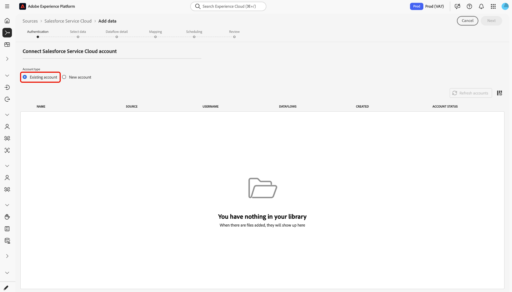

# UIを使用して[!DNL Salesforce Service Cloud] アカウントをExperience Platformに接続します

このステップバイステップガイドに従って、[!DNL Salesforce Service Cloud] アカウントをシームレスに接続し、カスタマーサクセスデータをAdobe Experience Platformにインポートします。

## はじめに

このチュートリアルは、 Experience Platform の次のコンポーネントを実際に利用および理解しているユーザーを対象としています。

* [[!DNL Experience Data Model (XDM)] システム](../../../../../xdm/home.md)：Experience Platform が顧客体験データの整理に使用する標準化されたフレームワーク。
   * [スキーマ構成の基本](../../../../../xdm/schema/composition.md)：スキーマ構成の主要な原則やベストプラクティスなど、XDM スキーマの基本的な構成要素について学びます。
   * [スキーマエディターのチュートリアル](../../../../../xdm/tutorials/create-schema-ui.md)：スキーマエディター UI を使用してカスタムスキーマを作成する方法を説明します。
* [[!DNL Real-Time Customer Profile]](../../../../../profile/home.md)：複数のソースからの集計データに基づいて、統合されたリアルタイムの顧客プロファイルを提供します。

有効な[!DNL Salesforce Service Cloud]接続が既にある場合は、このドキュメントの残りの部分をスキップして、カスタマーサクセス用のデータフローの設定[に関するチュートリアルに進むことができます](../../dataflow/customer-success.md)

### 必要な資格情報の収集

資格情報の取得について詳しくは、[認証ガイド &#x200B;](../../../../connectors/customer-success/salesforce-service-cloud.md#credentials)を参照してください。

## [!DNL Salesforce Service Cloud] アカウントを接続

Experience Platform UIで、左側のナビゲーションから「**[!UICONTROL Sources]**」を選択して、[!UICONTROL Sources] ワークスペースにアクセスします。 画面の左側にあるカタログから適切なカテゴリを選択することができます。 または、使用する特定のソースを検索オプションを使用して探すこともできます。

「*[!UICONTROL Customer success]*」カテゴリの「**[!DNL Salesforce Service Cloud]**」を選択し、「**[!UICONTROL Add data]**」を選択します。

>[!TIP]
>
>ソースカタログのソースには、特定のソースがまだ認証済みアカウントを持っていない場合、**[!UICONTROL Set up]** オプションが表示されます。 認証済みアカウントが存在すると、このオプションは&#x200B;**[!UICONTROL Add data]**&#x200B;に変更されます。

**[!UICONTROL Connect to Salesforce Service Cloud]** ページが表示されます。 このページでは、新しい資格情報または既存の資格情報を使用できます。

### 既存のアカウントの使用

既存のアカウントを使用するには、**[!UICONTROL Existing account]**&#x200B;を選択し、表示されるリストから目的のアカウントを選択します。 完了したら、**[!UICONTROL Next]**&#x200B;を選択して続行します。

### 新しいアカウントを作成

新しいアカウントを作成するには、**[!UICONTROL New account]**&#x200B;を選択し、新しい[!DNL Salesforce Service Cloud] アカウントの名前と説明を入力します。 次に、**[!UICONTROL OAuth2 Client Credential]**&#x200B;を選択し、次の資格情報の値を指定します。

* 環境 URL
* クライアント ID
* クライアントシークレット
* API バージョン

終了したら「**[!UICONTROL Connect to source]**」を選択します。

## 次の手順

このチュートリアルでは、[!DNL Salesforce Service Cloud] アカウントとの接続を確立しました。 次のチュートリアルに進み、[&#x200B; カスタマーサクセスデータをExperience Platform](../../dataflow/customer-success.md)に取り込むためのデータフローを設定できるようになりました。
