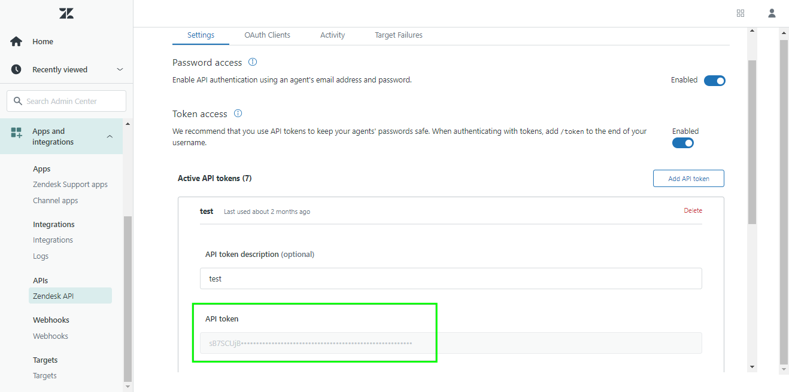
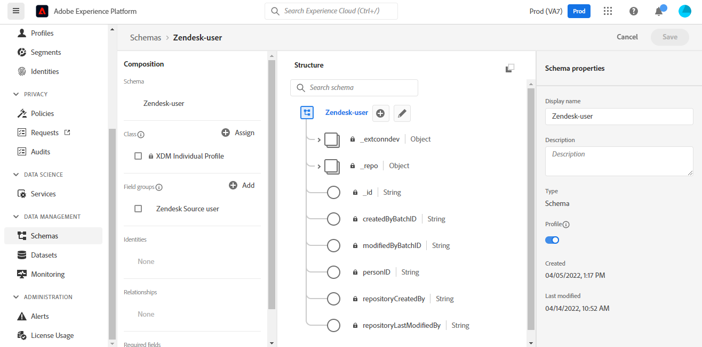
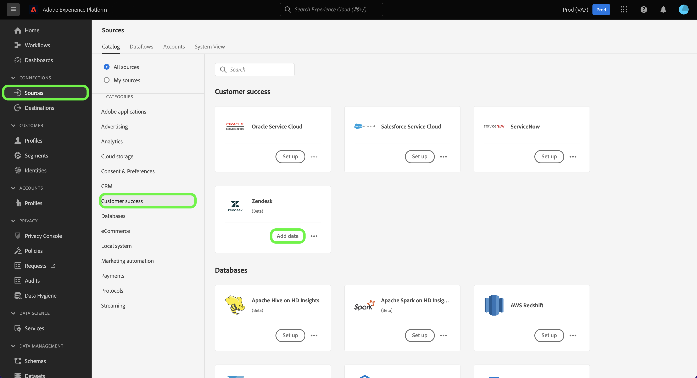
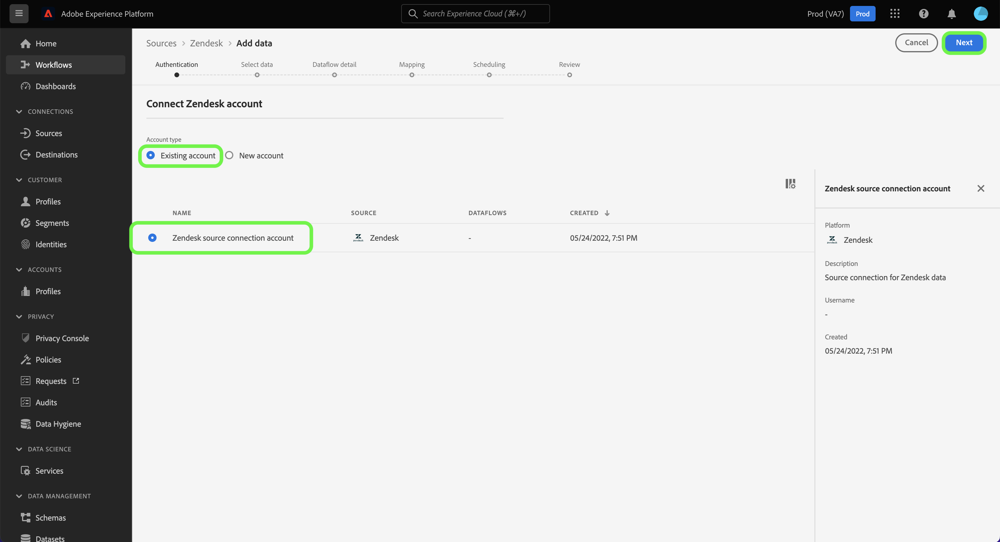
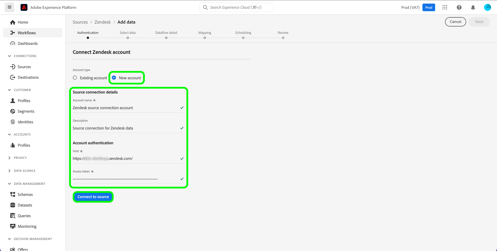
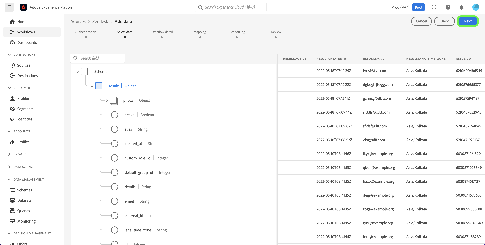
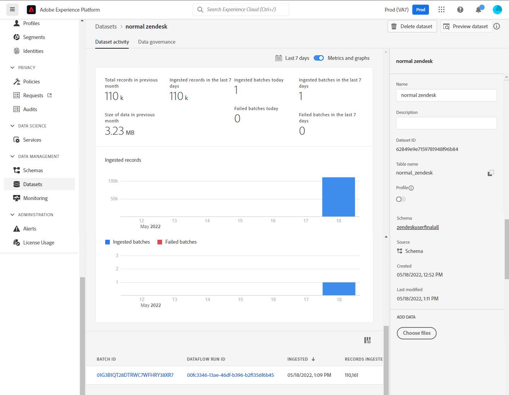
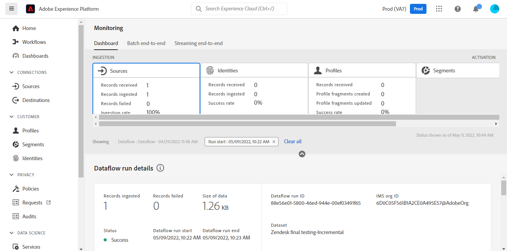
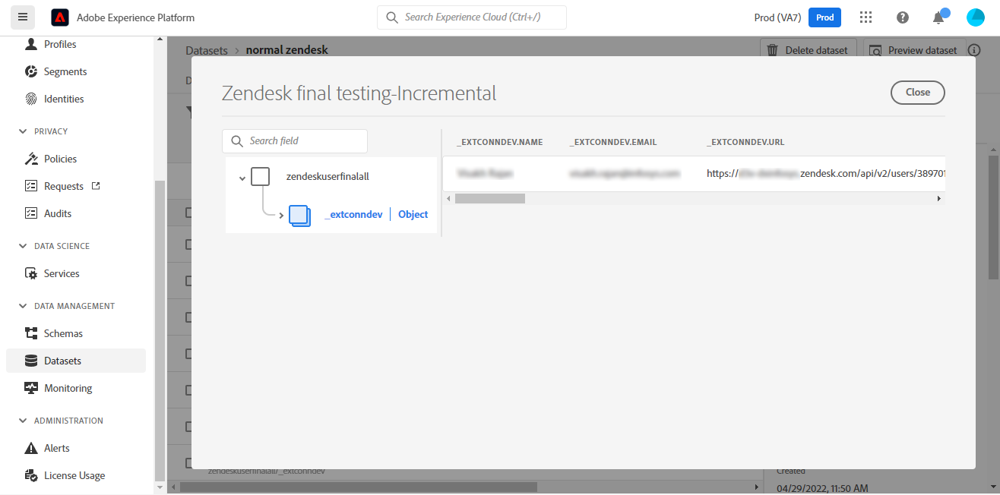
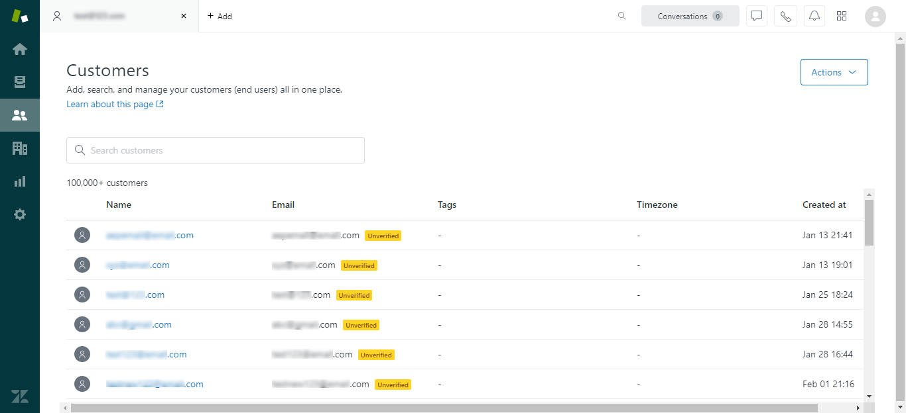

# UI での [!DNL Zendesk] ソース接続の作成

このチュートリアルでは、Adobe Experience Platform ユーザーインターフェイスを使用して[!DNL Zendesk] ソース接続を作成する手順を説明します。

## はじめに

このチュートリアルは、Adobe Experience Platform の次のコンポーネントを実際に利用および理解しているユーザーを対象としています。

* [[!DNL Experience Data Model (XDM)]  システム](../../../../../xdm/home.md)：[!DNL Experience Platform] が顧客体験データの整理に使用する標準化されたフレームワーク。
   * [スキーマ構成の基本](../../../../../xdm/schema/composition.md)：スキーマ構成の主要な原則やベストプラクティスなど、XDM スキーマの基本的な構成要素について学びます。
   * [スキーマエディターのチュートリアル](../../../../../xdm/tutorials/create-schema-ui.md)：スキーマエディター UI を使用してカスタムスキーマを作成する方法を説明します。
* [[!DNL Real-Time Customer Profile]](../../../../../profile/home.md)：複数のソースからの集計データに基づいて、統合されたリアルタイムの顧客プロファイルを提供します。

### 必要な資格情報の収集

Experience Platformで[!DNL Zendesk] アカウントにアクセスするには、次の資格情報の値を指定する必要があります。

| 資格情報 | 説明 | 例 |
| --- | --- | --- |
| サブドメイン | 登録プロセス中に作成されたアカウントに固有の一意のドメイン。 | `yoursubdomain` |
| アクセストークン | Zendesk API トークン： | `0lZnClEvkJSTQ7olGLl7PMhVq99gu26GTbJtf` |

[!DNL Zendesk] ソースの認証について詳しくは、[[!DNL Zendesk]  ソースの概要](../../../../connectors/customer-success/zendesk.md)を参照してください。

### [!DNL Zendesk]のExperience Platform スキーマを作成

[!DNL Zendesk] ソース接続を作成する前に、まずソースに使用するExperience Platform スキーマを作成する必要があります。 スキーマの作成方法の包括的な手順については、[Experience Platform スキーマの作成](../../../../../xdm/schema/composition.md)に関するチュートリアルを参照してください。

[!DNL Zendesk]に必要な[!DNL Zendesk Search API] スキーマに関する追加のガイダンスについては、以下の[制限](#limits) セクションを参照してください。

## [!DNL Zendesk] アカウントを接続

Experience Platform UIで、左側のナビゲーションバーから「**[!UICONTROL Sources]**」を選択して、[!UICONTROL Sources] ワークスペースにアクセスします。 [!UICONTROL Catalog]画面には、アカウントを作成できる様々なソースが表示されます。

画面の左側にあるカタログから適切なカテゴリを選択することができます。または、使用する特定のソースを検索オプションを使用して探すこともできます。

「*カスタマーサクセス*」カテゴリで、「**[!UICONTROL Zendesk]**」を選択し、「**[!UICONTROL Add data]**」を選択します。

**[!UICONTROL Connect Zendesk account]** ページが表示されます。 このページでは、新しい資格情報または既存の資格情報を使用できます。

### 既存のアカウント

既存のアカウントを使用するには、新しいデータフローを作成する&#x200B;*Zendesk* アカウントを選択し、**[!UICONTROL Next]**&#x200B;を選択して続行します。

### 新しいアカウント

新しいアカウントを作成する場合は、**[!UICONTROL New account]**&#x200B;を選択し、名前、オプションの説明、および資格情報を指定します。 完了したら、**[!UICONTROL Connect to source]**&#x200B;を選択し、新しい接続が確立されるまでしばらく時間を空けます。

### データの選択

ソースが認証されると、ページはインタラクティブなスキーマツリーに更新され、データの階層を探索および検査できるようになります。 続行するには、**[!UICONTROL Next]**&#x200B;を選択してください。

## 次の手順

このチュートリアルでは、[!DNL Zendesk] アカウントとExperience Platformの間のソース接続を認証して作成しました。 次のチュートリアルに進み、[ カスタマーサクセスデータをExperience Platformに取り込むためのデータフローを作成できるようになりました](../../dataflow/customer-success.md)。

## その他のリソース

以下の節では、[!DNL Zendesk] ソースを使用する際に参照できる追加のリソースについて説明します。

### 検証 {#validation}

次の手順では、[!DNL Zendesk] ソースが正常に接続されたこと、および[!DNL Zendesk] プロファイルがExperience Platformに取り込まれていることを検証するために実行できる手順の概要を示します。

Experience Platform UIで、左側のナビゲーションから「**[!UICONTROL Datasets]**」を選択して、[!UICONTROL Datasets] ワークスペースにアクセスします。 [!UICONTROL Dataset Activity]画面には、実行の詳細が表示されます。

次に、表示するデータフローのデータフロー実行IDを選択して、そのデータフロー実行に関する特定の詳細を表示します。

最後に、**[!UICONTROL Preview dataset]**&#x200B;を選択して、取り込まれたデータを表示します。

また、[!DNL Zendesk] > [!DNL Customers] ページのデータに対してExperience Platform データを検証することもできます。

### Zendesk スキーマ

次の表に、Zendeskに設定する必要があるサポートされているマッピングを示します。

>[!TIP]
>
>APIについて詳しくは、[Zendesk Search API / 検索結果を書き出し](https://developer.zendesk.com/api-reference/ticketing/ticket-management/search/#export-search-results)を参照してください。

| ソース | タイプ |
|---|---|
| `results.active` | ブール |
| `results.alias` | 文字列 |
| `results.created_at` | 文字列 |
| `results.custom_role_id` | 整数 |
| `results.default_group_id` | 整数 |
| `results.details` | 文字列 |
| `results.email` | 文字列 |
| `results.external_id` | 整数 |
| `results.iana_time_zone` | 文字列 |
| `results.id` | 整数 |
| `results.last_login_at` | 文字列 |
| `results.locale` | 文字列 |
| `results.locale_id` | 整数 |
| `results.moderator` | ブール |
| `results.name` | 文字列 |
| `results.notes` | 文字列 |
| `results.only_private_comments` | ブール |
| `results.organization_id` | 整数 |
| `results.phone` | 文字列 |
| `results.photo` | 文字列 |
| `results.report_csv` | ブール |
| `results.restricted_agent` | ブール |
| `results.result_type` | 文字列 |
| `results.role` | 文字列 |
| `results.role_type` | 整数 |
| `results.shared` | ブール |
| `results.shared_agent` | ブール |
| `results.shared_phone_number` | ブール |
| `results.signature` | 文字列 |
| `results.suspended` | ブール |
| `results.ticket_restriction` | 文字列 |
| `results.time_zone` | 文字列 |
| `results.two_factor_auth_enabled` | ブール |
| `results.updated_at` | 文字列 |
| `results.url` | 文字列 |
| `results.verified` | ブール |

{style="table-layout:auto"}

### 制限 {#limits}

* [Zendesk Search API/検索結果を書き出し](https://developer.zendesk.com/api-reference/ticketing/ticket-management/search/#export-search-results)は、1 ページにつき最大1000件のレコードを返します。
   * ``filter[type]`` パラメーターの値は``user``に設定されているため、Zendesk接続はユーザーのみを返します。
   * ページあたりの結果の数は、``page[size]`` パラメーターによって管理されます。 値は``100``に設定されています。 これは、Zendeskによって設定された速度低下の制約の影響を軽減するために行われます。
   * [制限](https://developer.zendesk.com/api-reference/ticketing/ticket-management/search/#limits)および[ ページネーション ](https://developer.zendesk.com/api-reference/ticketing/ticket-management/search/#pagination-1)を参照してください。
   * カーソルのページネーション [を使用して、](https://developer.zendesk.com/documentation/developer-tools/pagination/paginating-through-lists-using-cursor-pagination/) リストを介したページネーションを参照することもできます。
