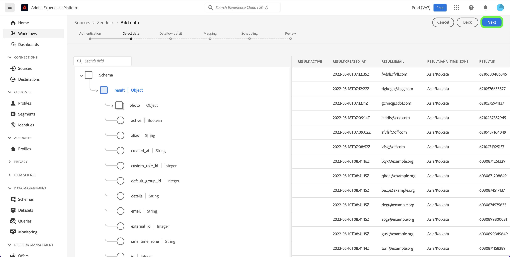

# UI での [!DNL Zendesk] ソース接続の作成

このチュートリアルでは、Adobe Experience Platform ユーザーインターフェイスを使用して [!DNL Zendesk] ソース接続を作成する手順について説明します。

## はじめに

このチュートリアルは、Adobe Experience Platform の次のコンポーネントを実際に利用および理解しているユーザーを対象としています。

* [[!DNL Experience Data Model (XDM)]  システム](../../../../../xdm/home.md)：[!DNL Experience Platform] が顧客体験データの整理に使用する標準化されたフレームワーク。
   * [スキーマ構成の基本](../../../../../xdm/schema/composition.md)：スキーマ構成の主要な原則やベストプラクティスなど、XDM スキーマの基本的な構成要素について学びます。
   * [スキーマエディターのチュートリアル](../../../../../xdm/tutorials/create-schema-ui.md)：スキーマエディター UI を使用してカスタムスキーマを作成する方法を説明します。
* [[!DNL Real-Time Customer Profile]](../../../../../profile/home.md)：複数のソースからの集計データに基づいて、統合されたリアルタイムの顧客プロファイルを提供します。

### 必要な資格情報の収集

Experience Platformで [!DNL Zendesk] アカウントにアクセスするには、次の資格情報の値を指定する必要があります。

| 資格情報 | 説明 | 例 |
| --- | --- | --- |
| サブドメイン | 登録プロセス中に作成された、アカウントに固有の一意のドメイン。 | `yoursubdomain` |
| アクセストークン | Zendesk API トークン。 | `0lZnClEvkJSTQ7olGLl7PMhVq99gu26GTbJtf` |

[!DNL Zendesk] ソースの認証について詳しくは、[[!DNL Zendesk]  ソースの概要 ](../../../../connectors/customer-success/zendesk.md) を参照してください。

### [!DNL Zendesk] 用のExperience Platform スキーマの作成

[!DNL Zendesk] ソース接続を作成する前に、まずソースに使用するExperience Platform スキーマを作成する必要もあります。 スキーマの作成方法に関する包括的な手順については、[Experience Platform スキーマの作成 ](../../../../../xdm/schema/composition.md) に関するチュートリアルを参照してください。

[!DNL Zendesk Search API] に必要な [!DNL Zendesk] スキーマに関する追加のガイダンスについては、以下の [limits](#limits) の節を参照してください。

## [!DNL Zendesk] アカウントを接続

Experience Platform UI の左側のナビゲーションバーで「**[!UICONTROL ソース]**」を選択し、「[!UICONTROL &#x200B; ソース &#x200B;] ワークスペースにアクセスします。 [!UICONTROL カタログ]画面には、アカウントを作成できる様々なソースが表示されます。

画面の左側にあるカタログから適切なカテゴリを選択することができます。または、使用する特定のソースを検索オプションを使用して探すこともできます。

*カスタマーサクセス* カテゴリで、「**[!UICONTROL Zendesk]**」を選択し、次に「**[!UICONTROL データを追加]**」を選択します。

**[!UICONTROL Zendesk アカウントを接続]** ページが表示されます。 このページでは、新しい資格情報または既存の資格情報を使用できます。

### 既存のアカウント

既存のアカウントを使用するには、新しいデータフローの作成に使用する *Zendesk* アカウントを選択し、「**[!UICONTROL 次へ]**」を選択して続行します。

### 新しいアカウント

新しいアカウントを作成する場合は、「**[!UICONTROL 新しいアカウント]**」を選択し、続けて名前、説明（オプション）、の認証情報を指定します。 終了したら「**[!UICONTROL ソースに接続]**」を選択し、新しい接続が確立されるまでしばらく待ちます。

### データの選択

ソースが認証されると、ページが更新されてインタラクティブスキーマツリーに変わり、データの階層を調べることができます。 「**[!UICONTROL 次へ]**」を選択して次に進みます。

## 次の手順

このチュートリアルでは、認証を行い、お使いの [!DNL Zendesk] アカウントとExperience Platformとのソース接続を作成しました。 次のチュートリアルに進み、[ カスタマーサクセスデータをExperience Platformに取り込むためのデータフローの作成 ](../../dataflow/customer-success.md) を行いましょう。

## その他のリソース

以下の節では、[!DNL Zendesk] ソースを使用する際に参照できるその他のリソースを示します。

### 検証 {#validation}

次に、[!DNL Zendesk] ソースに正常に接続したことと、[!DNL Zendesk] のプロファイルがExperience Platformに取り込まれていることを検証する手順の概要を説明します。

Experience Platform UI の左側のナビゲーションから **[!UICONTROL データセット]** を選択して、[!UICONTROL &#x200B; データセット &#x200B;] ワークスペースにアクセスします。 [!UICONTROL &#x200B; データセットアクティビティ &#x200B;] 画面には、実行の詳細が表示されます。

次に、表示するデータフローのデータフロー実行 ID を選択して、そのデータフロー実行に関する特定の詳細を確認します。

最後に、「**[!UICONTROL データセットをプレビュー]**」を選択して、取り込まれたデータを表示します。

また、[!DNL Zendesk] / [!DNL Customers] ページのデータに対してExperience Platform データを検証することもできます。

### Zendesk スキーマ

次の表に、Zendesk 用に設定する必要がある、サポートされるマッピングを示します。

>[!TIP]
>
>API について詳しくは、[Zendesk Search API/検索結果の書き出し ](https://developer.zendesk.com/api-reference/ticketing/ticket-management/search/#export-search-results) を参照してください。

| ソース | タイプ |
|---|---|
| `results.active` | ブール値 |
| `results.alias` | 文字列 |
| `results.created_at` | 文字列 |
| `results.custom_role_id` | 整数 |
| `results.default_group_id` | Integer |
| `results.details` | 文字列 |
| `results.email` | 文字列 |
| `results.external_id` | 整数 |
| `results.iana_time_zone` | 文字列 |
| `results.id` | 整数 |
| `results.last_login_at` | 文字列 |
| `results.locale` | 文字列 |
| `results.locale_id` | 整数 |
| `results.moderator` | ブール値 |
| `results.name` | 文字列 |
| `results.notes` | 文字列 |
| `results.only_private_comments` | ブール値 |
| `results.organization_id` | 整数 |
| `results.phone` | 文字列 |
| `results.photo` | 文字列 |
| `results.report_csv` | ブール値 |
| `results.restricted_agent` | ブール値 |
| `results.result_type` | 文字列 |
| `results.role` | 文字列 |
| `results.role_type` | 整数 |
| `results.shared` | ブール値 |
| `results.shared_agent` | ブール値 |
| `results.shared_phone_number` | ブール値 |
| `results.signature` | 文字列 |
| `results.suspended` | ブール値 |
| `results.ticket_restriction` | 文字列 |
| `results.time_zone` | 文字列 |
| `results.two_factor_auth_enabled` | ブール値 |
| `results.updated_at` | 文字列 |
| `results.url` | 文字列 |
| `results.verified` | ブール値 |

{style="table-layout:auto"}

### 制限 {#limits}

* [Zendesk Search API/検索結果の書き出し ](https://developer.zendesk.com/api-reference/ticketing/ticket-management/search/#export-search-results) は、1 ページあたり最大 1000 レコードを返します。
   * ``filter[type]`` パラメーターの値は ``user`` に設定されているので、Zendesk 接続はユーザーのみを返します。
   * ページごとの結果の数は、``page[size]`` パラメーターで管理されます。 値は ``100`` に設定されます。 これは、Zendesk によって設定された速度低下制約の影響を軽減するために行われます。
   * [ 制限 ](https://developer.zendesk.com/api-reference/ticketing/ticket-management/search/#limits) および [ ページネーション ](https://developer.zendesk.com/api-reference/ticketing/ticket-management/search/#pagination-1) を参照してください。
   * また、[ カーソルのページネーションを使用したリスト内のページ分割 ](https://developer.zendesk.com/documentation/developer-tools/pagination/paginating-through-lists-using-cursor-pagination/) も参照してください。
