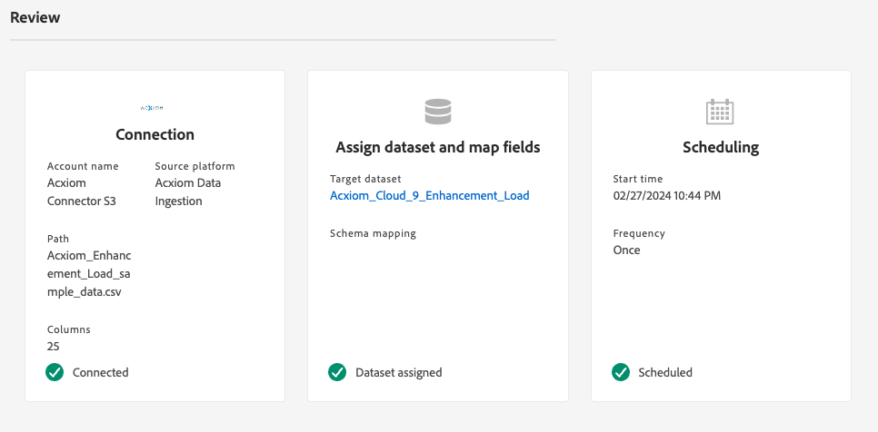

# の作成 [!DNL Acxiom Data Ingestion] UI でのソース接続とデータフロー

>[!NOTE]
>
>[!DNL Acxiom Data Ingestion] ソースはベータ版です。詳しくは、 [利用条件](../../../../home.md#terms-and-conditions) （ソースの概要）を参照して、ベータラベル付きのソースの使用に関する詳細を確認してください。

以下を使用します。 [!DNL Acxiom Data Ingestion] 取り込むソース [!DNL Acxiom] データをReal-time Customer Data Platformに取り込み、ファーストパーティプロファイルを強化します。 次に、 [!DNL Acxiom] — 強化されたファーストパーティプロファイル：オーディエンスを改善し、マーケティングチャネルをまたいでアクティブ化します。

このチュートリアルでは、 [!DNL Acxiom Data Ingestion] Adobe Experience Platformユーザーインターフェイスを使用したソース接続とデータフロー。 The [!DNL Acxiom Data Ingestion] ソースは、からの応答を取得してマッピングするために使用されます。 [!DNL Acxiom] Amazon S3 をドロップポイントとして使用する機能強化サービス。

## 前提条件 {#prerequisites}

このチュートリアルは、 Experience Platform の次のコンポーネントを実際に利用および理解しているユーザーを対象としています。

* [[!DNL Experience Data Model (XDM)] システム](../../../../../xdm/home.md)：Experience Platform が顧客体験データの整理に使用する標準化されたフレームワーク。
   * [スキーマ構成の基本](../../../../../xdm/schema/composition.md)：スキーマ構成の主要な原則やベストプラクティスなど、XDM スキーマの基本的な構成要素について学びます。
   * [スキーマエディターのチュートリアル](../../../../../xdm/tutorials/create-schema-ui.md)：スキーマエディター UI を使用してカスタムスキーマを作成する方法を説明します。
* [[!DNL Real-Time Customer Profile]](../../../../../profile/home.md)：複数のソースからの集計データに基づいて、統合されたリアルタイムの顧客プロファイルを提供します。

### 必要な資格情報の収集

Experience Platformでバケットにアクセスするには、次の資格情報に有効な値を指定する必要があります。

| 資格情報 | 説明 |
| --- | --- |
| [!DNL Acxiom] 認証キー | 認証キー。 この値は、 [!DNL Acxiom] チーム。 |
| [!DNL Amazon S3] アクセスキー | バケットのアクセスキー ID。 この値は、 [!DNL Acxiom] チーム。 |
| [!DNL Amazon S3] 秘密鍵 | バケットの秘密鍵 ID。 この値は、 [!DNL Acxiom] チーム。 |
| バケット名 | これはファイルが共有されるグループです。 この値は、 [!DNL Acxiom] チーム。 |

>[!IMPORTANT]
>
>次の両方を持つ必要があります。 **[!UICONTROL ソースを表示]** および **[!UICONTROL ソースの管理]** アカウントに対して有効になっている権限で、 [!DNL Acxiom] アカウントからExperience Platformへ。 製品管理者に問い合わせて、必要な権限を取得してください。 詳しくは、 [アクセス制御 UI ガイド](../../../../../access-control/ui/overview.md).

## [!DNL Acxiom] アカウントの接続

Platform の UI で、左側のナビゲーションバーで「**[!UICONTROL Sources]**」を選択し、[!UICONTROL Sources ]のワークスペースにアクセスします。[!UICONTROL カタログ]画面には、アカウントを作成できる様々なソースが表示されます。

画面の左側にあるカタログから適切なカテゴリを選択することができます。または、使用する特定のソースを検索オプションを使用して探すこともできます。

の下 **[!UICONTROL データおよび ID パートナー]** カテゴリ、選択 **[!UICONTROL Acxiom データ取り込み]** 次に、「 **[!UICONTROL 設定]**.

>[!TIP]
>
>表示されるソースカード **[!UICONTROL データを追加]** は、ソースに既に認証済みアカウントがあることを表します。 一方、 **[!UICONTROL 設定]** 「 」では、そのソースを使用するには、資格情報を入力し、新しいアカウントを作成する必要があります。

### 新しいアカウントを作成

新しい資格情報を使用している場合は、「**[!UICONTROL 新しいアカウント]**」を選択します。表示される入力フォームで、名前、説明（オプション）および [!DNL Acxiom] 認証情報。 終了したら「**[!UICONTROL ソースに接続]**」を選択し、新しい接続が確立されるまでしばらく待ちます。

| 資格情報 | 説明 |
| --- | --- |
| アカウント名 | アカウントの名前。 |
| 説明 | （オプション）アカウントの目的の簡単な説明。 |
| [!DNL Acxiom] 認証キー | The [!DNL Acxiom] — アカウントの承認に必要なキー。 データベースへの接続を行う前に、適切な値に一致する必要があります。  このキーは 24 文字にする必要があり、A ～ Z、a ～ z、0 ～ 9 のみを含めることができます。 |
| S3 アクセスキー | S3 アクセスキーは、Amazon S3 の場所を参照します。 これは、S3 の役割権限が定義されている場合に管理者から提供されます。 |
| S3 秘密鍵 | S3 秘密鍵はAmazon S3 の場所を参照します。 これは、S3 の役割権限が定義されている場合に管理者から提供されます。 |
| s3SessionToken | （オプション）S3 への接続時の認証トークンの値。 |
| serviceUrl | （オプション）非標準の場所で S3 に接続する際に使用する URL の場所。 |
| バケット名 | （オプション）S3 で設定され、データ選択の開始パスとして機能する S3 バケットの名前。 |
| フォルダーパス | バケット内のサブディレクトリを使用する場合は、データ選択の開始パスとしてパスを指定することもできます。 |

### 既存のアカウントを使用

既存のアカウントを使用するには、「 」を選択します。 **[!UICONTROL 既存のアカウント]**.

リストからアカウントを選択して、そのアカウントの詳細を表示します。 アカウントを選択したら、 **[!UICONTROL 次へ]** をクリックして続行します。

## データを選択

目的のバケットとサブディレクトリから取り込むファイルを選択します。 区切り文字と圧縮タイプを定義すると、データのプレビューを提供できます。 ファイルを選択したら、 **[!UICONTROL 次へ]** をクリックして続行します。

>[!NOTE]
>
>JSON および Parquet のファイルタイプは一覧に表示されますが、これらのファイルタイプは [!DNL Acxiom] ソースワークフロー。

## データセットとデータフローの詳細を入力

次に、データセットとデータフローに関する情報を指定する必要があります。

### データセットの詳細

>[!BEGINTABS]

>[!TAB 新しいデータセットを使用]

データセットは、スキーマ（列）とフィールド（行）で構成されるデータコレクション（通常はテーブル）を格納し管理するための構造です。Experience Platformに正常に取り込まれたデータは、データレイク内にデータセットとして保持されます。 新しいデータセットを使用するには、「 **[!UICONTROL 新しいデータセット]**.

| 新しいデータセットの詳細 | 説明 |
| --- | --- |
| 出力データセット名 | 新しいデータセットの名前。 |
| 説明 | （オプション）データセットの目的に関する簡単な説明です。 |
| スキーマ | 組織に存在するスキーマのドロップダウンリスト。 また、ソース設定プロセスの前に、独自のスキーマを作成することもできます。 詳しくは、 [UI でのスキーマの作成](../../../../../xdm/tutorials/create-schema-ui.md). |

>[!TAB 既存のデータセットを使用する]

既存のデータセットを使用するには、「 」を選択します。 **[!UICONTROL 既存のデータセット]**.

次の項目を選択できます。 **[!UICONTROL 詳細検索]** ：組織内のすべてのデータセットのウィンドウを表示します。これには、リアルタイム顧客プロファイルへの取り込みが有効になっているかどうかなど、それぞれの詳細が含まれます。

>[!ENDTABS]

+++「 」を選択して、プロファイルの取り込み、エラー診断、部分取り込みを有効にする手順を実行します。

データセットでリアルタイム顧客プロファイルが有効になっている場合、この手順の間に、 **[!UICONTROL プロファイルデータセット]** データをプロファイル取り込み用に有効にする場合。 また、この手順を使用して、 **[!UICONTROL エラー診断]** および **[!UICONTROL 部分取り込み]**.

* **[!UICONTROL エラー診断]**：を選択します。 **[!UICONTROL エラー診断]** を使用して、ソースに対してエラー診断を生成するように指示します。この診断は、データセットのアクティビティとデータフローのステータスを監視する際に、後で参照できます。
* **[!UICONTROL 部分取り込み]**：部分バッチ取得は、エラーを含むデータを、特定の設定可能なしきい値まで取得する機能です。 この機能を使用すると、正確なデータをすべてExperience Platformに正常に取り込む一方で、誤ったデータはすべて、無効な理由に関する情報と共に別々にバッチ処理されます。

+++

### データフローの詳細

データセットを設定したら、名前、説明（オプション）、アラート設定など、データフローの詳細を指定する必要があります。

| データフロー設定 | 説明 |
| --- | --- |
| データフロー名 | データフローの名前。  デフォルトでは、インポートされるファイルの名前が使用されます。 |
| 説明 | （オプション）データフローの簡単な説明。 |
| アラート | Experience Platformは、ユーザーが購読できるイベントベースのアラートを作成できます。これらのオプションは、実行中のデータフローをすべてトリガー化します。  詳しくは、 [アラートの概要](../../alerts.md) <ul><li>**ソースのデータフロー実行開始**：データフローの実行が開始したときに通知を受け取る場合は、このアラートを選択します。</li><li>**ソースのデータフロー実行成功**：データフローがエラーなく終了した場合に通知を受け取る場合は、このアラートを選択します。</li><li>**ソースのデータフロー実行エラー**：このアラートを選択すると、データフローの実行がエラーで終了した場合に通知を受け取ります。</li></ul> |

## マッピング

データをスキーマに取り込む前に、マッピングインターフェイスを使用して、ソースデータを適切なスキーマフィールドにマッピングします。  詳しくは、 [UI のマッピングガイド](../../../../../data-prep/ui/mapping.md)

## データフローの取り込みのスケジュール設定

次に、スケジューリングインターフェイスを使用して、データフローの取り込みスケジュールを定義します。

| スケジュール設定 | 説明 |
| --- | --- |
| 頻度 | 頻度を設定して、データフローを実行する頻度を指定します。 頻度は次のように設定できます。 <ul><li>**1 回**：頻度をに設定します。 `once` :1 回限りの取り込みを作成します。 1 回限りの取り込みデータフローを作成する場合、間隔とバックフィルの設定は使用できません。 デフォルトでは、スケジュールの頻度は 1 回に設定されています。</li><li>**分**：頻度をに設定します。 `minute` を使用して、1 分ごとにデータを取り込むようにデータフローをスケジュールします。</li><li>**時間**：頻度をに設定します。 `hour` を使用して、1 時間ごとにデータを取り込むようにデータフローをスケジュールします。</li><li>**日**：頻度をに設定します。 `day` を使用して、データを日単位で取り込むようにデータフローをスケジュールします。</li><li>**週**：頻度をに設定します。 `week` を使用して、週単位でデータを取り込むようにデータフローをスケジュールします。</li></ul> |
| 間隔 | 頻度を選択したら、間隔設定を設定して、各取り込み間隔の時間枠を設定できます。 例えば、頻度を「day」に設定し、間隔を 15 に設定した場合、データフローは 15 日ごとに実行されます。 **注意**：間隔を 0 に設定することはできません。 |
| 開始時間 | 予測される実行のタイムスタンプ（UTC タイムゾーンで表示）。 |
| バックフィル | バックフィルは、最初に取り込まれるデータを決定します。 バックフィルが有効な場合、指定されたパス内の現在のファイルは、最初にスケジュールされた取り込み中にすべて取り込まれます。 バックフィルが無効になっている場合、取り込みの最初の実行から開始時刻までの間に読み込まれたファイルのみが取り込まれます。 開始時より前に読み込まれたファイルは取り込まれません。 |

## データフローのレビュー

「レビュー」ページを使用して、取り込む前のデータフローの概要を確認します。 詳細は、次のカテゴリに分類されます。

* **接続**  — ソースのタイプ、選択したソースファイルの関連パス、およびそのソースファイル内の列数を表示します。
* **データセットの割り当てとフィールドのマッピング**  — データセットが準拠するスキーマを含め、ソースデータの取り込み先のデータセットを表示します。
* **スケジュール** ：取り込みスケジュールのアクティブな期間、頻度、間隔を示します。
データフローをレビューしたら、「完了」をクリックし、データフローを作成するまでしばらく待ちます。

## 次の手順

このチュートリアルに従うことで、バッチデータを [!DNL Acxiom] ソースからExperience Platformへ その他のリソースについては、以下に概要を示すドキュメントを参照してください。

### データフローの監視

データフローを作成したら、データフローを介して取り込まれているデータを監視して、取り込み率、成功、エラーに関する情報を表示できます。 データフローの監視方法の詳細については、 [UI でのアカウントとデータフローの監視](../../../../../dataflows/ui/monitor-sources.md).

### データフローの更新

データフローのスケジュール設定、マッピング、一般情報を更新するには、次のチュートリアルを参照してください： [UI でのソースデータフローの更新](../../update-dataflows.md).

### データフローの削除

不要になったデータフローや誤って作成されたデータフローは、**[!UICONTROL データフロー]**&#x200B;ワークスペース内にある&#x200B;**[!UICONTROL 削除]**&#x200B;機能で削除できます。データフローの削除方法の詳細については、 [UI でのデータフローの削除](../../delete.md).

## その他のリソース {#additional-resources}

詳しくは、 [[!DNL Acxiom] InfoBase](https://www.acxiom.com/wp-content/uploads/2022/02/fs-acxiom-infobase_AC-0268-22.pdf).
