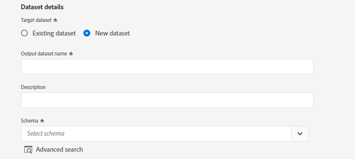

# の作成 [!DNL Acxiom Prospecting Data Import] UI でのソース接続とデータフロー

>[!NOTE]
>
>[!DNL Acxiom Prospecting Data Import] ソースはベータ版です。詳しくは、 [ソースの概要](../../../../home.md#terms-and-conditions) ベータラベル付きのソースの使用に関する詳細

[!DNL Acxiom]のAdobe Real-time Customer Data Platform向けの予測データインポートは、可能な限り生産的な見込み客オーディエンスを提供するプロセスです。 [!DNL Acxiom] は、安全なエクスポートを通じてReal-Time CDPのファーストパーティデータを取得し、受賞歴のある衛生および ID 解決システムを通じてそのデータを実行します。 これにより、抑制リストとして使用するデータファイルが生成されます。 次に、このデータファイルが Acxiom Global データベースと照合され、見込み客リストをインポート用にカスタマイズできます。

以下を使用すると、 [!DNL Acxiom] Amazon S3 をドロップポイントとして使用して、Acxiom 見込み客サービスから応答を取得およびマッピングするソース。

このチュートリアルでは、 [!DNL Acxiom Prospecting Data Import] Adobe Experience Platformユーザーインターフェイスを使用したソース接続とデータフロー。

## 前提条件 {#prerequisites}

このチュートリアルは、 Experience Platform の次のコンポーネントを実際に利用および理解しているユーザーを対象としています。

* [[!DNL Experience Data Model (XDM)] システム](../../../../../xdm/home.md)：Experience Platform が顧客体験データの整理に使用する標準化されたフレームワーク。
   * [スキーマ構成の基本](../../../../../xdm/schema/composition.md)：スキーマ構成の主要な原則やベストプラクティスなど、XDM スキーマの基本的な構成要素について学びます。
   * [スキーマエディターのチュートリアル](../../../../../xdm/tutorials/create-schema-ui.md)：スキーマエディター UI を使用してカスタムスキーマを作成する方法を説明します。
* [[!DNL Real-Time Customer Profile]](../../../../../profile/home.md)：複数のソースからの集計データに基づいて、統合されたリアルタイムの顧客プロファイルを提供します。
* [[!DNL Prospect Profile]](../../../../../profile/ui/prospect-profile.md)：見込み客プロファイルを作成および使用して、サードパーティの情報を使用して不明な顧客に関する情報を収集する方法を説明します。

### 必要な資格情報の収集

Experience Platformでバケットにアクセスするには、次の資格情報に有効な値を指定する必要があります。

| 資格情報 | 説明 |
| --- | --- |
| [!DNL Acxiom] 認証キー | 認証キー。 この値は、 [!DNL Acxiom] チーム。 |
| [!DNL Amazon S3] アクセスキー | バケットのアクセスキー ID。 この値は、 [!DNL Acxiom] チーム。 |
| [!DNL Amazon S3] 秘密鍵 | バケットの秘密鍵 ID。 この値は、 [!DNL Acxiom] チーム。 |
| バケット名 | これはファイルが共有されるグループです。 この値は、 [!DNL Acxiom] チーム。 |

>[!IMPORTANT]
>
>次の両方を持つ必要があります。 **[!UICONTROL ソースを表示]** および **[!UICONTROL ソースの管理]** アカウントに対して有効になっている権限で、 [!DNL Acxiom] アカウントからExperience Platformへ。 製品管理者に問い合わせて、必要な権限を取得してください。 詳しくは、 [アクセス制御 UI ガイド](../../../../../access-control/ui/overview.md).

## [!DNL Acxiom] アカウントの接続

Platform の UI で、左側のナビゲーションバーで「**[!UICONTROL Sources]**」を選択し、[!UICONTROL Sources ]のワークスペースにアクセスします。[!UICONTROL カタログ]画面には、アカウントを作成できる様々なソースが表示されます。

画面の左側にあるカタログから適切なカテゴリを選択することができます。または、使用する特定のソースを検索オプションを使用して探すこともできます。

の下 **[!UICONTROL データおよび ID パートナー]** カテゴリ、選択 **[!UICONTROL Acxiom 見込みデータのインポート]** 次に、「 **[!UICONTROL 設定]**.

>[!TIP]
>
>表示されるソースカード **[!UICONTROL データを追加]** は、ソースに既に認証済みアカウントがあることを表します。 一方、 **[!UICONTROL 設定]** 「 」では、そのソースを使用するには、資格情報を入力し、新しいアカウントを作成する必要があります。

### 新しいアカウントを作成

新しい資格情報を使用している場合は、「 」を選択します。 **[!UICONTROL 新しいアカウント]**. 表示される入力フォームで、名前、説明（オプション）および [!DNL Acxiom] 認証情報。 終了したら、「 」を選択します。 **[!UICONTROL ソースに接続]** その後、新しい接続が確立されるまでしばらく時間をかけます。

| 資格情報 | 説明 |
| --- | --- |
| アカウント名 | アカウントの名前。 |
| 説明 | （オプション）アカウントの目的の簡単な説明。 |
| [!DNL Acxiom] 認証キー | The [!DNL Acxiom] — アカウントの承認に必要なキー。 データベースへの接続を行う前に、適切な値に一致する必要があります。  このキーは 24 文字にする必要があり、A ～ Z、a ～ z、0 ～ 9 のみを含めることができます。 |
| S3 アクセスキー | S3 アクセスキーは、Amazon S3 の場所を参照します。 これは、S3 の役割権限が定義されている場合に管理者から提供されます。 |
| S3 秘密鍵 | S3 秘密鍵はAmazon S3 の場所を参照します。 これは、S3 の役割権限が定義されている場合に管理者から提供されます。 |
| s3SessionToken | （オプション）S3 への接続時の認証トークンの値。 |
| serviceUrl | （オプション）非標準の場所で S3 に接続する際に使用する URL の場所。 |
| バケット名 | （オプション）S3 で設定され、データ選択の開始パスとして機能する S3 バケットの名前。 |
| フォルダーパス | バケット内のサブディレクトリを使用する場合は、データ選択の開始パスとしてパスを指定することもできます。 |

### 既存のアカウントを使用

既存のアカウントを使用するには、「 」を選択します。 **[!UICONTROL 既存のアカウント]**.

リストからアカウントを選択して、そのアカウントの詳細を表示します。 アカウントを選択したら、 **[!UICONTROL 次へ]** をクリックして続行します。

## データを選択

目的のバケットとサブディレクトリから取り込むファイルを選択します。 区切り文字と圧縮タイプを定義すると、データのプレビューを提供できます。 ファイルを選択したら、 **[!UICONTROL 次へ]** をクリックして続行します。

>[!NOTE]
>
>JSON および Parquet のファイルタイプは一覧に表示されますが、これらのファイルタイプは [!DNL Acxiom] ソースワークフロー。

## データセットとデータフローの詳細を入力

次に、データセットとデータフローに関する情報を指定する必要があります。

### データセットの詳細

>[!BEGINTABS]

>[!TAB 新しいデータセットを使用]

データセットは、スキーマ（列）とフィールド（行）で構成されるデータコレクション（通常はテーブル）を格納し管理するための構造です。Experience Platformに正常に取り込まれたデータは、データレイク内にデータセットとして保持されます。 新しいデータセットを使用するには、「 **[!UICONTROL 新しいデータセット]**.

| 新しいデータセットの詳細 | 説明 |
| --- | --- |
| 出力データセット名 | 新しいデータセットの名前。 |
| 説明 | （オプション）データセットの目的に関する簡単な説明です。 |
| スキーマ | 組織に存在するスキーマのドロップダウンリスト。 また、ソース設定プロセスの前に、独自のスキーマを作成することもできます。 詳しくは、 [UI でのスキーマの作成](../../../../../xdm/tutorials/create-schema-ui.md). |

>[!TAB 既存のデータセットを使用する]

既存のデータセットを使用するには、「 」を選択します。 **[!UICONTROL 既存のデータセット]**.

次の項目を選択できます。 **[!UICONTROL 詳細検索]** ：組織内のすべてのデータセットのウィンドウを表示します。これには、リアルタイム顧客プロファイルへの取り込みが有効になっているかどうかなど、それぞれの詳細が含まれます。

>[!ENDTABS]

### データフローの詳細

この手順の間に、データセットのプロファイルが有効になっている場合は、 **[!UICONTROL プロファイルデータセット]** を切り替えて、プロファイル取り込み用にデータを有効にします。 また、 [!UICONTROL エラー診断] および [!UICONTROL 部分取り込み].

* **エラー診断**  — 選択 **エラー診断** を使用して、後で API を使用して参照できるエラー診断を生成するようにソースに指示する場合。 詳しくは、 [エラー診断の概要](../../../../../ingestion/quality/error-diagnostics.md)
* **部分取り込みを有効にする**  — 部分バッチ取り込みは、エラーを含むデータを、特定のしきい値まで取り込む機能です。 この機能を使用すると、正しいデータをすべてAdobe Experience Platformに正しく取り込み、間違ったデータはすべて別々にバッチ処理されます。また、無効な理由の詳細も同時にバッチ処理されます。  詳しくは、 [部分取り込みの概要](../../../../../ingestion/batch-ingestion/partial.md)

| データフロー設定 | 説明 |
| --- | --- |
| データフロー名 | データフローの名前。  デフォルトでは、インポートされるファイルの名前が使用されます。 |
| 説明 | （オプション）データフローの簡単な説明。 |
| アラート | Experience Platformは、ユーザーが購読できるイベントベースのアラートを作成できます。これらのオプションは、実行中のデータフローをすべてトリガー化します。  詳しくは、 [アラートの概要](../../alerts.md) <ul><li>**ソースのデータフロー実行開始**：データフローの実行が開始したときに通知を受け取る場合は、このアラートを選択します。</li><li>**ソースのデータフロー実行成功**：データフローがエラーなく終了した場合に通知を受け取る場合は、このアラートを選択します。</li><li>**ソースのデータフロー実行エラー**：このアラートを選択すると、データフローの実行がエラーで終了した場合に通知を受け取ります。</li></ul> |

## マッピング

データをスキーマに取り込む前に、マッピングインターフェイスを使用して、ソースデータを適切なスキーマフィールドにマッピングします。  詳しくは、 [UI のマッピングガイド](../../../../../data-prep/ui/mapping.md)

## データフローの取り込みのスケジュール設定

スケジューリングインターフェイスを使用して、データフローの取り込みスケジュールを定義します。

* **頻度**：頻度を設定して、データフローの実行頻度を指定します。 頻度は、1 回、分、時間、日、週に設定できます。
* **間隔**：頻度を選択したら、間隔設定を設定して、各取り込み間の時間枠を設定できます。 例えば、頻度を「day」に設定し、間隔を 15 に設定した場合、データフローは 15 日ごとに実行されます。 間隔は 0 に設定できず、15 以上に設定する必要があります。
* **開始時間**  — 予測される実行のタイムスタンプ（UTC タイムゾーンで表示）。
* **バックフィル**  — バックフィルは、最初に取り込まれるデータを決定します。 バックフィルが有効な場合、指定されたパス内の現在のファイルは、最初にスケジュールされた取り込み中にすべて取り込まれます。 バックフィルが無効になっている場合、取り込みの最初の実行から開始時刻までの間に読み込まれたファイルのみが取り込まれます。 開始時より前に読み込まれたファイルは取り込まれません。

## データフローのレビュー

「レビュー」ページを使用して、取り込む前のデータフローの概要を確認します。 詳細は、次のカテゴリに分類されます。

* **接続**  — ソースのタイプ、選択したソースファイルの関連パス、およびそのソースファイル内の列数を表示します。
* **データセットの割り当てとフィールドのマッピング**  — データセットが準拠するスキーマを含め、ソースデータの取り込み先のデータセットを表示します。
* **スケジュール** ：取り込みスケジュールのアクティブな期間、頻度、間隔を示します。
データフローをレビューしたら、「完了」をクリックし、データフローを作成するまでしばらく待ちます。

## 次の手順

このチュートリアルに従うことで、バッチデータを [!DNL Acxiom] ソースからExperience Platformへ その他のリソースについては、以下に概要を示すドキュメントを参照してください。

### データフローの監視

データフローを作成したら、データフローを介して取り込まれているデータを監視して、取り込み率、成功、エラーに関する情報を表示できます。 データフローの監視方法の詳細については、 [UI でのアカウントとデータフローの監視](../../monitor.md).

### データフローの更新

データフローのスケジュール設定、マッピング、一般情報を更新するには、次のチュートリアルを参照してください： [UI でのソースデータフローの更新](../../update-dataflows.md)

### データフローの削除

不要になったデータフローや誤って作成されたデータフローは、**[!UICONTROL データフロー]**&#x200B;ワークスペース内にある&#x200B;**[!UICONTROL 削除]**&#x200B;機能で削除できます。データフローの削除方法の詳細については、 [UI でのデータフローの削除](../../delete.md).

## その他のリソース {#additional-resources}

[!DNL Acxiom] オーディエンスのデータと配布： https://www.acxiom.com/customer-data/audience-data-distribution/
