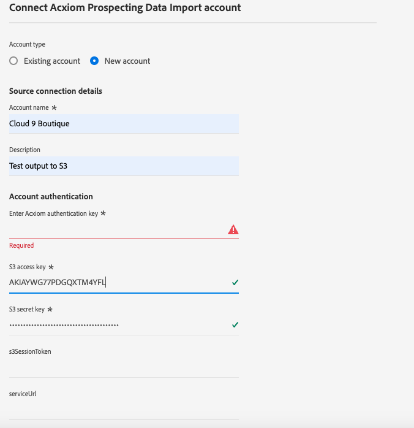

# UI での [!DNL Acxiom Prospecting Data Import] ソース接続とデータフローの作成

>[!NOTE]
>
>[!DNL Acxiom Prospecting Data Import] ソースはベータ版です。ベータラベル付きソースの使用について詳しくは、[ ソースの概要 ](../../../../home.md#terms-and-conditions) を参照してください。

[!DNL Acxiom] のAdobe Real-time Customer Data Platformの見込み客データインポートは、可能な限り生産的な見込み客オーディエンスを提供するプロセスです。 [!DNL Acxiom] は、Real-Time CDPのファーストパーティデータを安全な書き出しで取得し、そのデータを受賞歴のあるハイジーンおよび id 解決システムで実行します。 これにより、抑制リストとして使用されるデータファイルが生成されます。 その後、このデータ・ファイルと Acxiom グローバル・データベースが照合され、見込み客リストをインポート用にカスタマイズできるようになります。

[!DNL Acxiom] ソースを使用すると、Amazon S3 をドロップ ポイントとして使用して、Acxiom 見込み客サービスから応答を取得し、マップできます。

Adobe Experience Platform ユーザーインターフェイスを使用して [!DNL Acxiom Prospecting Data Import] ソース接続とデータフローを作成する方法については、このチュートリアルをお読みください。

## 前提条件 {#prerequisites}

このチュートリアルは、 Experience Platform の次のコンポーネントを実際に利用および理解しているユーザーを対象としています。

* [[!DNL Experience Data Model (XDM)] システム](../../../../../xdm/home.md)：Experience Platform が顧客体験データの整理に使用する標準化されたフレームワーク。
   * [スキーマ構成の基本](../../../../../xdm/schema/composition.md)：スキーマ構成の主要な原則やベストプラクティスなど、XDM スキーマの基本的な構成要素について学びます。
   * [スキーマエディターのチュートリアル](../../../../../xdm/tutorials/create-schema-ui.md)：スキーマエディター UI を使用してカスタムスキーマを作成する方法を説明します。
* [[!DNL Real-Time Customer Profile]](../../../../../profile/home.md)：複数のソースからの集計データに基づいて、統合されたリアルタイムの顧客プロファイルを提供します。
* [[!DNL Prospect Profile]](../../../../../profile/ui/prospect-profile.md)：見込み客プロファイルを作成および使用して、サードパーティの情報を使用して未知顧客に関する情報を収集する方法を説明します。

### 必要な資格情報の収集

Experience Platformのバケットにアクセスするには、次の資格情報に対して有効な値を指定する必要があります。

| 資格情報 | 説明 |
| --- | --- |
| [!DNL Acxiom] 認証キー | 認証キー。 この値は [!DNL Acxiom] チームから取得できます。 |
| [!DNL Amazon S3] アクセスキー | バケットのアクセスキー ID。 この値は [!DNL Acxiom] チームから取得できます。 |
| [!DNL Amazon S3] 秘密鍵 | バケットの秘密鍵 ID。 この値は [!DNL Acxiom] チームから取得できます。 |
| バケット名 | これは、ファイルが共有されるバケットです。 この値は [!DNL Acxiom] チームから取得できます。 |

>[!IMPORTANT]
>
>[!DNL Acxiom] アカウントをExperience Platformに接続するには、アカウントで **[!UICONTROL ソースの表示]** および **[!UICONTROL ソースの管理]** 権限の両方が有効になっている必要があります。 必要な権限を取得するには、製品管理者にお問い合わせください。 詳しくは、[ アクセス制御 UI ガイド ](../../../../../access-control/ui/overview.md) を参照してください。

## [!DNL Acxiom] アカウントの接続

Platform の UI で、左側のナビゲーションバーで「**[!UICONTROL Sources]**」を選択し、[!UICONTROL Sources ]のワークスペースにアクセスします。[!UICONTROL カタログ]画面には、アカウントを作成できる様々なソースが表示されます。

画面の左側にあるカタログから適切なカテゴリを選択することができます。または、使用する特定のソースを検索オプションを使用して探すこともできます。

**[!UICONTROL Data &amp; Identity Partners]** カテゴリで **[!UICONTROL Acxiom Prospecting Data Import]** を選択し、**[!UICONTROL 設定]** を選択します。

>[!TIP]
>
>**[!UICONTROL データを追加]** と表示されるソースカードは、ソースに認証済みアカウントが既にあることを意味します。 一方、**[!UICONTROL 設定]** と表示されるソースカードは、そのソースを使用するために、資格情報を提供し、新しいアカウントを作成する必要があることを意味します。

### 新しいアカウントを作成

新しい資格情報を使用している場合は、「**[!UICONTROL 新しいアカウント]**」を選択します。 表示される入力フォームで、名前、説明（オプション）、[!DNL Acxiom] 資格情報を入力します。 終了したら「**[!UICONTROL ソースに接続]**」を選択し、新しい接続が確立されるまでしばらく待ちます。

| 資格情報 | 説明 |
| --- | --- |
| アカウント名 | アカウントの名前。 |
| 説明 | （オプション）アカウントの目的の簡単な説明。 |
| [!DNL Acxiom] 認証キー | アカウントの承認に必要な、[!DNL Acxiom] 指定のキー。 データベースに接続するには、適切な値に一致する必要があります。  このキーは 24 文字である必要があり、A ～ Z、a ～ z、0 ～ 9 のみを含めることができます。 |
| S3 アクセスキー | S3 アクセスキーは、Amazon S3 の場所を参照します。 これは、S3 の役割の権限が定義されている場合に、管理者によって提供されます。 |
| S3 シークレットキー | S3 秘密鍵は、Amazon S3 の場所を参照します。 これは、S3 の役割の権限が定義されている場合に、管理者によって提供されます。 |
| s3SessionToken | （任意） S3 への接続時の認証トークンの値。 |
| serviceUrl | （任意）非標準の場所で S3 に接続するときに使用する URL の場所です。 |
| バケット名 | （任意） S3 に設定された、データ選択の開始パスとなる S3 バケットの名前。 |
| フォルダーパス | バケット内のサブディレクトリを使用する場合は、データ選択で開始パスとしてパスを指定することもできます。 |

### 既存のアカウントを使用

既存のアカウントを使用するには、「**[!UICONTROL 既存のアカウント]**」を選択します。

リストからアカウントを選択して、そのアカウントの詳細を表示します。 アカウントを選択したら、「**[!UICONTROL 次へ]**」を選択して続行します。

## データを選択

取り込むファイルを目的のバケットおよびサブディレクトリから選択します。 区切り文字と圧縮タイプを定義したら、データのプレビューを指定できます。 ファイルを選択したら、「**[!UICONTROL 次へ]**」を選択して続行します。

。

>[!NOTE]
>
>JSON ファイルタイプと Parquet ファイルタイプが一覧表示されますが、[!DNL Acxiom] ソースワークフロー中に使用する必要はなく、また使用も想定されていません。

## データセットとデータフローの詳細の指定

次に、データセットとデータフローに関する情報を指定する必要があります。

### データセットの詳細

>[!BEGINTABS]

>[!TAB  新しいデータセットを使用する ]

データセットは、スキーマ（列）とフィールド（行）で構成されるデータコレクション（通常はテーブル）を格納し管理するための構造です。Experience Platformに正常に取り込まれたデータは、データレイク内にデータセットとして保持されます。 新しいデータセットを使用するには、「**[!UICONTROL 新しいデータセット]**」を選択します。

| 新しいデータセットの詳細 | 説明 |
| --- | --- |
| 出力データセット名 | 新しいデータセットの名前。 |
| 説明 | （任意）データセットの目的の簡単な説明。 |
| スキーマ | 組織に存在するスキーマのドロップダウンリスト。 ソース設定プロセスの前に、独自のスキーマを作成することもできます。 詳しくは、[UI でのスキーマの作成 ](../../../../../xdm/tutorials/create-schema-ui.md) に関するガイドを参照してください。 |

>[!TAB 既存のデータセットを使用する]

既存のデータセットを使用するには、「**[!UICONTROL 既存のデータセット]**」を選択します。

**[!UICONTROL 詳細検索]** を選択すると、組織のすべてのデータセットを示すウィンドウが表示されます。これには、リアルタイム顧客プロファイルに取り込むことができるかどうかなど、それぞれの詳細が含まれます。

>[!ENDTABS]

### データフローの詳細

この手順の間に、データセットがプロファイルに対して有効になっている場合、**[!UICONTROL プロファイルデータセット]** 切り替えスイッチを選択して、プロファイル取り込み用のデータを有効にすることができます。 また、[!UICONTROL  エラー診断 ] および [!UICONTROL  部分取り込み ] を有効にすることもできます。

* **エラー診断** - **エラー診断** を選択して、API を使用して後で参照できるエラー診断を生成するようにソースに指示します。 詳しくは、[ エラー診断の概要 ](../../../../../ingestion/quality/error-diagnostics.md) を参照してください
* **部分取り込みを有効にする** – 部分バッチ取り込みは、特定のしきい値に到達するまで、エラーを含むデータを取り込む機能です。 この機能を使用すると、誤ったデータがすべて個別にバッチ処理されると同時に、無効な理由の詳細も含めて、正しいデータをすべてAdobe Experience Platformに取り込むことができます。  詳しくは、[ 部分取り込みの概要 ](../../../../../ingestion/batch-ingestion/partial.md) を参照してください

| データフロー設定 | 説明 |
| --- | --- |
| データフロー名 | データフローの名前。  デフォルトでは、読み込まれるファイルの名前が使用されます。 |
| 説明 | （任意）データフローの簡単な説明です。 |
| アラート | Experience Platformは、ユーザーが購読できるイベントベースのアラートを作成でき、これらのオプションは、これらをトリガーにする実行中のデータフローです。  詳しくは、[ アラートの概要 ](../../alerts.md) を参照してください <ul><li>**ソースデータフロー実行開始**：データフロー実行が開始したときに通知を受け取るには、このアラートを選択します。</li><li>**ソースデータフロー実行成功**：データフローがエラーなく終了した場合に通知を受け取るには、このアラートを選択します。</li><li>**ソースデータフロー実行の失敗**：データフローの実行がエラーで終了した場合に通知を受け取るには、このアラートを選択します。</li></ul> |

## マッピング

マッピングインターフェイスを使用して、データをExperience Platformに取り込む前に、ソースデータを適切なスキーマフィールドにマッピングします。  詳しくは、UI の [ マッピングガイド ](../../../../../data-prep/ui/mapping.md) を参照してください。

## データフロー取り込みのスケジュール

スケジュールインターフェイスを使用して、データフローの取り込みスケジュールを定義します。

* **頻度**：頻度を設定して、データフローの実行頻度を示します。 頻度は、1 回、1 分、1 時間、1 日、1 週間に設定できます。
* **間隔**：頻度を選択したら、間隔設定を設定して、取り込みごとに時間枠を確立できます。 例えば、頻度を日に設定し、間隔を 15 に設定すると、データフローは 15 日ごとに実行されます。 間隔を 0 に設定することはできません。少なくとも 15 に設定する必要があります。
* **開始時刻** – 見込み実行のタイムスタンプ（UTC タイムゾーンで表示）。
* **バックフィル** - バックフィルは、最初に取り込むデータを決定します。 バックフィルが有効になっている場合、指定されたパス内の現在のすべてのファイルが、最初にスケジュールされた取り込み時に取り込まれます。 バックフィルが無効になっている場合は、最初の取り込みの実行から開始時刻の間に読み込まれたファイルのみが取り込まれます。 開始時間より前に読み込まれたファイルは取り込まれません。

## データフローのレビュー

取り込み前のデータフローの概要を確認するページを使用します。 詳細は、次のカテゴリにグループ化されます。

* **接続** - ソースのタイプ、選択したソースファイルの関連パスおよびそのソースファイル内の列の数を表示します。
* **データセットの割り当てとフィールドのマッピング** - ソースデータがどのデータセットに取り込まれるかを、そのデータセットが準拠するスキーマを含めて表示します。
* **スケジュール** – 取り込みスケジュールのアクティブな期間、頻度、間隔を表示します。
データフローをレビューしたら、「終了」をクリックし、データフローが作成されるまでしばらく待ちます。

## 次の手順

このチュートリアルでは、[!DNL Acxiom] ソースからExperience Platformにバッチデータを取り込むデータフローを正常に作成しました。 その他のリソースについては、以下に概要を説明するドキュメントを参照してください。

### データフローの監視

データフローを作成したら、そのデータフローを通じて取り込まれるデータを監視し、取り込み率、成功、エラーに関する情報を表示できます。 データフローのモニタリング方法について詳しくは、[UI でのアカウントとデータフローのモニタリング ](../../monitor.md) のチュートリアルを参照してください。

### データフローの更新

データフローのスケジュール、マッピング、一般情報の設定を更新するには、[UI でのソースデータフローの更新 ](../../update-dataflows.md) に関するチュートリアルを参照してください。

### データフローの削除

不要になったデータフローや誤って作成されたデータフローは、**[!UICONTROL データフロー]**&#x200B;ワークスペース内にある&#x200B;**[!UICONTROL 削除]**&#x200B;機能で削除できます。データフローの削除方法について詳しくは、[UI でのデータフローの削除 ](../../delete.md) のチュートリアルを参照してください。

## その他のリソース {#additional-resources}

[!DNL Acxiom] オーディエンスデータおよび配布：https://www.acxiom.com/customer-data/audience-data-distribution/
