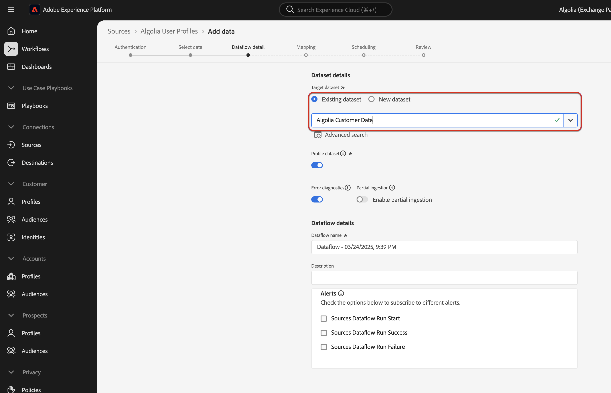

# UI を使用したExperience Platformへの [!DNL Algolia User Profiles] データの取り込み

このチュートリアルでは、ユーザーインターフェイスを使用して [!DNL Algolia User Profiles] アカウントからAdobe Experience Platformにデータを取り込む手順を説明します。

## 基本を学ぶ

>[!IMPORTANT]
>
>開始する前に、[[!DNL Algolia User Profiles]  概要 &#x200B;](../../../../connectors/data-partners/algolia-user-profiles.md#prerequisites) に記載されている前提条件を完了していることを確認してください。

このチュートリアルでは、次のExperience Platform コンポーネントに関する十分な知識があることを前提としています。

* [[!DNL Experience Data Model (XDM)]  システム &#x200B;](../../../../../xdm/home.md):Experience Platformがカスタマーエクスペリエンスデータの整理に使用する標準化されたフレームワーク。

   * [&#x200B; スキーマ構成の基本 &#x200B;](../../../../../xdm/schema/composition.md)：主要な原則やベストプラクティスなど、スキーマ構成について学びます。
   * [スキーマエディターのチュートリアル](../../../../../xdm/tutorials/create-schema-ui.md)：スキーマエディター UI を使用してカスタムスキーマを作成する方法を説明します。
* [[!DNL Real-Time Customer Profile]](../../../../../profile/home.md)：複数のソースから集計したデータに基づく、統合されたリアルタイム顧客プロファイル。
* [&#x200B; ソース &#x200B;](../../../../home.md)：様々なソースからデータを取り込み、Experience Platform サービスを使用して、データの構造化、ラベル付け、拡張を行います。

### 必要な資格情報の収集

[!DNL Algolia] をAdobe Experience Platformに接続するには、次の資格情報を入力します。

| 資格情報 | 説明 |
| -------------- | ----------------------------------------------------------------------------------------- |
| アプリケーション ID | [!DNL Algolia] アカウントに割り当てられた一意の ID。 |
| API キー | [!DNL Algolia] サービスへの API リクエストを認証および承認するための資格情報。 |

詳しくは、[!DNL Algolia] [&#x200B; 認証ドキュメント &#x200B;](https://www.algolia.com/doc/tools/cli/get-started/authentication/) を参照してください。

## [!DNL Algolia] アカウントを接続

Experience Platform UI の左側のナビゲーションで「**[!UICONTROL Sources]**」を選択し、「*[!UICONTROL Sources]*」ワークスペースを開きます。 *[!UICONTROL カテゴリ]* パネルまたは検索バーを使用して、目的のソースを見つけます。

[!DNL Algolia] に接続するには、「データと ID パートナー **[!UICONTROL の下の *[!UICONTROL Algolia]**&#x200B;ソースカードを選択し]* 「**[!UICONTROL 設定]**」を選択します。

>[!TIP]
>
> 認証済みアカウントがまだないソースの場合は、「**[!UICONTROL 設定]**」オプションが表示されます。 認証が完了すると、「**[!UICONTROL データを追加]**」に変わります。

## 認証

### 既存のアカウントを使用

既存のアカウントを使用するには、「**[!UICONTROL 既存のアカウント]**」を選択し、使用する [!DNL Algolia User Profiles] アカウントを選択します。 次に **[!UICONTROL 次へ]** を選択します。

### 新しいアカウントを作成

新しいアカウントを作成するには、「**[!UICONTROL 新しいアカウント]**」を選択し、名前、説明（オプション）、[!DNL Algolia] の資格情報を入力します。 **[!UICONTROL ソースに接続]** を選択し、接続が確立するのを待ちます。

## データの追加

[!DNL Algolia User Profiles] アカウントが作成されると、**[!UICONTROL データを追加]** 手順が表示されます。 これを使用して、取り込み用のユーザープロファイルデータを選択およびプレビューします。

* 左側で、オプションとして **[!UICONTROL インデックス]** と **[!UICONTROL アフィニティ]** を入力します。
* 右側で、最大 100 行のユーザープロファイルをプレビューします。

完了したら、「**[!UICONTROL 次へ]**」を選択します。

## データフローの詳細を入力

既存のデータセットを使用する場合は、[!DNL Algolia Profile] フィールドグループを含むスキーマに関連付けられているデータセットを選択します。 [!DNL Algolia User Token] フィールドで [!DNL Algolia User Token] ID 名前空間が使用されていることを確認します。  [!DNL Algolia User Token] が現在作成または割り当てられていない場合は、以下の手順を参照してください。

新しいデータセットを作成する場合は、[!DNL Algolia Profile] フィールドグループを使用してスキーマを選択します。

### ID 名前空間 [!DNL Algolia User Token] 作成

[!DNL Algolia User Token] ID 名前空間が組織内に存在しない場合は、作成する必要があります。

左側のナビゲーションを使用して「**[!UICONTROL ID]**」を選択し、[ID サービス &#x200B;](../../../../../identity-service/home.md) UI ワークスペースにアクセスして「**[!UICONTROL ID 名前空間を作成]**」を選択します。

次に、カスタム名前空間の **[!UICONTROL 表示名]** と **[!UICONTROL ID 記号]** を指定します。 この手順では、名前空間のタイプも設定する必要があります。 完了したら、「**[!UICONTROL 作成]**」をクリックします。

。

| カスタム名前空間設定 | 値 |
| --- | --- |
| **[!UICONTROL 表示名]** | [!DNL Algolia User Token] |
| **[!UICONTROL ID シンボル]** | [!DNL AlgoliaUserToken] |
| **[!UICONTROL タイプを選択]** | [!DNL Cookie ID] |

追加すると、名前空間がリストに表示されます。 これで、スキーマに適用できます。

### スキーマへの名前空間の適用

左側のナビゲーションを使用して「**[!UICONTROL スキーマ]**」を選択し、[&#x200B; スキーマ &#x200B;](../../../../../xdm/ui/overview.md) UI ワークスペースにアクセスします。 スキーマ ワークスペースを使用して、[!DNL Algolia Profile Details] フィールドグループでスキーマを作成または更新します。 次に、「**[!UICONTROL ユーザートークン]**」フィールドに移動し、右側のパネルを使用して「**[!UICONTROL ID]**」ボックスを選択します。 さらに、入力ボックスを使用して、[!DNL Algolia User Token] ID 名前空間を定義します。 完了したら「**[!UICONTROL 保存]**」を選択します。

**[!UICONTROL ユーザートークン]** フィールドに [!DNL Algolia User Token] ID 名前空間を割り当てると、その ID は任意のプロファイルのユーザープロファイルに表示されます。

## XDM スキーマへのデータフィールドのマッピング

マッピングインターフェイスを使用して、ソースデータをスキーマフィールドにマッピングします。 詳しくは、[&#x200B; マッピングガイド &#x200B;](../../../../../data-prep/ui/mapping.md) を参照してください。

## 取り込み実行のスケジュール

次に、スケジュールインターフェイスを使用して、データフローの取り込みスケジュールを定義します。

| スケジュール設定 | 説明 |
| --- | --- |
| 頻度 | 頻度を設定して、データフローの実行頻度を示します。 頻度は次のように設定できます。 <ul><li>**1 回**：頻度を `once` に設定して、1 回限りの取り込みを作成します。 1 回限りの取り込みデータフローを作成する場合、間隔とバックフィルの設定は使用できません。 デフォルトでは、スケジュールの頻度は 1 回に設定されています。</li><li>**分**：頻度を `minute` に設定して、1 分ごとにデータを取り込むようにデータフローをスケジュールします。</li><li>**時間**：頻度を `hour` に設定して、1 時間ごとにデータを取り込むようにデータフローをスケジュールします。</li><li>**日**：頻度を `day` に設定して、1 日にデータを取り込むようにデータフローをスケジュールします。</li><li>**週**：頻度を `week` に設定して、データフローが週ごとにデータを取り込むようにスケジュールします。</li></ul> |
| 間隔 | 頻度を選択したら、間隔設定を指定して、各取り込み間の時間枠を確立できます。 例えば、頻度を日に設定し、間隔を 15 に設定すると、データフローは 15 日ごとに実行されます。 間隔をゼロに設定することはできません。 各頻度で許容される最小のインターバル値は次のとおりです。<ul><li>**1 回**：なし</li><li>**分**: 15</li><li>**時間**: 1</li><li>**日**: 1</li><li>**週**: 1</li></ul> |
| 開始時間 | 見込み実行のタイムスタンプ（UTC タイムゾーンで表示）。 |
| バックフィル | バックフィルは、最初に取り込むデータを決定します。 バックフィルが有効になっている場合、指定されたパス内の現在のすべてのファイルが、最初にスケジュールされた取り込み時に取り込まれます。 バックフィルが無効になっている場合は、最初の取り込みの実行から開始時刻の間に読み込まれたファイルのみが取り込まれます。 開始時間より前に読み込まれたファイルは取り込まれません。 |

## データフローのレビュー

取り込み前のデータフローの概要を確認するページを使用します。 詳細は、次のカテゴリにグループ化されます。

* **接続** - ソースのタイプ、選択したソースファイルの関連パスおよびそのソースファイル内の列数を表示します。
* **データセットの割り当てとフィールドのマッピング** - ソースデータがどのデータセットに取り込まれるかを、そのデータセットが準拠するスキーマを含めて表示します。
* **スケジュール** – 取り込みスケジュールのアクティブな期間、頻度、間隔を表示します。

データフローをレビューしたら、「**[!UICONTROL 終了]**」を選択し、データフローが作成されるまでしばらく待ちます。

## 次の手順

このチュートリアルでは、[!DNL Algolia] ソースからExperience Platformにインテントデータを取り込むデータフローを正常に作成しました。 その他のリソースについては、以下に概要を説明するドキュメントを参照してください。

### データフローの監視

データフローを作成したら、そのデータフローを通じて取り込まれるデータを監視し、取り込み率、成功、エラーに関する情報を表示できます。 データフローのモニタリング方法について詳しくは、[UI でのアカウントとデータフローのモニタリング &#x200B;](../../../../../dataflows/ui/monitor-sources.md) のチュートリアルを参照してください。

### データフローの更新

データフローのスケジュール、マッピング、一般情報の設定を更新するには、[UI でのソースデータフローの更新 &#x200B;](../../update-dataflows.md) に関するチュートリアルを参照してください。

### データフローの削除

不要になったデータフローや誤って作成されたデータフローは、**[!UICONTROL データフロー]**&#x200B;ワークスペース内にある&#x200B;**[!UICONTROL 削除]**&#x200B;機能で削除できます。データフローの削除方法について詳しくは、[UI でのデータフローの削除 &#x200B;](../../delete.md) のチュートリアルを参照してください。
