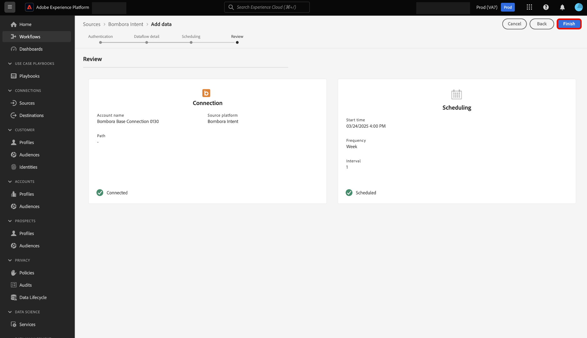

# UI を使用した [!DNL Bombora Intent] のExperience Platformへの接続

ユーザーインターフェイスを使用して [!DNL Bombora Intent] アカウントをAdobe Experience Platformに接続する方法については、このガイドを参照してください。

## 基本を学ぶ

このチュートリアルは、 Experience Platform の次のコンポーネントを実際に利用および理解しているユーザーを対象としています。

* [Real-Time CDP B2B edition](../../../../../rtcdp/b2b-overview.md): Real-Time CDP B2B editionは、B2B サービスモデルで業務を行うマーケター向けに設計されています。 複数のソースからのデータをまとめて、人物とアカウントプロファイルの単一のビューに結合します。この統合されたデータにより、マーケターは特定のオーディエンスを正確にターゲットにして、利用可能なすべてのチャネルでそれらのオーディエンスを惹き付けることができます。
* [&#x200B; ソース &#x200B;](../../../../home.md):Experience Platformを使用すると、データを様々なソースから取得しながら、Experience Platform サービスを使用して受信データの構造化、ラベル付け、拡張を行うことができます。
* [&#x200B; サンドボックス &#x200B;](../../../../../sandboxes/home.md): Experience Platformには、1 つのExperience Platform インスタンスを別々の仮想環境に分割し、デジタルエクスペリエンスアプリケーションの開発と発展に役立つ仮想サンドボックスが用意されています。

### 前提条件

認証資格情報の取得方法について詳しくは、[[!DNL Bombora Intent]  概要 &#x200B;](../../../../connectors/data-partners/bombora.md) を参照してください。

## ソースカタログのナビゲート

Experience Platformの UI で、左側のナビゲーションから **[!UICONTROL Sources]** を選択し、*[!UICONTROL Sources]* ワークスペースにアクセスします。 *[!UICONTROL カテゴリ]* パネルで適切なカテゴリを選択できます。 または、検索バーを使用して、使用する特定のソースに移動できます。

[!DNL Bombora] を使用するには、「**[!UICONTROL データおよび ID パートナー]** の下の「*[!UICONTROL Bombora Intent]*」ソースカードを選択してから、「**[!UICONTROL データを追加]**」を選択します。

>[!TIP]
>
>ソースカタログ内のソースは、特定のソースがまだ認証済みのアカウントを持っていない場合に「**[!UICONTROL 設定]**」オプションを表示します。 認証済みアカウントが存在すると、このオプションは **[!UICONTROL データを追加]** に変わります。

## 認証 {#authentication}

### 既存のアカウントを使用 {#existing}

既存のアカウントを使用するには、「**[!UICONTROL 既存のアカウント]**」を選択し、インターフェイスのアカウントのリストから使用するアカウントを選択します。

アカウントを選択したら、「**[!UICONTROL 次へ]**」を選択して次の手順に進みます。

### 新しいアカウントを作成 {#create}

既存のアカウントがない場合は、ソースに対応する必要な認証資格情報を指定して、新しいアカウントを作成する必要があります。

新しいアカウントを作成するには、「**[!UICONTROL 新しいアカウント]**」を選択し、アカウント名と、オプションでアカウントの詳細の説明を入力します。 次に、Experience Platformに対してソースを認証するための適切な認証値を指定します。 [!DNL Bombora] アカウントを接続するには、次の資格情報が必要です。

* **アクセスキー ID**:[!DNL Bombora] のアクセスキー ID。 これは、Experience Platformに対してアカウントを認証するために必要な 61 文字の英数字の文字列です。
* **秘密アクセスキー**:[!DNL Bombora] の秘密アクセスキー。 これは、Base-64 でエンコードされた 40 文字の文字列で、Experience Platformに対してアカウントを認証するために必要です。
* **バケット名**：データの取得元となる [!DNL Bombora] バケット。

## データフローの詳細を入力 {#provide-dataflow-details}

アカウントが認証され、接続されたら、データフローの次の詳細を指定する必要があります。

* **データフロー名**：データフローの名前。 この名前を使用して、作成および処理されたデータフローを UI で検索できます。
* **説明**:（任意）データフローの簡単な説明または追加情報。
* **ドメインソース**：ソースアカウントレコードをExperience Platform アカウントと照合するドメインまたは web サイトフィールド。 この値は、設定によって異なる場合があります。 指定しない場合、ドメインのデフォルト値は accountOrganization.website になります。

## データフローのスケジュール {#schedule-dataflow}

次に、スケジュールインターフェイスを使用して、データフローの取り込みスケジュールを設定します。

* **頻度**：頻度を設定して、データフローの実行頻度を示します。 [!DNL Bombora] データフローをスケジュールして、週単位でデータを取り込むことができます。
* **間隔**：間隔は、各取り込みサイクル間の時間を表します。 [!DNL Bombora] データフローでサポートされている間隔は 1 のみです。 つまり、データフローは、毎週 1 回、データを取り込みます。
* **開始時刻**：開始時刻は、データフローの最初の実行イテレーションが実行されるタイミングを示します。 [!DNL Bombora] は、週に 1 回、月曜日の午後 12:00 （UTC）にAdobeにデータをドロップします。 そのため、取り込み開始時刻を午後 12:00 UTC 以降に設定する必要があります。 さらに、ファイルをAdobeにドロップする際にスケジュールが変更される可能性があるので、[!DNL Bombora] で取り込み時間を確認する必要があります。

データフローの取り込みスケジュールを設定したら、「**[!UICONTROL 次へ]**」を選択します。

## データフローのレビュー {#review-dataflow}

データフロー作成プロセスの最後の手順は、データフローを実行する前に確認することです。 *[!UICONTROL レビュー]* ステップを使用すると、新しいデータフローを実行する前に詳細をレビューできます。 詳細は、次のカテゴリにグループ化されます。

* **接続**：ソースのタイプ、選択したソースファイルの関連パスおよびそのソースファイル内の列の数を表示します。
* **スケジュール**：取り込みスケジュールのアクティブな期間、頻度、間隔を表示します。

データフローをレビューしたら、「**[!UICONTROL 終了]**」を選択します。

## 次の手順

このチュートリアルでは、[!DNL Bombora] ソースからExperience Platformにインテントデータを取り込むデータフローを正常に作成しました。 その他のリソースについては、以下に概要を説明するドキュメントを参照してください。

### データフローの監視

データフローを作成したら、そのデータフローを通じて取り込まれるデータを監視し、取り込み率、成功、エラーに関する情報を表示できます。 データフローのモニタリング方法について詳しくは、[UI でのアカウントとデータフローのモニタリング &#x200B;](../../../../../dataflows/ui/monitor-sources.md) のチュートリアルを参照してください。

### データフローの更新

データフローのスケジュール、マッピング、一般情報の設定を更新するには、[UI でのソースデータフローの更新 &#x200B;](../../update-dataflows.md) に関するチュートリアルを参照してください。

### データフローの削除

不要になったデータフローや誤って作成されたデータフローは、**[!UICONTROL データフロー]**&#x200B;ワークスペース内にある&#x200B;**[!UICONTROL 削除]**&#x200B;機能で削除できます。データフローの削除方法について詳しくは、[UI でのデータフローの削除 &#x200B;](../../delete.md) のチュートリアルを参照してください。
