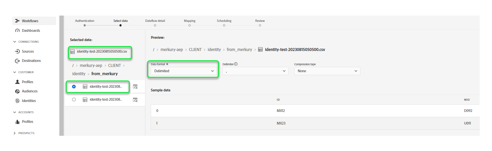

# の作成 [!DNL Merkury Enterprise Identity Resolution] UI でのソース接続とデータフロー

>[!NOTE]
>
>[!DNL Merkury Enterprise Identity Resolution] ソースはベータ版です。詳しくは、 [ソースの概要](../../../../home.md#terms-and-conditions) ベータラベル付きのソースの使用に関する詳細

このチュートリアルでは、 [!DNL Merkury Enterprise Identity Resolution] Adobe Experience Platformユーザーインターフェイスを使用したソース接続とデータフロー。

## 基本を学ぶ

このチュートリアルは、 Experience Platform の次のコンポーネントを実際に利用および理解しているユーザーを対象としています。

* [[!DNL Experience Data Model (XDM)] システム](../../../../../xdm/home.md)：Experience Platform が顧客体験データの整理に使用する標準化されたフレームワーク。
   * [スキーマ構成の基本](../../../../../xdm/schema/composition.md)：スキーマ構成の主要な原則やベストプラクティスなど、XDM スキーマの基本的な構成要素について学びます。
   * [スキーマエディターのチュートリアル](../../../../../xdm/tutorials/create-schema-ui.md)：スキーマエディター UI を使用してカスタムスキーマを作成する方法を説明します。
* [[!DNL Real-Time Customer Profile]](../../../../../profile/home.md)：複数のソースからの集計データに基づいて、統合されたリアルタイムの顧客プロファイルを提供します。

### 必要な資格情報の収集

Experience Platformでバケットにアクセスするには、次の資格情報に有効な値を指定する必要があります。

| 資格情報 | 説明 |
| --- | --- |
| アクセスキー | バケットのアクセスキー ID。 この値は、 [!DNL Merkury] チーム。 |
| 秘密鍵 | バケットの秘密鍵 ID。 この値は、 [!DNL Merkury] チーム。 |
| バケット名 | これは、ファイルが共有されるマークリバケットです。 この値は、 [!DNL Merkury] チーム。 |

の設定について詳しくは、 [!DNL Merkury] その他の前提条件については、 [[!DNL Merkury] ソースの概要](../../../../connectors/data-partners/merkury.md).

## マークリアカウントに接続

Platform の UI で、左側のナビゲーションバーで「**[!UICONTROL Sources]**」を選択し、[!UICONTROL Sources ]のワークスペースにアクセスします。[!UICONTROL カタログ]画面には、アカウントを作成できる様々なソースが表示されます。

画面の左側にあるカタログから適切なカテゴリを選択することができます。または、使用する特定のソースを検索オプションを使用して探すこともできます。

の下 **[!UICONTROL データパートナー]** カテゴリ、選択 **[!UICONTROL マークリ]** 次に、「 **[!UICONTROL 設定]**.

The **[!UICONTROL マークリに接続]** ページが表示されます。 このページでは、新しい資格情報または既存の資格情報を使用できます。

### 新しいアカウントを作成

新しい資格情報を使用している場合は、「 」を選択します。 **[!UICONTROL 新しいアカウント]**. 表示される入力フォームで、名前、説明（オプション）および [!DNL Merkury] 認証情報。 終了したら、「 」を選択します。 **[!UICONTROL ソースに接続]** その後、新しい接続が確立されるまでしばらく時間をかけます。

### 既存のアカウントを使用

既存のアカウントを使用するには、「 」を選択します。 **[!UICONTROL 既存のアカウント]** 次に、 [!DNL Merkury] 使用するアカウント。 「**[!UICONTROL 次へ]**」を選択して次に進みます。

>[!BEGINSHADEBOX]

**サポートされているファイル形式**

を使用して、次のファイル形式を取り込むことができます。 [!DNL Merkury] ソース：

* 区切り文字区切り値 (DSV): DSV 形式のデータ・ファイルの区切り文字として、任意の 1 文字の値を使用できます。
* [!DNL JavaScript Object Notation] (JSON):JSON 形式のデータファイルは、XDM に準拠している必要があります。
* [!DNL Apache Parquet]:Parquet 形式のデータファイルは、XDM に準拠している必要があります。
* 圧縮ファイル：JSON および区切り形式のファイルは、次のように圧縮できます。 `bzip2`, `gzip`, `deflate`, `zipDeflate`, `tarGzip`、および `tar`.

>[!ENDSHADEBOX]

## データの追加

作成後、 [!DNL Merkury] アカウント、 **[!UICONTROL データを追加]** 手順が表示され、 [!DNL Merkury] ファイル階層を参照し、Experience Platformに取り込むフォルダーまたは特定のファイルを選択します。

* インターフェイスの左側には、ディレクトリブラウザーが表示され、 [!DNL Merkury] ファイル階層。
* インターフェイスの右側では、互換性のあるフォルダーまたはファイルから最大 100 行のデータをプレビューできます。

ルートフォルダーを選択して、フォルダー階層にアクセスします。 ここから、1 つのフォルダーを選択して、フォルダー内のすべてのファイルを再帰的に取り込むことができます。 フォルダー全体を取り込む場合は、そのフォルダー内のすべてのファイルが同じデータ形式とスキーマを共有していることを確認する必要があります。

フォルダーを選択すると、右側のインターフェイスが更新され、選択したフォルダー内の最初のファイルのコンテンツと構造のプレビューが表示されます。

この手順の間、先に進む前に、データに対して複数の設定をおこなうことができます。 まず、「 」を選択します。 **[!UICONTROL データフォーマット]** 次に、表示されるドロップダウンパネルで、ファイルに適したデータ形式を選択します。

次の表に、サポートされているファイルタイプに適したデータ形式を示します。

| ファイルタイプ | データ形式 |
| --- | --- |
| CSV | [!UICONTROL 区切り] |
| JSON | [!UICONTROL JSON] |
| PARQUET | [!UICONTROL XDM Parquet] |

### 列の区切り文字を選択

+++区切り文字の設定手順を表示する場合に選択します

データフォーマットを設定した後、区切りファイルを取り込む際に列区切り文字を設定できます。 を選択します。 **[!UICONTROL 区切り]** 」オプションを選択し、ドロップダウンメニューから区切り文字を選択します。 メニューには、区切り文字に最も頻繁に使用されるオプション ( コンマ (`,`)、タブ (`\t`)、およびパイプ (`|`) をクリックします。

カスタム区切り文字を使用する場合は、 **[!UICONTROL カスタム]** をクリックし、ポップアップ入力バーに任意の 1 文字の区切り文字を入力します。

+++

### 圧縮ファイルの取り込み

+++ 圧縮ファイルの取り込み手順を表示する場合に選択します

圧縮タイプを指定して、圧縮 JSON または区切り形式のファイルを取り込むこともできます。

Adobe Analytics の [!UICONTROL データを選択] 手順：取り込む圧縮ファイルを選択し、適切なファイルタイプと、XDM に準拠しているかどうかを選択します。 次に、「 **[!UICONTROL 圧縮タイプ]** 次に、ソースデータに適した圧縮ファイルのタイプを選択します。

特定のファイルを Platform に取り込むには、フォルダーを選択し、取り込むファイルを選択します。 この手順では、ファイル名の横にあるプレビューアイコンを使用して、特定のフォルダー内にある他のファイルのファイルコンテンツをプレビューすることもできます。

終了したら、「**[!UICONTROL 次へ]**」を選択します。

+++

## データフローの詳細を入力

[!UICONTROL データフロー詳細]ページでは、既存のデータセットと新しいデータセットのどちらを使用するかを選択できます。このプロセスの間に、データをプロファイルに取り込むように設定し、次のような設定を有効にすることもできます。 [!UICONTROL エラー診断], [!UICONTROL 部分取り込み]、および [!UICONTROL アラート].

### 既存のデータセットを使用する

データを既存のデータセットに取り込むには、**[!UICONTROL 既存のデータセット]**&#x200B;を選択します。「[!UICONTROL 詳細検索]」オプションを使用するか、ドロップダウンメニューで既存のデータセットのリストをスクロールすると、既存のデータセットを取得できます。データセットを選択したら、データフローの名前と説明を入力します。

### 新しいデータセットの使用

データを新しいデータセットに取り込むには、「**[!UICONTROL 新しいデータセット]**」を選択して、出力データセット名とオプションの説明を入力します。次に、「[!UICONTROL 詳細検索]」オプションを使用するか、ドロップダウンメニューで既存のスキーマのリストをスクロールして、マッピングするスキーマを選択します。スキーマを選択したら、データフローの名前と説明を指定します。

### プロファイルとエラー診断を有効にする

+++選択して、エラー診断とプロファイル取り込みを有効にする手順を表示します

次に、 **[!UICONTROL プロファイルデータセット]** を切り替えて、リアルタイム顧客プロファイルのデータセットを有効にします。 これにより、エンティティの属性と動作の全体像を把握できます。プロファイルが有効なすべてのデータセットのデータは、プロファイルに含まれ、変更はデータフローを保存する際に適用されます。

[!UICONTROL エラー診断]は、データフローで発生するエラーレコードに対して、詳細なエラーメッセージ生成を有効にします。[!UICONTROL 部分取り込み]では、手動で定義した特定のしきい値に到達するまで、エラーを含むデータを取り込むことができます。詳しくは、[バッチ取り込みの概要](../../../../../ingestion/batch-ingestion/partial.md)を参照してください。

+++

### アラートの有効化

+++選択すると、アラートを有効にする手順が表示されます

アラートを有効にすると、データフローのステータスに関する通知を受け取ることができます。リストからアラートを選択して、データフローのステータスに関する通知を受け取るよう登録します。アラートについて詳しくは、[UI を使用したソースアラートの購読](../../alerts.md)についてのガイドを参照してください。

データフローへの詳細の入力を終えたら「**[!UICONTROL 次へ]** 」を選択します。

+++

## XDM スキーマへのデータフィールドのマッピング

[!UICONTROL マッピング]手順が表示され、ソーススキーマのソースフィールドを、ターゲットスキーマの適切なターゲット XDM フィールドにマッピングするためのインターフェイスが提供されます。

Platform は、選択したターゲットスキーマまたはデータセットに基づいて、自動マッピングされたフィールドに対するインテリジェントなレコメンデーションを提供します。 マッピングルールは、使用例に合わせて手動で調整できます。 必要に応じて、フィールドを直接マッピングするか、データ準備機能を使用してソースデータを変換して計算値を導き出すかを選択できます。マッパーインターフェイスと計算フィールドを使用した包括的な手順については、 [データ準備 UI ガイド](../../../../../data-prep/ui/mapping.md).

ソースデータが正常にマッピングされたら、「 」を選択します。 **[!UICONTROL 次へ]**.

## 取り込み実行のスケジュール設定

The [!UICONTROL スケジュール] 手順が表示され、設定済みのマッピングを使用して選択したソースデータを自動的に取り込むように取り込むように、取り込みスケジュールを設定できます。 デフォルトでは、スケジュールはに設定されています。 `Once`. 取り込み頻度を調整するには、「 」を選択します。 **[!UICONTROL 頻度]** 次に、ドロップダウンメニューからオプションを選択します。

>[!TIP]
>
>1 回限りの取り込みでは、間隔とバックフィルは表示されません。

取り込み頻度を `Minute`, `Hour`, `Day`または `Week`を設定した場合は、取り込みのたびに設定時間枠を設定する間隔を設定する必要があります。 例えば、取り込み頻度を `Day` そして、次の間隔が `15` は、データフローが 15 日ごとにデータを取り込むようにスケジュールされていることを意味します。

この手順の間に、 **バックフィル** およびは、データを増分的に取り込むための列を定義します。 バックフィルは、履歴データを取り込むために使用されます。一方、増分取り込み用に定義する列では、新しいデータを既存のデータと区別することができます。

スケジュール設定について詳しくは、次の表を参照してください。

| フィールド | 説明 |
| --- | --- |
| 頻度 | 取り込みが発生する頻度。 選択可能な頻度には次のものが含まれます `Once`, `Minute`, `Hour`, `Day`、および `Week`. |
| 間隔 | 選択した頻度の間隔を設定する整数。 間隔の値は、ゼロ以外の整数で、15 以上に設定する必要があります。 |
| 開始時間 | 最初の取り込みがいつ行われるかを示す UTC タイムスタンプ。 開始時間は、現在の UTC 時間以上である必要があります。 |
| バックフィル | 最初に取り込まれるデータを決定する boolean 値です。 バックフィルが有効な場合、指定されたパス内の現在のファイルは、最初にスケジュールされた取り込み中にすべて取り込まれます。 バックフィルが無効になっている場合、取り込みの最初の実行から開始時刻までの間に読み込まれたファイルのみが取り込まれます。 開始時より前に読み込まれたファイルは取り込まれません。 |

>[!NOTE]
>
>バッチ取り込みの場合、その後のデータフローでは、ソースから取り込まれるファイルが&#x200B;**最終変更日**&#x200B;のタイムスタンプに基づいて選択されます。つまり、バッチデータフローでは、新しいフローまたは最後のフロー実行以降に変更されたファイルをソースから選択します。 また、ファイルのアップロードからフローの実行までに十分な時間がかかることを確認する必要があります。予定フローの実行時間より前に、クラウドストレージアカウントに完全にアップロードされていないファイルは取り込み対象から除外されます。

取り込みスケジュールの設定が完了したら、「 **[!UICONTROL 次へ]**.

## データフローのレビュー

**[!UICONTROL レビュー]**&#x200B;手順が表示され、新しいデータフローを作成する前に確認できます。詳細は、次のカテゴリに分類されます。

* **[!UICONTROL 接続]**：ソースのタイプ、選択したソースファイルの関連パスおよびそのソースファイル内の列の数を表示します。
* **[!UICONTROL データセットの割り当てとフィールドのマッピング]**：ソースデータがどのデータセットに取り込まれるかを、そのデータセットが準拠するスキーマを含めて表示します。
* **[!UICONTROL スケジュール]**：取り込みスケジュールのアクティブな期間、頻度、間隔を表示します。

データフローをレビューしたら、「 」をクリックします。 **[!UICONTROL 完了]** とは、データフローが作成されるまでしばらく時間をかけます。

## 次の手順

このチュートリアルに従うことで、バッチデータを [!DNL Merkury] ソースからExperience Platformへ その他のリソースについては、以下に概要を示すドキュメントを参照してください。

### データフローの監視

データフローを作成したら、データフローを介して取り込まれているデータを監視して、取り込み率、成功、エラーに関する情報を表示できます。 データフローの監視方法の詳細については、 [UI でのアカウントとデータフローの監視](../../monitor.md).

### データフローの更新

データフローのスケジュール設定、マッピング、一般情報を更新するには、次のチュートリアルを参照してください： [UI でのソースデータフローの更新](../../update-dataflows.md)

### データフローの削除

不要になったデータフローや誤って作成されたデータフローは、**[!UICONTROL データフロー]**&#x200B;ワークスペース内にある&#x200B;**[!UICONTROL 削除]**&#x200B;機能で削除できます。データフローの削除方法の詳細については、 [UI でのデータフローの削除](../../delete.md).