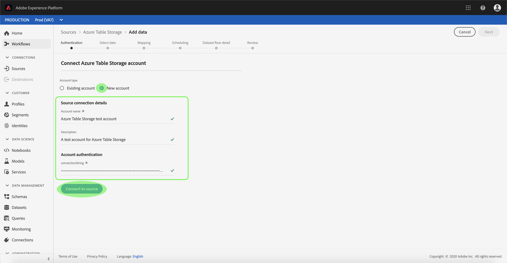

# UIに[!DNL Azure Table Storage]ソース接続を作成する

>[!NOTE]
>
>[!DNL Azure Table Storage]コネクタはベータ版です。 ベータラベル付きコネクタの使用方法の詳細については、[ソースの概要](../../../../home.md#terms-and-conditions)を参照してください。

Adobe Experience Platformのソースコネクタは、外部ソースのデータをスケジュールに基づいて取り込む機能を提供します。 このチュートリアルでは、[!DNL Platform]ユーザーインターフェイスを使用して[!DNL Azure Table Storage] （以下「ATS」と呼びます）ソースコネクタを作成する手順を説明します。

## はじめに

このチュートリアルは、Adobe Experience Platform の次のコンポーネントを実際に利用および理解しているユーザーを対象としています。

* [[!DNL Experience Data Model (XDM)] システム](../../../../../xdm/home.md):顧客体験データを [!DNL Experience Platform] 編成する際に使用される標準化されたフレームワーク。
   * [スキーマ構成の基本](../../../../../xdm/schema/composition.md)：スキーマ構成の主要な原則やベストプラクティスなど、XDM スキーマの基本的な構成要素について学びます。
   * [スキーマエディタのチュートリアル](../../../../../xdm/tutorials/create-schema-ui.md):スキーマエディターのUIを使用してカスタムスキーマを作成する方法を説明します。
* [[!DNL Real-time Customer Profile]](../../../../../profile/home.md):複数のソースからの集計データに基づいて、統合されたリアルタイムの消費者プロファイルを提供します。

既に有効なATS接続をお持ちの場合は、このドキュメントの残りの部分をスキップして、[データフロー](../../dataflow/databases.md)の設定のチュートリアルに進むことができます。

### 必要な資格情報の収集

[!DNL Platform]でATSアカウントにアクセスするには、次の値を指定する必要があります。

| Credential | 説明 |
| ---------- | ----------- |
| `connectionString` | [!DNL Azure Table Storage]インスタンスに接続する接続文字列。 ATSインスタンスに接続する接続文字列です。 ATSの接続文字列パターンは`DefaultEndpointsProtocol=https;AccountName={ACCOUNT_NAME};AccountKey={ACCOUNT_KEY}`です。 |

開始方法の詳細については、[この [!DNL Azure Table Storage] ドキュメント](https://docs.microsoft.com/en-us/azure/storage/common/storage-introduction)を参照してください。

## [!DNL Azure Table Storage]アカウントに接続

必要な資格情報を収集したら、次の手順に従ってATSアカウントを[!DNL Platform]にリンクします。

[Adobe Experience Platform](https://platform.adobe.com)にログインし、左のナビゲーションバーで「**[!UICONTROL ソース]**」を選択して&#x200B;**[!UICONTROL ソース]**&#x200B;ワークスペースにアクセスします。 **[!UICONTROL カタログ]**&#x200B;画面には様々なソースが表示され、このソースを使用してアカウントを作成できます。

画面の左側にあるカタログから適切なカテゴリを選択できます。 または、検索オプションを使用して、使用する特定のソースを見つけることもできます。

**[!UICONTROL データベース]**&#x200B;カテゴリの下で、**[!UICONTROL Azureテーブルストレージ]**&#x200B;を選択します。 このコネクタを初めて使用する場合は、**[!UICONTROL 設定]**&#x200B;を選択します。 それ以外の場合は、**[!UICONTROL 追加data]**&#x200B;を選択して新しいATSコネクタを作成します。

**[!UICONTROL Azureテーブルストレージに接続]**&#x200B;ページが表示されます。 このページでは、新しい秘密鍵証明書または既存の秘密鍵証明書を使用できます。

### 新しいアカウント

新しい資格情報を使用する場合は、「**[!UICONTROL 新しいアカウント]**」を選択します。 表示される入力フォームで、名前、オプションの説明およびATS秘密鍵証明書を入力します。 終了したら、[**[!UICONTROL 接続]**]を選択し、新しい接続が確立されるまでの時間を許可します。

### 既存のアカウント

既存のアカウントに接続するには、接続するATSアカウントを選択し、**[!UICONTROL 次へ]**&#x200B;を選択して次に進みます。

## 次の手順

このチュートリアルに従って、ATSアカウントへの接続を確立しました。 次のチュートリアルに進み、[データを [!DNL Platform]](../../dataflow/databases.md)に取り込むようにデータフローを設定できます。
